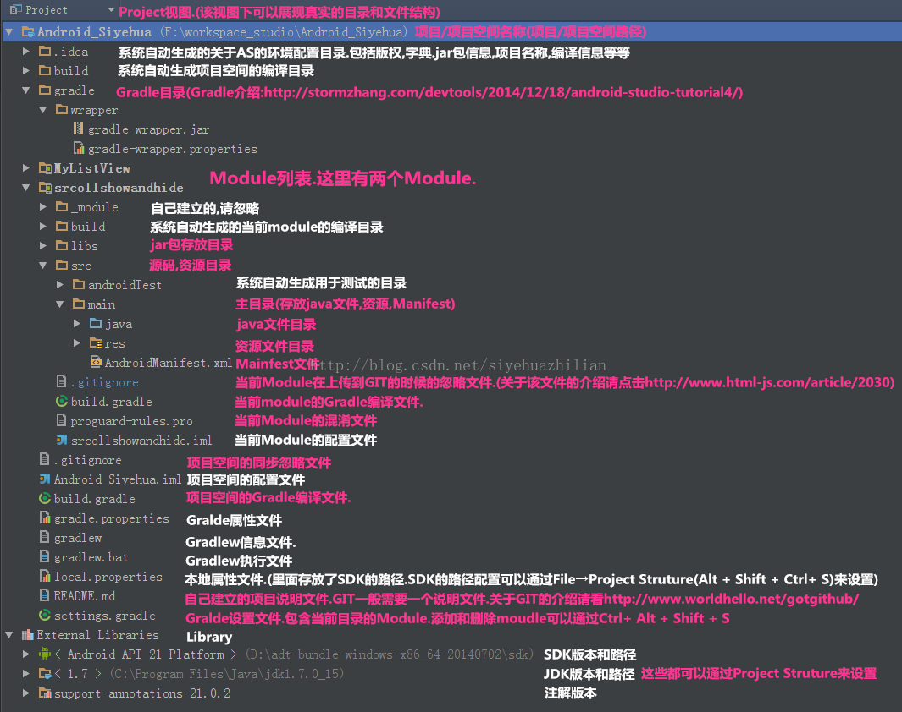

## Android Studio .gitignore 配置


### **Android Studio 文件结构**



该图片转载自网络。具体地址忘了。。

### **module 中 .gitignore 配置**

```java 
/build
*.iml

```

### **工程根目录下的 .gitignore配置**

```java 
#built application files 
*.apk
*.ap_

# files for the dex VM
*.dex

# Java class files
*.class

# generated files
bin/
gen/
out/
build/

# Local configuration file (sdk path, etc)
local.properties

# Windows thumbnail db
Thumbs.db

# OSX files
.DS_Store

# Eclipse project files
.classpath
.project

# Android Studio
*.iml
.idea

# Local IDEA workspace
.idea/workspace.xml

# Gradle cache
.gradle

#NDK
obj/
app/libs/
app/src/main/res/drawable/


```


### **Android Studio .gitignore 之后无法提交的解决**

Android Studio 中导入了`.ignore`插件重启Android Studio之后就解决了。。

