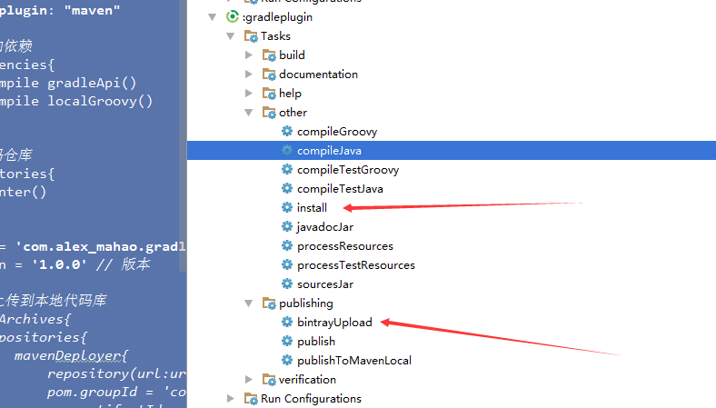

## Gradle之使用Android Studio 编写Gradle插件并上传Library到JCenter

在上一篇博客中[Gradle 入门](http://blog.csdn.net/lisdye2/article/details/52173213),编写`channel.gradle`并通过`apply from : 'channel.gradle'`引入Gradle 插件，实现了多渠道打包。同样，我们可以编写一个Library ，通过引入的方式引入Gradle 的插件脚本。


### 编写 Gradle Library 

对于编写Gradle Library ，整个流程可分为如下几个步骤：

- 创建Library Module 
- 删除 除build.gradle 以外的所有文件
- 修改build.gradle 脚本的内容
- 在Library Module下根目录下创建src/main/groovy 目录，在该目录下可以添加包名，文件等
- 在main目录下创建`resources`目录，并创建META-INF/gradle-plugins目录，该目录下添加的是向外提供的Gralde脚本的资源
- 上传Gradle插件到本地代码库
- 引用Gradle 插件


按照上面的步骤开始进行每一步的操作

**创建Library Module **


**删除 除build.gradle 以外的所有文件**

自行删除即可


**修改build.gradle 脚本的内容**

```java 

// 应用插件
apply plugin: "groovy"
apply plugin: "maven"

// 添加依赖
dependencies{
    compile gradleApi()
    compile localGroovy()
}

// 代码仓库
repositories{
   jcenter()
}

```

**在Library Module下根目录下创建src/main/groovy 目录，在该目录下可以添加包名，文件等**

创建好groovy 目录之后，会发现该目录自动变蓝，即表示识别了该文件。我们可以在该目录下创建包名，然后添加`PluginImple.groovy`文件。注意文件的后缀名，因为Gradle 使用的是Groovy编写，所以后缀必须是.groovy。

编写该文件的代码

```java 
package  com.alex_mahao.gradle

import org.gradle.api.Plugin
import org.gradle.api.Project

/**
 * 实现Plugin
 */
public class PluginImpl implements Plugin<Project>{

    @Override
    void apply(Project project) {
        project.task("testTask")<<{
            println "Hello gradle plugin"
        }
    }
}

```

编写该文件的时候，因为它不像java会自动导入包名，我们需要手动添加`package ...`

实现`Plugin`必须实现`apply`方法，见名知意。再次定义了一个任务`testTask`，它想控制台输入了`Hello gradle plugin`


**在main目录下创建`resources`目录，并创建META-INF/gradle-plugins目录，该目录下添加的是向外提供的Gralde脚本的资源**

创建`resources`后，会默认变成资源文件夹的标示，创建`META-INF/gradle-plugins`目录之后，添加资源。

创建`plugin.test.properties`,添加文件

```java 

implementation-class = com.alex_mahao.gradle.PluginImpl

```

文件名`plugin.test`为插件的应用名，即`apply plugin:'plugin.test'`

文件内容添加对应的实现类。


到这里，整个Library Module 就基本完成了，他的目录如图所示


如果我们想使用这个插件，直接引用的方式是行不通的，他和普通的Library Module 不同，我们必须把它发布到代码仓库中，代码仓库分为本地和远程，暂时先实现本地，然后讲解如何将代码发布到远程仓库

**上传Gradle插件到本地代码库**

在插件的`build.gradle`中，添加如下代码：

```java 
// 应用插件
apply plugin: "groovy"
apply plugin: "maven"

// 添加依赖
dependencies{
    compile gradleApi()
    compile localGroovy()
}

// 代码仓库
repositories{
   jcenter()
}

// 上传到本地代码库
uploadArchives{
    repositories{
        mavenDeployer{
            repository(url:uri('../repo'))
            pom.groupId = 'com.alex_mahao.gradle.plugin' // 组名
            pom.artifactId = 'test' // 插件名
            pom.version = '2.0.0' // 版本号
        }
    }
}

```

编写好代码之后 sync now 一下。此时打开右边的Gradle,多出了一个uploadArchives 的任务

,双击运行。此时可以看到在工程的根目录下多出了repo的文件夹。其中包含了相关的依赖。

**引用Gradle 插件**

在app 的 `build.gradle`中，添加引用

```java 
// 添加本地仓库依赖
buildscript{
    repositories{
        maven{
            url uri('../repo')
        }
    }
    dependencies{
        classpath 'com.alex_mahao.gradle.plugin:test:1.0.0'
    }
}

// 引用插件
apply plugin: 'plugin.test'

```

**sync now 一下**，Gradle 中多出了一个`testTask`任务

  


ok。实现了效果

> 到这里，可能有小伙伴就问了，你这有毛线用，其实该篇博客是对后面博客的铺垫，在讲解热修复时，会用到该篇博客的知识点

### `complie`,`classpath`的比较与解析

如果细心的小伙伴会发现，我上面依赖插件使用的是`classpath`,而我们平常依赖jar包的时候使用的是`complie`,他们有什么区别呢。


此处请自行思考。友情提示：看一下项目根目录下的`build.gradle`和app下的`build.gradle`。


他们后都跟上了相应jar包的路径：`classpath 'com.alex_mahao.gradle.plugin:test:2.0.0'`

整个插件或jar包的路径，分为了三个部分：

- 组名：类似于包名
- 插件名 ： 项目名称
- 版本号： 2.0.0


### 上传代码到jcenter

在上面实现了将插件上传到本地，那么同样我们可以把我们的Gradle 插件上传到jcenter 中。

jcenter 和 Maven Central 都是远程仓库，都可以通过依赖的形式添加jar包。在之前Android Studio 默认使用的是Maven Central ，但发现其有一定的入门难度，将其改为了jcenter。


想要把代码上传到jcenter，必须先有账号，登陆网站，直接可以选择使用github登陆。

网站地址[https://bintray.com/](https://bintray.com/)

在网战中我们需要获取两个重要的信息，用户名和秘钥

用户名显而易见


获取秘钥：


在编写代码之前，需要添加一些Gradle 的依赖，在项目的根目录的`build.gradle`中，添加依赖

```java 
buildscript {

    // 添加远程仓库
    repositories {
        jcenter()
    }

    // 添加依赖，此依赖从远程仓库中查找
    dependencies {
        classpath 'com.android.tools.build:gradle:2.1.0'

       // classpath 'com.alex_mahao.gradle.plugin:gradleplugin:2.0.0'
        // 将项目发布到JCenter 所需要的jar   添加依赖
        classpath 'com.jfrog.bintray.gradle:gradle-bintray-plugin:1.0'
        classpath 'com.github.dcendents:android-maven-plugin:1.2'
    }
}

```


在项目的根目录下编写`bintray.gradle`,添加如下代码.

```java 
// 应用插件
apply plugin: 'com.jfrog.bintray'
apply plugin: 'maven-publish'


def baseUrl = 'https://github.com/AlexSmille'
def siteUrl = baseUrl
def gitUrl = "${baseUrl}/Android-Gradle-Demo"
def issueUrl = "${baseUrl}/issues"


install {
    repositories {
        mavenInstaller {
            // This generates POM.xml with proper paramters
            pom.project {

                //添加项目描述
                name 'Gradle Plugin for Android'
                url siteUrl

                //设置开源证书信息
                licenses {
                    license {
                        name 'The Apache Software License, Version 2.0'
                        url 'http://www.apache.org/licenses/LICENSE-2.0.txt'
                    }
                }
                //添加开发者信息
                developers {
                    developer {
                        name 'Alex_Mahao'
                        email 'zziamahao@s163.com'
                    }
                }

                scm {
                    connection gitUrl
                    developerConnection gitUrl
                    url siteUrl
                }
            }
        }

    }
}


//配置上传Bintray相关信息
bintray {
    user = BINTRAY_USER
    key = BINTRAY_KEY

    configurations = ['archives']
    pkg {
        repo = 'maven' // 上传到中央仓库的名称
        name = 'tt' // 上传到jcenter 的项目名称
        desc = 'test gradle' // 项目描述
        websiteUrl = siteUrl
        issueTrackerUrl = issueUrl
        vcsUrl = gitUrl
        labels = ['gradle', 'plugin']
        licenses = ['Apache-2.0']
        publish = true
    }
}

```

在代码中，`user = BINTRAY_USER`和`key = BINTRAY_KEY`是关键字段，需要保密，所以我将他放在了`gradle.properties`中，同时选择了.gitignore。


在我们需要上传的Gradle plugin module下，应用插件

```java 
// 应用插件
apply plugin: "groovy"
apply plugin: "maven"

// 添加依赖
dependencies{
    compile gradleApi()
    compile localGroovy()
}

// 代码仓库
repositories{
   jcenter()
}

group = 'com.alex_mahao.gradle.plugin'  // 组名
version = '1.0.0' // 版本

/*// 上传到本地代码库
uploadArchives{
    repositories{
        mavenDeployer{
            repository(url:uri('../repo'))
            pom.groupId = 'com.alex_mahao.gradle.plugin' // 组名
            pom.artifactId = 'test' // 插件名
            pom.version = '2.0.0' // 版本号
        }
    }
}*/

// 应用插件
apply from: '../bintray.gradle'

```

`group`和`version`和之前的一样，`artifactId`没办法定义，他会默认和你的项目名一样


**sync now**之后，Gradle会出现两个任务，先点击`install`,在点击`bintrayUpload`。

ps： 总感觉`install`没什么用。。但网上的资料都写了。



这样就完成了上传。如何使用呢？


在项目的`build.gradle`下，添加依赖

```java 

buildscript {

    // 添加远程仓库
    repositories {
        jcenter()
        // Gradle 插件的仓库
        maven {
            url  "http://dl.bintray.com/alexsmille/maven"
        }
    }

    // 添加依赖，此依赖从远程仓库中查找
    dependencies {
        classpath 'com.android.tools.build:gradle:2.1.0'
        //自己编写的Gradle插件
        classpath 'com.alex_mahao.gradle.plugin:gradleplugin:1.0.0'
        // 将项目发布到JCenter 所需要的jar
        classpath 'com.jfrog.bintray.gradle:gradle-bintray-plugin:1.0'
        classpath 'com.github.dcendents:android-maven-plugin:1.2'
    }
}

```

两个地方修改，`url`和`classpath`;这两个值怎么获取，找到上传的项目的页面


此时小伙伴们可能又有疑问，为什么有的的不用添加url呢。


发布到`jcenter`，相当于我们之前的只是放到了`jcenter`，我们自己的仓库中。


