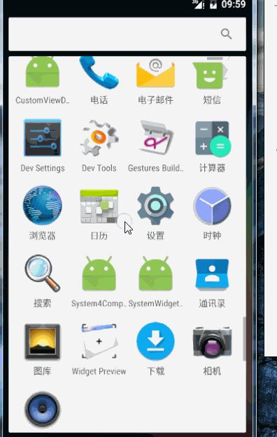
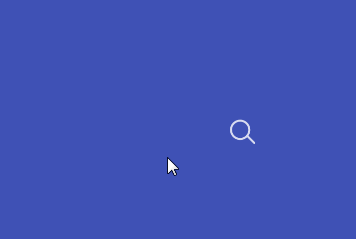
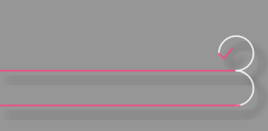
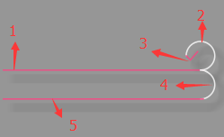

## Android VectorDrawable与SVG 实现炫酷动画

> 转载请标明出处：
[dsad]()
本文出自:[【Alex_MaHao的博客】](http://blog.csdn.net/lisdye2?viewmode=contents)
项目中的源码已经共享到github，有需要者请移步[【Alex_MaHao的github】](https://github.com/AlexSmille/alex_mahao_sample/tree/master/animationdemo)

Android 从 5.0 提供了新的API `VectorDrawable`,通过该对象，我们可以使用矢量图SVG。

在编写`xml`文件中，通过关键的几个标签节点`<vector>`，`<animated-vector>`,`<path>`完成对SVG 的编写以及动画的实现。

下面我们将实现两个例子来演示`VectorDrawable`和`SVG`的使用。先上实现的效果图。

**登录特效**




**搜索特效**



### **登录特效的实现**

首先需要分析该特效。根据整个动画，整个特效对应的SVG 图案如下所示：





整个图案分为五个部分，两条横线，两个半圆，以及一个对号。为了凸显，所以把颜色稍微修改了一下。


那么使用`<vector>`定义xml文件，实现如上图案。

**`edit_login.xml`**  ：该文件存放在res-> drawable文件夹下。

```java
<vector xmlns:android="http://schemas.android.com/apk/res/android"
    android:width="300dp"
    android:height="96dp"
    android:viewportWidth="150"
    android:viewportHeight="48">

    <!-- 第一条横线 -->
    <path
        android:name="bar"
        android:pathData="M0,23 L140,23"
        android:strokeWidth="1"
        android:strokeColor="@color/colorAccent"
        android:strokeAlpha="0.8"
        android:strokeLineCap="square" />


    <!--向上的圆弧 -->
    <path
        android:name="round"
        android:pathData="M138 23 A 10 10 0 1 0 128 13 "
        android:strokeWidth="1"
        android:strokeColor="@color/colorAccent"
        android:strokeAlpha="0.8"
        android:strokeLineCap="round"/>

    <!-- 对号-->
    <path
        android:name="right"
        android:pathData="M128 13  l 3 3 l 5 -6"
        android:strokeWidth="1"
        android:strokeColor="@color/colorAccent"
        android:strokeAlpha="0.8"
        android:strokeLineCap="round"/>

    <!--向下的圆弧 -->

    <path
        android:name="round2"
        android:pathData="M138 23 A 10 10 0 1 1 138 43 "
        android:strokeWidth="1"
        android:strokeColor="@color/colorAccent"
        android:strokeAlpha="0.8"
        android:strokeLineCap="round"/>

    <!-- 第二条横线-->
    <path
        android:name="bar2"
        android:pathData="M140,43 L0,43"
        android:strokeWidth="1"
        android:strokeColor="@color/colorAccent"
        android:strokeAlpha="0.8"
        android:strokeLineCap="square" />

</vector>

 ```


如上代码，我们可以通过`Android Studio`的预览效果，直接看到图案。


在代码中出现了两个标签`<vector>`,`<path>`.

- `<vector>`：用于定义整个画布。
	- `width`：画布的宽度。
	- `height`：画布的高度。
	- `viewportWidth`：将具体的宽度划分成相对的单位单元。`300dp`被分割成了150个单元单位。
	- `viewportHeight`：将具体的高度划分成相对的单元单位。`96dp`被分割成48个单元单位。

- `<path>`:用于画出具体的图案，类似于画笔。
	- `name`：声明一个标记。类似于id。 便于对其做动画的时候可以找到该节点。
	- `pathData`：矢量图SVG 的描述。（后面会提）
	- `strokeWidth`：画笔的宽度
	- `strokeColor`：画笔的颜色
	- `strokeAlpha`：透明度
	- `strokeLineCap`：画出线条的结束点的形状。正方向或圆角矩形。。。


图案画出以后，需要针对该图案做动画，整个图案过程分为三个：



- 初次点击第一个对话框时，显示第一条横线，其余的不显示。
	-  1 动画显示。2，3，4，5不显示。
- 验证输入是否正确，如果正确，显示对号。
	- 1 默认显示，2，3 动画显示 4，5 隐藏
- 点击第二个对话框，第一条横线个向第二条横线过度。
	- 1 动画隐藏 ，2 隐藏，3显示。 4，5动画显示。

当然，还很很多的用户交互，在此不再做实现。

根据上面的顺序，分别定义`anim1.xml`,`anim2.xml`,`anim3.xml`。注意，该文件存在`drawable`中。ps: 无视命名.

**`anim1.xml`**
```xml 
<animated-vector xmlns:android="http://schemas.android.com/apk/res/android"
    android:drawable="@drawable/edit_login">
    
    <target
        android:name="bar"
        android:animation="@animator/anim_bar_fill" />

    <target
        android:name="round"
        android:animation="@animator/anim_default_gone" />
    <target
        android:name="right"
        android:animation="@animator/anim_default_gone" />
    <target
        android:name="round2"
        android:animation="@animator/anim_default_gone" />
    <target
        android:name="bar2"
        android:animation="@animator/anim_default_gone" />

</animated-vector>

```


**`anim2.xml`**

```xml 
<?xml version="1.0" encoding="utf-8"?>
<animated-vector xmlns:android="http://schemas.android.com/apk/res/android"
    android:drawable="@drawable/edit_login">
    <target
        android:name="bar"
        android:animation="@animator/anim_default" />
    <target
        android:name="round"
        android:animation="@animator/anim_round" />

    <target
        android:name="right"
        android:animation="@animator/anim_aa" />
    <target
        android:name="round2"
        android:animation="@animator/anim_default_gone" />
    <target
        android:name="bar2"
        android:animation="@animator/anim_default_gone" />

</animated-vector>

```

**`anim3.xml`**

```xml 

<?xml version="1.0" encoding="utf-8"?>
<animated-vector xmlns:android="http://schemas.android.com/apk/res/android"
    android:drawable="@drawable/edit_login">
    <target
        android:name="bar"
        android:animation="@animator/anim_bar_empty" />
    <target
        android:name="round"
        android:animation="@animator/anim_default_gone" />

    <target
        android:name="right"
        android:animation="@animator/anim_default" />
    <target
        android:name="round2"
        android:animation="@animator/anim_round2" />
    <target
        android:name="bar2"
        android:animation="@animator/anim_bar_fill2" />


</animated-vector>

```

在三个文件中，最外层`<animated-vector>`进行包裹，该文件的作用类似于沟通的作用，将SVG和动画相整合，产生新的`drawable`。

- `<animated-vector>`
	- `drawable`:目标SVG.

- `<targer>`:对于SVG中的每一个`<path>`定义不同的动画。
	- `name`： 目标文件的标识。
	- `animation`：动画。


在其中定义了n多个动画。默认显示和默认不显示的动画（此时没有动画效果）.ps: 动画定义的都是属性动画，所以需要放在`animator`文件夹中。


**`anim_default.xml`** 默认显示
```xml 
<objectAnimator
    xmlns:android="http://schemas.android.com/apk/res/android"
    android:propertyName="trimPathEnd"
    android:valueFrom="1"
    android:valueTo="1"
    android:valueType="floatType"
    android:duration="1" />
```

动画属性`trimPathEnd`这个字段之前未出现过。它也是`<path>`的一个属性，其决定的是<path>节点所画出线条显示的百分比。 0~1 代表 从开始到结束显示的百分比。

同时也有一个`trimPathStart`，这个字段显示的也是百分比。不过其表示的是不显示的百分比。0~1代表从开始隐藏的百分比。

**`anim_default_gone.xml`** 默认隐藏

```xml 
<objectAnimator
    xmlns:android="http://schemas.android.com/apk/res/android"
    android:propertyName="trimPathEnd"
    android:valueFrom="0"
    android:valueTo="0"
    android:valueType="floatType"
    android:duration="1" />
```

**`anim_bar_fill.xml`** -----1 的显示动画。

```java 
<objectAnimator
    xmlns:android="http://schemas.android.com/apk/res/android"
    android:propertyName="trimPathEnd"
    android:valueFrom="0"
    android:valueTo="1"
    android:valueType="floatType"
    android:duration="500"
    android:interpolator="@android:interpolator/linear_out_slow_in" />

```


**`anim_bar_empty.xml`** -----1 的隐藏动画。

```java 
<objectAnimator
    xmlns:android="http://schemas.android.com/apk/res/android"
    android:propertyName="trimPathEnd"
    android:valueFrom="0"
    android:valueTo="1"
    android:valueType="floatType"
    android:duration="500"
    android:interpolator="@android:interpolator/linear_out_slow_in" />

```


**`anim_round.xml`**  -- 2 的显示动画

```xml 
<objectAnimator
    xmlns:android="http://schemas.android.com/apk/res/android"
    android:propertyName="trimPathStart"
    android:valueFrom="0"
    android:valueTo="1"
    android:valueType="floatType"
    android:duration="500"
    android:interpolator="@android:interpolator/linear_out_slow_in" />

```

**`anim_aa.xml`**  -- 3 的显示动画

```xml 
<objectAnimator
    xmlns:android="http://schemas.android.com/apk/res/android"
    android:propertyName="trimPathStart"
    android:valueFrom="0"
    android:valueTo="1"
    android:valueType="floatType"
    android:duration="500"
    android:interpolator="@android:interpolator/linear_out_slow_in" />

```

**`anim_round2.xml`**  -- 4 的显示动画

```xml 
<objectAnimator
    xmlns:android="http://schemas.android.com/apk/res/android"
    android:propertyName="trimPathStart"
    android:valueFrom="0"
    android:valueTo="1"
    android:valueType="floatType"
    android:duration="500"
    android:startOffset="501"
    android:interpolator="@android:interpolator/linear_out_slow_in" />

```

**`anim_bar_fill2.xml`**  -- 5 的显示动画

```xml 
<objectAnimator
    xmlns:android="http://schemas.android.com/apk/res/android"
    android:propertyName="trimPathStart"
    android:valueFrom="0"
    android:valueTo="1"
    android:valueType="floatType"
    android:duration="500"
    android:startOffset="501"
    android:interpolator="@android:interpolator/linear_out_slow_in" />

```


如上的代码已经实现了图片以及动画的实现。下面就是使用，首先看布局文件：

```xml 
<?xml version="1.0" encoding="utf-8"?>
<LinearLayout xmlns:android="http://schemas.android.com/apk/res/android"
    android:layout_width="match_parent"
    android:layout_height="match_parent"
    android:background="#fff"
    android:gravity="center_horizontal"
    android:orientation="vertical">

    <RelativeLayout xmlns:android="http://schemas.android.com/apk/res/android"
        android:layout_width="wrap_content"
        android:layout_height="wrap_content">

        <!-- 用以显示SVG 图案和动画-->
        <ImageView
            android:id="@+id/img1"
            android:layout_width="300dp"
            android:layout_height="96dp"
            android:layout_gravity="center"
            android:focusable="true"
            android:focusableInTouchMode="true"

            />

        <EditText
            android:id="@+id/edit1"
            android:layout_width="300dp"
            android:layout_height="45dp"
            android:layout_gravity="center"
            android:background="@null"
            android:hint="Email"
            android:paddingStart="4dp"
            android:textColor="?android:colorAccent"
            android:textColorHint="@color/colorPrimary"
            android:textSize="12sp" />

        <EditText
            android:id="@+id/edit2"
            android:layout_width="300dp"
            android:layout_height="45dp"
            android:layout_below="@+id/edit1"
            android:layout_gravity="center"
            android:background="@null"
            android:hint="Email"
            android:paddingStart="4dp"
            android:textColor="?android:colorAccent"
            android:textColorHint="@color/colorPrimary"
            android:textSize="12sp" />
    </RelativeLayout>
    
    <EditText
        android:layout_width="wrap_content"
        android:layout_height="wrap_content"
        android:layout_marginTop="20dp"
        android:hint="dsadsadsadssadsad" />
</LinearLayout>

```

两个文本框之间要有间隔，用以显示我们的动画。

由于文本框的存在，导致打开页面是自动弹出键盘，所以把焦点定在了`ImageView`上，防止打开页面时自动弹出软键盘。


```java 
/**
 * SVG 动画
 * Created by MH on 2016/7/19.
 */
public class SVGMainActivity extends AppCompatActivity implements View.OnFocusChangeListener, TextWatcher {


    private ImageView img1;

    private EditText edit1, edit2;

    // 显示
    private AnimatedVectorDrawable anim1, anim2, anim3;


    @Override
    protected void onCreate(Bundle savedInstanceState) {
        super.onCreate(savedInstanceState);
        setContentView(R.layout.activity_svg);


        img1 = ((ImageView) findViewById(R.id.img1));
        edit1 = ((EditText) findViewById(R.id.edit1));
        edit2 = ((EditText) findViewById(R.id.edit2));

        // 加载SVG
        anim1 = (AnimatedVectorDrawable) getResources().getDrawable(R.drawable.anim1);
        anim2 = (AnimatedVectorDrawable) getResources().getDrawable(R.drawable.anim2);
        anim3 = (AnimatedVectorDrawable) getResources().getDrawable(R.drawable.anim3);

        // 设置焦点变化的监听
        edit1.setOnFocusChangeListener(this);
        edit2.setOnFocusChangeListener(this);

        // 文本变化的监听
        edit1.addTextChangedListener(this);
    }


    @Override
    public void onFocusChange(View v, boolean hasFocus) {
        switch (v.getId()) {
            case R.id.edit1:
                if (hasFocus) {
                    img1.setImageDrawable(anim1);
                    anim1.start();
                }
                break;
            case R.id.edit2:
                if (hasFocus) {
                    img1.setImageDrawable(anim3);
                    anim3.start();
                }
                break;
        }

    }

    @Override
    public void beforeTextChanged(CharSequence s, int start, int count, int after) {

    }

    @Override
    public void onTextChanged(CharSequence s, int start, int before, int count) {

    }

    @Override
    public void afterTextChanged(Editable s) {
        // 内容变化之后，判断内容
        if (!TextUtils.isEmpty(s) && edit1.getText().toString().trim().equals("1234")) {
            Toast.makeText(SVGMainActivity.this, "right", Toast.LENGTH_SHORT).show();
            img1.setImageDrawable(anim2);
            anim2.start();
        }


    }
}

```

核心的三个步骤;

- `anim1 = (AnimatedVectorDrawable) getResources().getDrawable(R.drawable.anim1);`,将之前编写`<animated-vector>`的xml文件加载为`drawable`，同时强转为`AnimatedVectorDrawable`。
- `img.setImageDrawable(anim1)`设置`Drawable`。
- `anim1.start()`：启动动画


因为细节的处理上比较麻烦。所以此处只是做了一个简单的实现。


### **SVG Path Data**

在上面的实现中，定义SVG 图像时，`<path>`节点中`pathData`中，用字符和数字描绘了一个图案。

其中主要有如下命令：

- M : move to 移动绘制点
- L : line to 直线
- Z : close 闭合
- C : cubic bezier 三次贝塞尔曲线
- Q : quatratic bezier 二次贝塞尔曲线
- A : 圆弧

每个命令都有大写和小写，大写代表绝对位置。小写代表当前点的相对位置。

在使用中，唯一个需要说的便是圆弧（A）问题。

在代码中使用了`M138 23 A 10 10 0 1 0 128 13`。

- `M138 23`:先画笔移动到（138，23）的位置。
- `A 10 10 0 1 0 128 13`： 画圆弧。分别对应： x轴半径，y轴半径，x轴偏移量，弧度（0代表取小弧度，1代表大弧度） ，方向（0取逆时针，1为顺时针），目标X坐标，目标y坐标。


### **搜索特效的实现**

按照之前的步骤，分别如下实现：

- 定义SVG图像。`<vctor>`
- 定义`VectorDrawable`的xml文件。
- 定义动画。
- 加载，使用。


**`search_bar.xml`** 画出SVG.

```xml  
<?xml version="1.0" encoding="utf-8"?>
<vector xmlns:android="http://schemas.android.com/apk/res/android"
    android:width="150dp"
    android:height="24dp"
    android:viewportWidth="150"
    android:viewportHeight="24">

    <!-- 搜索图案-->
    <path
        android:name="search"
        android:pathData="M141,17 A9,9 0 1,1 142,16 L149,23"
        android:strokeWidth="2"
        android:strokeColor="#ffffff"
        android:strokeAlpha="0.8"
        android:strokeLineCap="round" />


    <path
        android:name="bar"
        android:pathData="M0,23 L149,23"
        android:strokeWidth="2"
        android:strokeColor="#ffffff"
        android:strokeAlpha="0.8"
        android:strokeLineCap="square" />

</vector>

```

**`anim_bar_to_search.xml`** 下划线向搜索图案的过渡。

```xml 
<?xml version="1.0" encoding="utf-8"?>
<animated-vector xmlns:android="http://schemas.android.com/apk/res/android"
    android:drawable="@drawable/search_bar" >
    <target
        android:animation="@animator/anim_search_fill"
        android:name="search"/>
    <target
        android:animation="@animator/anim_bar_empty"
        android:name="bar"/>
</animated-vector>

```

**`anim_search_to_bar.xml`** 搜索向下划线过渡的动画

```xml 
<?xml version="1.0" encoding="utf-8"?>
<animated-vector
    xmlns:android="http://schemas.android.com/apk/res/android"
    android:drawable="@drawable/search_bar">

    <target
        android:name="search"
        android:animation="@animator/anim_search_empty" />

    <target
        android:name="bar"
        android:animation="@animator/anim_bar_fill" />

</animated-vector>

```

下划线消失和隐藏的动画使用的是上一个例子的动画。代码不在贴。

搜索框的动画和下划线动画类似。

```xml 
<!-- anim_search_empty.xml-->
<objectAnimator
    xmlns:android="http://schemas.android.com/apk/res/android"
    android:propertyName="trimPathEnd"
    android:valueFrom="1"
    android:valueTo="0"
    android:valueType="floatType"
    android:duration="500"
    android:interpolator="@android:interpolator/fast_out_slow_in" />


<!-- anim_search_fill.xml-->
<objectAnimator xmlns:android="http://schemas.android.com/apk/res/android"
    android:duration="500"
    android:interpolator="@android:interpolator/linear_out_slow_in"
    android:propertyName="trimPathEnd"
    android:valueFrom="0"
    android:valueTo="1"
    android:valueType="floatType" />
```

布局文件：

```xml 

<LinearLayout xmlns:android="http://schemas.android.com/apk/res/android"
    android:layout_width="match_parent"
    android:layout_height="match_parent"
    android:background="?android:colorPrimary"
    android:gravity="center"
    android:onClick="lost_focus">

    <FrameLayout
        android:layout_width="wrap_content"
        android:layout_height="wrap_content"
        android:focusable="true"
        android:focusableInTouchMode="true">

        <ImageView
            android:id="@+id/search"
            android:layout_width="150dp"
            android:layout_height="24dp"
            android:onClick="animate"
            android:src="@drawable/search_bar" />

        <EditText
            android:id="@+id/text"
            android:layout_width="121dp"
            android:layout_height="22dp"
            android:alpha="0"
            android:background="@null"
            android:paddingStart="4dp"
            android:textColor="?android:colorAccent"
            android:textSize="12sp" />

    </FrameLayout>

</LinearLayout>
```

布局文件，在最外层添加点击事件，当点击文本框之外时，显示搜索图标。点击图标时显示下划线。同时，将焦点设置移开文本框。

在activity中设置：


```java 

/**
 *
 * 搜索动画的实现
 * Created by MH on 2016/7/19.
 */
public class SVGMain2Activity extends AppCompatActivity {

    private ImageView iv;
    private TextView text;
    private AnimatedVectorDrawable searchToBar;
    private AnimatedVectorDrawable barToSearch;

    @Override
    protected void onCreate(Bundle savedInstanceState) {
        super.onCreate(savedInstanceState);
        setContentView(R.layout.activity_svg2);
        
        iv = (ImageView) findViewById(R.id.search);
        text = (TextView) findViewById(R.id.text);
        // 加载SVG 
        searchToBar = (AnimatedVectorDrawable) getResources().getDrawable(R.drawable.anim_search_to_bar);
        barToSearch = (AnimatedVectorDrawable) getResources().getDrawable(R.drawable.anim_bar_to_search);

        // 设置监听
        iv.setOnClickListener(new View.OnClickListener() {
            @Override
            public void onClick(View v) {
                iv.setImageDrawable(searchToBar);
                searchToBar.start();
            }
        });
    }

    public void lost_focus(View view) {
        // 点击文本框之外时，隐藏下划线
        iv.setImageDrawable(barToSearch);
        barToSearch.start();
    }

}

```

