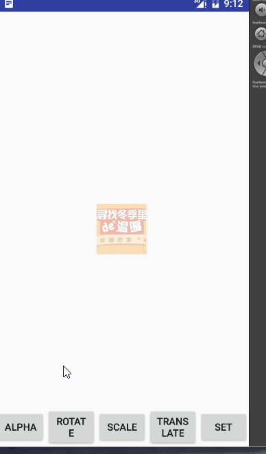
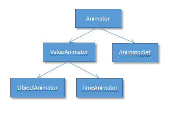
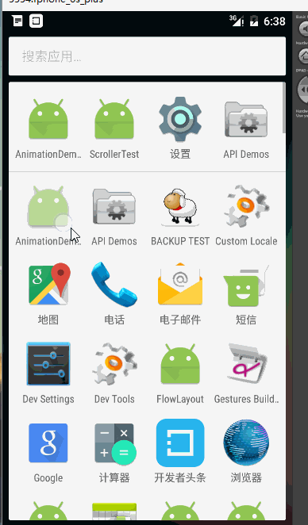
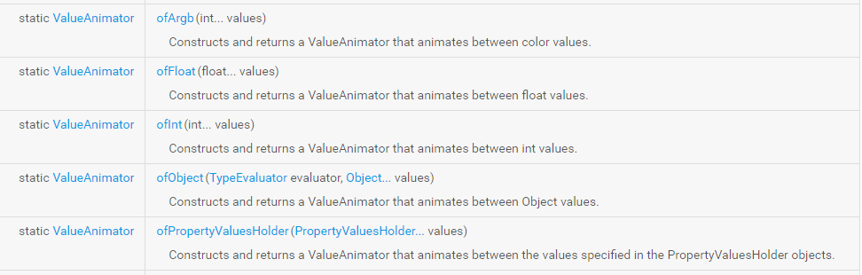

Android 动画分为两大类，分别是视图动画（View Animation）和属性动画（Property Animation）。对于这两种动画，都能够使用xml和代码的形式定义动画。

## View Animation 

视图动画是`Android`最基础的动画，在API 1中就已经加入，不需考虑兼容性，但由于其动画只是作用于视图上，而不会由该控件的属性，所以有很多的局限性。

视图动画的基类是`Animation`其下包含了四个直接的子类

- `AlphaAnimation`： 透明度动画
- `TranslateAnimation`:平移动画
- `ScaleAnimation`:缩放动画
- `RotateAnimation`：旋转动画
- `AnimationSet`:动画集合

### Animation 公共常用方法

| xml属性        | java 方法           | 解释  |
| ------------- |:-------------:|:-----:|
|android:duration|setDuration(long)| 设置动画执行的时间|
|android:fillAfter|setFillAfter(boolean)|设置动画是否保持其结束时的状态，默认false，不保存|
|android:fillBefore|setFillBefore(boolean)|设置动画结束时是否回到其动画初始之前的状态，默认为true。当设置为false时，需要fillEnabled属性为true|
|android:fillEnabled| setFillEnable(boolean)|当该属性设置为true时，fillBefore(false)属性才能生效。|
|android:interpolator|setInterpolator(Interpolator)|设置插值器，及动画执行的变化的速率。及一直匀速，或前快后慢等|
|android:repeatCount|setRepeatCount(int)|设置动画重复执行的次数，默认为0，及不重复执行|
|android:repeatMode|setRepeatMode(int)|设置动画重复执行的模式，可取值REVERSE：重复执行时，按照倒序。RESTART：从头开始|
|android:startOffset|setStartOffset(long)|设置动画延迟执行的时间|


View Animation 通过xml文件构造动画时，其资源文件存放在 res-》anim。 这个需要我们手动创建anim文件夹。

我们将实现如下例子，用以学习View Animation


### AlphaAnimation

- java代码定义动画

```java 

//初始透明度，结束时的透明度  取值范围1.0~0.0
        AlphaAnimation anim= new AlphaAnimation(1,0);
        //RepeatCount ,动画执行结束后的重复次数，如果大于0，则重复次数。默认是0
        //如果小于0，默认是Animation.INFINITE
        anim.setRepeatCount(1); //重复1次
        //Animation.RESTART  从头开始。  Animation.REVERSE :反转
        anim.setRepeatMode(Animation.REVERSE);  
        anim.setDuration(1000);

       
        img.startAnimation(anim);
```

- xml定义动画
创建  res-》anim-》view_alpha.xml 文件。
```xml 
<alpha xmlns:android="http://schemas.android.com/apk/res/android"
    android:duration="1000"
    android:repeatMode="reverse"
    android:repeatCount="1"
    android:fromAlpha="1"
    android:toAlpha="0"
	>
 <!--
    fromAlpha  : 初始透明度
    toAlpha： 目标透明度
    -->

</alpha>

```

在java代码中通过AnimationUtils加载xml文件，构造动画对象。对于`View Aniamtion`，都是通过该方法加载xml文件。

```java 
Animation animation = AnimationUtils.loadAnimation(getApplicationContext(), R.anim.view_alpha);
img.startAnimation(animation);
```

### RotateAnimation 旋转动画

- **java 代码创建**

```java 
		
        RotateAnimation anim = new RotateAnimation(0f,180f,Animation.RELATIVE_TO_SELF,0.5f,Animation.RELATIVE_TO_SELF,0.5f);
        anim.setDuration(500);
        //设置为true ，则保持动画结束后的状态，默认false
        anim.setFillAfter(true); 
        
        img.startAnimation(anim);

```

在RotateAnimation中最全参数的构造方法如下`RotateAnimation(float fromDegrees, float toDegrees, int pivotXType, float pivotXValue, int pivotYType, float pivotYValue)`参数解释如下：

- `fromDegrees`:起始的度数
- `toDegrees`：结束时的度数
- `pivotXType`和`pivotYType`:旋转时参照的动画中心点的位置类型。可选值：`RELATIVE_TO_SELF`依据自身为参照。`RELATIVE_TO_PARENT` 依据其所在的父控件为参照
- `pivotXValue`和`pivotYValue`：百分比值。与上面的参数配合使用。例如对于X轴来说，如果类型是`RELATIVE_TO_SELF`，值是0.5f,则就是位于当前控件x轴的中心。


- **xml创建动画**

```xml 
<rotate xmlns:android="http://schemas.android.com/apk/res/android"
    android:duration = "500"
    android:fillAfter = "true"
    android:fromDegrees="0"
    android:toDegrees="180"
    android:pivotX="50%"
    android:pivotY="50%"
    >

    <!--
    android:duration 动画从开始到结束持续的时长，单位为毫秒
    android:fromDegrees 旋转开始的角度
    android:toDegrees 旋转结束的角度
    android:pivotX 旋转中心点的X坐标，纯数字表示相对于View本身左边缘的像素偏移量；
                    带"%"后缀时表示相对于View本身左边缘的百分比偏移量；带"%p"后缀时表示相对于父View左边缘的百分比偏移量
    android:pivotY 旋转中心点的Y坐标，纯数字表示相对于View本身顶部边缘的像素偏移量；
                    带"%"后缀时表示相对于View本身顶部边缘的百分比偏移量；带"%p"后缀时表示相对于父View顶部边缘的百分比偏移量

    -->

</rotate>

```


### ScaleAnimation 缩放动画

- **java 代码实现**

```java 

        ScaleAnimation anim = new ScaleAnimation(1f,0.5f,1f,0.5f,0.5f,0.f);
        anim.setDuration(500);
        img.startAnimation(anim);

```

对于`ScaleAnimation`，仍然看他构造方法中参数最多的。

`ScaleAnimation(float fromX, float toX, float fromY, float toY, int pivotXType, float pivotXValue, int pivotYType, float pivotYValue)`

- `fromX`:动画开始时x轴方向控件缩放的比例。
- `toX`:动画结束时x轴方向控件缩放的比例。
- `fromY`:动画开始时y轴方向控件缩放的比例。
- `toY`:动画结束时y轴方向控件缩放的比例。
- `pivotXType，pivotYType`:缩放时中心点的参照物。类比旋转
- `pivotXValue,pivotYValue`:缩放时中心点相对于其参照物的位置。类比旋转。

- **xml实现**

```xml 
<scale xmlns:android="http://schemas.android.com/apk/res/android"
    android:duration ="1000"
    android:fromXScale="1"
    android:toXScale="0.5"
    android:fromYScale="1"
    android:toYScale="0.5"
    android:pivotX="50%"
    android:pivotY="50%"
    >

    <!--
    android:duration 动画从开始到结束持续的时长，单位为毫秒
    android:fromXScale 动画开始时X坐标上的缩放尺寸
    android:toXScale 动画结束时X坐标上的缩放尺寸
    android:fromYScale 动画开始时Y坐标上的缩放尺寸
    android:toYScale 动画结束时Y坐标上的缩放尺寸
    PS：以上四个属性，0.0表示缩放到没有，1.0表示正常无缩放，小于1.0表示收缩，大于1.0表示放大

    android:pivotX 缩放时的固定不变的X坐标，一般用百分比表示，0%表示左边缘，100%表示右边缘

    android:pivotY 缩放时的固定不变的Y坐标，一般用百分比表示，0%表示顶部边缘，100%表示底部边缘

    -->
</scale>
```


### TraslateAnimation 位移动画

**java代码实现**

```java 
 TranslateAnimation anim = new TranslateAnimation(Animation.RELATIVE_TO_SELF,0f,Animation.RELATIVE_TO_SELF,1f,
                Animation.RELATIVE_TO_SELF,0f,Animation.RELATIVE_TO_SELF,1f);

        anim.setDuration(500);

        img.startAnimation(anim);
```

`TranslateAnimation(int fromXType, float fromXValue, int toXType, float toXValue,int fromYType, float fromYValue, int toYType, float toYValue)`

其构造函数是类型和值是成对出现的。
- type表示当前值是相对于父控件还是其本身。
- value：偏移量的百分比。取值0.0~1.0；


**xml 代码实现**

```xml 
<translate xmlns:android="http://schemas.android.com/apk/res/android"
    android:duration = "500"
    android:fromXDelta="0%"
    android:toXDelta="100%"
    android:fromYDelta="0%"
    android:toYDelta="100%"
    >

    <!--

    android:duration 动画从开始到结束持续的时长，单位为毫秒
        android:fromXDelta 起始位置的X坐标的偏移量
        android:toXDelta 结束位置的X坐标的偏移量
        android:fromYDelta 起始位置的Y坐标的偏移量
        android:toYDelta 结束位置的Y坐标的偏移量
    -->

</translate>
```

### AnimationSet 动画集合

动画集合相当于是把单一动画整合一起之后同时执行。

**java 代码实现**

```java 
  		//shareInterpolator  true 使用set的差值器 ，false ：使用自身的差值器
        AnimationSet set = new AnimationSet(true);


        ScaleAnimation anim = new ScaleAnimation(1f,0.5f,1f,0.5f,0.5f,0.f);
        anim.setDuration(500);

        RotateAnimation anim1 = new RotateAnimation(0f,180f,Animation.RELATIVE_TO_SELF,0.5f,Animation.RELATIVE_TO_SELF,0.5f);
        anim.setDuration(500);

        set.addAnimation(anim);
        set.addAnimation(anim1);

        set.setDuration(500); //设置动画时间，不然动画执行时间有问题，和想象中的各自执行叠加不同

        img.startAnimation(set);

```

在`AnimationSet`中有几个关键点。

- `AnimationSet`的构造方法，会传入一个布尔值，当为`true`时，表示其所加入的动画的插值器使用`AnimationSet`所设置的插值器。`false`：标识其所加入的动画使用他们自己所设置的插值器。

- 通过`addAniamtion(anim)`添加动画。

- 需要设置动画时间。


**xml 代码实现**

```xml 
<set xmlns:android="http://schemas.android.com/apk/res/android"
    android:duration="500"
    >

    <translate
        android:fromXDelta="0%"
        android:toXDelta="100%"
        android:fromYDelta="0%"
        android:toYDelta="100%"/>


    <rotate
        android:fromDegrees="0"
        android:toDegrees="180"
        android:pivotY="50%"
        android:pivotX="50%"/>


</set>
```


> 总结：视图动画改变的是动画的显示效果，但实际，其本身包含的属性，宽，高，所处位置等等并没有改变。

## Property Aniamtion

属性动画是Android 3.0 之后引入的新的动画。从其定义的名称就可以看出，他和视图动画的区别就在于，他是通过改变控件的属性已达到动画的效果的。但因为其从Android3.0加入，所以我们的app最小sdk必须11以上。这个在现在应该不是问题。3.0一下的市场占有率已经很少了。

视图动画的基类是`Animation`,而属性动画的基类是`Animator`。

在Animator中同样有一些公用的方法，下面列举一些常用的方法

- `pause()`:暂停一个正在运行的动画
- `resume()`:恢复一个暂停的动画
- `setDuration()`: 设置动画执行的时间
- `setInterpolator()`: 设置动画的插值器
- `setStartDelay()`: 设置动画延迟执行的时间
- `setTarget()`: 设置动画将要作用的对象
- `start()`:启动动画


通过google的文档可以看到，`Animator`的结构图如下



可以看到其下分为两个子类`ValueAnimator`，单一动画的基类。`AniamtorSet`动画集合。


那么我们就开始一个一个的分析他们的使用。看一下例子，动画因为设计不合理，所以没有按顺序演示




将会首先按照代码的方式分析，xml文件的格式构造动画的放在最后。

### ValueAnimator

该类是属性动画中单一动画的基类。该类总结性的说，他可以定义初始值，结束值，时间。然后会这个时间段中，按照一定的规则，从初始值开始逐渐向结束值过渡，通过产生的一系列过渡值设置控件的属性形成了动画效果。

通过以上的总结，我们明确了几个关键字，初始值，结束值，时间，产生的过渡值。对于时间，我们知道在其父类`Animator`中有设置时间的方法。那么`ValueAnimator`是如何定义初始值和结束值的呢？

在google的文档中，有如下方法



他们的参数都是可变参数，意思是，我们可以传入一系列值，按照这一系列值进行变换。

- `ofArgb`: ARGB,色值吗。 按照颜色的格式进行过渡。
- `ofFloat`:浮点类型进行过渡。
- `ofInt`:整形。
- `ofObject`:不知道什么意思。通过对象来过渡。后面在说吧。
- `ofPropertyValueHolder`:通过`PropertyValueHolder`构造。下面会说。

ok，现在我们设置了初始值，结束值，事件，那么我们如何获取这个过渡值呢，很明显，他肯定有监听的回调方法。

`addUpdateListener`:该方法回监听每次动画过渡值得修改并回调。那么我们看一下例子

```java 
ValueAnimator anim = ValueAnimator.ofFloat(1f, 0f，1f)
                .setDuration(1000);

 anim.addUpdateListener(new ValueAnimator.AnimatorUpdateListener() {
            @Override
            public void onAnimationUpdate(ValueAnimator animation) {
                //根据动画的过渡产生数量值,通过getAnimatedValue获取变化的值
                float offset = (float) animation.getAnimatedValue();
                //设置透明度
                img.setAlpha(offset);
                //设置缩放
                img.setScaleX(offset);
                img.setScaleY(offset);

            }
        });

        anim.start();

```

那么动画，会先是缩小的同时慢慢的透明，然后又慢慢的放大并显现。


### ObjectAnimation

`ObjectAniamtor`是`ValueAnimator`的子类，从编程思想上分析，他肯定是对他的父类做了一些封装，添加了一些新的功能。及更加的细致。那么，他的细致在哪买呢？

我们在用`ValueAnimator`时，还需要设置监听，就不能添加一些，比如旋转，缩放等之类的常用的属性让我设置，省得设置监听回调了。ok，`ObjectAnimator`就干了这件事。

仍然根据我们的关键字，来分析。由于其继承`ValueAnimator`，那么肯定有of..方法。不过他在此基础上，添加了一些参数。因为原理相同，只分析`ofFloat`（其实只是懒）。

`ofFloat(Object target, String propertyName, float... values)`，多了两个参数。起始很好理解。如果让我们对`ValueAnimator`进行二次封装，需要的无非就是，我要改变的属性，以及我要作用的对象。ok，就是这两个参数。

- `target`:作用的对象。
- `proepertyName`:作用对象的属性。
- `values`：可变参数，你猜他是什么意思。

那么用法也非常简单

```java 
ObjectAnimator anim = ObjectAnimator.ofFloat(img, "rotation", 0f, 360f)
                .setDuration(1000);

        anim.start();

```

可见，大大的节省了代码量。

那么对于`propertyName`，我们都可以设置那些值呢。

- `translationX`和`translationY` ：相对于控件本身先x,y轴的偏移量。与`x`,`y`类比。
- `x`和`y`：相对于其所在父控件的x，y轴的偏移量。其与上面的属性，都是按照像素进行偏移。
- `rotation`，`rotationX`，`rotationY`:旋转，分别是绕中心点的2d旋转和绕先x,y轴的3D旋转。
- `scaleX`，`scaleY`：缩放，x，y轴的缩放。
- `pivotX`，`pivotY`:旋转和缩放相对于某一点的设置。默认是中心点。
- `alpha`:透明度

那么，我们能够自己定义属性吗，当然可以。其实，他里面的逻辑是通过该属性值查找动画目标中是否有setXXX方法，如果有，将会调用。而以上列举的属性，Android已经在View中默认实现了set方法。

那么下面我们就通过动画实现比较常见的获取验证码倒计时的功能。

首先在布局文件中添加控件
```xml 
  <Button
        android:text="获取验证码"
        android:onClick="startTime"
        android:id="@+id/timer"
        android:layout_width="wrap_content"
        android:layout_height="wrap_content" />

```

我们明白他是通过是否有setXXX方法，来修改对应属性值的。那么我们对`Button`进行封装`TimerBtnWrapper`，

```java 
/**
 * Button按钮的包装类，实现倒计时
 * Created by Alex_MaHao on 2016/5/13.
 */
public class TimerBtnWrapper {

    private Button btn;

    public TimerBtnWrapper(Button btn) {
        this.btn = btn;
    }


    /**
     * 关键方法，动画调用此方法，修改属性值
     * @param time
     */
    public void setTimer(int time){

        btn.setText(time+"s");
    }


    /**
     * 设值动画结束后的值
     * @param text
     */
    public void setTimeEndText(String text){
        btn.setText(text);
    }

    /**
     * 设置按钮是否可以点击
     * @param isClick
     */
    public void setIsClick(boolean isClick){
        btn.setClickable(isClick);
    }
}

```

在`main`中创建动画：

```java 
 mTimeAnim = ObjectAnimator.ofInt(new TimerBtnWrapper(mTimerBtn),"timer",60,0).setDuration(60*1000);

        //修改插值器，即数值改变速率平均
        mTimeAnim.setInterpolator(new LinearInterpolator());
        
        //设置动画监听
        mTimeAnim.addListener(new AnimatorListenerAdapter() {
            @Override
            public void onAnimationEnd(Animator animation) {
                //动画结束，设置按钮可以点击，同时设置重新获取验证码

                //获取动画的目标控件
                TimerBtnWrapper target = (TimerBtnWrapper) ((ObjectAnimator) animation).getTarget();

                target.setIsClick(true);
                target.setTimeEndText("重新获取");
            }

            @Override
            public void onAnimationStart(Animator animation) {
                //动画开始时，设置按钮不可点击

                //获取动画的目标控件
                TimerBtnWrapper target = (TimerBtnWrapper) ((ObjectAnimator) animation).getTarget();

                target.setIsClick(false);
            }
        });

```

实现按钮的点击事件
```java 
 public void startTime(View view){
        mTimeAnim.start();
    }
```

### TimeAniamtor

> This class provides a simple callback mechanism to listeners that is synchronized with all other animators in the system. There is no duration, interpolation, or object value-setting with this Animator. Instead, it is simply started, after which it proceeds to send out events on every animation frame to its TimeListener (if set), with information about this animator, the total elapsed time, and the elapsed time since the previous animation frame.

为什么在这贴一大段英文呢，因为我也不知道这个对象是干啥的。以上是google的API介绍。


### PropertyValuesHolder 

在`ValueAniamtor`的构造初始默认值时，有`ofPropertyValuesHolder(PropertyValuesHolder... values)`方法，而其传入的参数即为`PropertyValuesHolder`对象。

那么，他到底是什么意思。如果我们有这种需求，如果我们想让一个控件从不透明逐渐透明的动画，那么很好实现，
```java 
	ObjectAnimator anim = ObjectAnimator.ofFloat(imageView,"alpha",1f,0f);

```

现在，我们的需求改了，想让他在逐渐透明的时候，逐渐缩小。很尴尬，怎么实现呢，我们要启动两个动画吗，或者整一个动画集合，都不用，这时候就显示出了PropertyValuesHolder的作用。我们可以通过如下代码实现我们的要求：

```java 

        PropertyValuesHolder pvhX = PropertyValuesHolder.ofFloat("scaleX",1f,0f);

        PropertyValuesHolder pvhY = PropertyValuesHolder.ofFloat("scaleY",1f,0f);
        
        PropertyValuesHolder pvhAlhpa = PropertyValuesHolder.ofFloat("alpha",1f,0f);
        
        ObjectAnimator anim = ObjectAnimator.ofPropertyValuesHolder(img,pvhX,pvhY,pvhAlhpa);


```


### Keyframe

在上一段中，我们知道通过`PropertyValuesHolder`可以对一个控件的不同属性定义动画，可以定义为扩大了动画的范围。而keyframe则是提高动画的精度。frame是帧的意思。我们可以定义一个动画中某一帧是什么状态。

```java 
	Keyframe kf0 = Keyframe.ofFloat(0f, 0f);
	Keyframe kf1 = Keyframe.ofFloat(0.5f, 360f);
	Keyframe kf2 = Keyframe.ofFloat(1f, 0f);
	PropertyValuesHolder pvhRotation = PropertyValuesHolder.ofKeyframe("rotation", kf0, kf1, kf2);
	ObjectAnimator rotationAnim = ObjectAnimator.ofPropertyValuesHolder(target, pvhRotation)
	rotationAnim.setDuration(5000ms);
```
这是google 官方的例子，我们分析一下即可。该例子中定义了一个旋转动画。其中创建了三个`keyframe`对象，通过`ofFloat(fraction,value)`,`fraction`表示动画所处在那一帧，`value`代表所对应的值。分别对应状态是

- 在动画执行初始时，值是0；在这里即旋转的度数0°。
- 在动画执行到1/2时，值是360。
- 在动画执行到1时，及结束，值是0.

同时`Keyframe`中有`setInterpolator`方法，即可以设置不同帧之间的插值器。

### AnimatorSet 属性动画集合

相比较视图动画的`AnimationSet`不同，`AnimatorSet`不进可以定义动画的同时执行，还可定义动画的执行先后顺，因为比较简单，直接一个例子搞定。

```java 
 //============使用代码实现AnimatorSet ==============
        ObjectAnimator rotateAnim = ObjectAnimator.ofFloat(img, "rotation", 0f, 360f)
                .setDuration(1000);
  		// 使用PropertyValuesHolder实现缩放动画
        PropertyValuesHolder pvhX = PropertyValuesHolder.ofFloat("scaleX",1,0);

        PropertyValuesHolder pvhY = PropertyValuesHolder.ofFloat("scaleY",1,0);

        ObjectAnimator scaleAnim = ObjectAnimator.ofPropertyValuesHolder(img, pvhX, pvhY);
        scaleAnim.setDuration(1000);


        AnimatorSet animSet = new AnimatorSet();

        //两个动画同时执行
        //animSet.play(rotateAnim).with(scaleAnim);

        //先缩放在旋转
//      animSet.play(rotateAnim).after(scaleAnim);

        //先旋转 再缩放
        animSet.play(rotateAnim).before(scaleAnim);
        animSet.start();


```
代码都有注释，应该难度不大。


### 使用xml创建属性动画

**`ValueAnimator`**

```xml 
<animator xmlns:android="http://schemas.android.com/apk/res/android"
    android:duration="1000"
    android:valueFrom="1f"
    android:valueTo="0f"
    android:valueType="floatType"
    >

    <!--
        valueFrom: 初始值
        valueTo：结束值
        valueType：值得类型
        propertyName:动画作用的属性

    -->
</animator>
```

注意，根节点是`<animator>`

**ObjectAnimator**

```xml 
<objectAnimator xmlns:android="http://schemas.android.com/apk/res/android"
    android:duration="1000"
    android:valueTo="360"
    android:valueFrom="0"
    android:propertyName="rotation"
    android:valueType="floatType"
    >

    <!--
        valueFrom: 初始值
        valueTo：结束值
        valueType：值得类型
        propertyName:动画作用的属性

    -->

</objectAnimator>

```

注意根节点是`<objectAnimator>`

**AnimatorSet**

```xml 
<!--
android:ordering 设置动画的时序关系，取值可为以下两个值之一：
        together 动画同时执行，默认值
        sequentially 动画按顺序执行 即代码的从上往下，
            - 对于当前例子来说，限制性旋转，再执行缩放。

-->
<set xmlns:android="http://schemas.android.com/apk/res/android"
    android:ordering="sequentially"
    >

    <objectAnimator
        android:propertyName="rotation"
        android:valueTo="360"
        android:valueFrom="0"
        android:valueType="floatType"
        android:duration="1000"/>


    <set android:ordering="together">

        <objectAnimator
            android:propertyName="scaleY"
            android:valueFrom="1"
            android:valueTo="0"
            android:valueType="floatType"
            android:duration="1000"
        />

        <objectAnimator
            android:propertyName="scaleX"
            android:valueFrom="1"
            android:valueTo="0"
            android:valueType="floatType"
            android:duration="1000"
            />

    </set>


</set>

```

注意,set可以嵌套使用以及`ordering`关键字。

**使用方式**

和视图动画使用`AnimationUtils`相比，其使用的是`AnimatorInflater`。具体使用方式如下：

```java 
 		Animator anim = AnimatorInflater.loadAnimator(getApplicationContext(), R.animator.property_set);

        anim.setTarget(img);

        anim.start();


```
对于`ValueAnimator`要注意设置监听。


> 源码已更新到[我的github](https://github.com/AlexSmille/alex_mahao_sample),在`animationdemo`文件中。


