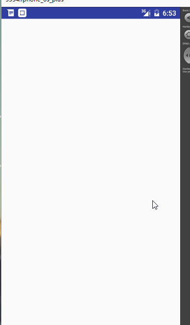

## Android动画之布局动画

布局动画是针对于ViewGroup使用的，我们直接上效果，通过效果分析进行实现。



首先我们分析一下效果图，总共可分为两种，
- 在我们的界面初始化显示时，会垂直显示一条垂直的按钮，他们会从右边按照顺序飞入。
- 当我们向这个垂直的按钮列表添加和移除按钮时，添加或删除的按钮有一个进入和飞出的动画，他所影响的其他按钮也会有一个过渡动画。

这两中效果分别使用了Android中的两个类，`LayoutAnimationController`和`LayoutTransition`。


### LayoutAniamtionContrller

该动画主要用于针对于一个`ViewGroup`初始化时对于其下子控件的动画操作。针对于上面的效果，我们的实现方式如下：

首先，可以看到我们的控件是从右边进入，逐渐显现，所以定义如下动画

```java 
<set xmlns:android="http://schemas.android.com/apk/res/android"
    android:duration="500">

    <translate
        android:fromXDelta="100%"
        android:fromYDelta="0"
        android:toXDelta="0"
        android:toYDelta="0"/>

    <alpha android:fromAlpha="0"
        android:toAlpha="1"/>
</set>

```

在代码中，加载动画，并通过`LayoutAnimationController`设置到`LinearLayout`上。

```java 

		//通过加载XML动画设置文件来创建一个Animation对象；
        Animation animation= AnimationUtils.loadAnimation(this, R.anim.listview_item_anim);   
		//得到一个LayoutAnimationController对象；
        LayoutAnimationController controller = new LayoutAnimationController(animation);   
		//设置控件显示的顺序；
        controller.setOrder(LayoutAnimationController.ORDER_NORMAL);  
		//设置控件显示间隔时间；
        controller.setDelay(0.3f);   
		//为ListView设置LayoutAnimationController属性；
        mParent.setLayoutAnimation(controller);
```

注释很清楚，唯一要解释的只有两点：

- 子控件显示顺序可取值
	- `ORDER_NORMAL`：正常顺序，及按照从上往下开始执行。
	- `ORDER_REVERSE`：倒序。从下往上。
	- `ORDER_RANDOM`：随机。

- 间隔时间，可设置的值0.0~1.0（百分比值）。及上一个控件显示到多少是下一个控件开始执行动画。

因为其只是在控件初始化时调用，并且是对控件整体的子控件加载一个按照固定顺序显示的动画。我们可以调用`ViewGroup.startLayoutAnimation()`让其重新显示一遍。

### LayoutTransition

对于一个`LinearLayout`，在`xml`中添加`android:animateLayoutChanges="true"`或者在`java`代码中添加代码
```java 
 LayoutTransition mTransition = new LayoutTransition();

 mParent.setLayoutTransition(mTransition);
```

`LayoutTransition`有默认的动画效果。

此时，我们如果在添加子控件或删除子控件，就有了动画效果。

当然，我们肯定要懂得如何自定义动画效果。看一下`LayoutTransition`的文档，可以看到有如下方法

```java 
 public void setAnimator(int transitionType, Animator animator) 
```

他的注释如下

> @param transitionType One of {@link #CHANGE_APPEARING}, {@link #CHANGE_DISAPPEARING}, {@link #CHANGING}, {@link #APPEARING}, or {@link #DISAPPEARING}, which determines theanimation whose animator is being set.
   @param animator The animation being assigned. A value of <code>null</code> means that no
   animation will be run for the specified transitionType.


第一个参数，我们要设置动画的目标，类型。第二个参数表示要设置的动画。

类型中可以取四个字段，这四个字段很重要。我们看一下他们的含义

- `LayoutTransition.APPEARING`：当一个View在ViewGroup中出现时，对此View设置的动画
- `LayoutTransition.CHANGE_APPEARING`：当一个View在ViewGroup中出现时，对此View对其他View位置造成影响，对其他View设置的动画
- `LayoutTransition.DISAPPEARING`：当一个View在ViewGroup中消失时，对此View设置的动画
- `LayoutTransition.CHANGE_DISAPPEARING`：当一个View在ViewGroup中消失时，对此View对其他View位置造成影响，对其他View设置的动画。

既然含义了解了，看一下代码实现：

```java 
 		LayoutTransition mTransition = new LayoutTransition();

 		mParent.setLayoutTransition(mTransition);

 		//view 进入
        ObjectAnimator animator1 = ObjectAnimator.ofFloat(null, "rotationY", -90f, 0f)
                .setDuration(mTransition.getDuration(LayoutTransition.APPEARING));
        animator1.setInterpolator(new LinearInterpolator());
        mTransition.setAnimator(LayoutTransition.APPEARING, animator1);

        //view 退出
        PropertyValuesHolder propertyValuesHolder = PropertyValuesHolder.ofFloat("alpha", 1f, 0f);
        PropertyValuesHolder propertyValuesHolder1 = PropertyValuesHolder.ofFloat("translationX", 0f, 1000f);
        ObjectAnimator animator2 = ObjectAnimator.ofPropertyValuesHolder(new Object(), propertyValuesHolder, propertyValuesHolder1);
        animator2.setDuration(mTransition.getDuration(LayoutTransition.DISAPPEARING));

//       ObjectAnimator animator2 = ObjectAnimator.ofFloat(null,"translationX",0f,1000f).setDuration(1000);
        mTransition.setAnimator(LayoutTransition.DISAPPEARING, animator2);


        //控件进入对其他控件的影响

		// google 原生的写法， 不加会出错
        PropertyValuesHolder pvhLeft = PropertyValuesHolder.ofInt("left", 0, 1);
        PropertyValuesHolder pvhTop = PropertyValuesHolder.ofInt("top", 0, 1);
        PropertyValuesHolder pvhRight = PropertyValuesHolder.ofInt("right", 0, 1);
        PropertyValuesHolder pvhBottom = PropertyValuesHolder.ofInt("bottom", 0, 1);
        PropertyValuesHolder pvhScrollX = PropertyValuesHolder.ofInt("scrollX", 0, 1);
        PropertyValuesHolder pvhScrollY = PropertyValuesHolder.ofInt("scrollY", 0, 1);

		//自定义的动画
        PropertyValuesHolder pvhChangeAppearing = PropertyValuesHolder.ofFloat("scaleX", 1f, 2f, 1f);

        ObjectAnimator animator3 = ObjectAnimator.ofPropertyValuesHolder(this, pvhLeft, pvhTop, pvhRight, pvhBottom,
                pvhScrollX, pvhScrollY, pvhChangeAppearing);
        mTransition.setAnimator(LayoutTransition.CHANGE_APPEARING, animator3);

        //如果当前动画没有结束，如果有新的View加入，会导致当前动画取消，并进行下一次动画，所以需要添加监听
        animator3.addListener(new AnimatorListenerAdapter() {
            @Override
            public void onAnimationEnd(Animator animation) {
                View target = (View) ((ObjectAnimator) animation).getTarget();
                target.setScaleX(1f);
            }
        });


        //控件消失对其他控件的影响，类似于上面的，偷懒了
        mTransition.setAnimator(LayoutTransition.CHANGE_DISAPPEARING, animator3);


```

如果了解属性动画的，这个地方没有什么难点，唯一需要注意的是，在控件进入或消失对其他控件的影响时，会出现一种情况，当我们连续点击添加控件时，其他控件的动画还没结束，会将动画停止到其执行状态，并执行下一次动画。例如控件放大到一半时，停止并执行下一次动画，那么初始值就是控件放大到一半的值了，那么肯定会出错。所以需要设置动画监听，当动画结束时，设置其缩放。及上述代码中这段代码
```java 
   animator3.addListener(new AnimatorListenerAdapter() {
            @Override
            public void onAnimationEnd(Animator animation) {
                View target = (View) ((ObjectAnimator) animation).getTarget();
                target.setScaleX(1f);
            }
        });

```


源码已更新到[github](https://github.com/AlexSmille/alex_mahao_sample),在`animationdemo`文件中。


