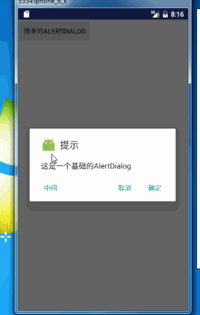
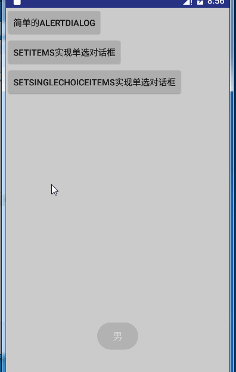
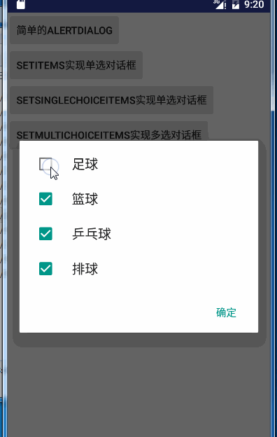
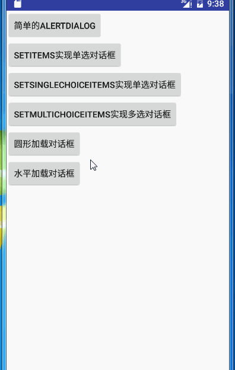
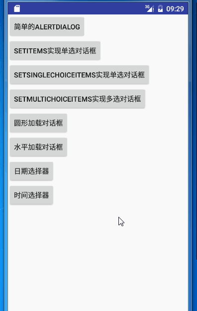
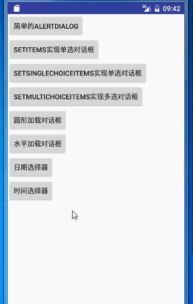
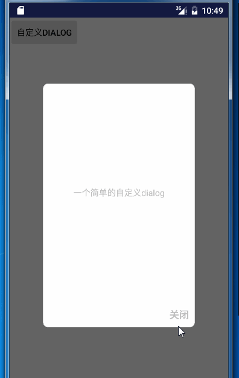
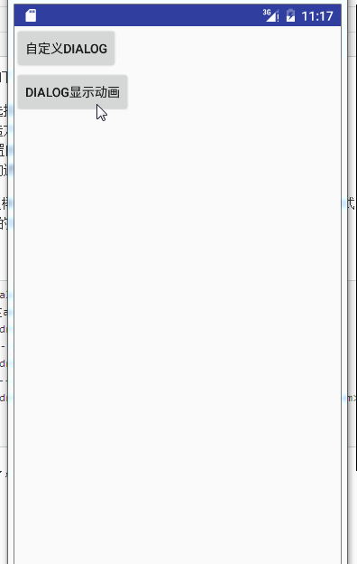

## Dialog 使用总结

`Dialog` 是`Android`中对话框相关的类，起到相关提示的作用。

`Dialog`在Android 中主要分为以下几类：


- `AlertDialog` :警告对话框(提示对话框)
- `ProgressDialog`：进度对话框
- `DatePickerDialog`：日期选择对话框
- `TimerPickerDialog`: 时间选择对话框
- 自定义对话框

下面将按照如上所分类，进行一一介绍。

### AlertDialog

#### AlertDialog 的简单使用

`AlertDialog` 继承 `Dialog`，该对象对于常用的一些对话框进行了封装。

需要注意的是`AlertDialog`存在两种实现并对应的存在于两个不同的包，

- Android 原生包`android.app.AlertDialog`。该包中的`AlertDialog`并没有对不同版本的系统进行适配。在不同的手机系统上会显示不同的样式。（不推荐）。
- v7包`android.support.v7.app.AlertDialog`。该包中的`AlertDialog`是根据google 推出的`Material Desgin`进行设计的，并对低版本的系统进行了适配。支持系统版本到7（Android 2.1 ）以上。（推荐）

下面都将使用v7版本的`AlertDialog`

`AlertDialog`的使用分为以下几步：

1. 创建`AlertDialog.Builder`对象，该对象能创建`AlertDialog`。
2. 调用`Builder`对象的方法设置图标、标题、内容、按钮等。
	- `setTitle()`：为对话框设置标题
	- `setIcon ()`：设置图标
	- `setMessage ()`：设置要显示的信息
	- `setPositiveButton ()`：设置确定按钮
	- `setNegativeButton ()`: 设置取消按钮
	- `setNeutralButton ()`：设置中立按钮
3. 调用`Builder`对象的`create()`方法创建`AlertDialog`对话框。
4. 调用`AlertDialog`的`show()`方法来显示对话框
5. 调用`AlertDialog`的`dimiss()`方法销毁对话框。

下面就根据上面的步骤，来创建`AlertDialog`方法。

```java 

    public void dialog1(View view){
        // 简单的AlertDialog

        // 1 . 创建AlertDialog 对象
        //          注意 Dialog 的Builder的创建虽然传入的是Context，其实是多态，此处必须传入Activity对象
        AlertDialog.Builder builder = new AlertDialog.Builder(this);

        // 2. 通过builder 设置一些常用的属性
        //   设置图标
        builder.setIcon(R.mipmap.ic_launcher);
        // 设置标题
        builder.setTitle("提示");

        //设置提示消息
        builder.setMessage("这是一个基础的AlertDialog");

        builder.setPositiveButton("确定", new DialogInterface.OnClickListener() {
            @Override
            public void onClick(DialogInterface dialog, int which) {
                //点击确定按钮之后的回调
                Toast.makeText(AlertDialogActivity.this, "确定", Toast.LENGTH_SHORT).show();
            }
        });

        builder.setNegativeButton("取消", new DialogInterface.OnClickListener() {
            @Override
            public void onClick(DialogInterface dialog, int which) {
                //点击取消按钮之后的回调
            }
        });

        builder.setNeutralButton("中间", new DialogInterface.OnClickListener() {
            @Override
            public void onClick(DialogInterface dialog, int which) {
                //点击中间的按钮的回调
            }
        });


        //3 .通过Builder  的 create方法创建AlertDialog;

        AlertDialog dialog = builder.create();


        // 4 . 显示对话框

        dialog.show();

    }

```

看一下效果




有以下几点需要注意：

- `AlertDialog`和`Builder`导入的都是`android.support.v7.app.AlertDialog`。
- 确定，取消和中间三个按钮的接口回调，点击时默认都调用了`dimiss()`方法，所以我们无需手动隐藏他。
- 一般在使用中，不会使用中间那个按钮。都是两个按钮足够：取消和确定，确定在右，取消在左。分别对应两个监听`setPositiveButton`和`setNegativeButton`。英文单词意为积极的和消极的。
- 创建`Dialog`虽然需要的是`Context`,但必须传入`Activity`对象。

如果观察仔细的会发现`builder`的`sexXXX`方法，返回的仍然是`Builder`对象。那么我们可以修改代码之后如下：

```java 
   AlertDialog dialog = new AlertDialog.Builder(this)
                .setIcon(R.mipmap.ic_launcher)
                .setTitle("提示")
                .setMessage("这是一个基础的AlertDialog")
                .setPositiveButton("确定", new DialogInterface.OnClickListener() {
                    @Override
                    public void onClick(DialogInterface dialog, int which) {
                        //点击确定按钮之后的回调
                        Toast.makeText(AlertDialogActivity.this, "确定", Toast.LENGTH_SHORT).show();
                    }
                })
                .setNegativeButton("取消", new DialogInterface.OnClickListener() {
                    @Override
                    public void onClick(DialogInterface dialog, int which) {
                        //点击取消按钮之后的回调
                    }
                })
                .setNeutralButton("中间", new DialogInterface.OnClickListener() {
                    @Override
                    public void onClick(DialogInterface dialog, int which) {
                        //点击中间的按钮的回调
                    }
                }).create();

```

类似一条链式的创建`Dialog`对象。


#### 继承于Dialog的一些特性

因为`AlertDialog`继承`Dialog`,所以他拥有`Dialog`的特性。（该特性对于所有的对话框都适用）

其中几个常用的方法：

- `setCancelable(boolean flag)`：当点击返回键的时候，Dialog是否消失。 true 表示点击返回键提示框消失。 false表示不消失，即点击返回无效果。
- `  setCanceledOnTouchOutside (boolean cancel) ` 点击对话框以外的区域时，对话框是否消失。true 表示点击以外的区域消失，false表示不消失。

```java 

        // 点击返回不会取消对话框
        dialog.setCancelable(false);

        // 触摸对话框以外的区域不会消失
        dialog.setCanceledOnTouchOutside(false);

```

> 注意：该方法是`Dialog`的方法，不是`Builder`中的方法。


#### 具有单选功能的对话框

实现单选功能对话框有两种实现方式，通过两个方法`setItems`和`setSingleChoiceItems`。

- `setItems`：通过该方法实现对话框，无需点击确定，直接点击条目之后立即消失，同时调用相应的回调。
- `setSingleChoiceItems`：普通的单选效果，带有圆圈，点击确定之后隐藏。


首先看一下两个的效果图：



- `setItems()`方法实现单选


```java 
final String[] sex = {"男","女"};

        AlertDialog dialog = new AlertDialog.Builder(this)

                .setItems(sex, new DialogInterface.OnClickListener() {
                    @Override
                    public void onClick(DialogInterface dialog, int which) {
                        // which 表示的 点击的索引。
                        Toast.makeText(AlertDialogActivity.this, sex[which], Toast.LENGTH_SHORT).show();
                    }
                }).create();

        dialog.show();

```

`setItems(CharSequence[] items, final OnClickListener listener)`: 第一个参数为显示不同数据的数组。第二个方法为选择之后的回调。


- `setSingleChoiceItems`实现：

```java 

    public void choice_single(View view){

        final String[] sex = {"男","女"};

        AlertDialog dialog = new AlertDialog.Builder(this)
                .setSingleChoiceItems(sex, 0,new DialogInterface.OnClickListener() {
                    @Override
                    public void onClick(DialogInterface dialog, int which) {
                        // which 表示的 点击的索引。
                        Toast.makeText(AlertDialogActivity.this, sex[which], Toast.LENGTH_SHORT).show();

						//保存状态
                    }
                })
                .setPositiveButton("确定", new DialogInterface.OnClickListener() {
                    @Override
                    public void onClick(DialogInterface dialog, int which) {
                        // 确定操作

						//通过在上一个onClick方法中的回调的记录，进行对应操作。
                    }
                })
                .create();

        dialog.show();

    }

```

`setSingleChoiceItems(CharSequence[] items, int checkedItem,final OnClickListener listener)`： 第一个参数表示数据数组，第二个参数表示默认选中第几条，第三个参数为借口回调。


- 两种方式实现的比较：
	- `setItems`方式实现无法修改，只能选择一次，选中之后对话框就会消失。
	- `setSingleChoiceItems`，可以设置默认的选中条目，多次选择，选中之后不会消失，直到点击确定等隐藏对话框的操作。
	- 两者选中事件的回调相同，都是在他们的参数中的回调对象进行操作。


#### 实现多选对话框

`AlertDialog.Builder`中存在方法`setMultiChoiceItems(CharSequence[] items, boolean[] checkedItems, DialogInterface.OnMultiChoiceClickListener listener) `设置多选对话框。

- `CharSequence[] items`：可选的条目的数组数据。
- `boolean[] checkedItems`：默认显示的状态，与条目一一对象，false表示不选中，true表示默认选中。
- `DialogInterface.OnMultiChoiceClickListener listener`：条目选择产生变化之后的回调


看一下效果：



具体代码

```java 


        final String[] like = {"足球","篮球","乒乓球","排球"};
        final boolean[] check = {false,false,true,true};

        AlertDialog dialog = new AlertDialog.Builder(this)
                .setMultiChoiceItems(like, check, new DialogInterface.OnMultiChoiceClickListener() {
                    @Override
                    public void onClick(DialogInterface dialog, int which, boolean isChecked) {
                        // which 数据变化的索引   isChecked 表示变化的结果

                        // 根据变化修改数据
                        check[which] = isChecked;
                    }
                })
                .setPositiveButton("确定", new DialogInterface.OnClickListener() {
                    @Override
                    public void onClick(DialogInterface dialog, int which) {
                        // 确定操作

                        //根据check 中的true 和 flase 进行处理不同结果。

                        String select = "";
                        for(int i = 0;i<check.length;i++){
                            if(check[i]){
                                select= select+","+like[i];
                            }
                        }

                        Toast.makeText(AlertDialogActivity.this, "选择了"+select, Toast.LENGTH_SHORT).show();
                    }
                })
                .create();

        dialog.show();
```

- `setMultiChoiceItems`中的`OnMultiChoiceClickListener()`，数据变化时回调此方法，我们需要在此方法中保存修改的数据。


### ProgressDialog 进度对话框

`ProgressDialog` 也是继承于`Dialog`,但其扩展了缓冲加载提示的功能。

总共分为两种样式，一种是圆形转圈的加载，一种是水平进度条（带有加载进度）的效果。

看一下效果：



#### 圆形加载对话框

看一下demo

```java 
  /**
     * 圆形加载对话框
     * @param view
     */
    public void progress_circle(View view){
        final ProgressDialog pd  = new ProgressDialog(this);
        // 进度条为水平旋转
        pd.setProgressStyle(ProgressDialog.STYLE_SPINNER);
        // 设置点击返回不能取消
        pd.setCancelable(false);
        //设置触摸对话框以外的区域不会消失
        pd.setCanceledOnTouchOutside(false);
        // 设置提示的title的图标，默认是没有的，如果没有设置title的话只设置Icon是不会显示图标的
        pd.setIcon(R.mipmap.ic_launcher);
        // 设置标题
        pd.setTitle("提示");

        pd.setOnDismissListener(new DialogInterface.OnDismissListener() {
            @Override
            public void onDismiss(DialogInterface dialog) {

                // dimiss的监听
            }
        });

        pd.setOnCancelListener(new DialogInterface.OnCancelListener() {
            @Override
            public void onCancel(DialogInterface dialog) {
                //cancel
            }
        });

        pd.setMessage("这是一个圆形进度条");
        pd.show();

        new Thread(new Runnable() {

            @Override
            public void run() {
                try {
                    Thread.sleep(5000);
                    //pd.cancel();
                    pd.dismiss();
                } catch (InterruptedException e) {
                    e.printStackTrace();
                }

            }
        }).start();

    }
```

- 直接 `new`出`ProgressDialog`,并没有创建什么`Builder`类。
- 通过设置`setProgressStyle`为`ProgressDialog.STYLE_SPINNER`，使其显示圆形加载效果。
- `pd.dismiss()`和`pd.cancel()`方法都能够隐藏加载对话框。
	- `cancel()`表示隐藏对话框，对话框并不会被销毁。会回调`setOnCancelListener`.
	- `dismiss()`:销毁对话框，回调`setOnDismissListener`。

> 推荐使用`dismiss()`方法。因为，如果调用了`cancel`，在`activity`结束时，仍要手动调用`dismiss`。不然，`dialog`如果没有销毁，则会导致内存溢出。

#### 水平加载对话框

```java 
  /**
     * 水平加载进度对话框
     * @param view
     */
    public void progress_horizontal(View view){
        final ProgressDialog pd = new ProgressDialog(this);
        // 设置水平进度条
        pd.setProgressStyle(ProgressDialog.STYLE_HORIZONTAL);
        // 设置点击返回不能取消
        pd.setCancelable(false);
        //设置触摸对话框以外的区域不会消失
        pd.setCanceledOnTouchOutside(false);
        // 设置提示的title的图标，默认是没有的，如果没有设置title的话只设置Icon是不会显示图标的
        pd.setIcon(R.mipmap.ic_launcher);
        // 设置标题
        pd.setTitle("提示");

 		// 默认为100
        pd.setMax(100);

        pd.setMessage("这是一个水平进度条");
        pd.show();

        new Thread(new Runnable() {

            @Override
            public void run() {
                int i = 0;
                while (i < 100) {
                    try {
                        Thread.sleep(200);
                        // 每次增加 1%
                        pd.incrementProgressBy(1);
                        i++;

                    } catch (Exception e) {
                    }
                }
                pd.dismiss();

            }
        }).start();

    }
```

设置一个线程，通过线程没个200ms使进度值+1，最后销毁`dialog`。


- 设置样式：`setProgressStyle` 为`ProgressDialog.STYLE_HORIZONTAL`
- 设置总的进度：`pd.setMax()`，整形，默认为100。
- 动态改变进度：`pd.incrementProgressBy(1);`，改变当前进度值，传入的参数为递增量。


###  DataPickerDialog 日期选择对话框

Android 提供的原生控件，使用起来比较简单，但因为其没有对不同系统做适配，所以在不同系统上显示可能不同。只做了解即可。一般都是自定义日期对话框。

效果


注意：该效果是在Android5.0和以上系统上显示的效果。具体适配会在后面提到。


使用方式

```java 
/**
     * 日期选择器
     * @param view
     */
    public void dialog_date(View view){

        // 年，天，时，分都是从 1 开始  月从1 开始
        
        // 获取系统当前时间
        Calendar instance = Calendar.getInstance();
        int year = instance.get(Calendar.YEAR);
        int month = instance.get(Calendar.MONTH); // 该方法month 从0 开始
        int day = instance.get(Calendar.DAY_OF_MONTH);


        // 构造dialog
        DatePickerDialog dialog = new DatePickerDialog(this,new DatePickerDialog.OnDateSetListener() {
            @Override
            public void onDateSet(DatePicker view, int year, int monthOfYear, int dayOfMonth) {

                // 获取到的month 需要+1 获取正确的月份
                Toast.makeText(AlertDialogActivity.this, year+"-"+monthOfYear+"-"+dayOfMonth, Toast.LENGTH_SHORT).show();
            }
        },year,month,day);


        dialog.show();

    }

```

通过`Calendar`获取系统当前时间，并通过`DatePickerDialog`的构造方法传入系统当前时间和相应的数据回调。最后在显示。

`DatePickerDialog()`构造方法有5个参数：
- 当前`Activity`
- `onDateSetListener()`：数据的回调，在点击确定是将数据作为参数回调`onDateSet`方法。
- `year`， 年
- `month`，注意+1和-1
- `day`，天


有以下几点注意：

- 在JAVA的时间中，无论是当前的`Calendar`还是`DataPicker`，他们的年，天，时，分都是从0开始的，也就是直接获取值显示即可。而月是从0开始的，即我们需要对数据进行+1或-1操作。
	- 如果日期是2016-6-15，则传入的参数为，2016，5，15
	- 如果`onDataSet`回调的日期是2016，5，15。则在显示时需要对月份+1 ，即2016，6（5+1），15
- 颜色的设置：可以看到起弹出的大部分是粉红色，我们可以自定义粉红色区域的颜色。该颜色获取的是我们对应用设置的主题中的`<colorAccent>`

```java 
<!-- Base application theme. -->
    <style name="AppTheme" parent="Theme.AppCompat.Light.NoActionBar">
        <!-- Customize your theme here. -->
        <item name="colorPrimary">@color/colorPrimary</item>
        <item name="colorPrimaryDark">@color/colorPrimaryDark</item>
        <!-- 该字段设置dialog 的颜色-->
        <item name="colorAccent">@color/colorAccent</item>
    </style>

```


### TimePicker 时间选择器

该控件的使用和`DatePickerDialog`的使用基本类似。

看一下效果


注意：该效果是在Android5.0和以上系统上显示的效果。具体适配会在后面提到。


```java 
 /**
     * 时间选择器
     * @param view
     */
    public void dialog_time(View view){

        // 获取系统时间
        Calendar instance = Calendar.getInstance();
        int hour = instance.get(Calendar.HOUR_OF_DAY);
        int minute = instance.get(Calendar.MINUTE);


        // 时间对话框
        TimePickerDialog dialog = new TimePickerDialog(this, new TimePickerDialog.OnTimeSetListener() {
            @Override
            public void onTimeSet(TimePicker view, int hourOfDay, int minute) {

                Toast.makeText(AlertDialogActivity.this, hourOfDay+"-"+minute, Toast.LENGTH_SHORT).show();
            }
        },hour,minute,true);

        //显示
        dialog.show();
    }

```


`TimePickerDialog`的有5个参数
- 当前`Activity`的对象
- `onTimeSetListener`，数据回调。
- `hour`：小时
- `minute`：分
- `is24hourView`:  `false`：不使用24小时制。`true`：使用24小时表示。


### 自定义Dialog

在平常的项目中，因为系统提供的`dialog`无法很好的适配不同的版本（样式不同），通常自定义`Dialog`实现相应功能。

实现的步骤：

- 编写自定义的布局
- 自定义类继承`Dialog`并实现构造方法。
- 设置`dialog`的主题。
- 加载自定义布局
- 使用`setContentView`设置到`dialog`中。
- 查找相应控件并编写逻辑。

看一下效果




- 编写自定义布局`dialog_simple.xml`

```java 
<LinearLayout xmlns:android="http://schemas.android.com/apk/res/android"
    android:orientation="vertical"
    android:background="@drawable/shape_dialog_psd_bg"
    android:layout_width="250dp"
    android:layout_height="400dp">


    <TextView
        android:layout_weight="1"
        android:gravity="center"
        android:text="一个简单的自定义dialog"
        android:layout_width="match_parent"
        android:layout_height="match_parent" />


    <LinearLayout
        android:layout_margin="10dp"
        android:layout_gravity="right"
        android:layout_width="wrap_content"
        android:layout_height="wrap_content">

        <TextView
            android:id="@+id/dialog_simple_cancel"
            android:textSize="16sp"
            android:textStyle="bold"
            android:text="关闭"
            android:layout_width="wrap_content"
            android:layout_height="wrap_content" />


    </LinearLayout>

</LinearLayout>

```


- 很多需求模仿IOS 实现外框是一个圆角矩形的形式。`Dialog`并没有提供对应的方法，我们需要从自定义布局上，设置它的背景为圆角矩形。

圆角矩形`shape`资源`shape_dialog_psd_bg.xml`

```java 
<shape xmlns:android="http://schemas.android.com/apk/res/android"
    android:shape="rectangle">

    <corners android:radius="8dp" />

    <solid android:color="#fff" />

    <stroke
        android:width="1dp"
        android:color="#ececec" />

</shape>
```

下面就是编写`CustomDialog`类

```java 
/**
 * 简单的对话框
 * Created by MH on 2016/6/15.
 */
public class SimpleDialog extends Dialog implements View.OnClickListener {


    public SimpleDialog(Context context) {
        
        // 注意，在此处设置样式
        super(context,R.style.CustomDialog);

        // 设置我们的布局到dialog中
        setContentView(R.layout.dialog_simple);

        // 初始化布局
        initView();
    }

    private void initView() {
        findViewById(R.id.dialog_simple_cancel).setOnClickListener(this);
    }

    @Override
    public void onClick(View v) {
        switch (v.getId()) {

            case R.id.dialog_simple_cancel:
                // 对应的点击事件
                this.dismiss();
                break;
        }
    }
}
```


在如上类中，关键的几步如下：

- 重写构造方法，我们选择只有一个参数的。
- 构造方法调用父类构造方法并传入了`dialog`的样式。
- `setContentView()`设置自定义布局到`dialog`中。
- 查找控件并编写相应的逻辑

其中需要注意的一点为设置样式，该样式设置的目的是为了统一不同系统版本下显示的样式，如果不设置，在低于Android5。0的系统下会爆炸。。。

在此定义的样式一般为

```xml 
 <style name="CustomDialog" parent="@android:style/Theme.Dialog">
 		<!-- 是否浮现在activity之上 -->
        <item name="android:windowIsFloating">true</item>
       	<!-- 无标题 -->
        <item name="android:windowNoTitle">true</item>
 		<!-- 背景透明 -->
        <item name="android:windowBackground">@android:color/transparent</item>
       
    </style>
```


自定义`Dialog`大概就这么多，复杂的无非就是界面复杂点，逻辑复杂点那么多。


### Dialog 设置动画

看一下效果图




下面就开始实现，定义动画需要通过`xml`文件来编写动画

- `dialog_anim_enter.xml`  进入的动画

```xml 
<set xmlns:android="http://schemas.android.com/apk/res/android"
    android:duration="500">


    <translate android:fromYDelta="-10%p" />

    <alpha
        android:fromAlpha="0"
        android:interpolator="@android:anim/accelerate_interpolator"
        android:toAlpha="1" />

</set>

```

- `dialog_anim_exit.xml` 离开动画

```xml 
<set xmlns:android="http://schemas.android.com/apk/res/android"
    android:duration="500"

    >
    <translate android:toYDelta="60%p" />

    <alpha
        android:fromAlpha="1"
        android:interpolator="@android:anim/accelerate_interpolator"
        android:toAlpha="0" />

</set>
```

如果对动画不是太熟悉的，可以看我之前的博客[Android动画之视图动画和属性动画](http://blog.csdn.net/lisdye2/article/details/51396348)

> 在这里需要注意，虽然是相对父布局，但仍然是我们显示的dialog的左上角为0坐标开始偏移的,效果是相对于本身的动画。我猜测应该是`dialog`外层包裹了另一个和他一样大小的布局。

- 编写动画的样式

```xml 
  <style name="DialogAnim" parent="@android:style/Animation">
        <item name="android:windowEnterAnimation">@anim/dialog_anim_enter</item>
        <item name="android:windowExitAnimation">@anim/dialog_anim_exit</item>

  </style>

```

- 通过`dialog.getWindow().setWindowAnim(int resId)`方法设置动画

```java 	

/**
     * dialog设置动画
     */
    public void dialog_anim(View view){
        
        SimpleDialog dialog = new SimpleDialog(this);
        // 设置动画
        dialog.getWindow().setWindowAnimations(R.style.DialogAnim);

        dialog.show();
    }
```

> 该动画的设置方法对所有的`dialog`都适用，即之前系统提供的`AlertDialog`都适用。


### 设置Dialog的大小

两种实现方式：

- 第一种方式 通过`dialog.getWindow().setLayout(100,100);` 设置大小。

- 第二种方式 通过`dialog.getWindow().getAttributes();`设置。

```java 


    /**
     * 设置大小
     * @param view
     */
    public void dialog_size(View view) {

        SimpleDialog dialog = new SimpleDialog(this);

//        // 第一种方式
//        dialog.getWindow().setLayout(100,100);


        // 第二种方式  获取参数
        WindowManager.LayoutParams params = dialog.getWindow().getAttributes();

        // 设置高度
        params.height = 100;

        // 设置宽度
        params.width = 100;

        // 设置
        dialog.getWindow().setAttributes(params);


        dialog.show();
    }
```


- 其实第一种方式，在其内部实现上也是通过第二种方式设置的。
- 第二种方式获取到的`params` ，里面包含了很多`dialog`的显示属性，不是只要高度和宽度。

> 该大小的设置方法对所有的`dialog`都适用，即之前系统提供的`AlertDialog`都适用。


该博客中的源码已经更新到[github](https://github.com/AlexSmille/alex_mahao_sample/tree/master/systemwidgetdemo),有需要者请移步。
