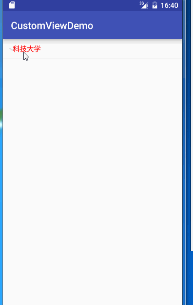
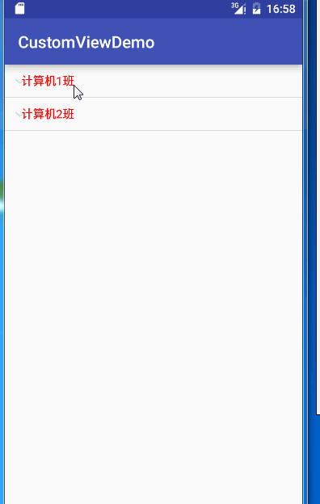
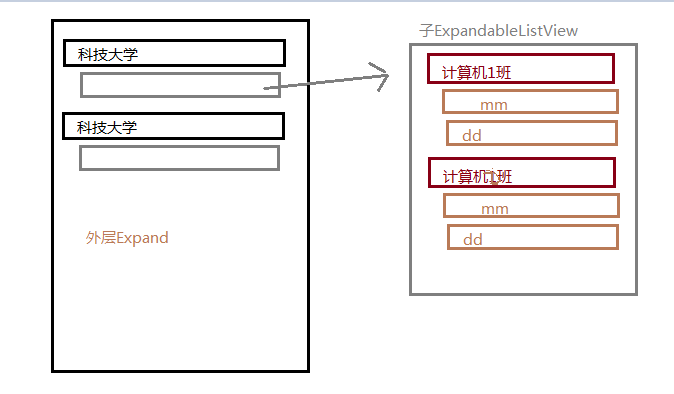

## ExpandableListView 使用解析（三级列表的实现）

在往常的设计中，往往有类似于QQ的二级列表的样式，而使用`ExpandableListView`变可以实现这种类似的效果。

当然，如果`ExpandableListView`嵌套`ExpandableListView`便可以实现三级列表，甚至多级条目，而本博客最终的实现效果便是三级条目。

首先看一下效果：



当然样式比较丑，这里只实现基本的逻辑。具体的样式可以根据自己的需要进行修改


### ExpendableListView 的基本使用

万丈高楼平地起，想要实现三级列表肯定要从最简单的二级列表实现。下面就开始实现他的二级列表。


`ExpendableListView`的使用和ListView几乎一样：

- 编写布局文件并查找`ExpendableListView`。
- 自定义适配器继承`BaseExpandableListAdapter`
- `setAdapter`设置适配器。

下面开始进行实现：

- 编写布局文件并查找控件

```xml  
<?xml version="1.0" encoding="utf-8"?>
<LinearLayout xmlns:android="http://schemas.android.com/apk/res/android"
    android:orientation="vertical" android:layout_width="match_parent"
    android:layout_height="match_parent">


    <ExpandableListView
        android:id="@+id/tree_view_simple"
        android:layout_width="match_parent"
        android:layout_height="match_parent"
         >
    </ExpandableListView>


</LinearLayout>

```


- 自定义`ClassesExpandableListViewAdapter`继承`BaseExpandableListAdapter`


在编写该类之前，我们必须要有我们的实体类。看一下我们定义的班级实体类`Classes`

```java 
/**
 *
 * 班级实体类
 * Created by MH on 2016/6/16.
 */
public class Classes {


    // 班级名
    public String name;


    // 班级中的学生列表
    public List<String> students;

}

```

ok，直接上`ClassesExpandableListViewAdapter`的代码，后面解释。

```java 
/**
 *
 * 班级的适配器
 * Created by MH on 2016/6/16.
 */
public class ClassesExpandableListViewAdapter extends BaseExpandableListAdapter {


    // 班级的集合
    private List<Classes> classes;

    // 创建布局使用
    private Activity activity;


    public ClassesExpandableListViewAdapter(List<Classes> classes, Activity activity) {
        this.classes = classes;
        this.activity = activity;
    }

    @Override
    public int getGroupCount() {
        // 获取一级条目的数量  就是班级的大小
        return classes.size();
    }

    @Override
    public int getChildrenCount(int groupPosition) {
        // 获取对应一级条目下二级条目的数量，就是各个班学生的数量
        return classes.get(groupPosition).students.size();
    }

    @Override
    public Object getGroup(int groupPosition) {
        // 获取一级条目的对应数据  ，感觉没什么用
        return classes.get(groupPosition);
    }

    @Override
    public Object getChild(int groupPosition, int childPosition) {
        // 获取对应一级条目下二级条目的对应数据  感觉没什么用
        return classes.get(groupPosition).students.get(childPosition);
    }

    @Override
    public long getGroupId(int groupPosition) {
        // 直接返回，没什么用
        return groupPosition;
    }

    @Override
    public long getChildId(int groupPosition, int childPosition) {
        // 直接返回，没什么用
        return childPosition;
    }

    @Override
    public boolean hasStableIds() {
        // 谁知道这个是干什么。。。。
        return false;
    }

    @Override
    public View getGroupView(int groupPosition, boolean isExpanded, View convertView, ViewGroup parent) {

        // 获取对应一级条目的View  和ListView 的getView相似

        return getGenericView(classes.get(groupPosition).name);
    }

    @Override
    public View getChildView(int groupPosition, int childPosition, boolean isLastChild, View convertView, ViewGroup parent) {

        // 获取对应二级条目的View  和ListView 的getView相似
        return getGenericView(classes.get(groupPosition).students.get(childPosition));
    }

    @Override
    public boolean isChildSelectable(int groupPosition, int childPosition) {
        // 根据方法名，此处应该表示二级条目是否可以被点击   先返回true 再讲
        return true;
    }


    /**
     * 根据字符串生成布局，，因为我没有写layout.xml 所以用java 代码生成
     *
     *      实际中可以通过Inflate加载自己的自定义布局文件，设置数据之后并返回
     * @param string
     * @return
     */
    private TextView getGenericView(String string) {

        AbsListView.LayoutParams layoutParams = new AbsListView.LayoutParams(
                ViewGroup.LayoutParams.MATCH_PARENT,
                ViewGroup.LayoutParams.WRAP_CONTENT);

        TextView textView = new TextView(activity);
        textView.setLayoutParams(layoutParams);

        textView.setGravity(Gravity.CENTER_VERTICAL | Gravity.LEFT);

        textView.setPadding(40, 20, 0, 20);
        textView.setText(string);
        textView.setTextColor(Color.RED);
        return textView;
    }

}

```

代码贴完了，你以为我会解释。。呵呵，我才不呢。

注释很清楚，有几个关键方法

- `getGroupCount()`:获取一级条目的数量。
- `getChildrenCount()`:获取二级条目的数量。
- `getGroupView()`:获取一级条目的对应布局。
- `getChildView()`：获取二级条目对应的布局。


- `setAdapter()`设置适配器

```java 
@Override
    protected void onCreate(@Nullable Bundle savedInstanceState) {
        super.onCreate(savedInstanceState);

        setContentView(R.layout.activity_tree_view_simple);

        initData();

        // 查找控件
        listview = ((ExpandableListView) findViewById(R.id.tree_view_simple));


        //SimpleExpandableListViewAdapter adapter = new SimpleExpandableListViewAdapter(colleges,this);


        // 初始化数据
        List<Classes> classesList = new ArrayList<>();

        for(int i = 1 ;i<3;i++) {
            Classes classes = new Classes();

            classes.name = "计算机"+i+"班";

            List<String> list = new ArrayList<>();

            list.add("mm");
            list.add("dd");
            classes.students = list;

            classesList.add(classes);
        }

        // 构造适配器
        ClassesExpandableListViewAdapter adapter = new ClassesExpandableListViewAdapter(classesList,this);


        // 设置适配器
        listview.setAdapter(adapter);


    }

```

看一下效果：




### 实现三级列表

实现三级列表，从理解上来讲，无非是在返回二级条目时，返回一个`ExpandableListView`对象即可，但想象往往比实现容易，其中很多坑。。。

首先我们先来搞数据：

在班级之外，在添加一个大学（`College`）

```java 
/**
 * 大学实体类
 * Created by MH on 2016/6/16.
 */
public class College {

    // 大学名
    public String name;

    // 班级列表
    public List<Classes> classList;
}

```

搞个数据
```java 
 /**
     * 初始化数据
     */
    private void initData() {


        College college = new College();

        college.name = "科技大学";

        List<Classes> classesList = new ArrayList<>();

        for(int i = 1 ;i<3;i++) {
            Classes classes = new Classes();

            classes.name = "计算机"+i+"班";

            List<String> list = new ArrayList<>();

            list.add("mm");
            list.add("dd");
            classes.students = list;

            classesList.add(classes);
        }

        college.classList = classesList;


        colleges = new ArrayList<>();
        colleges.add(college);

    }
```

那么此时的数据应该是

- 科技大学
	- 计算机1班
		- mm
		- dd
	- 计算机2班
		- mm
		- dd


数据分析完之后，分析布局




在这里，有一个很关键的一点：

- 在外层`Expand`中，他的所有二级条目都是一个，为什么，因为他具体的显示都交给了`子ExpandableListView`，二级条目的目的是为了把`子ExpandableListView`显示出来。


关键的一点分析了，上代码

```java 
/**
 *
 * 外层ExpandListView 适配器的实现
 * Created by MH on 2016/6/16.
 */
public class SimpleExpandableListViewAdapter extends BaseExpandableListAdapter {


    // 大学的集合
    private List<College> colleges;

    private Activity activity;


    public SimpleExpandableListViewAdapter(List<College> colleges, Activity activity) {
        this.colleges = colleges;
        this.activity = activity;
    }

    @Override
    public int getGroupCount() {
        return colleges.size();
    }

    @Override
    public int getChildrenCount(int groupPosition) {
        // 很关键，，一定要返回  1
        return 1;
    }

    @Override
    public Object getGroup(int groupPosition) {
        return colleges.get(groupPosition);
    }

    @Override
    public Object getChild(int groupPosition, int childPosition) {
        return colleges.get(groupPosition).classList.get(childPosition);
    }

    @Override
    public long getGroupId(int groupPosition) {
        return groupPosition;
    }

    @Override
    public long getChildId(int groupPosition, int childPosition) {
        return childPosition;
    }

    @Override
    public boolean hasStableIds() {
        return false;
    }

    @Override
    public View getGroupView(int groupPosition, boolean isExpanded, View convertView, ViewGroup parent) {
        
        return getGenericView(colleges.get(groupPosition).name);
    }

    @Override
    public View getChildView(int groupPosition, int childPosition, boolean isLastChild, View convertView, ViewGroup parent) {

        // 返回子ExpandableListView 的对象  此时传入是该父条目，即大学的对象（有歧义。。）

        return getGenericExpandableListView(colleges.get(groupPosition));
    }

    @Override
    public boolean isChildSelectable(int groupPosition, int childPosition) {
        return true;
    }

    private TextView getGenericView(String string) {
        AbsListView.LayoutParams layoutParams = new AbsListView.LayoutParams(
                ViewGroup.LayoutParams.MATCH_PARENT,
                ViewGroup.LayoutParams.WRAP_CONTENT);

        TextView textView = new TextView(activity);
        textView.setLayoutParams(layoutParams);

        textView.setGravity(Gravity.CENTER_VERTICAL | Gravity.LEFT);

        textView.setPadding(40, 20, 0, 20);
        textView.setText(string);
        textView.setTextColor(Color.RED);
        return textView;
    }


    /**
     *  返回子ExpandableListView 的对象  此时传入的是该大学下所有班级的集合。
     * @param college
     * @return
     */
    @TargetApi(Build.VERSION_CODES.JELLY_BEAN)
    public ExpandableListView getGenericExpandableListView(College college){
        AbsListView.LayoutParams layoutParams = new AbsListView.LayoutParams(
                ViewGroup.LayoutParams.MATCH_PARENT,
                ViewGroup.LayoutParams.WRAP_CONTENT);

        CustomExpandableListView view = new CustomExpandableListView(activity);

        // 加载班级的适配器
        ClassesExpandableListViewAdapter adapter = new ClassesExpandableListViewAdapter(college.classList,activity);

        view.setAdapter(adapter);

        view.setPadding(20,0,0,0);
        return view;
    }
}

```

代码依然一大串，但其实和之前写的`ClassExpandableListViewAdapter`都差不多一样，主要有以下几点区别：

- `getChildrenCount（）` 返回1.
-  `getChildView()` 返回的是`ExpandableListView`对象。
-  `getGenericExpandableListView()`： 添加了获取`ExpandableListView`对象的方法。


可能在这里，观察仔细的会发现`getGenericExpandableListView()`中创建的是`CustomExpandableListView`对象，该对象是我自定义的。很多人可能都遇到过，`ScrollView`嵌套`ListView`，`ListView`显示不全。同样在这里也出现了，`子ExpandableListView`同样显示不全，所以自定义解决这个问题。

```java 
/**
 *
 * 自定义ExpandableListView  解决嵌套之下显示不全的问题
 * Created by MH on 2016/6/16.
 */
public class CustomExpandableListView extends ExpandableListView {


    public CustomExpandableListView(Context context) {
        super(context);
    }

    public CustomExpandableListView(Context context, AttributeSet attrs, int defStyleAttr) {
        super(context, attrs, defStyleAttr);
    }

    public CustomExpandableListView(Context context, AttributeSet attrs) {
        super(context, attrs);
    }

    @Override
    protected void onMeasure(int widthMeasureSpec, int heightMeasureSpec) {
        // 解决显示不全的问题
        int expandSpec = MeasureSpec.makeMeasureSpec(Integer.MAX_VALUE >> 2
                , MeasureSpec.AT_MOST);
        super.onMeasure(widthMeasureSpec, expandSpec);
    }
}

```


ok ,告一段落。最后在看一下`Main`中的操作：

```java 
public class SimpleExpandListViewActivity extends AppCompatActivity {


    private ExpandableListView listview;

    private List<College> colleges;

    @Override
    protected void onCreate(@Nullable Bundle savedInstanceState) {
        super.onCreate(savedInstanceState);

        setContentView(R.layout.activity_tree_view_simple);

        initData();

        // 查找控件
        listview = ((ExpandableListView) findViewById(R.id.tree_view_simple));


        SimpleExpandableListViewAdapter adapter = new SimpleExpandableListViewAdapter(colleges,this);

        // 设置适配器
        listview.setAdapter(adapter);
/*
        // 初始化数据
        List<Classes> classesList = new ArrayList<>();

        for(int i = 1 ;i<3;i++) {
            Classes classes = new Classes();

            classes.name = "计算机"+i+"班";

            List<String> list = new ArrayList<>();

            list.add("mm");
            list.add("dd");
            classes.students = list;

            classesList.add(classes);
        }*/

        // 构造适配器
       // ClassesExpandableListViewAdapter adapter = new ClassesExpandableListViewAdapter(classesList,this);


    }

    /**
     * 初始化数据
     */
    private void initData() {


        College college = new College();

        college.name = "科技大学";

        List<Classes> classesList = new ArrayList<>();

        for(int i = 1 ;i<3;i++) {
            Classes classes = new Classes();

            classes.name = "计算机"+i+"班";

            List<String> list = new ArrayList<>();

            list.add("mm");
            list.add("dd");
            classes.students = list;

            classesList.add(classes);
        }

        college.classList = classesList;


        colleges = new ArrayList<>();
        colleges.add(college);
    }
}


```


该项目源码已上传[github](https://github.com/AlexSmille/alex_mahao_sample/tree/master/customviewdemo)。有需要者请移步。

