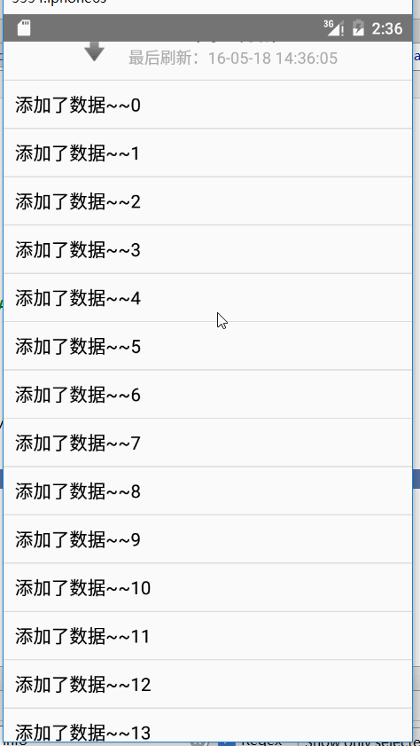
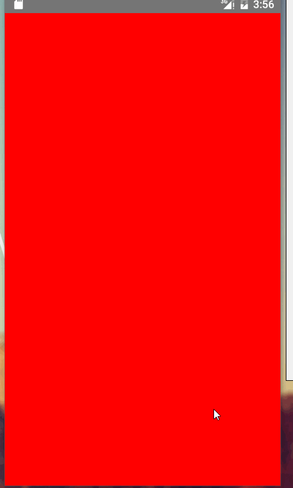
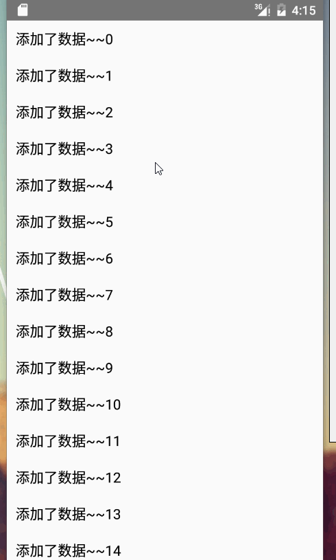

## ListView上拉加载和下拉刷新多种实现方式

该篇为ListView下拉刷新和上拉加载实现的各种方法大合集。可能在具体的细节逻辑上处理不太到位，但基本上完成逻辑的实现。细节方面，个人可以根据自己的需求进行完善。

该博客将以四种思路来完成下拉刷新和上拉加载

- 自定义View实现上拉加载和下拉刷新
- 使用PullToRefresh 实现上拉加载和下拉刷新
- 使用Ultra-Pull-To-Refresh实现上拉加载和下拉刷新
- 使用SwipeToRefreshLayout实现上拉加载和下拉刷新


### 自定义View实现上拉加载和下拉刷新

该方法，我们通过完全自定义的方式实现，不添加任何依赖库和jar包。纯原生。

首先看一下我们实现的效果



实现的关键点：

- 为`ListView`添加头布局和底布局。
- 通过改变头布局的`paddingTop`值，来控制控件的显示和隐藏
- 根据我们滑动的状态，动态修改头部布局和底部布局。

看一下代码：

```java 
public class CustomRefreshListView extends ListView implements OnScrollListener{

	/**
	 * 头布局
	 */
	private View headerView;

	/**
	 * 头部布局的高度
	 */
	private int headerViewHeight;

	/**
	 * 头部旋转的图片
	 */
	private ImageView iv_arrow;

	/**
	 * 头部下拉刷新时状态的描述
	 */
	private TextView tv_state;

	/**
	 * 下拉刷新时间的显示控件
	 */
	private TextView tv_time;


	/**
	 * 底部布局
	 */
	private View footerView;

	/**
	 * 底部旋转progressbar
	 */
	private ProgressBar pb_rotate;


	/**
	 * 底部布局的高度
	 */
	private int footerViewHeight;


	/**
	 * 按下时的Y坐标
	 */
	private int downY;
	
	private final int PULL_REFRESH = 0;//下拉刷新的状态
	private final int RELEASE_REFRESH = 1;//松开刷新的状态
	private final int REFRESHING = 2;//正在刷新的状态

	/**
	 * 当前下拉刷新处于的状态
	 */
	private int currentState = PULL_REFRESH;

	/**
	 * 头部布局在下拉刷新改变时，图标的动画
	 */
	private RotateAnimation upAnimation,downAnimation;

	/**
	 * 当前是否在加载数据
	 */
	private boolean isLoadingMore = false;

	public CustomRefreshListView(Context context) {
		this(context,null);
	}

	public CustomRefreshListView(Context context, AttributeSet attrs) {
		super(context, attrs);
		init();
	}
	
	private void init(){
		//设置滑动监听
		setOnScrollListener(this);
		//初始化头布局
		initHeaderView();
		//初始化头布局中图标的旋转动画
		initRotateAnimation();
		//初始化为尾布局
		initFooterView();
	}


	/**
	 * 初始化headerView
	 */
	private void initHeaderView() {
		headerView = View.inflate(getContext(), R.layout.head_custom_listview, null);
		iv_arrow = (ImageView) headerView.findViewById(R.id.iv_arrow);
		pb_rotate = (ProgressBar) headerView.findViewById(R.id.pb_rotate);
		tv_state = (TextView) headerView.findViewById(R.id.tv_state);
		tv_time = (TextView) headerView.findViewById(R.id.tv_time);

		//测量headView的高度
		headerView.measure(0, 0);
		//获取高度，并保存
		headerViewHeight = headerView.getMeasuredHeight();
		//设置paddingTop = -headerViewHeight;这样，该控件被隐藏
		headerView.setPadding(0, -headerViewHeight, 0, 0);
		//添加头布局
		addHeaderView(headerView);
	}
	
	/**
	 * 初始化旋转动画
	 */
	private void initRotateAnimation() {

		upAnimation = new RotateAnimation(0, -180, 
				RotateAnimation.RELATIVE_TO_SELF, 0.5f,
				RotateAnimation.RELATIVE_TO_SELF, 0.5f);
		upAnimation.setDuration(300);
		upAnimation.setFillAfter(true);

		downAnimation = new RotateAnimation(-180, -360, 
				RotateAnimation.RELATIVE_TO_SELF, 0.5f,
				RotateAnimation.RELATIVE_TO_SELF, 0.5f);
		downAnimation.setDuration(300);
		downAnimation.setFillAfter(true);
	}

	//初始化底布局，与头布局同理
	private void initFooterView() {
		footerView = View.inflate(getContext(), R.layout.foot_custom_listview, null);
		footerView.measure(0, 0);
		footerViewHeight = footerView.getMeasuredHeight();
		footerView.setPadding(0, -footerViewHeight, 0, 0);
		addFooterView(footerView);
	}
	
	@Override
	public boolean onTouchEvent(MotionEvent ev) {
		switch (ev.getAction()) {
		case MotionEvent.ACTION_DOWN:
			//获取按下时y坐标
			downY = (int) ev.getY();
			break;
		case MotionEvent.ACTION_MOVE:
			
			if(currentState==REFRESHING){
				//如果当前处在滑动状态，则不做处理
				break;
			}
			//手指滑动偏移量
			int deltaY = (int) (ev.getY() - downY);
			
			//获取新的padding值
			int paddingTop = -headerViewHeight + deltaY;
			if(paddingTop>-headerViewHeight && getFirstVisiblePosition()==0){
				//向下滑，且处于顶部，设置padding值，该方法实现了顶布局慢慢滑动显现
				headerView.setPadding(0, paddingTop, 0, 0);

				if(paddingTop>=0 && currentState==PULL_REFRESH){
					//从下拉刷新进入松开刷新状态
					currentState = RELEASE_REFRESH;
					//刷新头布局
					refreshHeaderView();
				}else if (paddingTop<0 && currentState==RELEASE_REFRESH) {
					//进入下拉刷新状态
					currentState = PULL_REFRESH;
					refreshHeaderView();
				}
				
				
				return true;//拦截TouchMove，不让listview处理该次move事件,会造成listview无法滑动
			}
			
			
			break;
		case MotionEvent.ACTION_UP:
			if(currentState==PULL_REFRESH){
				//仍处于下拉刷新状态，未滑动一定距离，不加载数据，隐藏headView
				headerView.setPadding(0, -headerViewHeight, 0, 0);
			}else if (currentState==RELEASE_REFRESH) {
				//滑倒一定距离，显示无padding值得headcView
				headerView.setPadding(0, 0, 0, 0);
				//设置状态为刷新
				currentState = REFRESHING;
				
				//刷新头部布局
				refreshHeaderView();
				
				if(listener!=null){
					//接口回调加载数据
					listener.onPullRefresh();
				}
			}
			break;
		}
		return super.onTouchEvent(ev);
	}
	
	/**
	 * 根据currentState来更新headerView
	 */
	private void refreshHeaderView(){
		switch (currentState) {
		case PULL_REFRESH:
			tv_state.setText("下拉刷新");
			iv_arrow.startAnimation(downAnimation);
			break;
		case RELEASE_REFRESH:
			tv_state.setText("松开刷新");
			iv_arrow.startAnimation(upAnimation);
			break;
		case REFRESHING:
			iv_arrow.clearAnimation();//因为向上的旋转动画有可能没有执行完
			iv_arrow.setVisibility(View.INVISIBLE);
			pb_rotate.setVisibility(View.VISIBLE);
			tv_state.setText("正在刷新...");
			break;
		}
	}
	
	/**
	 * 完成刷新操作，重置状态,在你获取完数据并更新完adater之后，去在UI线程中调用该方法
	 */
	public void completeRefresh(){
		if(isLoadingMore){
			//重置footerView状态
			footerView.setPadding(0, -footerViewHeight, 0, 0);
			isLoadingMore = false;
		}else {
			//重置headerView状态
			headerView.setPadding(0, -headerViewHeight, 0, 0);
			currentState = PULL_REFRESH;
			pb_rotate.setVisibility(View.INVISIBLE);
			iv_arrow.setVisibility(View.VISIBLE);
			tv_state.setText("下拉刷新");
			tv_time.setText("最后刷新："+getCurrentTime());
		}
	}
	
	/**
	 * 获取当前系统时间，并格式化
	 * @return
	 */
	private String getCurrentTime(){
		SimpleDateFormat format = new SimpleDateFormat("yy-MM-dd HH:mm:ss");
		return format.format(new Date());
	}
	
	private OnRefreshListener listener;
	public void setOnRefreshListener(OnRefreshListener listener){
		this.listener = listener;
	}
	public interface OnRefreshListener{
		void onPullRefresh();
		void onLoadingMore();
	}
	
	/**
	 * SCROLL_STATE_IDLE:闲置状态，就是手指松开
	 * SCROLL_STATE_TOUCH_SCROLL：手指触摸滑动，就是按着来滑动
	 * SCROLL_STATE_FLING：快速滑动后松开
	 */
	@Override
	public void onScrollStateChanged(AbsListView view, int scrollState) {
		if(scrollState==OnScrollListener.SCROLL_STATE_IDLE 
				&& getLastVisiblePosition()==(getCount()-1) &&!isLoadingMore){
			isLoadingMore = true;
			
			footerView.setPadding(0, 0, 0, 0);//显示出footerView
			setSelection(getCount());//让listview最后一条显示出来，在页面完全显示出底布局
			
			if(listener!=null){
				listener.onLoadingMore();
			}
		}
	}


	@Override
	public void onScroll(AbsListView view, int firstVisibleItem,
			int visibleItemCount, int totalItemCount) {
	}

}

```

代码的注释写的比较详细，在这里只说明主要的逻辑。

#### 下拉刷新

下拉刷新是通过设置`setOnTouchListener()`方法，监听触摸事件，通过手指滑动的不同处理实现相应逻辑。

实现比较复杂，分为了三个情况，初始状态（显示下拉刷新），释放刷新状态，刷新状态。

其中下拉刷新状态和释放状态的改变，是由于手指滑动的不同距离，是在`MotionEvent.ACTION_MOVE`中进行判断，该判断不处理任何数据逻辑，只是根据手指滑动的偏移量该表UI的显示。

刷新状态的判断是在`MotionEvent.ACTION_UP`手指抬起时判断的。这很好理解，因为最终下拉刷新是否加载数据的确定，是由我们手指离开屏幕时与初始值的偏移量确定的。如果我们的偏移量小于了头布局的高度，代表不刷新，继续隐藏头布局。如果偏移量大于了头布局的高度，代表刷新，修改UI，同时通过接口回调，让其持有者进行加载数据。

#### 上拉加载

上拉加载和下拉刷新不同，他的视线较为简单，我们通过`ListView`的滚动监听进行处理相应逻辑。即`setOnScrollListener(this);`。

该方法需要实现两个回调方法

- `public void onScroll(AbsListView view, int firstVisibleItem,int visibleItemCount, int totalItemCount) `:滚动监听的调用。
- `public void onScrollStateChanged(AbsListView view, int scrollState)`：滑动状态改变的回调。其中`scrollState`为回调的状态，可能值为
	- SCROLL_STATE_IDLE:闲置状态，手指松开后的状态回调
	- SCROLL_STATE_TOUCH_SCROLL：手指触摸滑动的状态回调
	- SCROLL_STATE_FLING：手指松开后惯性滑动的回调

我们在`onScrollStateChanged`中进行判断，主要判断一下条件;

- 是否是停止状态
- 是否滑倒最后
- 是否正在加载数据

如果符合条件，则开始加载数据，通过接口回调。


### 使用PullToRefresh 实现上拉加载和下拉刷新

该类库已经很久没有更新过了，该类库因为作者的不更新，导致局限性非常大。在这里十分的不推荐，但还是说一下简单的用法

[下载地址](https://github.com/chrisbanes/Android-PullToRefresh)

- 添加控件

```xml
 <!-- 引用下拉刷新(上拉加载)的控件 -->
    <com.handmark.pulltorefresh.library.PullToRefreshListView
        android:id="@+id/ptrListViewId"
        android:layout_width="match_parent"
        android:layout_height="match_parent"/>
```
因为其继承`ListView`，所以其加载数据用法和`ListView`一样

- 代码设置相应属性

```java 
private void initPTR() {
		// TODO 初始化下拉刷新控件的相关设置
		//1. 设置刷新模式
		ptrListView.setMode(Mode.BOTH);
		
		//2. 设置下拉或上拉事件监听
		ptrListView.setOnRefreshListener(new OnRefreshListener2<ListView>() {
		
			@Override
			public void onPullDownToRefresh(PullToRefreshBase<ListView> refreshView) {
				// TODO 下拉刷新数据
				refreshData(false);
			}
			
			@Override
			public void onPullUpToRefresh(PullToRefreshBase<ListView> refreshView) {
				// TODO 上拉加载下页数据
				loadData(true);
			}
		});
		
		//3. 定制下拉或上拉布局中相应的提示信息与加载图标
		//获取下拉布局的代理对象
		ILoadingLayout proxyPullDown = 
				ptrListView.getLoadingLayoutProxy(true,false);
		proxyPullDown.setPullLabel("下拉刷新");
		proxyPullDown.setReleaseLabel("放开以刷新");
		proxyPullDown.setRefreshingLabel("正在玩命地加载....");
		proxyPullDown.setLoadingDrawable(getResources().getDrawable(R.drawable.ic_launcher));
		
		
		ILoadingLayout proxyPullUp = 
				ptrListView.getLoadingLayoutProxy(false,true);
		proxyPullUp.setPullLabel("上拉加载更多");
		proxyPullUp.setReleaseLabel("放开以加载");
		proxyPullUp.setRefreshingLabel("正在玩命地加载....");
		proxyPullUp.setLoadingDrawable(getResources().getDrawable(android.R.drawable.ic_menu_camera));
		
	}

```

在其中分为了三部：

1. `ptrListView.setMode(Mode.BOTH);`：`Mode.BOTH`表示上拉加载和下拉刷新都有
2. `setOnRefreshListener（）`：注意其传入参数为`OnRefreshListener2`，如果传入`OnRefreshListener`，表示只有刷新
3. `getLoadingLayoutProxy（）`方法，传入参数的不同分别获得上拉刷新和下拉加载的布局代理对象
4. 完成数据的加载，结束下拉刷新或上拉加载，调用`ptrListView.onRefreshComplete();`


> 这个刷新没有例子，上面还是我以前总结的笔记。该三方库已经有3年没有更新了。真的不推荐使用啊。


### 使用Ultra-Pull-To-Refresh实现上拉加载和下拉刷新

Ultra-Pull-To-Refresh是一个功能非常强大的类库，通过他，我们可以实现非常丰富的下拉刷新视图，并且他支持几乎所有的控件的下拉刷新（不仅仅是`ListView`），但该视图不支持上拉加载，作者可能在考虑此库设计时的想法与`Google`官方的`SwipeRefreshLayout`的理念符合。即刷新可能是许多控件都需要，而上拉加载只有列表视图需要。

那么我们就开始尝试使用他吧。

#### Android Studio 导入Ultra

- 在工程的`build.gradle`中，加上如下代码

```java 
allprojects {
    repositories {
        jcenter()
        mavenCentral();
        maven {
            url 'https://oss.sonatype.org/content/repositories/snapshots'
        }
    }
}

```

- 添加依赖包

```java 
compile 'in.srain.cube:ultra-ptr:1.0.11'
```
- Clean一下工程即可


#### Eclipse 导入 Ultra

因为作者提供的只有`AndroidStudio`版本，所以，我把它代码导出到了一个`Eclipse`工程中，直接添加依赖即可。

[Ultra-Pull-To-Refresh Eclipse 版本下载地址](http://download.csdn.net/detail/lisdye2/9524481)


#### 简单使用

添加xml文件：`activity_listview_ultra_refresh`

```xml

<LinearLayout xmlns:android="http://schemas.android.com/apk/res/android"
    android:orientation="vertical" android:layout_width="match_parent"
    android:layout_height="match_parent">

    <in.srain.cube.views.ptr.PtrClassicFrameLayout
        android:id="@+id/ultra_ptr_frame"
        xmlns:cube_ptr="http://schemas.android.com/apk/res-auto"
        android:layout_width="match_parent"
        android:layout_height="match_parent"
        >

        <FrameLayout
            android:id="@+id/ultra_refresh_frame"
            android:layout_width="match_parent"
            android:layout_height="match_parent"
            android:background="#f00"
            android:paddingTop="100dp">
        </FrameLayout>
    </in.srain.cube.views.ptr.PtrClassicFrameLayout>


</LinearLayout> 

```

添加了一个`PtrClassicFrameLayout`包含了一个`FrameLayout`.

看一下java代码

```java 
public class UltraRefreshActivity extends Activity {


    private PtrClassicFrameLayout ptrFrame;

    @Override
    protected void onCreate(Bundle savedInstanceState) {
        super.onCreate(savedInstanceState);

        setContentView(R.layout.activity_listview_ultra_refresh);

        ptrFrame = ((PtrClassicFrameLayout) findViewById(R.id.ultra_ptr_frame));

        ptrFrame.setLastUpdateTimeRelateObject(this);

        //下拉刷新的阻力，下拉时，下拉距离和显示头部的距离比例，值越大，则越不容易滑动
        ptrFrame.setRatioOfHeaderHeightToRefresh(1.2f);

        ptrFrame.setDurationToClose(200);//返回到刷新的位置（暂未找到）

        ptrFrame.setDurationToCloseHeader(1000);//关闭头部的时间 // default is false

        ptrFrame.setPullToRefresh(false);//当下拉到一定距离时，自动刷新（true），显示释放以刷新（false）

        ptrFrame.setKeepHeaderWhenRefresh(true);//见名只意

        ptrFrame.setPtrHandler(new PtrHandler() {
            @Override
            public boolean checkCanDoRefresh(PtrFrameLayout frame,
                                             View content, View header) {
                return PtrDefaultHandler.checkContentCanBePulledDown(frame,
                        content, header);
            }

            @Override
            public void onRefreshBegin(PtrFrameLayout frame) {

                //数据刷新的回调

                ptrFrame.postDelayed(new Runnable() {
                    @Override
                    public void run() {
                        ptrFrame.refreshComplete();
                    }
                }, 1500);
            }
        });
    }
}
```

看一下效果



通过实现过程，我们可以发现，其下拉刷新和其包含的控件没有之间联系：也就是说我们可以在`PtrClassicFrameLayout`包含任何子控件。

他可以设置的一些常量，代码注释中都有体现。而他有两个关键性的方法：


- `ptrFrame.setPtrHandler(new PtrHandler())`:数据刷新的接口回调。包含两个回调方法
	- `checkCanDoRefresh`：是否能够刷新。
	- `onRefreshBegin`：开始刷新的回调。
- `ptrFrame.addPtrUIHandler(new PtrUIHandler())`：UI更新接口的回调。其中`PtrUIHandler`为一个接口，其定义如下

```java 
public interface PtrUIHandler {

    /**
     * When the content view has reached top and refresh has been completed, view will be reset.
     *
     * @param frame
     */
    public void onUIReset(PtrFrameLayout frame);

    /**
     * prepare for loading
     *
     * @param frame
     */
    public void onUIRefreshPrepare(PtrFrameLayout frame);

    /**
     * perform refreshing UI
     */
    public void onUIRefreshBegin(PtrFrameLayout frame);

    /**
     * perform UI after refresh
     */
    public void onUIRefreshComplete(PtrFrameLayout frame);

    public void onUIPositionChange(PtrFrameLayout frame, boolean isUnderTouch, byte status, PtrIndicator ptrIndicator);
}

```

含义如下：

- `onUIRefreshPrepare`：开始下拉之前的接口回调。
- `onUIRefreshBegin`：开始刷新的接口回调。
- `onUIRefreshComplete`:刷新完成的接口回调。
- `onUIReset`：刷新完成之后，UI消失之后的接口回调。
- `onUIPositionChange`：下拉滑动的接口回调，多次调用。
	- `isUnderTouch`	：手指是否触摸
	- `status`：状态值
	- `ptrIndicator`：滑动偏移量等值的封装对象。

那么对于`onUIPositionChange`中，都是返回了那些值呢，我写了一个自定义的HeadView，并设置高位100，同时打印相应的Log。在这只贴`onUIPositionChange`中的Log代码。

```java 
 @Override
    public void onUIPositionChange(PtrFrameLayout frame, boolean isUnderTouch, byte status, PtrIndicator ptrIndicator) {
        int headerHeight = ptrIndicator.getHeaderHeight();//头部的高度
        int lastPosY = ptrIndicator.getLastPosY();//上一次滑动的Y偏移值
        int offsetToRefresh = ptrIndicator.getOffsetToRefresh();//刷新需要滑动的偏移量
        float offsetY = ptrIndicator.getOffsetY();//当前与上一次滑动处理的偏移值
        int currentPosY = ptrIndicator.getCurrentPosY();//当前系统偏移值
  

        Log.i("info","isUnderTouch"+isUnderTouch+"headHeight: "+headerHeight+" lastPosY "+lastPosY+" offsetToRefresh "+offsetToRefresh+" offsetY "+offsetY+" currentPosY "+currentPosY);
    }

```

看一下打印信息

```java 
onUIRefreshPrepare
isUnderTouchtrueheadHeight: 100 lastPosY 0 offsetToRefresh 120 offsetY 23.025852 currentPosY 23
............................................................
isUnderTouchtrueheadHeight: 100 lastPosY 299 offsetToRefresh 120 offsetY 2.1575928 currentPosY 301
onUIRefreshBegin
isUnderTouchfalseheadHeight: 100 lastPosY 301 offsetToRefresh 120 offsetY 2.1575928 currentPosY 278
............................................................
isUnderTouchfalseheadHeight: 100 lastPosY 101 offsetToRefresh 120 offsetY 2.1575928 currentPosY 100
onUIRefreshComplete
isUnderTouchfalseheadHeight: 100 lastPosY 100 offsetToRefresh 120 offsetY 2.1575928 currentPosY 96
............................................................
isUnderTouchtrueheadHeight: 100 lastPosY 239 offsetToRefresh 120 offsetY 1.324391 currentPosY 240
onUIRefreshComplete
isUnderTouchfalseheadHeight: 100 lastPosY 240 offsetToRefresh 120 offsetY 1.324391 currentPosY 223
............................................................
isUnderTouchfalseheadHeight: 100 lastPosY 2 offsetToRefresh 120 offsetY 1.324391 currentPosY 1
onUIReset
isUnderTouchfalseheadHeight: 100 lastPosY 1 offsetToRefresh 120 offsetY 1.324391 currentPosY 0
```
关于每个字段的含义，代码注释已经说的很清楚了，不在多述。


#### Ultra自定义刷新

看一下我们将要实现的效果：



自定义头部的代码实现

```java

public class CustomUltraRefreshHeader extends RelativeLayout implements PtrUIHandler {

    CircleView mCircleView;

    TextView mDescText;

    private ObjectAnimator anim;

    public CustomUltraRefreshHeader(Context context) {
        this(context,null);
    }

    public CustomUltraRefreshHeader(Context context, AttributeSet attrs) {
        this(context, attrs,0);
    }

    public CustomUltraRefreshHeader(Context context, AttributeSet attrs, int defStyleAttr) {
        super(context, attrs, defStyleAttr);

        initView();
    }

    @Override
    protected void onMeasure(int widthMeasureSpec, int heightMeasureSpec) {
        super.onMeasure(widthMeasureSpec, heightMeasureSpec);
        setMeasuredDimension(widthMeasureSpec,100);
    }

    /**
     * 初始化布局
     */
    private void initView() {

        int circlewidth = (int) TypedValue.applyDimension(TypedValue.COMPLEX_UNIT_DIP, 30, getResources().getDisplayMetrics());

        mCircleView = new CircleView(getContext());

        LinearLayout.LayoutParams circleParams = new LinearLayout.LayoutParams(circlewidth,circlewidth);

        mCircleView.setLayoutParams(circleParams);

        mDescText = new TextView(getContext());

        LinearLayout.LayoutParams descParams = new LinearLayout.LayoutParams(circlewidth*3, ViewGroup.LayoutParams.WRAP_CONTENT);

        descParams.gravity = Gravity.CENTER;
        descParams.setMargins(circlewidth/2,0,0,0);
        mDescText.setLayoutParams(descParams);
        mDescText.setTextSize(12);
        mDescText.setTextColor(Color.GRAY);
        mDescText.setText("下拉刷新");

        //添加线性的父布局
        LinearLayout ll = new LinearLayout(getContext());
        RelativeLayout.LayoutParams llParams = new LayoutParams(ViewGroup.LayoutParams.WRAP_CONTENT, ViewGroup.LayoutParams.WRAP_CONTENT);
        llParams.addRule(CENTER_IN_PARENT);
        ll.setLayoutParams(llParams);
        ll.setPadding(10,10,10,10);

        ll.addView(mCircleView);
        ll.addView(mDescText);

        addView(ll);
    }

    @Override
    public void onUIReset(PtrFrameLayout frame) {
        //重置时，将动画置为初始状态
        mCircleView.setRotation(0f);
        Log.i("info","onUIReset");
    }

    @Override
    public void onUIRefreshPrepare(PtrFrameLayout frame) {
        mDescText.setText("下拉加载数据");
        Log.i("info","onUIRefreshPrepare");
    }

    @Override
    public void onUIRefreshBegin(PtrFrameLayout frame) {

        //开始刷新，启动动画
        anim = ObjectAnimator.ofFloat(mCircleView, "rotation", mCircleView.getRotation(), mCircleView.getRotation()+360f)
                .setDuration(500);
        anim.setRepeatCount(ValueAnimator.INFINITE);
        anim.setRepeatMode(ValueAnimator.RESTART);
        anim.start();

        mDescText.setText("正在加载数据");
        Log.i("info","onUIRefreshBegin");
    }

    @Override
    public void onUIRefreshComplete(PtrFrameLayout frame) {
        anim.cancel();
        mDescText.setText("加载完成");
        Log.i("info","onUIRefreshComplete");
    }

    @Override
    public void onUIPositionChange(PtrFrameLayout frame, boolean isUnderTouch, byte status, PtrIndicator ptrIndicator) {
        int headerHeight = ptrIndicator.getHeaderHeight();//头部的高度
        int lastPosY = ptrIndicator.getLastPosY();//上一次滑动的Y偏移值
        int offsetToRefresh = ptrIndicator.getOffsetToRefresh();//舒心需要滑动的偏移量
        float offsetY = ptrIndicator.getOffsetY();//当前与上一次滑动处理的偏移值
        int currentPosY = ptrIndicator.getCurrentPosY();//当前系统偏移值

        if (isUnderTouch&&status== PtrFrameLayout.PTR_STATUS_PREPARE) {

            mCircleView.setRotation(currentPosY);
            if(currentPosY<offsetToRefresh&&lastPosY >= offsetToRefresh){
                //表示不刷新了
                mDescText.setText("下拉加载数据");
            }else if(currentPosY>offsetToRefresh&&lastPosY<=offsetToRefresh){
                mDescText.setText("松开加载更多");
            }
        }

       /* if (currentPos < mOffsetToRefresh && lastPos >= mOffsetToRefresh) {
            if (isUnderTouch && status == PtrFrameLayout.PTR_STATUS_PREPARE) {*//*
        Log.i("info","isUnderTouch"+isUnderTouch+"headHeight: "+headerHeight+" lastPosY "+lastPosY+" offsetToRefresh "+offsetToRefresh+" offsetY "+offsetY+" currentPosY "+currentPosY);*/
    }
}

```

在这里我们实现了`PtrUIHandler`接口，用于下拉刷新时的接口会调，有两点说明：

- 使用的`CircleView`为自定义控件，就是图中的转盘，在我以前的博客中有相应的实现。[RecyclerView 下拉刷新和上拉加载](http://blog.csdn.net/lisdye2/article/details/51384159)

- 在动态改变现实视图时，需要注意的便是`onUIPositionChange`，我们只有在手指触摸且`status`为`PtrFrameLayout.PTR_STATUS_PREPARE`才修改我们的属性，其他时候不能修改。因为该方法会一直回调。


封装自定义的`UltraRefreshListView`继承`ListView`，并实现了`PtrHandler`接口，用以数据更新回调。

```java 
public class UltraRefreshListView extends ListView implements PtrHandler,AbsListView.OnScrollListener {

    private UltraRefreshListener mUltraRefreshListener;

    /**
     * 根布局
     */
    private View footView;


    /**
     * 是否正在加载数据
     */
    private boolean isLoadData = false;

    /**
     * 是否是下拉刷新，主要在处理结果时使用
     */
    private boolean isRefresh = false;

    public UltraRefreshListView(Context context) {
        this(context,null);
    }

    public UltraRefreshListView(Context context, AttributeSet attrs) {
        this(context, attrs,0);
    }

    public UltraRefreshListView(Context context, AttributeSet attrs, int defStyleAttr) {
        super(context, attrs, defStyleAttr);
        //初始化布局，及添加一个跟布局
        initView();
    }

    private void initView() {
        footView = LayoutInflater.from(getContext()).inflate(R.layout.foot_ultra_refresh_listview, null);

        setOnScrollListener(this);
    }


    @Override
    public void onRefreshBegin(PtrFrameLayout frame) {

        isLoadData  =true;
        isRefresh =true;
        //下拉刷新的回调
        if(mUltraRefreshListener!=null){

            mUltraRefreshListener.onRefresh();
        }
    }


    @Override
    public boolean checkCanDoRefresh(PtrFrameLayout frame, View content, View header) {
        //  PtrHandler 的接口回调，是否能够加载数据的判断
        return !isLoadData&&checkContentCanBePulledDown(frame, content, header);
    }

    // 从PtrHandler的默认实现类 PtrDefaultHandler中找到的，用以判断是否可以下拉刷新
    public static boolean checkContentCanBePulledDown(PtrFrameLayout frame, View content, View header) {
        return !canChildScrollUp(content);
        
    }
    
    // 从PtrHandler的默认实现类 PtrDefaultHandler中找到的，用以判断是否可以下拉刷新
    public static boolean canChildScrollUp(View view) {
        if (android.os.Build.VERSION.SDK_INT < 14) {
            if (view instanceof AbsListView) {
                final AbsListView absListView = (AbsListView) view;
                return absListView.getChildCount() > 0
                        && (absListView.getFirstVisiblePosition() > 0 || absListView.getChildAt(0)
                        .getTop() < absListView.getPaddingTop());
            } else {
                return view.getScrollY() > 0;
            }
        } else {
            return view.canScrollVertically(-1);
        }
    }


    /**
     * 设置ListView的监听回调
     */
    public void setUltraRefreshListener(UltraRefreshListener mUltraRefreshListener) {
        this.mUltraRefreshListener = mUltraRefreshListener;
    }

    @Override
    public void onScrollStateChanged(AbsListView view, int scrollState) {

    }

    @Override
    public void onScroll(AbsListView view, int firstVisibleItem, int visibleItemCount, int totalItemCount) {
        /*Log.i("info","isLoadData:"+isLoadData+" totalItemCount "+totalItemCount+" firstVisibleItem "+
                firstVisibleItem+" visibleItemCount "+ visibleItemCount);
*/
        //加载更多的判断
        if(totalItemCount>1&&!isLoadData&&totalItemCount==firstVisibleItem+visibleItemCount){
            isRefresh =false;
            isLoadData = true;
            addFooterView(footView);
            mUltraRefreshListener.addMore();
        }
}


    //刷新完成的后调用此方法还原布局
    public void refreshComplete(){
        isLoadData = false;
        if(isRefresh){
            //获取其父控件，刷新
            ViewParent parent = getParent();
            if(parent instanceof PtrClassicFrameLayout){
                ((PtrClassicFrameLayout) parent).refreshComplete();
            }
        }else{
            removeFooterView(footView);
        }
    }
}
```

其中有以下几个关键点需要注意：

- `isRefresh`：标清当前是正在下拉刷新还是在正在加载更多，这样就不用其调用者在使用`refreshComplete()`时，传入相应参数。
- `checkCanDoRefresh()`方法中，在判断是否可以刷新时，加入了`!isLoadData`，该目的是，当正在加载更多时，不允许下拉刷新。
- `checkContentCanBePulledDown()`和`canChildScrollUp()`方法的实现，是从其源码`PtrDefaultHandler`中找到的，作者已经给出了比较靠谱的实现方式。

该方法，将下拉刷新和上拉加载整合到了一起，定义一个共同的接口以便进行相应操作的回调

```java 
/**
 * 数据接口的回调
 * Created by Alex_MaHao on 2016/5/18.
 */
public interface UltraRefreshListener {

    //下拉刷新
    void onRefresh();

    //上拉加载
    void addMore();
}
```

最后我们看一下如何使用

```xml 

<LinearLayout xmlns:android="http://schemas.android.com/apk/res/android"
    android:orientation="vertical" android:layout_width="match_parent"
    android:layout_height="match_parent">

    <in.srain.cube.views.ptr.PtrClassicFrameLayout
        android:id="@+id/ultra_ptr"
        android:layout_width="match_parent"
        android:layout_height="match_parent">

        <com.mahao.alex.systemwidgetdemo.listView.ultra_refresh.UltraRefreshListView
            android:id="@+id/ultra_lv"
            android:layout_width="match_parent"
            android:layout_height="match_parent"/>

    </in.srain.cube.views.ptr.PtrClassicFrameLayout>

</LinearLayout>
```


```java 
/**
 * Created by Alex_MaHao on 2016/5/18.
 */
public class UltraRefreshListActivity extends AppCompatActivity implements UltraRefreshListener {

    private PtrClassicFrameLayout mPtrFrame;

    private List<String> datas = new ArrayList<>();

    private SimpleBaseAdapter mAdapter;

    private UltraRefreshListView mLv;

    @Override
    protected void onCreate(@Nullable Bundle savedInstanceState) {
        super.onCreate(savedInstanceState);

        setContentView(R.layout.activity_listview_ultra);

        //查找控件
        mPtrFrame = ((PtrClassicFrameLayout) findViewById(R.id.ultra_ptr));

        mLv = ((UltraRefreshListView) findViewById(R.id.ultra_lv));

        //创建我们的自定义头部视图
        CustomUltraRefreshHeader header = new CustomUltraRefreshHeader(this);

        //设置头部视图
        mPtrFrame.setHeaderView(header);

        //设置视图修改的回调，因为我们的CustomUltraRefreshHeader实现了PtrUIHandler
        mPtrFrame.addPtrUIHandler(header);

        //设置数据刷新的会回调，因为UltraRefreshListView实现了PtrHandler
        mPtrFrame.setPtrHandler(mLv);

        mAdapter = new SimpleBaseAdapter(datas);

        mLv.setAdapter(mAdapter);

        //设置数据刷新回调接口
        mLv.setUltraRefreshListener(this);
    }

    @Override
    public void onRefresh() {
        mPtrFrame.postDelayed(new Runnable() {
            @Override
            public void run() {
                datas.clear();
                for(int i = 0;i<20;i++){
                    datas.add("添加了数据~~"+i);
                }
                //刷新完成
                mLv.refreshComplete();
                mAdapter.notifyDataSetChanged();
            }
        },1000);

    }

    @Override
    public void addMore() {
        mPtrFrame.postDelayed(new Runnable() {
            @Override
            public void run() {

                int count = mAdapter.getCount();
                for(int i = count; i< count +10; i++){
                    datas.add("添加了数据~~"+i);
                }
                mAdapter.notifyDataSetChanged();
                //刷新完成
                mLv.refreshComplete();
            }
        },1000);
        
    }
}

```

OK,注释你要看不懂，那我也很纠结该怎么办。

> 该控件非常好用，推荐。

### 使用SwipeToRefreshLayout实现上拉加载和下拉刷新

之前的博客中讲解了[RecyclerView 下拉刷新和上拉加载](http://blog.csdn.net/lisdye2/article/details/51384159)，其中就使用了`SwipeToRefreshLayout`框架，他的实现原理是基于`Ultra`的，但其实现了上拉加载和下拉刷新。

虽然之前的博客中说的是`RecyclerView`的使用，但其使用方法完全相同，这里不再重复了。


> 该项目源码已经共享到[我的github](https://github.com/AlexSmille/alex_mahao_sample),在模块`systemwidgetdemo`中。