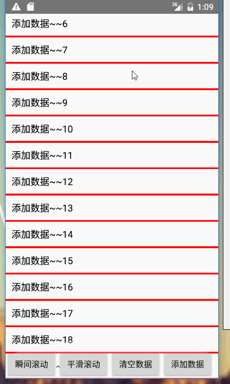
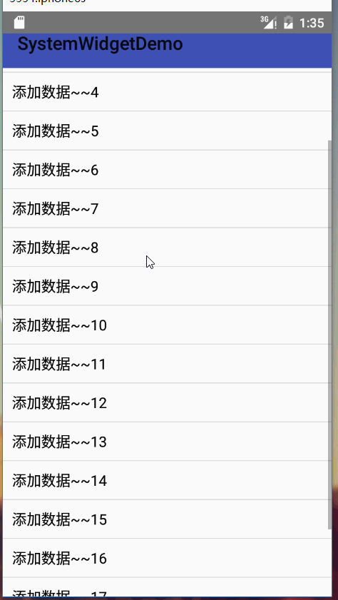
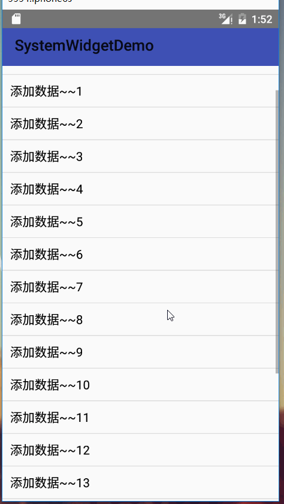
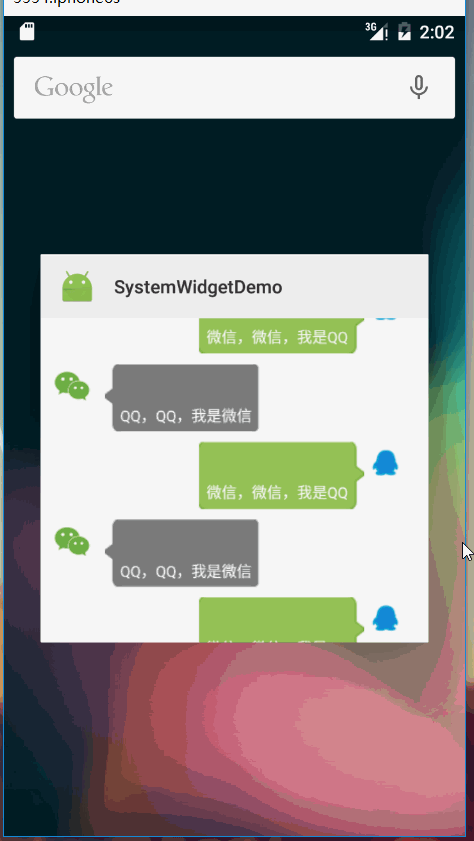

## ListView使用总结

虽然随着`RecyclerView`的不断普及，相应的资源也越来越多，许多的项目都在使用`RecyclerView`，但作为他的前辈`ListView`，加深对`ListView`的使用有助于我们更好的适应到`RecyclerView`的使用中。

首先看一下我们实现的效果一些简单效果



这只是前面的一些简单效果，后面会有一些进阶的效果，希望能耐心的看下去。

### ListView的优化

`ListView`的优化主要包括两个方面，分别是对自身的优化以及其适配器（`Adapter`）的优化。

#### `ListView`自身的优化

主要包括一条。对于`ListView`的`layout_height`和`layout_width`设置为`match_parent`,如果设置为`match_parent`,一般`ListView`的宽高会测量三次以上。具体的源码没有深入研究。但为什么会要测量多次，如果对于自定义`View`稍微有点基础的会知道，对于`View`的测量大小有三个类型：
	- `UNSPECIFIED`:未指定的，父类不对子类施加任何限制。
	- `EXACTLY`:确定的，父类确定其子类控件的大小。
	- `AT_MOST`:最大值，需要子类去测量自身大小确定。
	
如果我们设置宽高为`wrap_content`，即`AT_MOST`,表示其宽高有控件本身去测量确定，而如果是`match_parent`，则`EXACTLY`，表示确定的大小。

#### `Adapter`优化。

对于Adapter的优化，主要包括以下几个步骤：

- 复用`convertView`,减少子布局的生成。

- 定义`ViewHolder`，减少`findViewById()`的次数。

下面看一下代码

```java 

/**
 * 最基础的adapter
 * Created by Alex_MaHao on 2016/5/17.
 */

public class SimpleBaseAdapter extends BaseAdapter {

    private List<String> datas;


    public SimpleBaseAdapter(List<String> datas) {
        this.datas = datas;
    }

    @Override
    public int getCount() {
        return datas==null?0:datas.size();
    }

    @Override
    public Object getItem(int position) {
        return null;
    }

    @Override
    public long getItemId(int position) {
        return 0;
    }

    @Override
    public View getView(int position, View convertView, ViewGroup parent) {

        ViewHolder vHolder;

        if(convertView==null){
            //初始化item布局
            convertView = LayoutInflater.from(parent.getContext()).inflate(R.layout.item_listview_sample,parent,false);

            //创建记事本类
            vHolder = new ViewHolder();

            //查找控件，保存控件的引用
            vHolder.tv = ((TextView) convertView.findViewById(R.id.listview_sample_tv));

            //将当前viewHolder与converView绑定
            convertView.setTag(vHolder);
        }else{
            //如果不为空，获取
            vHolder = (ViewHolder) convertView.getTag();
        }
        vHolder.tv.setText(datas.get(position));

        return convertView;
    }


    /**
     * 笔记本类，保存对象的引用
     */
    class ViewHolder{
        TextView tv;
    }
}

```

根据代码分析思路：
- `ListView`中的`item`滑出屏幕时，滑出的`item`会在`getView()`方法中返回，及`converView`参数。所以在这里判断，是否为null，如果不为null，表示我们可以对该布局重新设置数据并返回到列表中显示。
- `ViewHolder`，保存`item`中子控件的引用。因为我们复用了`converView`,那么对于同一个`converView`布局，其子控件的引用应该是不变的。所以我们可以获取到其上的所有子控件的引用并通过`ViewHolder`进行保存。
- `setTag()，getTag()`：该方法实现了`ViewHolder`和`converView`的绑定，就类似于通过`setTag()`方法，将`ViewHolder`打包成一个包裹，放在了`converView`上，再通过`getTag()`方法，将这个包裹取出。


> 在很多优化中，会将`ViewHolder`定义为`static`。但在这里我并没加上。因为经过测试，加或不加，`ViewHolder`的创建次数不变。网上查了很多资料，也没有找到一个让我信服的理由。唯一有点理的就是基于java的特性。静态内部类的对象不依赖于其所在的外部类对象。


### Adapter的封装--BaseAppAdapter

上一节说了`Adapter`的优化，但如果我们每次写都要写这么多的优化代码，这不符合程序员懒惰的天性。那我们只能把他封装，提取出一个公共的基类，在基类中，我们把布局加载，优化等都默认实现，只需让子类构造布局文件，以及绑定数据。

那么，从我们上一节的代码看，有以下模块都可以提取为基类：

- 数据集合datas：对于数据集合，我们通常都是一个`List`集合，在这里定义泛型来表述其所包含的内容。
- 数据优化：布局的复用以及`ViewHolder`与`converView`的绑定。
- `ViewHolder`：定义一个`ViewHolder`，通过`map`保存控件与id；

子类所需实现的：

- 数据的初始化
- 确定`item`的布局文件
- 将数据与视图绑定。


那么直接看一下我们继承好的代码：

```java 
public abstract  class BaseAppAdapter<T> extends BaseAdapter {

    /**
     * 泛型，保存数据
     */
    protected List<T> datas;

    /**
     * 构造方法，子类必须实现其构造方法，并初始化数据
     * @param datas
     */
    public BaseAppAdapter(List<T> datas) {
        this.datas = datas;
    }

    @Override
    public int getCount() {
        return datas==null?0:datas.size();
    }

    @Override
    public Object getItem(int position) {
        return null;
    }

    @Override
    public long getItemId(int position) {
        return 0;
    }

    @Override
    public View getView(int position, View convertView, ViewGroup parent) {

        BaseViewHolder vHolder;

        if(convertView==null){
            convertView = LayoutInflater.from(parent.getContext()).inflate(getItemLayoutId(),parent,false);

            vHolder = new BaseViewHolder(convertView);

            convertView.setTag(vHolder);
        }else{
            vHolder = (BaseViewHolder) convertView.getTag();
        }

        /**
         * 数据绑定的回调
         */
        bindData(vHolder,datas.get(position));

        return convertView;
    }

    /**
     * 子类实现，获取item布局文件的id
     * @return
     */
    protected  abstract int getItemLayoutId();

    /**
     * 子类实现，绑定数据
     * @param vHolder  对应position的ViewHolder
     * @param data 对应的数据绑定
     */
    protected abstract void bindData(BaseViewHolder vHolder,T data);


    /**
     * ViewHolder类
     */
    class BaseViewHolder{

        /**
         * 保存view，以id-view的形式
         */
        Map<Integer,View> mapView;
        View rootView;

        public BaseViewHolder(View rootView){
            this.rootView = rootView;
            mapView = new HashMap<Integer,View>();
        }


        /**
         * 通过id查找控件
         * @param id
         * @return
         */
        public View getView(Integer id){
            View view = mapView.get(id);
            if(view==null){
                view = rootView.findViewById(id);
                mapView.put(id,view);
            }

            return view;
        }

    }

}

```

在以上代码中有几个关键点：

- 有参的构造方法：子类实现时，必须调用父类的构造方法，用以保存数据。
- `getItemLayoutId()`:`item`的布局文件id。抽象方法，子类必须实现。对于每一个`BaseAppAdapter`的子类，都需要通过该方法返回他们所特有的`item`的id。
- `bindData(BaseViewHolder vHolder,T data)`：数据绑定方法，子类必须实现。子类在此方法中将数据设置到试图上
- `BaseViewHolder`中的`getView(Integer id)`:该方法设计比较巧妙，因为，对于基类我们不知道有哪些`id`需要查询，如果直接通过`findViewById()`方法，则并没有减少查询次数。在这里，通过保存一个`map`对象，通过`id`先从`map`中取，如果不存在，说明是第一次获取，则使用`findViewById`查找控件，并将控件以键值对的形式保存到`map`中，则下次查找，会从`map`中取，减少了`findViewById`的次数。可能有人会认为，添加了一个`map`对象，内存占用不是增大了吗，但是，第一，我们`map`中保存的都是引用。第二，`findViewById()`是按照深度优先遍历查询的，如果不懂，遍历肯定能明白吧。

### ListView 分割线的高度和颜色设置。

简单的两个属性

- `android:divider`:设置颜色，背景
- ` android:dividerHeight`:设置高度

如果设置无分割线，可以设置`android:divider="@null"`。

> 该两个属性必须同时使用，如果只设置`divider`，则没有效果，同时默认的分割线也会消失。

当然，我们也可以在`item`布局文件中添加分割线（在底部添加一个线），麻烦点而已。


### 隐藏ListView 的滚动条

`android:scrollbars="none"`

### 取消ListView的点击反馈效果

对于`ListView`，在android5.0一下是一个变色，在android5.0以上是一个波纹动画。我们可以通过一些设置取消掉他的反馈效果。使用如下代码

` android:listSelector="#0000"`:点击颜色设置为透明

### 设置空试图

`ListView`作为列表显示的控件，那么肯定会存在数据为空的情况，如果我们就直接显示一面白无疑是不友好的，`ListView`可以通过设置一个视图，当列表为null，显示该视图。

关键方法为`setEmpty(View)`。具体使用方法如下：


xml文件中，在`ListView`下设置一个图片，如下

```xml 
 <com.mahao.alex.systemwidgetdemo.listView.MyListView
        android:id="@+id/listview_lv"
        android:divider="#f00"
        android:scrollbars="none"
        android:listSelector="#0000"
        android:dividerHeight="3dp"
        android:layout_width="match_parent"
        android:layout_height="match_parent"/>

    <ImageView
        android:id="@+id/listview_empty_view"
        android:layout_width="match_parent"
        android:src="@mipmap/ic_launcher"
        android:layout_height="match_parent" />

```

在java代码中设置如下

```java 
		//设置空视图,调用此方法会默认隐藏Empty_view
        mLv.setEmptyView(findViewById(R.id.listview_empty_view));

```

> 注意：我们无需设置`ImageView`的`visible`属性，因为通过`setEmpty()`方法，已将其显示与隐藏于`ListView`所绑定，由`ListView`来管理。

### `ListView`的滚动

对于显示数据，我们可能会有一些特殊的要求，比如初始显示到第几列，或者要调到第几条显示。对于此种要求，`ListView`已经实现了相应的方法让我调用。

- `public void setSelection(int position) `:`position`为需要显示在第一条的数据。该方法为瞬间滚动，无滑动效果，类似图片上瞬间滑动按钮实现的效果。
- `public void smoothScrollToPosition(int position)`：与上面方法作用相同，不过其有过度效果，类似平滑滚动实现的效果。


### ListView 下拉顶部空白回弹效果

在`ListView`中，有如下方法，他控制了回弹设置的值：

```java 
 protected boolean overScrollBy(int deltaX, int deltaY, int scrollX, int scrollY, int scrollRangeX, int scrollRangeY, int maxOverScrollX, int maxOverScrollY, boolean isTouchEvent)

```

`maxOverScrollY`参数便是设置我们可以下拉的空白区域的高度。具体实现如下

```java 
public class MyListView extends ListView {

    /**
     * 下拉回弹效果，下拉的最大距离
     */
    private int mMaxOverDistance;

    public MyListView(Context context) {
        super(context);
    }

    public MyListView(Context context, AttributeSet attrs) {
        super(context, attrs);

        //初始化最大距离
        DisplayMetrics metrics = context.getResources().getDisplayMetrics();
        float density = metrics.density;
        mMaxOverDistance = (int) (100*density);
    }

    public MyListView(Context context, AttributeSet attrs, int defStyleAttr) {
        super(context, attrs, defStyleAttr);
    }

    @Override
    protected boolean overScrollBy(int deltaX, int deltaY, int scrollX, int scrollY, int scrollRangeX, int scrollRangeY, int maxOverScrollX, int maxOverScrollY, boolean isTouchEvent) {
        
        //注意第九个参数，设置为了我们自定义的值
        return super.overScrollBy(deltaX, deltaY, scrollX, scrollY, scrollRangeX, scrollRangeY, maxOverScrollX, mMaxOverDistance, isTouchEvent);
    }
}

```

该方法是保护类型的，所以我们需要通过继承`ListView`来修改此方法的实现。

在看到此方法时，第一反应是`ScrollView`有没有该方法，查了以后，发现`ScrollView`也有该方法。那么，同理，`ScrollView`也能通过重写`overScrollBy`实现下拉回弹的效果。

### ListView 进阶--实现跟随滑动消失和显现的ToolBar

首先看一下效果图：



分析其逻辑：

- 当我们向上滑动列表时，`toolbar`慢慢消失到顶部。
- 当我们向下滑动列表时，`toolbar`慢慢的从顶部显现。

实现逻辑：
- `setOnTouchListener`,设置触摸监听。
- 对当前手指移动事件进行判断。
	- 如果是向下移动，且`ToolBar`是隐藏的，则给`toolbar`设置一个向下显现的动画。
	- 如果是向上移动，且`toolbar`是显现的，则给`toolbar`设置一个向上隐藏的动画。

看一下实现代码：

```java 
/**
 * Created by Alex_MaHao on 2016/5/17.
 */
public class ToorBarListViewActivity extends AppCompatActivity implements View.OnTouchListener {

    private Toolbar mToolBar;

    private ListView mLv;

    private SimpleBaseAdapter mAdapter;

    private List<String> datas  = new ArrayList<>();

    //系统默认的滑动最小偏移量
    private int mTouchSlop;
    
    //手指初次触摸时的Y坐标
    private float mFirstY;
    
    //当前手指触摸的Y坐标
    private float mCurrentY;
    
    //手指移动的方向，0代表向下滑动，1代表向上滑动
    private int direction;

    //toobar的显示状态
    private boolean isShow = true;

    //toobar显示和隐藏的动画
    private Animator mAnimator;

    @Override
    protected void onCreate(@Nullable Bundle savedInstanceState) {
        super.onCreate(savedInstanceState);
        setContentView(R.layout.activity_listview_toobar);

        // 把toolbar替代ActionBar
        mToolBar = ((Toolbar) findViewById(R.id.toolbar));
        setSupportActionBar(mToolBar);

        mLv = ((ListView) findViewById(R.id.listview_toolbar_lv));
        initDatas();

        mAdapter = new SimpleBaseAdapter(datas);

        mLv.setAdapter(mAdapter);

        /**
         * 添加一个头部View,不然使用RelativeLayout，会被遮挡
         */
        addHeadView();


        //最小移动距离，判断是否滑动
        mTouchSlop = ViewConfiguration.get(this).getScaledTouchSlop();

        //设置触摸监听
        mLv.setOnTouchListener(this);
    }

    /**
     * 添加头布局，避免被遮挡
     */
    private void addHeadView() {
        
        //创建一个与ToolBar等高的空白view，添加到ListView的头布局中
        View head = new View(this);
        TypedArray actionbarSizeTypedArray = getApplicationContext().obtainStyledAttributes(new int[] { android.R.attr.actionBarSize });
        head.setLayoutParams(new AbsListView.LayoutParams(AbsListView.LayoutParams.MATCH_PARENT, (int) actionbarSizeTypedArray.getDimension(0, 0)));

        mLv.addHeaderView(head);
    }

    private void initDatas() {
        for(int i = 0;i<20;i++){
            datas.add("添加数据~~"+i);
        }
    }

    @Override
    public boolean onTouch(View v, MotionEvent event) {
        switch (event.getAction()){

            case MotionEvent.ACTION_DOWN:
                //记录初次触摸的Y坐标
                mFirstY = event.getY();
                break;
            case MotionEvent.ACTION_MOVE:
                mCurrentY = event.getY();
                if(mCurrentY-mFirstY>mTouchSlop){
                    //向下滑动
                    direction = 0;
                }else if(mFirstY-mCurrentY>mTouchSlop){
                    //向上滑动
                    direction = 1;
                }
                if(direction==1){
                    //向上滑动，且toolbar在显示状态，则隐藏
                    if(isShow){
                        toolbarAnim(false);
                        isShow = !isShow;
                    }
                }else if(direction==0){
                    //向下滑动，且toolbar在隐藏状态，则显示
                    if(!isShow){
                        toolbarAnim(true);
                        isShow = !isShow;
                    }
                }

                break;
        }


        return false;
    }


    public void toolbarAnim(boolean isShow){
        if(mAnimator!=null&&mAnimator.isRunning()){
            mAnimator.cancel();
        }
        
        if(isShow){
            //显现toobar
            mAnimator = ObjectAnimator.ofFloat(mToolBar,"translationY",mToolBar.getTranslationY(),0);
        }else{
            //隐藏toobar
            mAnimator = ObjectAnimator.ofFloat(mToolBar,"translationY",mToolBar.getTranslationY(),-mToolBar.getHeight());
        }
        //启动动画
        mAnimator.start();
    }
}


```

代码注释非常详细，需要注意的有以下三点：

- 因为我们的父布局是`RelativeLayout`，如果不给`ListView`设置一个`headView`,则在最顶部时，`ListView`顶部数据会被隐藏。当然，可能会想到为什么不用垂直布局，把`ListView`放在`toolbar`的下面呢，这样会导致另一个问题，即当`toobar`消失时，会导致顶部有一个空白效果。如下图所示：




- 监听两个条件，滑动方向和`toolbar`当前显示的状态，如果不监听当前`toobar`状态，会导致动画重复调用。

- 会存在一种情况，及`toolbar`处在某一个动画的时候，突然该表方向，我们需要先停止当前动画，并以当前偏移量上为基础，创建新的动画。这也是创建动画时使用`mToolBar.getTranslationY()`作为参数的原因。

### ListView 进阶--聊天列表的实现

在显示数据中，可能会有这种需求，显示的列表的布局不同，例如聊天界面，根据不同的聊天人，显示的位置不同，及加载不同的`itemView`那么我们如何实现呢。先看一下实现效果：



请忽略他的丑陋，目的是为了实现效果，下面直接上源码，看一下实现过程，最后在总结实现的关键点：

聊天的实体类，在聊天实体类中，我们必须通过类型区分该聊天内容是自己还是朋友。

```java 
/**
 * 聊天的实体类
 * Created by Alex_MaHao on 2016/5/18.
 */
public class ChatBean {

    /**
     * 聊天的两种类型，自己和朋友
     */
    public static final int CHAT_MYSELF = 0;
    public static final int CHAT_FIRENDS = 1;

    /**
     * 聊天的头像
     */
    private Drawable userIcon;

    /**
     * 发送的消息
     */
    private String message;

    /**
     * 确定是否为当前聊天者
     */
    private int type;


    public ChatBean() {
    }

    public ChatBean(String message, int type, Drawable userIcon) {
        this.message = message;
        this.type = type;
        this.userIcon = userIcon;
    }

    public String getMessage() {
        return message;
    }

    public void setMessage(String message) {
        this.message = message;
    }

    public int getType() {
        return type;
    }

    public void setType(int type) {
        this.type = type;
    }

    public Drawable getUserIcon() {
        return userIcon;
    }

    public void setUserIcon(Drawable userIcon) {
        this.userIcon = userIcon;
    }
}

```

`ListView`所在的布局文件`activity_listview_chat.xml`

```xml
<RelativeLayout xmlns:android="http://schemas.android.com/apk/res/android"
    android:orientation="vertical" android:layout_width="match_parent"
    android:layout_height="match_parent">

    <ListView
        android:id="@+id/listview_chat_lv"
        android:divider="#0000"
        android:listSelector="#0000"
        android:dividerHeight="10dp"
        android:layout_width="match_parent"
        android:layout_height="match_parent"
        android:layout_marginBottom="20dp"
        />
    
</RelativeLayout>
```
因为聊天条目没有点击反馈效果，所以通过`android:listSelector`设置无反馈效果。使用`android:divider="#0000"`和`android:dividerHeight="10dp"`设置每一个聊天条目的间隔。

我们需要加载不同的布局，所以我们有两个`item`布局文件，用来显示自己的消息和朋友的消息：

`item_listview_chat_left`，显示在左边，朋友消息显示布局

```xml 
<RelativeLayout xmlns:android="http://schemas.android.com/apk/res/android"
    android:orientation="vertical" android:layout_width="match_parent"
    android:layout_height="match_parent">

    <ImageView
        android:layout_alignParentRight="true"
        android:layout_marginRight="20dp"
        android:id="@+id/chat_right_icon"
        android:src="@mipmap/qq"
        android:scaleType="fitXY"
        android:layout_width="40dp"
        android:layout_height="40dp" />

    <TextView
        android:id="@+id/chat_right_msg"
        android:gravity="center"
        android:text="dsadsadsasdasdasd"
        android:textColor="#fff"
        android:layout_marginLeft="10dp"
        android:background="@drawable/listview_chat_right"
        android:layout_toLeftOf="@id/chat_right_icon"
        android:layout_width="wrap_content"
        android:layout_height="wrap_content" />


</RelativeLayout>

```

`item_listview_chat_right`，显示在右边，自己消息的显示布局

```xml
<?xml version="1.0" encoding="utf-8"?>
<RelativeLayout xmlns:android="http://schemas.android.com/apk/res/android"
    android:orientation="vertical" android:layout_width="match_parent"
    android:layout_height="match_parent">

    <ImageView
        android:layout_alignParentRight="true"
        android:layout_marginRight="20dp"
        android:id="@+id/chat_right_icon"
        android:src="@mipmap/qq"
        android:scaleType="fitXY"
        android:layout_width="40dp"
        android:layout_height="40dp" />

    <TextView
        android:id="@+id/chat_right_msg"
        android:gravity="center"
        android:text="dsadsadsasdasdasd"
        android:textColor="#fff"
        android:layout_marginLeft="10dp"
        android:background="@drawable/listview_chat_right"
        android:layout_toLeftOf="@id/chat_right_icon"
        android:layout_width="wrap_content"
        android:layout_height="wrap_content" />


</RelativeLayout>


```

关键点来了，构造`ChatAdapter`，用以显示数据。

```java 
/**
 * 聊天的Adapter，实现加载不同的布局
 * Created by Alex_MaHao on 2016/5/18.
 */
public class ChatAdapter extends BaseAdapter {

    List<ChatBean> chatBeens ;

    public ChatAdapter(List<ChatBean> chatBeens) {
        this.chatBeens = chatBeens;
    }

    @Override
    public int getCount() {
        return chatBeens.size();
    }

    @Override
    public Object getItem(int position) {
        return null;
    }

    @Override
    public long getItemId(int position) {
        return 0;
    }

    @Override
    public int getItemViewType(int position) {
        //返回值需要从0开始，对应数据所要加载的对应布局标识
        return chatBeens.get(position).getType();
    }

    @Override
    public int getViewTypeCount() {
        //不同布局的种类数量
        return 2;
    }

    @Override
    public View getView(int position, View convertView, ViewGroup parent) {

        //获取当前数据的类型
        int type = getItemViewType(position);

        ViewHolder vHolder = null;
        if(convertView==null){
            switch (type){
                case ChatBean.CHAT_MYSELF:
                    //加载自己消息显示的布局
                    convertView = LayoutInflater.from(parent.getContext()).inflate(R.layout.item_listview_chat_right,parent,false);
                    vHolder = new ViewHolder();
                    vHolder.icon = ((ImageView) convertView.findViewById(R.id.chat_right_icon));
                    vHolder.msg = ((TextView) convertView.findViewById(R.id.chat_right_msg));
                    break;
                case ChatBean.CHAT_FIRENDS:
                    //加载朋友消息显示的布局
                    convertView = LayoutInflater.from(parent.getContext()).inflate(R.layout.item_listview_chat_left,parent,false);
                    vHolder = new ViewHolder();
                    vHolder.icon = ((ImageView) convertView.findViewById(R.id.chat_left_icon));
                    vHolder.msg = ((TextView) convertView.findViewById(R.id.chat_left_msg));
                    break;
            }
            //控件应用与控件绑定
            convertView.setTag(vHolder);
        }else{
            //获取控件引用
            vHolder = (ViewHolder) convertView.getTag();
        }

        //设置数值
        vHolder.icon.setImageDrawable(chatBeens.get(position).getUserIcon());
        vHolder.msg.setText(chatBeens.get(position).getMessage());
        
        return convertView;
    }


    class ViewHolder{
        ImageView icon;
        TextView msg;
    }
}

```

在`adapter`中有两个关键的方法：

- `getViewTypeCount()`:返回布局的种类数，比如当前我们分为自己的消息和朋友的消息两个布局，那么就返回2.

-`getItemViewType()`:返回对应条目下，`item`布局的类型。`ListView`通过该方法，实现在`getView（）`中返回相同类型的`converView`复用。注意，该返回类型要从0开始，不然会数组越界。

因为在这里，比较巧合，我们的`item`布局控件都一样，只不过显示不一样，所以只定义了一个`ViewHolder`类。


关键的实现了，那么看一下`activity`中的代码吧

```java 
public class ChatListViewActivity extends AppCompatActivity {

    private ListView mChatLv;

    private List<ChatBean> chatBeanList = new ArrayList<>();

    private ChatAdapter adapter;

    @Override
    protected void onCreate(@Nullable Bundle savedInstanceState) {
        super.onCreate(savedInstanceState);

        setContentView(R.layout.activity_listview_chat);

        mChatLv = ((ListView) findViewById(R.id.listview_chat_lv));

        initChatBeanList();

        adapter = new ChatAdapter(chatBeanList);

        mChatLv.setAdapter(adapter);


        mChatLv.postDelayed(new Runnable() {
            @Override
            public void run() {
                //设置我们ListView显示在底部
                mChatLv.setSelection(adapter.getCount());
            }
        },200);
    }

    @Override
    protected void onStart() {
        super.onStart();
    }

    /**
     * 初始化聊天内容
     */
    private void initChatBeanList() {
        for (int i = 0;i<10;i++){
            ChatBean chat = new ChatBean();
            if(i%2==0){
                chat.setType(ChatBean.CHAT_MYSELF);
                chat.setUserIcon(getApplicationContext().getResources().getDrawable(R.mipmap.qq));
                chat.setMessage("微信，微信，我是QQ");
            }else{
                chat.setType(ChatBean.CHAT_FIRENDS);
                chat.setUserIcon(getApplicationContext().getResources().getDrawable(R.mipmap.weixin));
                chat.setMessage("QQ，QQ，我是微信");
            }

            chatBeanList.add(chat);
        }
    }
}

```

> 实现该布局的两个关键方法（adapter中的方法）
> - `getViewTypeCount()`:返回布局的种类数，比如当前我们分为自己的消息和朋友的消息两个布局，那么就返回2.
> - `getItemViewType()`:返回对应条目下，`item`布局的类型。`ListView`通过该方法，实现在`getView（）`中返回相同类型的`converView`复用。注意，该返回类型要从0开始，不然会数组越界。

### ListView 的上拉加载和下拉刷新

决定使用多种方式实现下拉刷新和上拉加载，会在下一篇博客中实现。绝对满满的干货。

