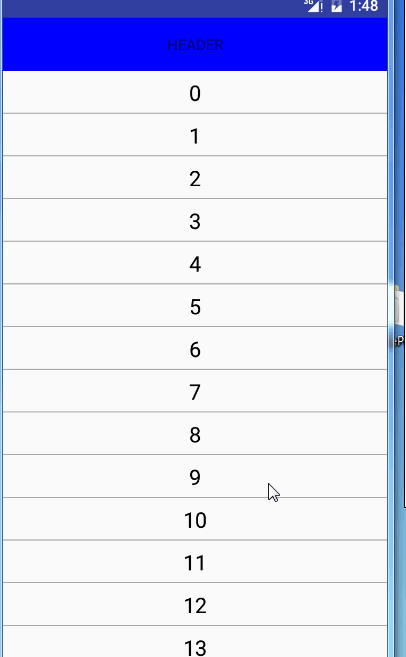

## RecyclerView封装Adapter之添加头部和底部视图

> 转载请标明出处：
[http://blog.csdn.net/lisdye2/article/details/52049857](http://blog.csdn.net/lisdye2/article/details/52049857)
本文出自:[【Alex_MaHao的博客】](http://blog.csdn.net/lisdye2?viewmode=contents)
项目中的源码已经共享到github，有需要者请移步[【Alex_MaHao的github】](https://github.com/AlexSmille/alex_mahao_sample/tree/master/systemwidgetdemo/src/main/java/com/mahao/alex/systemwidgetdemo/recycleView/base)


在`ListView`中已经自带了添加头布局和添加底部布局的方法，但是在`RecyclerView`中，却没有默认实现，这导致在实现一些特殊布局中不是那么的方便，本篇博客将通过封装`Adapter`方式添加头部和底部布局。


首先看一下实现效果




在阅读本篇博客之前，推荐阅读上一篇博客[ RecyclerView 封装Adapter之BaseRecyclerAdapter ](http://blog.csdn.net/lisdye2/article/details/52673428)


### **理论分析**

在实现的过程中，我们首先想到的便是复用的问题，如果对于`ListView`和`RecylerView`掌握的还可的话，知道在一个条目显示时候，会复用之前已经隐藏的条目。如果添加头部或者底部的视图，他的样式肯定适合我们普通显示的条目是不同的，这时候，复用势必会抛出错误，那么如何解决呢？


细心的同学会发现，在创建`RecyclerView.Adapter`时，其中的一个方法有些特别` public BaseViewHolder onCreateViewHolder(ViewGroup parent, int viewType) `，第一个参数是父控件，第二个参数，从参数的命名山可以理解为视图的类型，关键便就在此，我们可以根据`viewType`的值不同，构造不同的`ViewHoder`。 既然能够获取，肯定有指定的地方，继续寻找,发现了下面的方法`public int getItemViewType(int position)`,根据索引值返回对应条目的类型。那么，一切都捋顺了。思路如下：


- 根据`public int getItemViewType(int position)`，定义头部，底部，正常条目的常量，根据索引值进行返回。
- 在`public BaseViewHolder onCreateViewHolder(ViewGroup parent, int viewType) `中，通过`viewType`的不同值创建不同的`ViewHolder`.


### **代码实现**

**定义变量，添加头部布局和底部布局**

首先，从简单的开始实现，如下

```java 

public abstract class BaseRecycleAdapter<T> extends RecyclerView.Adapter<BaseRecycleAdapter.BaseViewHolder> {
   
 // 头部控件
    private View mHeaderView;

    // 底部控件
    private View mFooterView;


  	private boolean isHasHeader = false;

    private boolean isHasFooter = false;


   /**
     * 添加头部视图
     * @param header
     */
    public void setHeaderView(View header){
        this.mHeaderView = header;
        isHasHeader = true;
        notifyDataSetChanged();
    }

    /**
     * 添加底部视图
     * @param footer
     */
    public void setFooterView(View footer){
        this.mFooterView = footer;
        isHasFooter = true;
        notifyDataSetChanged();
    }


}

```

上面的代码都很简单，设置头部和底部布局，修改对应的标志。


**定义不同的视图类型，用以确定viewType的值**

```java 
   // item 的三种类型
    public static final int ITEM_TYPE_NORMAL = 0X1111; // 正常的item类型
    public static final int ITEM_TYPE_HEADER = 0X1112; // header
    public static final int ITEM_TYPE_FOOTER = 0X1113; // footer

```

定义了三种类型，因为对于`item`条目的类型，无非正常的，头部，底部三种，当然如果有特殊需求，自行添加。

**在getItemViewType()中，根据索引值，返回不同的布局类型**

```java 
 @Override
    public int getItemViewType(int position) {

        // 根据索引获取当前View的类型，以达到复用的目的

        // 根据位置的索引，获取当前position的类型
        if(isHasHeader&&position==0){
            return ITEM_TYPE_HEADER;
        }
        if(isHasHeader&&isHasFooter&&position==datas.size()+1){
            // 有头部和底部时，最后底部的应该等于size+!
            return ITEM_TYPE_FOOTER;
        }else if(!isHasHeader&&isHasFooter&&position==datas.size()){
            // 没有头部，有底部，底部索引为size
            return ITEM_TYPE_FOOTER;
        }
        return ITEM_TYPE_NORMAL;
    }

```


**在onCreateViewHolder()中，根据`viewType`类型构造不同的ViewHolder**


```java 
  @Override
    public BaseViewHolder onCreateViewHolder(ViewGroup parent, int viewType) {

        if(viewType==ITEM_TYPE_FOOTER){
            // 如果是底部类型，返回底部视图
            return new BaseViewHolder(mFooterView);
        }

        if(viewType==ITEM_TYPE_HEADER){
            return new BaseViewHolder(mHeaderView);
        }
        View view = LayoutInflater.from(parent.getContext()).inflate(getLayoutId(),parent,false);
        return new BaseViewHolder(view);
    }

```

**因为设置了头部布局或者是底部布局，大小要发生不同的变化**

```java 
 @Override
    public int getItemCount() {
        int size =  datas.size();
        if(isHasFooter)
            size ++;
        if(isHasHeader)
            size++;
        return size;
    }


```

**最后，绑定数据方法的定义**

如果看了上一篇博客，会明白通过`bindData()`方法，将数据的绑定交给了子类，同样，此时也是如此，不过我们需要添加一些基本的判断。

```java 
 @Override
    public void onBindViewHolder(BaseRecycleAdapter.BaseViewHolder holder, final int position) {

        if(isHasHeader&&isHasFooter){
            // 有头布局和底部时，向前便宜一个，且最后一个不能绑定数据
            if(position==0 ||position==datas.size()+1){
                return;
            }
            bindData(holder,position-1);
        }

        if(position!=0&&isHasHeader&&!isHasFooter){
            // 有顶部，但没有底部
            bindData(holder,position-1);
        }

        if(!isHasHeader&&isHasFooter){
            // 没有顶部，但有底部
            if(position==datas.size()){
                return;
            }
            bindData(holder,position);
        }

        if(!isHasHeader&&!isHasFooter){
            // 没有顶部，没有底部
            bindData(holder,position);
        }

    }

```

基本的逻辑，当有头部时，基本的向子类的偏移量要+1，有底部布局，则最后一个`position`不会回调。


### **使用方式**


```java 
public class PersonActivity extends AppCompatActivity {


    private RecyclerView mRecycler;
    private ArrayList<Person> mPersons;
    private PersonAdapter mAdapter;

    @Override
    protected void onCreate(@Nullable Bundle savedInstanceState) {
        super.onCreate(savedInstanceState);
        setContentView(R.layout.activity_person);

        mRecycler = ((RecyclerView) findViewById(R.id.reycler));


        LinearLayoutManager manager = new LinearLayoutManager(this, LinearLayoutManager.VERTICAL, false);


        mRecycler.setLayoutManager(manager);


        mPersons = new ArrayList<>();

        for(int i = 0 ;i <50;i++){

            mPersons.add(new Person(i+""));
        }

        mAdapter = new PersonAdapter(mPersons);


        mRecycler.setAdapter(mAdapter);

        // 设置头部布局
        mAdapter.setHeaderView(createView(Color.BLUE,"HEADER"));

        // 设置底部布局
        mAdapter.setFooterView(createView(Color.RED,"FOOTER"));

    }


    /**
     * 创建一个简单的布局
     * @param color
     * @param str
     * @return
     */
    public View createView(int color,String str){
        TextView text = new TextView(this);
        RecyclerView.LayoutParams params = new RecyclerView.LayoutParams(ViewGroup.LayoutParams.MATCH_PARENT,100);
        text.setLayoutParams(params);
        text.setBackgroundColor(color);
        text.setText(str);
        text.setGravity(Gravity.CENTER);
        return text;
    }
}

```


### **BaseRecycleAdapter的源码**

```java 
public abstract class BaseRecycleAdapter<T> extends RecyclerView.Adapter<BaseRecycleAdapter.BaseViewHolder> {


    protected List<T> datas;

    public BaseRecycleAdapter(List<T> datas) {
        this.datas = datas;
    }

    // 头部控件
    private View mHeaderView;

    // 底部控件
    private View mFooterView;


    // item 的三种类型
    public static final int ITEM_TYPE_NORMAL = 0X1111; // 正常的item类型
    public static final int ITEM_TYPE_HEADER = 0X1112; // header
    public static final int ITEM_TYPE_FOOTER = 0X1113; // footer


    private boolean isHasHeader = false;

    private boolean isHasFooter = false;

    @Override
    public BaseViewHolder onCreateViewHolder(ViewGroup parent, int viewType) {

        if(viewType==ITEM_TYPE_FOOTER){
            // 如果是底部类型，返回底部视图
            return new BaseViewHolder(mFooterView);
        }

        if(viewType==ITEM_TYPE_HEADER){
            return new BaseViewHolder(mHeaderView);
        }
        View view = LayoutInflater.from(parent.getContext()).inflate(getLayoutId(),parent,false);
        return new BaseViewHolder(view);
    }

    @Override
    public void onBindViewHolder(BaseRecycleAdapter.BaseViewHolder holder, final int position) {

        if(isHasHeader&&isHasFooter){
            // 有头布局和底部时，向前便宜一个，且最后一个不能绑定数据
            if(position==0 ||position==datas.size()+1){
                return;
            }
            bindData(holder,position-1);
        }

        if(position!=0&&isHasHeader&&!isHasFooter){
            // 有顶部，但没有底部
            bindData(holder,position-1);
        }

        if(!isHasHeader&&isHasFooter){
            // 没有顶部，但有底部
            if(position==datas.size()){
                return;
            }
            bindData(holder,position);
        }

        if(!isHasHeader&&!isHasFooter){
            // 没有顶部，没有底部
            bindData(holder,position);
        }

    }


    /**
     * 添加头部视图
     * @param header
     */
    public void setHeaderView(View header){
        this.mHeaderView = header;
        isHasHeader = true;
        notifyDataSetChanged();
    }

    /**
     * 添加底部视图
     * @param footer
     */
    public void setFooterView(View footer){
        this.mFooterView = footer;
        isHasFooter = true;
        notifyDataSetChanged();
    }


    @Override
    public int getItemViewType(int position) {

        // 根据索引获取当前View的类型，以达到复用的目的

        // 根据位置的索引，获取当前position的类型
        if(isHasHeader&&position==0){
            return ITEM_TYPE_HEADER;
        }
        if(isHasHeader&&isHasFooter&&position==datas.size()+1){
            // 有头部和底部时，最后底部的应该等于size+!
            return ITEM_TYPE_FOOTER;
        }else if(!isHasHeader&&isHasFooter&&position==datas.size()){
            // 没有头部，有底部，底部索引为size
            return ITEM_TYPE_FOOTER;
        }
        return ITEM_TYPE_NORMAL;
    }

    /**
     * 刷新数据
     * @param datas
     */
    public void refresh(List<T> datas){
        this.datas.clear();
        this.datas.addAll(datas);
        notifyDataSetChanged();
    }


    /**
     * 添加数据
     * @param datas
     */
    public void addData(List<T> datas){
        this.datas.addAll(datas);
        notifyDataSetChanged();
    }

    /**
     *  绑定数据
     * @param holder  具体的viewHolder
     * @param position  对应的索引
     */
    protected abstract void bindData(BaseViewHolder holder, int position);


    @Override
    public int getItemCount() {
        int size =  datas.size();
        if(isHasFooter)
            size ++;
        if(isHasHeader)
            size++;
        return size;
    }


    /**
     * 封装ViewHolder ,子类可以直接使用
     */
    public class BaseViewHolder extends  RecyclerView.ViewHolder{


        private Map<Integer, View> mViewMap;

        public BaseViewHolder(View itemView) {
            super(itemView);
            mViewMap = new HashMap<>();
        }

        /**
         * 获取设置的view
         * @param id
         * @return
         */
        public View getView(int id) {
            View view = mViewMap.get(id);
            if (view == null) {
                view = itemView.findViewById(id);
                mViewMap.put(id, view);
            }
            return view;
        }
    }

    /**
     * 获取子item
     * @return
     */
    public abstract int getLayoutId();


    /**
     * 设置文本属性
     * @param view
     * @param text
     */
    public void setItemText(View view,String text){
        if(view instanceof TextView){
            ((TextView) view).setText(text);
        }
    }
}

```