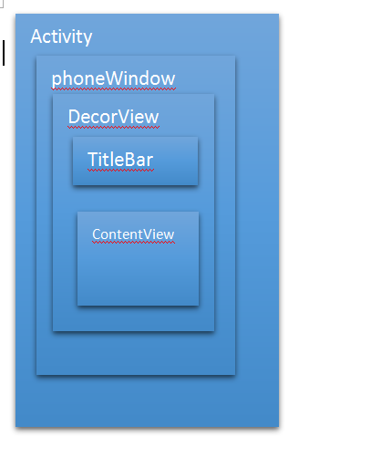

## Android群英传之第三章Android控件架构与自定义控件详解

### Android 控件架构

Android中对于一个`Activity`，都是由一个个`ViewGroup`和`View`中，通过`ViewGroup`,整个界面形成了一个树形的结构，这也就是我们常说的控件树，上层控件负责下层子控件的测量与绘制，并传递交互事件。通常在Activity中通过`findViewById`方法，就是在控件树中以树的深度优先遍历来查找对应元素的。

> 深度优先遍历：从节点开始，沿其相邻的结点的某一个往下深入到最终。

上图为Android的系统架构，每个`Activity`都包含一个`window`对象。在`Andriod`中通常是由`PhoneWindow`来实现的。`PhoneWidnow`将一个`DecorView`设置为整个应用窗口的根`View`。在`DecorView`就是我们`App`的显示的视图部分。在`DecorView`中包含了一个垂直`LinearLayout`，垂直的`LinearLayout`下包含了两个控件及`TitleBar`和`ContentView`，而我们的`setContentView`设置的便是此时的`ContentView`.

通过`requestWindowFeature(Window.FEATURE_NO_TITLE)`来设置全屏显示。那么此时视图中的布局就只有`ContentView`了。

### View的测量

在Android 提供一个了功能强大的类`MeasureSpect`类，通过他可以测量`View`的大小。`MeasureSpec`是一个32位的int值。

- 其中前两位为测量的模式。
- 低30位为测量的大小。

测量的模式有以下三种：

- `EXACTLY`:精确值模式。当我们把控件的宽高设置为固定值或者`match_parent`时，系统使用的便是`EXACTLY`模式。
- `AT_MOST`:最大值模式，当控件的宽高属性设置为`wrap_content`时，控件的大小一般随着控件的子控件或内容的变化而变化，此时控件的尺寸只要不超过父控件允许的最大尺寸即可。
- `UNSPECIFIED`:英文含义为未指明的，他不指定其大小测量模式。`View`想多大就多大，通常情况下在绘制自定义`View`时才会使用。

`View`类默认的`onMeasure()`方法只支持`EXACTLY`模式，即如果我们在自定义`View`时不重些`onMeasure()`方法，就只能使用`EXACTLY`模式。此时控件只能响应`match_parent`和固定的宽高值。而如果要让自定义`View`支持`wrap_content`属性，那么就必须重写`onMeasure()`方法来指定`wrap_content`的大小。

### View测量