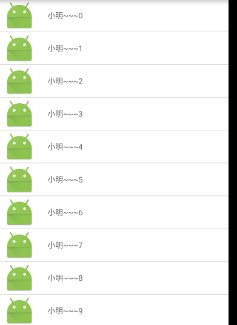

## Android之ListView的使用技巧总结

### ListView的基本概念。

对于ListView，我们知道他是用于显示具有一定特征的条目的集合。

ListView的使用与数据源（data），适配器（adapter）是密不可分的，只要有ListView就必须有另两个对象。

那么对于数据源很好理解就是我们往常数据的集合，可以是List集合或者是一个数组。而对于adapter，我们常用的有以下三类的adapter：

- `ArrayAdapter`：该适配器主要用于显示一些简单的数据，看一下特的构造方法：`ArrayAdapter(Context context, @LayoutRes int resource, @IdRes int textViewResourceId,@NonNull List<String> objects)`
	- `context`:代表上下文
	- `resource`：带表布局文件的资源id。
	- `textViewResourceId`：textView的资源id，如果我们的`resource`是我们需要显示的`textView`，则该参数可以省略。
	- `objects`:数据源，`String`类型的数组或集合。


- `BaseAdapter`：该适配器是平常用处最多的适配器，基本上大部分的`ListView`显示都通过该适配器来实现。该适配器自定义效果比较强，可以根据我们的需要定义不同的显示方式。

- `SimpleAdapter`:如果点击该适配器看其实现会发现，其继承了`BaseAdapter`,也就是说当前适配器是`BaseAdapter`的一个简单实现，但是，其实现时没有考虑到图片显示等问题，会导致图片错误等，所以该适配器不推见使用。

### ListView与BaseApdater的使用

我们看一下例子，我们有一群人，包含了姓名和头像，把这些人的数据显示在一个列表里。

创建实体类`Person`
```java 
public class Person {

    //头像
    private int iconId;

    //姓名
    private String name;


    public String getName() {
        return name;
    }

    public void setName(String name) {
        this.name = name;
    }

    public int getIconId() {
        return iconId;
    }

    public void setIconId(int iconId) {
        this.iconId = iconId;
    }
}
```

根据之前提出的概念，数据源（data）有了，那么下面就是一个适配器了。在这里我们需要实现`BaseAdapter`，因为`BaseAdapter`是一个抽象的类，所以我们必须实现以下的四个方法

- `getCount()`:决定了ListView显示的条目数。
- `getItem()`:没什么太大用处，一般做处理
- `getItemId()`:同上
- `getView()`:关键的方法，实现了`itemView`的加载以及数据的显示绑定等。

对于BaseAdapter，他的主要功能就是将数据显示到对应的`itemView`并返回。

```java 
public class PersonAdapter extends BaseAdapter {

    //数据
    private List<Person> mDatas;

    public PersonAdapter(List<Person> mDatas) {
        this.mDatas = mDatas;
    }

    @Override
    public int getCount() {
        //返回显示的数据条目的大小
        return mDatas==null?0:mDatas.size();
    }

    @Override
    public Object getItem(int position) {
        //一般没什么用
        return position;
    }

    @Override
    public long getItemId(int position) {
        //一般没什么用
        return position;
    }

    @Override
    public View getView(int position, View convertView, ViewGroup parent) {
		//position表示当前需要返回的itemView的索引

        //加载显示的itemView
        View itemView = LayoutInflater.from(parent.getContext()).inflate(R.layout.item, parent, false);

        //设置头像
        ((ImageView) itemView.findViewById(R.id.img)).setImageResource(mDatas.get(position).getIconId());

        //设置姓名
        ((TextView) itemView.findViewById(R.id.text1)).setText(mDatas.get(position).getName());

        //将itemView返回
        return itemView;
    }
}
```
看一下item的布局文件，非常简单。

```java 
<?xml version="1.0" encoding="utf-8"?>
<LinearLayout android:layout_width="match_parent"
    android:layout_height="50dp"
    android:background="#fff"
    android:gravity="center_vertical"
    android:orientation="horizontal"
    xmlns:android="http://schemas.android.com/apk/res/android">

    <ImageView
        android:id="@+id/img"
        android:layout_marginLeft="10dp"
        android:layout_width="wrap_content"
        android:layout_height="wrap_content" />

    <TextView
        android:layout_marginLeft="20dp"
        android:id="@+id/text1"
        android:textSize="12sp"
        android:layout_width="wrap_content"
        android:layout_height="wrap_content" />

</LinearLayout>

```


在getView中我们做了三件事情：1，加载布局文件。2，将数据显示到对应的布局文件上。3，返回该`itemView`。

最后，我们只需要在`activity`中查找到`ListView`，并和数据绑定即可。

```java 
public class MainActivity extends AppCompatActivity {

    private ListView mListView;

    private List<Person> mDatas = new ArrayList<>();

    private PersonAdapter mAdapter;


    @Override
    protected void onCreate(Bundle savedInstanceState) {
        super.onCreate(savedInstanceState);
        setContentView(R.layout.activity_main);

        //初始化数据源
        initData();

        //查找listView
        mListView = ((ListView) findViewById(R.id.listview));

        //创建适配器
        mAdapter = new PersonAdapter(mDatas);

        //设置当前适配器
        mListView.setAdapter(mAdapter);

    }

    /**
     * 初始化数据
     */
    private void initData() {
        for(int i = 0;i<20;i++){
            mDatas.add(new Person(R.mipmap.ic_launcher,"小明~~~"+i));
        }
    }
}

```

`Activity`的xml文件
```java 

<LinearLayout xmlns:android="http://schemas.android.com/apk/res/android"
    xmlns:tools="http://schemas.android.com/tools"
    android:layout_width="match_parent"
    android:layout_height="match_parent"
   >


    <ListView
        android:id="@+id/listview"
        android:layout_width="match_parent"
        android:layout_height="match_parent"
        />


</LinearLayout>
```

看一下效果：



### ListView与BaseAdapter的优化

BaseAdapter的优化主要分为以下方面

- 重用`itemView`，当`ListView`中已经划过的条目，会通过getView()方法的第二个参数`convertView`将已经消失的View返回已达到重用的目的。
- 定义`ViewHolder`类，减少`findViewById`的次数。

根据第一条，getView()中的方法变化如下：

```java
 @Override
    public View getView(int position, View convertView, ViewGroup parent) {

        //convertView:已经划过的itemView进行返回，我们可以通过其达到复用的目的

        //判断convertView，是否为null，
        // 如果不为null，因为我们返回的itemView都一样，我们可以直接拿来修改数据之后返回
        // 如果为null，则我们加载新的布局
        if(convertView ==null){
            convertView = LayoutInflater.from(parent.getContext()).inflate(R.layout.item, parent, false);
        }

        //设置头像
        ((ImageView) convertView.findViewById(R.id.img)).setImageResource(mDatas.get(position).getIconId());

        //设置姓名
        ((TextView) convertView.findViewById(R.id.text1)).setText(mDatas.get(position).getName());

        //将itemView返回
        return convertView;
    }

```

这样，我们就达到了第一种优化，下面进行第二种优化。由于我们第一种的优化，当前`ListView`中加载的`itemView`的数量为屏幕可显示条目的+1，那么我们只需要对于每一个`itemView`记录下他的控件`id`，这样就避免了多次查找。第二种优化的关键就在于定义一个类，用来保存每一个`itemView`中的控件的`id`值，减少`findViewById`的操作。

创建`ViewHolder`用来保存控件id
```java 
 /**
     * 保存控件id
     */
    class ViewHolder{
        ImageView img;
        TextView textView;
    }
```
再来看一下`getView()`方法
```java 
@Override
    public View getView(int position, View convertView, ViewGroup parent) {

        //convertView:已经划过的itemView进行返回，我们可以通过其达到复用的目的

        //判断convertView，是否为null，
        // 如果不为null，因为我们返回的itemView都一样，我们可以直接拿来修改数据之后返回
        // 如果为null，则我们加载新的布局

        ViewHolder vHolder;


        if(convertView ==null){
            convertView = LayoutInflater.from(parent.getContext()).inflate(R.layout.item, parent, false);
            //因为当前view是新创建的，我们需要查找控件并将id保存到vHolder中
            vHolder = new ViewHolder();
            vHolder.img = ((ImageView) convertView.findViewById(R.id.img));
            vHolder.textView = ((TextView) convertView.findViewById(R.id.text1));

            //通过setTag（）方法，将vHolder保存到itemView中
            convertView.setTag(vHolder);
        }else{
            //如果convertView不为null，则我们已将查找到对应的控件id，我们只需要通过getTag（）获取vHolder；

            vHolder = (ViewHolder) convertView.getTag();
        }

        //设置头像
        vHolder.img.setImageResource(mDatas.get(position).getIconId());

        //设置姓名
        vHolder.textView.setText(mDatas.get(position).getName());

        //将itemView返回
        return convertView;
    }

```
注释写的很清楚，就不在做过多的解释。

### 封装通用的BaseAdapter

对于adapter，我们通常只关心三件事情：
- 数据源
- itemView的布局文件
- 将`itemView`与数据源一一对应。

而他的复用，优化等等，应该放在内部去实现，而我们不需要关心。根据以上逻辑，我们实现了以下的`BaseAppAdapter`类

```java 
public abstract class BaseAppAdapter<T> extends BaseAdapter {

    //数据源，因为我们不知道具体的数据类型，所以引入泛型
    private List<T> datas;

    public BaseAppAdapter(List<T> datas) {
        
        this.datas = datas;
    }

    @Override
    public int getCount() {
        return datas==null?0:datas.size();
    }

    @Override
    public Object getItem(int position) {
        return null;
    }

    @Override
    public long getItemId(int position) {
        return 0;
    }

    @Override
    public View getView(int position, View convertView, ViewGroup parent) {
        ViewHolder viewHolder;
        
        if(convertView==null){
            convertView = LayoutInflater.from(parent.getContext()).inflate(getItemLayoutId(),parent,false);
            viewHolder = new ViewHolder(convertView);
            convertView.setTag(viewHolder);
        }else{

            viewHolder = (ViewHolder) convertView.getTag();
        }

		//实现类实现该方法，用来绑定数据        
        bindData(viewHolder,datas.get(position));
        
        return convertView;
    }

    /**
     * 绑定数据
     * @param viewHolder 显示条目的viewHolder
     * @param t  显示条目的javabean
     */
    protected abstract void bindData(ViewHolder viewHolder, T t);


    /**
     * 获取itemView的布局文件
     * @return
     */
    public abstract int getItemLayoutId();

    class ViewHolder{
        //因为不清楚具体多少控件以及类型，所以定义map保存。k为id，v为控件
        HashMap<Integer,View> mapView;
        
        //保存itemView，以便查找控件
        View itemView;
        
        public ViewHolder(View itemView){
            this.itemView = itemView;
            mapView = new HashMap<>();
        }
        
        //通过id获取View
        public View getView(int id){
            
            //从集合中查找view是否存在
            View view = mapView.get(id);
            //如果不存在，则说明还未查找过，
            if(view==null){
                //通过id在itemView中查找控件，
                view = itemView.findViewById(id);
                //将查找的保存到map中，以便下次查找
                mapView.put(id,view);
            }
            //返回view
            return view;
        }
        
        
    }
}

```

可以看到，我们定义了两个抽象方法，用来获取`temView`的id以及绑定数据。该方法数据模板设计模式。有兴趣的可以看一看。

那么封装式完成了，我们怎么使用他呢，对于`Person`，我们实现最终的`OverPersonAdapter`

```java 
/**
 * Created by Alex_MaHao on 2016/5/4.
 */
public class OverPersonAdapter extends BaseAppAdapter<Person> {

    public OverPersonAdapter(List<Person> datas) {
        super(datas);
    }

    @Override
    protected void bindData(ViewHolder viewHolder, Person person) {
        //设置头像
        ((ImageView) viewHolder.getView(R.id.img)).setImageResource(person.getIconId());

        //设置姓名
        ((TextView) viewHolder.getView(R.id.text1)).setText(person.getName());
    }

    @Override
    public int getItemLayoutId() {
        return R.layout.item;
    }
}

```

可以看到，大大的减少了代码量。同时又达到了优化的目的。我们可以根据需要在`BaseAppAdapter`中添加刷新数据等等一系列的方法。