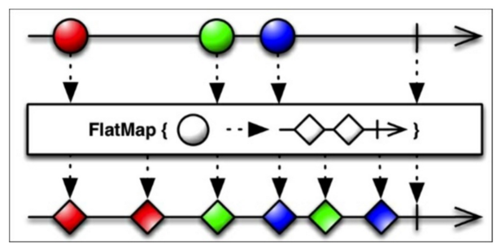
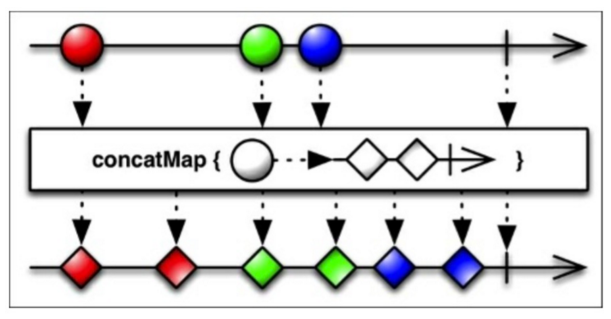

## RxJava操作符总结之变换


### map()

将发射序列的元素转化成另一种元素进行转换。

我们可能会有这种需求，有一个数组存放图片的地址，我们需要加载到图片并设置到对应的`imageView`，那么，对于发射的元素，有这样一层转化，`url` - >`Bitmap` ， 那么此时就是用到`map()`

请暂时忽略线程的问题，只是为了说明问题

```java 
   Observable.from(urls)
                .map(new Func1<String, Bitmap>() {
                    @Override
                    public Bitmap call(String url) {
                        return loadBitmap(url);
                    }
                })
                .subscribe(new Action1<Bitmap>() {
                    @Override
                    public void call(Bitmap bitmap) {
                        //设置图片     
                    }
                });

```

此代码的逻辑，我们通过`from()`加载urls数组。通过`map()`将url转化为`Bitmap`,最后订阅的时候，设置图片即可。


### flatMap()

将发射序列中的元素转化为另一个发射序列，最后将所有的发射序列合并成一条发射序列之后重新发送。


- `flatMap()`是将一个元素转化为一个发射序列。 一个元素转化成多个元素。同时，由于其发送的是一个Observable对象，相当于是另一个订阅响应的关系。
- `map()` 是将一个元素转化为另一个元素。一个元素转化成另一个元素。同步的直接返回值。

对于上一个例子，我们看到，将图片加载成`Bitmap`对象，是同步的，但在实际情况中，我们肯定是在异步加载我们的图片，当图片完成之后，我们来通知相应的事件。那么，也即是一个Observable对象

```java 
 Observable.from(urls)
                .flatMap(new Func1<String, Observable<Bitmap>>() {
                    @Override
                    public Observable<Bitmap> call(String url) {
						//返回Observable对象
                        return loadAsyncBitmap(url) ;
                    }
                })
                .subscribe(new Action1<Bitmap>() {
                    @Override
                    public void call(Bitmap bitmap) {
                        //获取到加载的图片
                    }
                });

```

以上是从逻辑上分析，但从代码角度，我个人认为是因为他们处理的方式不同。因为如果我们直接使用`map()`时，返回的对像，直接向下发送即可。而对于`flatMap()`，返回的`Observable`对象，我们知道其实质是一个携带回调信息的对象，我们不能直接继续发送，而是让其返回值与之前的值绑定。如果有疑惑的，可以看我之前的博客[ RxJava前奏之原理分析](http://blog.csdn.net/lisdye2/article/details/51024952)。相信会有助于理解

上面那个例子是针对`flatMap()`的一个特性，我们通过`flatMap()`返回的是一个`Observable`对象，我们知道其实质可以包含一个发射序列，只不过我们上一个例子的发射序列中只有一个元素，下面表示一个元素转化为一个发射序列。

```java 

    public static void main(String[] args) {
        init();
        Observable.from(array)
                .take(5)
                .flatMap(new Func1<Integer, Observable<String>>() {
                    @Override
                    public Observable<String> call(Integer i) {

                        return Observable.from(getStringList(i));
                    }
                }).subscribe(new Action1<String>() {
                        @Override
                        public void call(String s) {
                            System.out.println(s);
                        }
            });

    }


    public static void init() {
        for (int i = 0; i < 50; i++) {
            array.add(i);
        }
    }


    public static String[] getStringList(int i) {
        String[] array = new String[3];
        for (int m = 0; m < 3; m++) {
            array[m] = i + "aa";
        }
        return array;

    }


```

```java 
0aa
0aa
0aa
1aa
1aa
1aa
2aa
2aa
2aa
3aa
3aa
3aa
4aa
4aa
4aa

```
可以看到，对于我们发射序列1~49 ， 先截取前五个，然后每个数字转化为 0 - 》 0aa ，0aa ,0aa。转化成了具有三个元素的发射序列，最后在合并。


### concatMap() 

该操作符和`flatMap()`的作用几乎相同，唯一的区别就在于，`flatMap()`合并每一个发射序列时，是并行的，当数据很大时，会造成顺序上混乱。而`concatMap()`是将新建的发射序列按照发射元素的顺序合并。

借用《Rx Essentials》的图片

- flatMap
 

- concatMap




### buffer() 

将发射序列中的元素合并成固定数量的集合，以集合为基本元素发送新的序列。

对于，1~50 ，我们以4和4的倍数为间隔，将其间隔后的数据形成一个个集合重新发送。

```java 
     Observable.from(array)
                .buffer(3,4)
                .subscribe(new Action1<List<Integer>>() {
                    @Override
                    public void call(List<Integer> integers) {

                        System.out.println();

                        System.out.print(integers);
                    }
                });

```

```java 

[1, 2, 3]
[5, 6, 7]
[9, 10, 11]
[13, 14, 15]
[17, 18, 19]
[21, 22, 23]
[25, 26, 27]
[29, 30, 31]
[33, 34, 35]
[37, 38, 39]
[41, 42, 43]
[45, 46, 47]
[49, 50]

```

第一个参数表多少个为一组，第二个参数为当前组开始往后推。


例如：如果3个位一组，skip 为4，则第4个数会被舍去。  如果skip为小于3的数，则无效。如果skip等于5，则第4，5会被舍去。

### groupBy()

将发射元素按照一定规则进行分组，将不同组保存在不同的发射序列中进行缓存。

该方法和`buffer`的区别为：

- `buffer`是按照发射顺序进行分组，并且分组是按照list的方式作为发射元素存储到一个发射序列中

- `groupBy`是按照我们制定的规则进行分组，但分组仍是按照基本的元素存储，但是不同规则的元素放在不同的发射序列中，通过键值进行标识，会产生多个发射序列

例如，从1~50，我们将其分为3的倍数和不是3的倍数的两个发射序列。对于是3的倍数的发射序列，我们进行发射。

```java 

        Observable.from(array)
                .groupBy(new Func1<Integer, String>() {
                    @Override
                    public String call(Integer integer) {
                        if (integer % 3 == 0)
                            return "3";
                        else
                            return "!3";
                    }
                })
                .subscribe(new Action1<GroupedObservable<String, Integer>>() {
                    @Override
                    public void call(GroupedObservable<String, Integer> stringIntegerGroupedObservable) {
                        System.out.println(stringIntegerGroupedObservable.getKey());
                        if (stringIntegerGroupedObservable.getKey().equals("3")) {
                            stringIntegerGroupedObservable.subscribe(new Action1<Integer>() {
                                @Override
                                public void call(Integer integer) {
                                    System.out.print(" " + integer);
                                }
                            });
                        } else {
                            stringIntegerGroupedObservable.take(0);
                        }
                    }
                });
```

```java 
!3
3
 3 6 9 12 15 18 21 24 27 30 33 36 39 42 45 48
```

注意，在产生的多个发射序列中，如果有不符合我们想要结果的，我们必须调用`take()`方法清除缓存。

### scan()

累加器，将该方法中返回的值作往下发送的同时，会将该值保存并作为下一次参数进行传入`scan()`方法。

对1~50截取前5位，并进行累加。

```java 

        Observable.from(array)
                .take(5)
                .scan(new Func2<Integer, Integer, Integer>() {
                    @Override
                    public Integer call(Integer num, Integer item) {
                        System.out.println( "scan:"+num+" "+item);
                        return num+item;
                    }
                })
                .subscribe(new Action1<Integer>() {
                    @Override
                    public void call(Integer integer) {
                        System.out.println(integer);
                    }
                });
```

```java 
1
scan:1 2
3
scan:3 3
6
scan:6 4
10
scan:10 5
15

```

可以看到，第一次没有回调`scan()`的`call()`方法，直接进行了向下发送。因为当前是第一次发生，并没有相应得累加。

### widow()

将发射的元素按照顺序进行分组，每一分组作为一个发射序列，最后产生多个发射序列。


```java 

        Observable.from(array)
                .window(2,3)
                .flatMap(new Func1<Observable<Integer>, Observable<String>>() {
                    @Override
                    public Observable<String> call(Observable<Integer> integerObservable) {
                        System.out.println();

                        return integerObservable.map(new Func1<Integer, String>() {
                            @Override
                            public String call(Integer integer) {
                                return integer+"";
                            }
                        });
                    }
                })
                .subscribe(new Action1<String>() {
                    @Override
                    public void call(String s) {
                        System.out.print(s+" ");
                    }
                });

```

```java 
1 2 
4 5 
7 8 
10 11 
13 14 
16 17 
19 20 
22 23 
25 26 
28 29 
31 32 
34 35 
37 38 
40 41 
43 44 
46 47 
49 50 

```


### buffer(),groupBy(),window()的区别

- buffer() 按照发射序列的元素顺序进行分组，分组按照集合的形式称为发射序列的新元素，仍是一个发射序列。

- groupBy() 根据我们自定义的规则，返回不同的键值，然后通过键值的不同将发射序列分成不同的发射序列。不按顺序，按键值规则，同时多条发射序列。

- widow() ，按照发射序列顺序进行分组，分组后以发射序列为集合，包含我们的元素。按顺序分组，多条发射序列。

