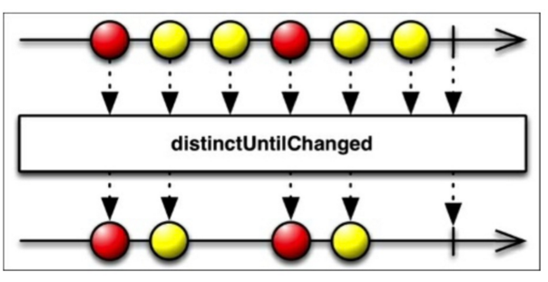
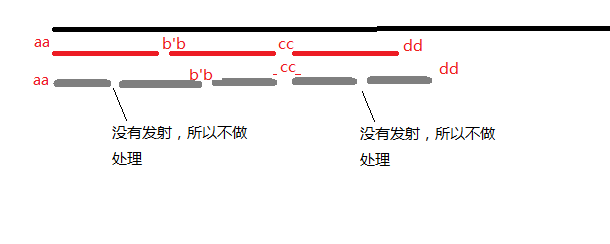
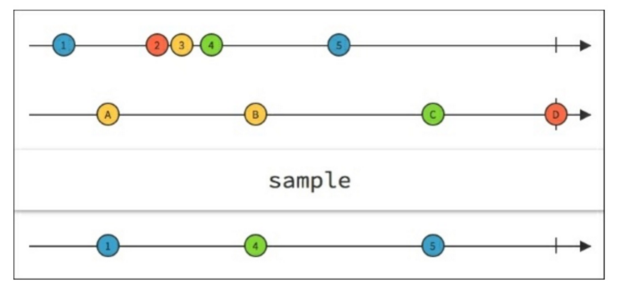
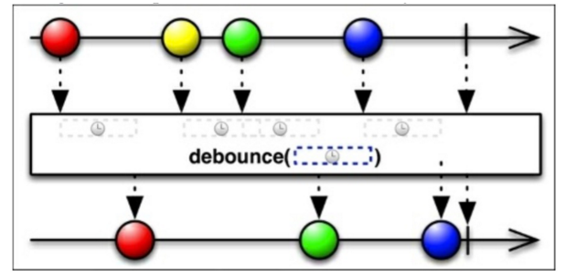

## RxJava操作符总结之过滤


### jsut()

`just(T t1, T t2, T t3 ....)` ，just可以传入多个相同类型的参数，并将当前参数一个接着一个的发送。

```java 
 Observable.just("1","2","3")
                .subscribe(new Action1<String>() {
                    @Override
                    public void call(String s) {
                        System.out.println(s);
                    }
                });
```
```java 
1
2
3
```

### repeat()

`repeat()` 将当前的消息序列无限制循环发送。我们可以传入一个参数表示循环的次数

```java 
 Observable.just("1","2","3")
                .repeat(3)
                .subscribe(new Action1<String>() {
                    @Override
                    public void call(String s) {
                        System.out.println(s);
                    }
                });
```

```java 
123123123
```

### defer() 

延迟创建`Observable`。再订阅时创建`Observable`对象。该方法利用`call`方法的特性。

```java 
public static void main(String[] args) {

        Observable.defer(new Func0<Observable<Integer>>() {
            @Override
            public Observable<Integer> call() {
                return getInt();
            }
        });


    }


    public static Observable<Integer> getInt() {

        System.out.println("getInt()");
        return Observable.create(new Observable.OnSubscribe<Integer>() {
            @Override
            public void call(Subscriber<? super Integer> subscriber) {

                System.out.print("ss");
                subscriber.onNext(42);
            }
        });
    }
```

此时`getInt()`方法不会被调用，会在`subscribe()`时调用。这个如果看过源码很容易理解。或者看我之前的博客[RxJava 源码走读之Observable.create()和subscribe()](http://blog.csdn.net/lisdye2/article/details/51068499)

### range()

从指定数字开始发射数字。

```java 
  Observable.range(3,2)
                .subscribe(new Action1<Integer>() {
                    @Override
                    public void call(Integer integer) {
                        System.out.print(integer);
                    }
                });
```

```java 
34
```

`range(int start,int count)` 第一个参数为从哪个数开始，第二个参数为发送多少个。

### filter()

过滤作用。根据回调的条件对序列进行筛选。


查询0~49能被3整除的数。

```java 

    private static ArrayList<Integer> array = new ArrayList<>();

    public static void main(String[] args) {
        init();
        Observable.from(array)
                .filter(new Func1<Integer, Boolean>() {
                    @Override
                    public Boolean call(Integer integer) {

						//判断条件，如果返回false则该发送内容将取消，true将继续发送
                        return integer%3==0;
                    }
                })
                .subscribe(new Action1<Integer>() {
                    @Override
                    public void call(Integer integer) {
                        System.out.print(integer+" ");
                    }
                });

    }


    public static void init(){
        for (int i=0;i<50;i++){
            array.add(i);
        }
    }

```
```java 
0 3 6 9 12 15 18 21 24 27 30 33 36 39 42 45 48 
```

### take()  takeLast()

- `take()`获取发射序列的前几个，后面的取消发送。
- `takeLast()`获取发射序列的后几个，其余的取消继续向下发送

获取0~49的前三个数和最后三个数
```java 
		Observable.from(array)
                .take(3)
                .subscribe(new Action1<Integer>() {
                    @Override
                    public void call(Integer integer) {
                        System.out.print(integer+" ");
                    }
                });

        System.out.println();
        Observable.from(array)
                .takeLast(3)
                .subscribe(new Action1<Integer>() {
                    @Override
                    public void call(Integer integer) {
                        System.out.print(integer+" ");
                    }
                });
```

```java 
0 1 2 
47 48 49 
```

### distinct()

将发送序列中重复的值除去。即发送序列后面的值如果和前面有重叠，则后面的值不会被发送。  该方法去重时需要记录发送序列每一次发送的值，所以当有大数据时要注意发送的值。

```java 
 Observable.from(array)
                .take(3)
                .repeat(3)
                .distinct()
                .subscribe(new Action1<Integer>() {
                    @Override
                    public void call(Integer integer) {
                        System.out.print(integer+" ");
                    }
                });
```
```java 
0 1 2 
```

### distinctUntilChanged()

该方法和`distinct()`的区别为，当前发射值与上一次发射值相同时则取消当前发射，如果不相同，则继续发射。即所谓的有改变时发射。




### first()和last()

故名思意，就是获取发射序列的第一个和最后一个。

同时，该方法可以根据条件进行选择符合条件的第一个和最后一个。

获取0~49中3的倍数的最后一个值
```java 
Observable.from(array)
                .last(new Func1<Integer, Boolean>() {
                    @Override
                    public Boolean call(Integer integer) {
                        return integer%3==0&&integer!=0;
                    }
                })
                .subscribe(new Action1<Integer>() {
                    @Override
                    public void call(Integer integer) {
                        System.out.print(integer+" ");
                    }
                });

```

```java 
48 
```

### skip()和skipLast()

跳过发射序列的前几个和最后几个 。 该方法和`take()`,`takeLast()`类似。

跳过0~49发射序列中的前三个和后三个

```java 
  Observable.from(array)
                .skip(3)
                .skipLast(3)
                .subscribe(new Action1<Integer>() {
                    @Override
                    public void call(Integer integer) {
                        System.out.print(integer+" ");
                    }
                });


```

```java 
3 4 5 6 7 8 9 10 11 12 13 14 15 16 17 18 19 20 21 22 23 24 25 26 27 28 29 30 31 32 33 34 35 36 37 38 39 40 41 42 43 44 45 46
```

### elementAt()和elementAtOrDefault()

获取发射序列指定位置的发射值。 其中当我们指定位置大于发射序列时，会抛出异常，所以推荐使用带有默认值的`elementAtDefault()`。

对0~49的发射序列，获取前三个元素的发射后获取第五个位置的元素值。如果没有，则设置默认值为3.

```java 
Observable.from(array)
                .take(3)
                .elementAtOrDefault(5,3)
                .subscribe(new Action1<Integer>() {
                    @Override
                    public void call(Integer integer) {
                        System.out.print(integer+" ");
                    }
                });
```

```java 
3 
```

### interval()

轮询，该操作符每隔指定时间发送一次事件。该方法默认在`conmputation`线程执行

```java 
		Observable
                .interval(3, TimeUnit.SECONDS)
                .observeOn(AndroidSchedulers.mainThread())
                .subscribe(new Action1<Long>() {
                               @Override
                               public void call(Long s) {
                                   Log.i("info",s);
                               }
                           }
                );
```

第一个参数：延时时间   第二个参数：单位

该操作符会从0开始，每隔1秒发送一次

稍微复杂点的，对于列表，我们要遍历打印此列表，则代码如下
```java 
Observable.interval(3,TimeUnit.SECONDS)
                .flatMap(new Func1<Long, Observable<String>>() {
                    @Override
                    public Observable<String> call(Long aLong) {
                        return Observable.just(array.get(aLong.intValue()));
                    }
                })
                .observeOn(AndroidSchedulers.mainThread())
                .subscribe(new Subscriber<String>() {
                    @Override
                    public void onCompleted() {
                        Log.i("info","onCompleted");
                    }

                    @Override
                    public void onError(Throwable e) {
                        Log.i("info","error");
                    }

                    @Override
                    public void onNext(String s) {
                        Log.i("info","onNext--"+s);
                    }
                });
```
```java 
04-13 15:44:28.634 15455-15455/mahao.alex.rxjava I/info: onNext--aa
04-13 15:44:31.634 15455-15455/mahao.alex.rxjava I/info: onNext--bb
04-13 15:44:34.634 15455-15455/mahao.alex.rxjava I/info: onNext--cc
04-13 15:44:37.634 15455-15455/mahao.alex.rxjava I/info: onNext--dd
04-13 15:44:40.644 15455-15455/mahao.alex.rxjava I/info: error
```
打印如下，而且是每隔三秒。打印一次。。


### timer()

延迟固定时间后发送元素。与`interval()`区别为该操作符只发送一次。

```java 
Observable.timer(3,TimeUnit.SECONDS)
                .flatMap(new Func1<Long, Observable<String>>() {
                    @Override
                    public Observable<String> call(Long aLong) {
                        return Observable.just(array.get(aLong.intValue()));
                    }
                })
                .observeOn(AndroidSchedulers.mainThread())
                .subscribe(new Subscriber<String>() {
                    @Override
                    public void onCompleted() {
                        Log.i("info","onCompleted");
                    }

                    @Override
                    public void onError(Throwable e) {
                        Log.i("info","error");
                    }

                    @Override
                    public void onNext(String s) {
                        Log.i("info","onNext--"+s);
                    }
                });

```

```java 
04-13 15:52:32.114 23036-23036/mahao.alex.rxjava I/info: onNext--aa
04-13 15:52:32.114 23036-23036/mahao.alex.rxjava I/info: onCompleted

```

注意：该操作符运行在`conputation`线程中。


### sample()

将发射序列每隔固定间隔获取其最近值并向下发送。

这个分为两种情况。

 - 发送序列的时间间隔大于`sample`的时间间隔
 - 发送序列的时间间隔小于`sample`的时间间隔

对于第二种情况，就是每隔固定间隔发射即可，而第一种情况存在的一种特殊情况

下面我们看一下例子

有一个数组{"aa","bb","cc","dd"}每隔三秒发射，而`sample`每隔两秒筛选。

```java 
Observable.interval(3,TimeUnit.SECONDS)
                .flatMap(new Func1<Long, Observable<String>>() {
                    @Override
                    public Observable<String> call(Long aLong) {
                        return Observable.just(array.get(aLong.intValue()));
                    }
                })
                .sample(2,TimeUnit.SECONDS)
                .observeOn(AndroidSchedulers.mainThread())
                .subscribe(new Subscriber<String>() {
                    @Override
                    public void onCompleted() {
                        Log.i("info","onCompleted");
                    }

                    @Override
                    public void onError(Throwable e) {
                        Log.i("info","error");
                    }

                    @Override
                    public void onNext(String s) {
                        Log.i("info","onNext--"+s);
                    }
                });

```

```java 
04-13 16:13:45.404 11935-11935/mahao.alex.rxjava I/info: onNext--aa
04-13 16:13:49.404 11935-11935/mahao.alex.rxjava I/info: onNext--bb
04-13 16:13:51.404 11935-11935/mahao.alex.rxjava I/info: onNext--cc
04-13 16:13:55.404 11935-11935/mahao.alex.rxjava I/info: onNext--dd
04-13 16:13:56.414 11935-11935/mahao.alex.rxjava I/info: error

```
看一下他们的事件间隔，四次发射的时间间隔为 4,2,4。最后error暂且不提。

为什么是这个时间间隔呢？



图虽然丑，但还是有一定道理的

再上一张好看的图


### timeOut

指定最小的发射时间间隔，如果指定的当前时间间隔内没有发送元素，则抛出异常，停止。

### debounce

当发送的数据的时间间隔小于`debounce`指定的时间间隔，则当前发送的数据将被过滤，如果在指定的时间间隔内仍没有数据发送，则会发送最后一个。




