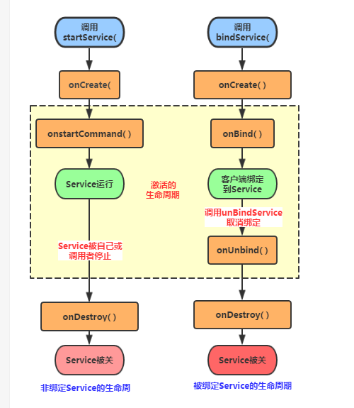

## Service 使用全解析


### **什么是Service**

`Service`是Android 的四大组件之一，主要处理一些耗时的后台操作逻辑，或者轮询操作等需要长期在后台运行的任务。甚至在程序退出之后，可以让Service继续在后台运行。


`Service`的启动方式有三种：三种方式对应着三种不同的生命周期。

- `startService`启动服务。（简单使用）
- `bindService`绑定服务的方式启动服务。
- 先启动服务之后绑定服务。


###  **Service 的简单使用**

`startService`启动服务是最简单的一种方式。我们按照以下流程来使用`Service`

- 创建`MyService`类继承`Service`
- 重写`onCreate()`，`onStartCommand()`,`onDestory()`方法。
- 在`Activity`启动`Service`
- 清单文件中注册该`Service`。


创建`MyService`类并重写对应的三个方法

```java 
public class MyService extends Service {

    private static final  String TAG = "INFO";

    @Override
    public void onCreate() {

        Log.i(TAG,"onCreate");
        super.onCreate();
    }


    @Override
    public int onStartCommand(Intent intent, int flags, int startId) {
        Log.i(TAG,"onStartCommand");
        return super.onStartCommand(intent, flags, startId);
    }

    @Override
    public void onDestroy() {
        super.onDestroy();
        Log.i(TAG,"onDestroy");
    }

    @Nullable
    @Override
    public IBinder onBind(Intent intent) {
        return null;
    }
}

```

在继承`Service`时，默认必须实现`onBind`方法，该方法是在绑定服务时用到的，在这里我们不做任何操作，后面会用到。

对于这三个方法，并没有做多余的操作，分别在这个三个方法中打印了一句log,看一下他们的调用时机。


布局文件中添加了两个按钮，分别是启动服务和停止服务

```xml 
<LinearLayout xmlns:android="http://schemas.android.com/apk/res/android"
    android:orientation="vertical" android:layout_width="match_parent"
    android:layout_height="match_parent">

    <Button
        android:onClick="start"
        android:text="start_service"
        android:layout_width="wrap_content"
        android:layout_height="wrap_content" />


    <Button
        android:onClick="stop"
        android:text="stop_service"
        android:layout_width="wrap_content"
        android:layout_height="wrap_content" />

</LinearLayout>

```


在`MainActivity`中实现这两个方法：

```java 
 	public void start(View view) {
        Intent intent = new Intent(this, SimpleService.class);
        startService(intent);
    }


    public void stop(View view) {
        Intent intent = new Intent(this, SimpleService.class);
        stopService(intent);
    }


```

启动`Service`的方式和启动`Activity`的方式相似，最后使用`startService`和`stopService`启动和停止服务。

**最后**，一定要在清单文件中进行注册

```xml 

    <application
        android:allowBackup="true"
        android:icon="@mipmap/ic_launcher"
        android:label="@string/app_name"
        android:supportsRtl="true"
        android:theme="@style/AppTheme">
        <activity android:name=".service.ServiceMainActivity">
            <intent-filter>
                <action android:name="android.intent.action.MAIN" />

                <category android:name="android.intent.category.LAUNCHER" />
            </intent-filter>
        </activity>

		<!-- 注册服务 -->
        <service android:name=".service.SimpleService" />
    </application>


```

看一下打印结果

```java 

// 点击start 按钮
06-20 16:09:24.483 22629-22629/com.example.system4compent I/INFO: onCreate
06-20 16:09:24.485 22629-22629/com.example.system4compent I/INFO: onStartCommand
//　再次点击start按钮
06-20 16:09:27.873 22629-22629/com.example.system4compent I/INFO: onStartCommand
// 点击 stop 按钮
06-20 16:09:29.442 22629-22629/com.example.system4compent I/INFO: onDestroy

// 退出程序，此时Service 已停止，程序被完全退出

// 重新打开程序，点击 start 按钮
06-20 16:09:49.545 22867-22867/com.example.system4compent I/INFO: onCreate
06-20 16:09:49.545 22867-22867/com.example.system4compent I/INFO: onStartCommand

// 退出程序，使用后台干掉。此时Service 未停止，重新调用了onCreate和onStartCommand
06-20 16:09:53.488 22971-22971/com.example.system4compent I/INFO: onCreate
06-20 16:09:53.489 22971-22971/com.example.system4compent I/INFO: onStartCommand


```


从上面的结果中可以看到，当我们`startService()`启动服务时，如果是第一次，则会创建`Service`实例，并调用了`onCreate()`和`onstartCommand()`,而如果不是第一次，`Service`实例已经被创建了，则只会调用`onStartCommand()`方法。 


`stopService` 方法可停止服务的启动。销毁`Service`实例。

为了对比，分别在`Service`实例被销毁和不被销毁时，通过后台管理直接干掉该程序，发现到销毁时，程序正常退出。而未销毁时，在程序退出之后，又调用了`onCreate()`和`onStartCommand()`方法，这是为什么呢？

解释： 当销毁时退出，一切都ok。但是当`Service`还存在时，通过后台管理直接干掉程序，对于`Service`来说，突然被干掉，属于异常退出，此时会让系统重新创建一个`Service`实例，这也是重新调用了两个初始方法的原因。

> 有一个没有演示，在这里直接说结论，当通过返回的方式退出程序时，`Service`如果没有手动调用`onDestory()`,则`Service`不会被销毁和退出，仍在系统中运行。


总结：该方式我们可以通过`startService()`启动服务时，通过`onStartCommand()`方式不断调用，来操做`service`，常见的MP3播放器就是使用这种方式。单是，其和Activity的交互比较麻烦，此时，绑定方式更加的利于相互的数据交互。


### **绑定Service **

在上一节中，有一个方法没有管它，在这里，我们继续对之前的`MyService`进行修改。

```java 
 	@Nullable
    @Override
    public IBinder onBind(Intent intent) {
        // 绑定之后会回调此方法
        return myBinder;
    }

    /**
     * 绑定之后回传给Activity 的对象实例
     */
    public class MyBinder extends Binder{
        public void down(){
            Log.i(TAG,"down.....");
        }
    }

```

由于`onBind()`方法返回的是`IBinder`对象，我们自定义该实现其类。同时自定义下载方法，通过`onBind()`方法，将实例回传。

在布局文件中添加两个按钮，分别是绑定服务和解绑服务

```xml 

    <Button
        android:onClick="bind"
        android:text="bind_service"
        android:layout_width="wrap_content"
        android:layout_height="wrap_content" />

    <Button
        android:onClick="unbind"
        android:text="unbind_service"
        android:layout_width="wrap_content"
        android:layout_height="wrap_content" />

```


实现布局中的两个方法

```java 

    public void bind(View view) {
        // 绑定服务

        Intent intent = new Intent(this, MyService.class);

        bindService(intent,conn,BIND_AUTO_CREATE);
    }


    public void unbind(View view){
        //解绑服务

        unbindService(conn);
    }


```

绑定服务和解绑服务，通过`bindService()`和`unbindService()`方法。分析`bindService()`的参数:

`bindService(Intent service, ServiceConnection conn,int flags)`

- `service`:很好理解，意图
- `ServiceConnection`: 服务绑定和解绑的回调类，类似`xxxListener`.
- `flag`： 绑定的一些标志。对于当前的标志`BIND_AUTO_CREATE`的含义是，如果绑定是`Service`未创建实例，则先创建实例在绑定。

`ServiceConnection`作为监听的类，有两个监听方法：

- ` public void onServiceConnected(ComponentName name, IBinder service) `： 绑定成功的回调。
- ` public void onServiceDisconnected(ComponentName name)`：绑定的服务被异常销毁时。一般不会回调此方法。


看一下我们的实现：

```java 
 private ServiceConnection conn = new ServiceConnection() {
        @Override
        public void onServiceConnected(ComponentName name, IBinder service) {
            // 建立联系时回调
            myBinder = (MyService.MyBinder) service;
            myBinder.down();
            Log.i("INFO","onServiceConnected");
        }

        @Override
        public void onServiceDisconnected(ComponentName name) {
            // 断开连接时回调
            Log.i("INFO","onServiceDisconnected");
        }
    };
```

通过`onServiceConnected`的参数，我们获取到当绑定时返回的`MyBinder`对象。


```java 
06-20 16:49:06.972 20373-20373/com.example.system4compent I/INFO: onCreate
06-20 16:49:06.977 20373-20373/com.example.system4compent I/INFO: down.....
06-20 16:49:06.977 20373-20373/com.example.system4compent I/INFO: onServiceConnected
06-20 16:49:20.228 20373-20373/com.example.system4compent I/INFO: onDestroy
```


对于结果，直接总结：

- `bindService`时因为`flag`的设置，会先创建`Service`的实例，在调用`onBind`回传`Binder`实例，用以产生交互。
- `unbindService`调用后，当前`Service`解绑之后会被立即销毁。
- 如果没有解绑服务，当前`activity`销毁或者从后台直接干掉程序，都会抛出异常。即绑定之后必须解除绑定。
- `bindService()`之后，再绑定，则无效果，也不会回调，`activity`和`Service`的交互完全交给了`Binder`对象实例。


在`bindService()`时，第三个参数`flags`都能够传入那些参数呢？

- `BIND_AUTO_CREATE`：绑定的service不存在时，会自动创建
- `BIND_ADJUST_WITH_ACTIVITY`：service的优先级别与根据所绑定的Activity的重要程度有关，Activity处于前台，service的级别高；
- `BIND_NOT_FOREGROUND`：Service永远不拥有运行前台的优先级；
- `BIND_WAIVE_PRIORITY`：Service的优先级不会改变；
- `BIND_IMPORTANT`： 当你的客户端在前台，这个标示符下的Service也变得重要性相当于前台的Activity，优先级迅速提升。
- `BIND_ABOVE_CLIENT`：优先级已经超过了Activity，也就是说Activity要比Service先死，当资源不够的时候。；


> 补充：在`Service`中，同样有一个`unBind()`方法，当所有与其绑定的都断开时，会回调此方法。

### **先启动再绑定服务**

先启动服务，在绑定服务，则调用方法如下：
```java 

06-20 17:02:02.628 21264-21264/com.example.system4compent I/INFO: onCreate
06-20 17:02:02.628 21264-21264/com.example.system4compent I/INFO: onStartCommand
06-20 17:02:05.544 21264-21264/com.example.system4compent I/INFO: down.....
06-20 17:02:05.544 21264-21264/com.example.system4compent I/INFO: onServiceConnected
06-20 17:02:08.502 21264-21264/com.example.system4compent I/INFO: onDestroy

//== 第二次启动
06-20 17:02:11.615 21264-21264/com.example.system4compent I/INFO: onCreate
06-20 17:02:11.619 21264-21264/com.example.system4compent I/INFO: onStartCommand
06-20 17:02:13.949 21264-21264/com.example.system4compent I/INFO: down.....
06-20 17:02:13.949 21264-21264/com.example.system4compent I/INFO: onServiceConnected
06-20 17:02:15.779 21264-21264/com.example.system4compent I/INFO: onDestroy

```


在这里只需要记住关键点：只要启动和绑定了服务，必须停止服务和解除绑定同时调用，`Service`才能销毁。

> 感觉这个没什么太大的作用


### **Service 的生命周期**

在这里只对重要两种方式进行分析，分别是通过`startService`和`bindService`调用`Service`。第三种方式不做分析。




### **粘性Service**

在使用`startService`启动`Service`时，如果程序被后台干掉，同时该`Service`实例未被销毁，那么程序结束之后，会重新启动`Service`并调用`onCreate`和`onStartCommand`。

那么，我们能控制么，当然可以。

```java 
 	@Override
    public int onStartCommand(Intent intent, int flags, int startId) {
        Log.i(TAG,"onStartCommand");
        return super.onStartCommand(intent, flags, startId);
    }

```

该方法，我们之前默认返回其父类的返回参数，点进去会发现

```java 
 	public int onStartCommand(Intent intent, int flags, int startId) {
        onStart(intent, startId);
        return mStartCompatibility ? START_STICKY_COMPATIBILITY : START_STICKY;
    }

```

可见就是几个字段，因此，我们可以修改代码

```java 
	public int onStartCommand(Intent intent,int flags,int startId){
	
		// 非粘性标示，即被异常干掉之后不会重启服务。
		return Service.START_NOT_STICKY;
	}

```

该返回值可取的值

- `START_STICKY`：粘性标志。如果service进程被kill掉，保留service的状态为开始状态，但不保留递送的intent对象。随后系统会尝试重新创建service，由于服务状态为开始状态，所以创建服务后一定会调用onStartCommand(Intent,int,int)方法。如果在此期间没有任何启动命令被传递到service，那么参数Intent将为null
- `START_NOT_STICKY`： 非粘性标志。使用这个返回值时，如果在执行完onStartCommand后，服务被异常kill掉，系统不会自动重启该服务。
- `START_REDELIVER_INTENT`：带数据的粘性标识。使用这个返回值时，如果在执行onStartCommand后，服务被异常kill掉，系统会自动重启该服务，并将Intent的值传入。
- `START_STICKY_COMPATIBILITY`：`START_STICKY`的兼容版本，但不保证服务被kill后一定能重启。


### **Service和Thread，Activity的比较**

**`service` 和 `Thread` 线程之间的比较**

- `service` 和`Thread` 没有任何联系。
- `Thread` 开启一个子线程，执行耗时操作，不会阻塞主线程
- `service` 运行在主线程,如果运行耗时操作也会导致程序阻塞,ANR;

**`service`和`Activity` 之间的比较 **

- 都是运行在主线程
- 如果在`Activity` 中启动线程， 则线程不可控，且不可共享。如果`Activity`被销毁，则线程就无法控制。
- `Service` 可以与多个`Activity`绑定，获取到`Service` 对象，便于操作线程。即使`Activity`被销毁，其余`Activity`与`Service`绑定，即可继续操作。


### **前台 Serivice**

Google 将进程分为以下5个级别（优先级别从高到低）

- 前台进程：
	- 处于前台的正与用户交互的`activity`。
	- 进程中包含与前台绑定的`Service`。
- 可视进程：进程中包含未处于前台但仍然可见的activity(调用了activity的onPause()方法, 但没有调用onStop()方法). 典型的情况是运行activity时弹出对话框, 此时的activity虽然不是前台activity, 但其仍然可见.
- 服务进程：进程中包含已启动的`activity`;
- 后台进程: 进程中不包含可见的`activity`;
- 空进程：不包含任何处于活动状态的进程是一个空进程。


前台的`Service`是将`Service`与一个通知所绑定，类似于酷狗音乐后台播放音乐一样，当酷狗从进程中被杀死时，音乐依然在播放，同时在通知栏可以看到播放音乐的效果。

在`MyService`的`onCreate()`中添加如下代码

```java 
   // 创建一个延时意图，即点击通知跳转到该应用
        Intent notificationIntent = new Intent(this, ServiceMainActivity.class);

        PendingIntent pendingIntent = PendingIntent.getActivity(this, 0,
                notificationIntent, 0);

        // 通知
        Notification notification1 = new Notification.Builder(this)
                .setContentTitle("这是通知的标题")
                .setContentText("这是通知的内容")
                .setSmallIcon(R.mipmap.ic_launcher)
                .setContentIntent(pendingIntent).build();

        // 启动通知
        NotificationManager nService = (NotificationManager) getSystemService(Context.NOTIFICATION_SERVICE);
        nService.notify(1,notification1);

        // 使Service 不被杀死。
        startForeground(1,notification1);
```


关键方法`startForeground()`，使当前通知和`Service`绑定。这时，即使我们从后台干掉当前应用，`Service`实例仍然存在，且不会被销毁。同时通知依然在。

点击通知之后，跳转到我们的应用程序，通知不会消失。因为它与我们的`Service`相绑定。


销毁`Service`，则通知会立即消失。

 当`Service`不在需要前台的优先级时，`stopForeground(true); `可以将其移动到后台。并且可以选择是否移除通知。


> 音乐播放器使用的都是这种方式


###  **IntentService**

#### **`IntentService`的业务场景**

我们或许会碰到这么一种业务需求，一项任务分成几个子任务，子任务按顺序先后执行，子任务全部执行完后，这项任务才算成功。那么，利用几个子线程顺序执行是可以达到这个目的的，但是每个线程必须去手动控制，而且得在一个子线程执行完后，再开启另一个子线程。或者，全部放到一个线程中让其顺序执行。这样都可以做到，但是，如果这是一个后台任务，就得放到`Service`里面，由于`Service`和`Activity`是同级的，所以，要执行耗时任务，就得在`Service`里面开子线程来执行。那么，有没有一种简单的方法来处理这个过程呢，答案就是`IntentService`。

####  **什么是IntentService :**

IntentService是继承于Service并处理异步请求的一个类，在IntentService内有一个工作线程来处理耗时操作，启动IntentService的方式和启动传统Service一样，同时，当任务执行完后，IntentService会自动停止，而不需要我们去手动控制。另外，可以启动IntentService多次，而每一个耗时操作会以工作队列的方式在IntentService的onHandleIntent回调方法中执行，并且，每次只会执行一个工作线程，执行完第一个再执行第二个，以此类推。

#### **`IntentService`使用方式**

使用和实现方式和`Service`类似，该类需要继承`IntentService`.

```java 
public class MyIntentService extends IntentService {


    // 必须实现父类的构造方法， 同时传入的参数代表线程的名字
    public MyIntentService() {
        super("MyIntentService");
    }

    @Override
    public void onCreate() {
        super.onCreate();

        Log.i("info","onCreate");
    }


    @Override
    public int onStartCommand(Intent intent, int flags, int startId) {

        Log.i("info","onStartCommand");
        return super.onStartCommand(intent, flags, startId);


    }

    @Override
    protected void onHandleIntent(Intent intent) {

        // 根据不同的参数启动不同的服务，执行不同的任务
        String params = intent.getStringExtra("params");

        if(params.equals("1"))
            Log.i("info","run service1");

        if(params.equals("2"))
            Log.i("info","run service2");

        if(params.equals("3"))
            Log.i("info","run service13");


        //让服务休眠2秒
        try{
            Thread.sleep(2000);
        }catch(InterruptedException e){e.printStackTrace();}
    }


    @Override
    public void onDestroy() {
        super.onDestroy();

        Log.i("info","onDestory");
    }
}


```


- 必须实现无参构造方法，同时调用`super(name)`，`name`代表创建工作线程的名字。
- `onHandleIntent`方法代表启动服务的工作序列，该方法在子线程中调用。
- Log以下不同方法，看看调用的顺序。

```java 
  // 定义三个不同的后台任务
        Intent intent1 = new Intent(this,MyIntentService.class);
        intent1.putExtra("params","1");

        Intent intent2 = new Intent(this,MyIntentService.class);
        intent2.putExtra("params","2");

        Intent intent3 = new Intent(this,MyIntentService.class);
        intent3.putExtra("params","3");


        // 启动服务
        startService(intent1);
        startService(intent2);
        startService(intent3);


```

-  记得在清单文件中注册

看一下打印结果：

```java 
06-21 10:19:30.546 32076-32076/com.example.system4compent I/info: onCreate
06-21 10:19:30.547 32076-32076/com.example.system4compent I/info: onStartCommand
06-21 10:19:30.548 32076-32076/com.example.system4compent I/info: onStartCommand
06-21 10:19:30.553 32076-32076/com.example.system4compent I/info: onStartCommand
06-21 10:19:30.554 32076-32322/com.example.system4compent I/info: run service1
06-21 10:19:32.555 32076-32322/com.example.system4compent I/info: run service2
06-21 10:19:34.565 32076-32322/com.example.system4compent I/info: run service13
06-21 10:19:36.567 32076-32076/com.example.system4compent I/info: onDestory

```

对结果进行分析：

- `onCreate`方法只打印一次，可见只创建一次`IntentService`实例。
- `onHandleIntent()`的执行，按照顺序执行。说明是同步的。如果是异步的，则因为睡眠，顺序将不可控。
- 运行完任务之后，调用了`onDestory`方法，销毁自己。


### **Service 实现简单轮询功能（推送相关）**


`Service`在开发中还有一种情况，后台定时任务。每隔一段时间请求一下服务器，确认一下服务器状态或者信息更新等。

实现的两种方式：

- `Timer`，该类是Java中的线程封装类，可以执行计时等功能。但`Timer`存在问题，如果CPU 休眠（例如长时间的熄屏），则`Timer`就无法执行。此时轮询功能就失效。可以使用`WakeLock`让CPU时刻保持唤醒，但非常耗电。
- `AlarmManager`：`AlarmManager` 是 Android 系统封装的用于管理 RTC 的模块，RTC (Real Time Clock) 是一个独立的硬件时钟，可以在 CPU 休眠时正常运行，在预设的时间到达时，通过中断唤醒 CPU。

推荐使用`AlarmMananger`，极光推送就是使用该方式。


实现：

定义`LongRunningService`，实现轮询。

```java 
	public class LongRunningService extends Service {


    @Nullable
    @Override
    public IBinder onBind(Intent intent) {
        return null;
    }


    @Override
    public int onStartCommand(Intent intent, int flags, int startId) {

        new Thread(){
            @Override
            public void run() {
                // 网络请求等轮询更新操作
                Log.i("info","更新数据");
            }
        }.start();


        //启动一个时钟
        AlarmManager manager = (AlarmManager) getSystemService(ALARM_SERVICE);
        //设置提醒的时间，就类似于闹钟，设置一个叫醒的实现
        int anHour = 2 * 1000;
        // 该时间获取的是系统开机到现在的时间，区分 System.currentTimeMillis()
        long triggerAtTime = SystemClock.elapsedRealtime() + anHour;
        //延时意图
        Intent i = new Intent(this,LongRunningReceiver.class);
        PendingIntent pi = PendingIntent.getBroadcast(this, 0, i, 0);

        //设置闹钟
        manager.set(AlarmManager.ELAPSED_REALTIME_WAKEUP, triggerAtTime, pi);

        return super.onStartCommand(intent, flags, startId);
    }
}

```

在`onStartCommand`中，获取`AlarmManager`，开启闹钟。每隔2秒，启动广播，在广播中启动服务，这样就产生了一个循环。

```java 
public class LongRunningReceiver extends BroadcastReceiver {


    @Override
    public void onReceive(Context context, Intent intent) {
        //启动服务

        Intent i = new Intent(context,LongRunningService.class);
        context.startService(i);
    }
}
```


备注：在设置闹钟时`manager.set()`的参数，第二和第三个参数分别为唤醒时间和延迟意图。第一个参数，可取以下值。

- `AlarmManager.ELAPSED_REALTIME`:使用相对时间（开机时间），不计休眠时间，休眠时间唤起不可用。
- `AlarmManager.ELAPSED_REALTIME_WAKEUP`：相对时间，休眠时间可以唤起。
- `AlarmManager.RTC`： 绝对时间（1970-1-1：0），休眠状态下不可用。
- `AlarmManager.RTC_WAKEUP`：绝对时间，在休眠状态下可以唤醒并显示提示功能等。
- `AlarmManager.POWER_OFF_WAKEUP`：绝对时间，表示在关机状态下仍然能够显示提示功能。


### **AIDL 进程通信（待完成） **


使用`Service`完成进程间通信涉及较多，会在后面的博客中进行专门讲解。

**TO DO : 进程间通信的总结（IPC机制）。**
