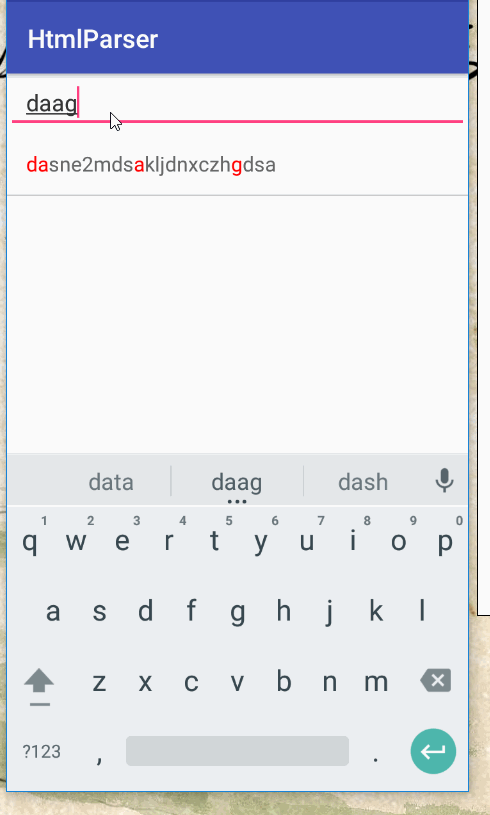

## Span使用之利用系统Span样式实现模糊搜索,匹配变色的特殊UI效果

在上一篇博客中，演示了基本的`Span`的使用，实现了对于字体的放大，缩小，变色等等。而这篇博客便是对于上一篇博客所讲解的东西加以利用。如果对于上一篇博客不是很清楚的，请点击如下链接：

- [Span使用之系统提供的Span基本样式](http://blog.csdn.net/lisdye2/article/details/70233565)
- Span使用之利用系统Span样式实现模糊搜索,匹配变色的特殊UI效果
- Span使用之利用自定义Span解析Html中特殊标签实现类似微博@效果

关于`Span`的讲解分为三篇，该篇是第二篇，实现模糊搜索+匹配变色。


### 实现效果

首先看一下实现的最终效果。




主要流程如下

- 编写xml文件，最上面为`EditText`，下面为`RecyclerView`。
- 初始化`RecyclerView`和初始化数据。
- 监听`EditText`数据的变化。
- 当`EditText`数据变化时，进行匹配搜素，并保存匹配的数据，同时保存匹配的字符位置。
- 在`Adapter`中绑定数据时，动态修改字符串匹配索引的颜色。

从上面的流程中，实现的难点在于

- 如何匹配数据和保存匹配索引值。
- 如何实现匹配字符的变色(利用`Span`)

### 基本骨架

看一下基本的布局文件`activity_search.xml`文件

```xml
<?xml version="1.0" encoding="utf-8"?>
<LinearLayout xmlns:android="http://schemas.android.com/apk/res/android"
    android:orientation="vertical" android:layout_width="match_parent"
    android:layout_height="match_parent">
    <EditText
        android:paddingLeft="15dp"
        android:id="@+id/search_et"
        android:hint="请输入要搜索的内容"
        android:textSize="18sp"
        android:textColor="#333"
        android:layout_width="match_parent"
        android:layout_height="wrap_content" />
    <android.support.v7.widget.RecyclerView
        android:id="@+id/recycler"
        android:layout_width="match_parent"
        android:layout_height="match_parent"/>
</LinearLayout>

```

以及`RecyclerView`的item的布局文件`item_search_list.xml`

```xml 
<?xml version="1.0" encoding="utf-8"?>
<RelativeLayout xmlns:android="http://schemas.android.com/apk/res/android"
    android:layout_width="match_parent"
    android:layout_height="50dp"
    android:background="#fff">
    <TextView
        android:id="@+id/title"
        android:textSize="16sp"
        android:layout_width="match_parent"
        android:layout_height="50dp"
        android:gravity="center_vertical"
        android:paddingLeft="15dp"
        android:text="的萨达四大四"
        android:textColor="#666" />
    <View
        android:layout_width="match_parent"
        android:layout_height="1dp"
        android:layout_alignParentBottom="true"
        android:background="#ccc" />
</RelativeLayout>

```

如上的两个文件，然后便是java代码文件。注意在这里只是实现了基本骨架

```java

public class SearchActivity extends AppCompatActivity implements TextWatcher {

    private EditText mSearchEt;
    private RecyclerView mRecycler;
    private MyAdapter mAdapter;
	// 关键字段
    private List<String> mData = new ArrayList<>();
    private List<String> mFilterData = new ArrayList<>();
    private List<HashMap<Integer, Integer>> mFilterColorIndexList = new ArrayList<>();

    @Override
    protected void onCreate(@Nullable Bundle savedInstanceState) {
        super.onCreate(savedInstanceState);
        setContentView(R.layout.activity_search);
		// 初始化recycler
        mRecycler = (RecyclerView) findViewById(R.id.recycler);
        initData();
        LinearLayoutManager manager = new LinearLayoutManager(this);
        manager.setOrientation(LinearLayoutManager.VERTICAL);
        mRecycler.setLayoutManager(manager);
        mAdapter = new MyAdapter();
        mRecycler.setAdapter(mAdapter);
		// 初始化editText并添加监听
        mSearchEt = (EditText) findViewById(R.id.search_et);
        mSearchEt.addTextChangedListener(this);
    }

    // 初始化原始数据
    public void initData() {
        mData.add("dasdsa3123dsalkjpiincz");
        mData.add("czxndoqiewnzxczouie2");
        mData.add("dasne2mdsakljdnxczhgdsa");
        mData.add("daskjhewqbmcxzugudwehjc");
        mData.add("ggyiqbckxzjhueqwwbnmczxhiuhda");
        mData.add("das8nc8unzoijeqwbchuz");
        mFilterData.addAll(mData);
    }
    
    @Override
    public void afterTextChanged(Editable editable) {
        // 搜索匹配的关键方法
        filter(editable.toString());
    }

    class MyAdapter extends RecyclerView.Adapter<MyAdapter.MyViewHolder> {
        @Override
        public MyViewHolder onCreateViewHolder(ViewGroup parent, int viewType) {
            View view = LayoutInflater.from(getApplicationContext()).inflate(R.layout.item_search_list, parent, false);
            return new MyViewHolder(view);
        }

        @Override
        public void onBindViewHolder(MyViewHolder holder, int position) {
            String title = mFilterData.get(position);
            SpannableString spannableString = new SpannableString(title);
           	// .... 关键实现，实现变色逻辑
            holder.title.setText(spannableString);
        }

        @Override
        public int getItemCount() {
            return mFilterData.size();
        }

        class MyViewHolder extends RecyclerView.ViewHolder {
            TextView title;

            public MyViewHolder(View itemView) {
                super(itemView);
                title = (TextView) itemView.findViewById(R.id.title);
            }
        }
    }

    @Override
    public void beforeTextChanged(CharSequence charSequence, int i, int i1, int i2) {}

    @Override
    public void onTextChanged(CharSequence charSequence, int i, int i1, int i2) {}
}

```

整个骨架实现了基本的`RecyclerView`初始化以及原始数据的初始化。

其中有三个关键的字段，需要解释一下

- `mData`: 原始数据，该数据只做搜索，不做显示。
- `mFilterData`: 搜索后的数据，该数据用于显示。
- `mFilterColorIndexList`: 保存匹配的位置索引，其外层为`List`，和`mFilterData`一一对应，同时一条匹配数据可能对应多个匹配的索引，所以其内用`Map`集合，对应的key和value代表索引的start和end。

在上面的代码中，其中`filer()`方法和变色逻辑并没有实现，他也是我们实现的重点。所以抽取出来，单独分析。


### 实现模糊搜索并保存匹配索引

看一下`filter()`方法的实现

```java
  /**
     * 过滤方法
     * @param str 输入的字符串
     */
    private void filter(String str) {
        mFilterData.clear();
        mFilterColorIndexList.clear();

        if (TextUtils.isEmpty(str)) {
            mFilterData.addAll(mData);
            mAdapter.notifyDataSetChanged();
            return;
        }
		// 过滤原始数据，进行实际的匹配
        for (String search : mData) {
            if (isConformSplitFilter(str, search, mFilterColorIndexList)) {
                mFilterData.add(search);
            }
        }
        mAdapter.notifyDataSetChanged();
    }
```

整个方法，分为三个部分：

- 首先对数据做初始化操作，清空两个集合中的数据。
- 判断过滤的字符串是否为空，如果是，则将所有数据添加，并返回。
- 如果不为空，则对原始数据进行遍历，并判断是否匹配。

在对原始数据进行遍历时，关键方法便是`isConformSplitFilter()`,看一下他的实现。

```java
/**
     * 是否符合匹配
     *
     * @param filter 过滤条件
     * @param source 原始数据
     * @param filterColorIndexList 保存匹配索引的集合
     * @return true表示符合过滤条件
     */
    public static boolean isConformSplitFilter(String filter, String source, List<HashMap<Integer, Integer>> filterColorIndexList) {
        // 分割字符串
        char[] ss = filter.toLowerCase().replaceAll("\\s+", "").toCharArray();
        source = source.toLowerCase();
        int[] colorIndex = new int[ss.length];
        // 标志位
        boolean find = true;
        int count = 0;
        // 循环过滤条件
        for (int i = 0; i < ss.length; i++) {
            char c = ss[i];
            // 查找是否有匹配字符
            int index = source.indexOf(c);
            if (index >= 0) {
                // 如果匹配上了，保存索引，并截取，然后继续循环
                count += index;
                colorIndex[i] = count;
                source = source.substring(index + 1, source.length());
                count++;
            } else {
                find = false;
                break;
            }
        }
        // 如果查找到，切索引集合不为空，则保存索引到集合中
        if (find && filterColorIndexList != null) {
            HashMap<Integer, Integer> map = new HashMap<>();
            for (int index : colorIndex) {
                map.put(index, index + 1);
            }
            filterColorIndexList.add(map);
        }
        return find;
    }

```

对于该方法，整个流程总结如下：

- 将过滤条件转化为字符数组然后遍历。
- 如果在原始数据中有匹配的字符，则记录匹配的字符索引，并从该索引截取字符串，然后开始下一个循环。直到所有过滤条件都已经匹配完毕。如果某一个无法匹配，直接返回false。
- 如果对于字符数组中的所有都能匹配，则将记录的索引存入到集合中，然后返回true。


### 实现变色

到这里，骨架，匹配，存储索引等都已经完毕，可以说万事具备，只差显示。那么看一下`Adapter`中绑定数据的实现。

```java
  @Override
        public void onBindViewHolder(MyViewHolder holder, int position) {
            String title = mFilterData.get(position);
            // 构造span对象
            SpannableString spannableString = new SpannableString(title);
            // 判断条件是为了防止过滤条件为空时的数组越界问题
            if (mFilterColorIndexList.size() > 0) {
                // 获取对应List数据的索引Map集合然后遍历
                HashMap<Integer, Integer> colorMap = mFilterColorIndexList.get(position);
                for (Map.Entry<Integer, Integer> entry : colorMap.entrySet()) {
                    int start = entry.getKey();
                    int end = entry.getValue();
                    // 设置变色
                    spannableString.setSpan(new ForegroundColorSpan(Color.RED), start, end, Spanned.SPAN_EXCLUSIVE_EXCLUSIVE);
                }
            }
            holder.title.setText(spannableString);
        }

```

总的来说就是获取索引，利用`Span`设置文字变为红色即可。


### 源码地址

具体的源码细节已经上传到github上，欢迎访问[https://github.com/AlexSmille/HtmlParser](https://github.com/AlexSmille/HtmlParser)

