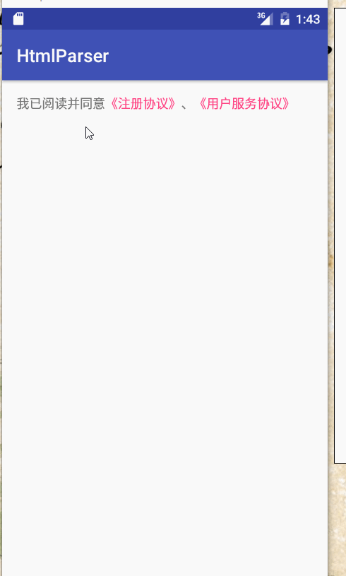

## Span使用之利用自定义Span解析Html中特殊标签实现类似微博@效果

在前两篇博客中，讲解了系统已经定义好的`Span`，并且怎么利用系统的`span`实现一些特殊的效果。本篇博客将是这一系列的最后一篇。

- [Span使用之系统提供的Span基本样式](http://blog.csdn.net/lisdye2/article/details/70233565)
- [Span使用之利用系统Span样式实现模糊搜索,匹配变色的特殊UI效果](http://blog.csdn.net/lisdye2/article/details/75269135)
- Span使用之利用自定义Span解析Html中特殊标签实现类似微博@效果


### 实现效果



分析一下实现效果，就是一长串文字，部分文字根据我们的要求变色，并且可以点击。点击的内容有我们定义。
本篇博客的实现和系统的`UrlSpan`实现类似。

而对于微博的`@`的效果，和该实现流程几乎一致。看完你就明白了。


### 原理分析

系统提供的`Span`中有一个`ClickableSpan`，不过他是一个抽象类，需要我们实现`onClick`方法，并且他也提供了修改颜色方法，我们只需要实现这个类即可。并且通过第一篇博客中的讲解，将他设置到对应文本索引上就可以了。

如上所述确实可以实现，不过对于一个文本，如果有多个地方，那么需要我们设置多个`ClickableSpan`，这很不利于使用。假如实现微博的`@`功能，多个`@`并且数据可能是后台返回，如果我们一一的拼接，并没有提供多大的便利。

这时候我们需要用到一些其他方面的知识。关于`TextView`我们可以放入一个`Html`格式的文本，他会自动解析，而本章的关键便在于`HTML`，我们自定义一个标签，类似于`<a>`标签一样，让标签中的内容可以点击。

根据如上所述，整个流程实现如下：

- 定义自定义标签和编写HTML
- 设置HTML到`TextView`上。
- 解析`Html`文本并获取到自定义标签。
- 自定义类实现`ClickableSpan`。
- 将解析的自定义标签中的内容设置自定义的`Span`

### 实现

#### 定义自定义标签和编写HTML

首先看一下编写的`HTML`文本

```
 我已阅读并同意<app_a href="https://www.baidu.com" show_underline=false >《注册协议》</app_a>、<app_a href="https://www.baidu.com" show_underline=false >《用户服务协议》</app_a>
   
```


在这里，我们定义`<app_a>`标签作为特殊标签，当解析到该标签的时候表示其要作为特殊处理，设置点击事。

同时对于`<app_a>`标签添加了自定义属性，`href`和`show_underline`。

将这一段文本写到`string.xml`文件中，因为`Html`中也会有标签，可能会和`xml`冲突，所以我们需要添上相关的标识。

```xml 
	<string name="tag_html">
        <![CDATA[
        我已阅读并同意<app_a href="https://www.baidu.com" show_underline=false >《注册协议》</app_a>、<app_a href="https://www.baidu.com" show_underline=false >《用户服务协议》</app_a>
        ]]>
    </string>

```

#### 设置HTML到`TextView`上。

```java 
  @Override
    protected void onCreate(Bundle savedInstanceState) {
        super.onCreate(savedInstanceState);
        setContentView(R.layout.activity_main);
        mText = ((TextView) findViewById(R.id.text));
		// 使点击实现可以传递到我们定义的`span`上
        mText.setMovementMethod(LinkMovementMethod.getInstance());
		// 设置文本
        mText.setText(fromHtml(getString(R.string.tag_html)));

    }
	// 解析html
    public static Spanned fromHtml(String html) {
        if (Build.VERSION.SDK_INT >= Build.VERSION_CODES.N) {
            return Html.fromHtml(html, Html.FROM_HTML_MODE_COMPACT, null, new HtmlParser(new LinkHandler()));
        } else {
            return Html.fromHtml(html, null, new HtmlParser(new LinkHandler()));
        }
    }

```
关键方法在于`Html.from()`，该方法能够实现将`html`转化为`spanned`。同时他能够传入一个解析器，实现自定义解析。因为要解析自定义标签，所以我们要传入一个自定义解析器。

> `Html.from()`是系统提供的方法，而`HtmlParser`，`LinkHandler`使我们实现的类。


#### 解析`Html`文本并获取到自定义标签

看一下`HtmlParser`的实现

```java
public class HtmlParser implements Html.TagHandler, ContentHandler {
	// ...
}
```

实现了两个接口，其中`tagHandler`是实现解析器必须实现的接口，他其中定义了一个方法

```java
  public interface TagHandler {
        void handleTag(boolean opening, String tag, Editable output, XMLReader attributes);
    }

```
在解析的过程中，每遇到一个标签，都会回调这个方法，对于我们现在的文本，他的回调如下：

```
 03-20 14:24:26.392 9727-9727/com.spearbothy.htmlparser I/info: open:truetag:htmloutput:
 * 03-20 14:24:26.392 9727-9727/com.spearbothy.htmlparser I/info: open:truetag:bodyoutput:
 * 03-20 14:24:26.392 9727-9727/com.spearbothy.htmlparser I/info: open:truetag:app_aoutput:我已阅读并同意
 * 03-20 14:24:26.392 9727-9727/com.spearbothy.htmlparser I/info: open:falsetag:app_aoutput:我已阅读并同意《注册协议》
 * 03-20 14:24:26.392 9727-9727/com.spearbothy.htmlparser I/info: open:truetag:app_aoutput:我已阅读并同意《注册协议》、
 * 03-20 14:24:26.392 9727-9727/com.spearbothy.htmlparser I/info: open:falsetag:app_aoutput:我已阅读并同意《注册协议》、《用户服务协议》
 * 03-20 14:24:26.392 9727-9727/com.spearbothy.htmlparser I/info: open:falsetag:bodyoutput:我已阅读并同意《注册协议》、《用户服务协议》
 * 03-20 14:24:26.392 9727-9727/com.spearbothy.htmlparser I/info: open:falsetag:htmloutput:我已阅读并同意《注册协议》、《用户服务协议》

```

再看第二个接口，他是一个解析处理类，因为对于`TagHandler`的回调，，没有明显的区分开闭标签，都在一个方法中回调，而`ContentHandler`能够区分开闭标签进行回调。他里面有两个最重要的方法

```java

public void startElement(String uri, String localName, String qName, Attributes atts) 

public void endElement(String uri, String localName, String qName)
```

那么看一下流程开始`handleTag()`的实现。并且一些相关字段：

```java
     // 处理我们自定义标签的类
    private final TagHandler mHandler;
    // 系统的解析器
    private ContentHandler mWrapperContentHandler;
    // 解析的文本那内容
    private Editable mOutput;
    // 保存我们解析标签的状态
    private ArrayDeque<Boolean> mTagStatus = new ArrayDeque<>();

  @Override
    public void handleTag(boolean opening, String tag, Editable output, XMLReader xmlReader) {
        if (mWrapperContentHandler == null) {
            mOutput = output;
            // 保存系统的解析器处理
            mWrapperContentHandler = xmlReader.getContentHandler();
            // 设置当前类处理系统标签
            xmlReader.setContentHandler(this);
            // 记录当前标签是否处理
            mTagStatus.addLast(Boolean.FALSE);
        }
    }

```

整个方法的流程如下：

- 保存文本的输出，以便获取文本
- 获取系统的默认解析文本的处理器，放入我们自己的标签处理器，就是当前类，该类实现了`ContentHandler`
- 保存当前标签是否处理。true表示当前是自定义标签。false不是当前自定义标签。

在这里有必要说一下`mTagStatus`,他是一个队列，因为标签都是一一对应，有一个开就有一个闭，那么我们在标签开始的时候添加是否处理，在标签结束的时候获取这个索引，就只到是否需要处理了。

然后看一下实现`ContentHandler`中的方法的处理流程

```java

  @Override
    public void startElement(String uri, String localName, String qName, Attributes atts) throws SAXException {
        Log.i("info", "start:--" + "uri:" + uri + " localName:" + localName + " qName:" + qName);
		// 判断当前是否是需要处理的自定义标签的类
        boolean isHandled = mHandler.handleTag(true, localName, mOutput, atts);
        mTagStatus.addLast(isHandled);
		// 如果不是，交由系统处理
        if (!isHandled)
            mWrapperContentHandler.startElement(uri, localName, qName, atts);
    }

    @Override
    public void endElement(String uri, String localName, String qName) throws SAXException {
        Log.i("info", "end:--" + "uri:" + uri + " localName:" + localName + " qName:" + qName);
		// 获取状态，判断是否自定义需要处理
        if (!mTagStatus.removeLast()) {
            mWrapperContentHandler.endElement(uri, localName, qName);
        } else {
            mHandler.handleTag(false, localName, mOutput, null);
        }
    }
```

在这里有必要强调一点，对于开闭标签，我们的逻辑应该是这样的：在标签开始时，打上标记，在标签结束时，处理相关逻辑，因为只有在结束标签，我们才能知道文本的长短。

在代码中有一个`mHandler`，该类是我们自己编写的类，如果你有印象的话，在解析`Html`时，我们传入了一个`Handler`

```java 
// LinkHandler
Html.fromHtml(html, Html.FROM_HTML_MODE_COMPACT, null, new HtmlParser(new LinkHandler()));

```

我们在`HtmlParser`中定义一个接口，然后具体的自定义逻辑交给`LinkHandler`实现。


```java
public class HtmlParser implements Html.TagHandler, ContentHandler {

	public interface TagHandler {
        boolean handleTag(boolean opening, String tag, Editable output, Attributes attributes);
    }
}

```

> 此时一定要将我们自定义的`TagHandler`和系统的区分开


看一下`LinkHandler`的实现

```java
public class LinkHandler implements HtmlParser.TagHandler {

    @Override
    public boolean handleTag(boolean opening, String tag, Editable output, Attributes attributes) {
        if (tag.equalsIgnoreCase("app_a")) {
            if (opening) {
                // 开始标签，获取对应值
                String href = attributes.getValue("href");
                String showUnderline = attributes.getValue("show_underline");
                if (TextUtils.isEmpty(showUnderline)) {
                    showUnderline = "true";
                }
                // 构造标签实体，用以保存数据
                LinkTagAttribute entity = new LinkTagAttribute();
                entity.setHref(href);
                entity.setShowUnderline(Boolean.parseBoolean(showUnderline));
                // 将解析的数据实体暂时保存到文本上 (打标记)
                output.setSpan(entity, output.length(), output.length(), Spanned.SPAN_INCLUSIVE_EXCLUSIVE);
            } else {
                // 获取之前保存的标记
                LinkTagAttribute entity = getLast(output, LinkTagAttribute.class);
                if (entity != null) {
                    // 获取开始标签的位置索引
                    int start = output.getSpanStart(entity);
                    // 移除之前的标记
                    output.removeSpan(entity);
                    int end = output.length();
                    if (start != end){
                        // 设置自定义的Span
                        output.setSpan(new AppUrlSpan(entity),start,end,Spanned.SPAN_EXCLUSIVE_EXCLUSIVE);
                    }
                }
            }
            return true;
        }
        return false;
    }
}

```
该处理的方法中分为两部分，开始标签和闭合标签。

开始标签的时候，获取到标签以及其自定义属性保存到实体中，同时`Editable`提供将实体作为标记打入文本上，类似于`View.setTag()`方法一样。

然后在闭合标签的时候，获取之前打的标记，然后根据标记的内容设置生成`Span`并设置。

看一下自定义属性实体`LinkTagAttribute`

```java


public class LinkTagAttribute implements Parcelable {

    private String href;
    private boolean isShowUnderline;

    @Override
    public int describeContents() {
        return 0;
    }

    @Override
    public void writeToParcel(Parcel dest, int flags) {
        dest.writeString(this.href);
        dest.writeByte(isShowUnderline ? (byte) 1 : (byte) 0);
    }

    protected LinkTagAttribute(Parcel in) {
        this.href = in.readString();
        this.isShowUnderline = in.readByte() != 0;
    }

    public static final Creator<LinkTagAttribute> CREATOR = new Creator<LinkTagAttribute>() {
        @Override
        public LinkTagAttribute createFromParcel(Parcel source) {
            return new LinkTagAttribute(source);
        }

        @Override
        public LinkTagAttribute[] newArray(int size) {
            return new LinkTagAttribute[0];
        }
    };

    public LinkTagAttribute() {
    }

	//.....
}
```


#### 自定义类实现`ClickableSpan`

该类的实现就比较简单了

```java
public class AppUrlSpan extends ClickableSpan implements ParcelableSpan {
    private static final int APP_URL_SPAN = 100000;
    private LinkTagAttribute entity;
	// .... 
   
    @Override
    public void onClick(View widget) {
        // 点击事件，简单的弹出提示
        Log.i("info", "click");
        Toast.makeText(widget.getContext(), entity.getHref() + "", Toast.LENGTH_SHORT).show();
    }

    @Override
    public int getSpanTypeId() {
		// 类型标识
        return APP_URL_SPAN;
    }
    @Override
    public void updateDrawState(TextPaint ds) {
        super.updateDrawState(ds);
		// 修改文本的状态
        ds.bgColor = Color.TRANSPARENT;
        ds.setUnderlineText(entity.isShowUnderline());
    }
}

```

#### 将解析的自定义标签中的内容设置自定义的`Span`

最后一步，该步骤的代码在第三步的时候就已经贴出。

在解析到结束标签是的代码如下

```java
 			// 获取之前保存的标记
                LinkTagAttribute entity = getLast(output, LinkTagAttribute.class);
                if (entity != null) {
                    // 获取开始标签的位置索引
                    int start = output.getSpanStart(entity);
                    // 移除之前的标记
                    output.removeSpan(entity);
                    int end = output.length();
                    if (start != end){
                        // 设置自定义的Span
                        output.setSpan(new AppUrlSpan(entity),start,end,Spanned.SPAN_EXCLUSIVE_EXCLUSIVE);
                    }
                }

```

获取标记，打上`Span`。

### 源码地址

具体的源码细节已经上传到github上，欢迎访问[https://github.com/AlexSmille/HtmlParser](https://github.com/AlexSmille/HtmlParser)


