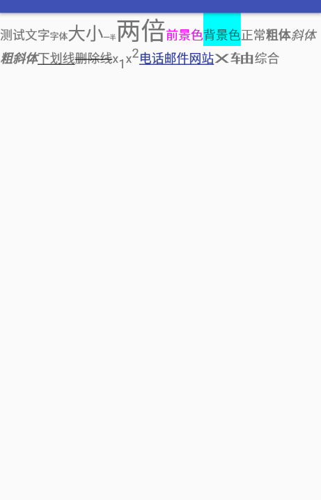

### Span的应用

在`Android`中，使用`TextView`显示文本，但往往有一些特殊的文本样式，比如一段文本，中间某几个字颜色不同或者中间某几个字能点击等等，这些样式如果没有不同，就编写一个新的`TextView`，那么一段文字将使用很多的`TextView`去显示，那么，有没有可能使用一个`TextView`显示所有文字，而基于文字定义不同的样式呢。这就是`Span`的作用。

### Span使用三部曲

`Span`是`android`提供的用于操作文本的样式的相关类。他能够精确地控制一段文本中具体某些文本的样式。基于`Span`将分为三遍博客去描述

- [Span使用之系统提供的Span基本样式]()
- Span使用之利用系统Span样式实现模糊搜索,匹配变色的特殊UI效果
- Span使用之利用自定义Span解析Html中特殊标签实现类似微博@效果


### 系统Span的基本使用


首先，看一下我们要实现的效果，该效果网上的例子很多，本篇博客也是基于网上的例子编写的。



如上效果，如果每一个特殊效果都是一个`TextView`，那么将编写很多的`TextView`，下面我们就开始利用`Span`实现如上效果。

编写`SpannerTestActivity`如下：

```java 
public class SpannerTestActivity extends AppCompatActivity {

    private TextView mText;

    @Override
    protected void onCreate(@Nullable Bundle savedInstanceState) {
        super.onCreate(savedInstanceState);
        setContentView(R.layout.activity_spanner);
        mText = ((TextView) findViewById(R.id.text));
		// testSpanned()便是基于文本定义的样式
        mText.setText(testSpanned());
    }
}

```

关键方法便是`testSpanned()`方法，看一下实现

```
/**
     * 测试Spanned的样式
     *      关键方法setSpan(mark )，传入的第一个参数表示对字符串的处理
     *      CharacterStyle类是所有处理类的父类，其定义了一系列处理的Span子类
     */
    public Spanned testSpanned() {
        SpannableString spanned = new SpannableString("测试文字字体大小一半两倍前景色背景色正常粗体斜体粗斜体下划线删除线x1x2电话邮件网站X轴综合");
     	// ......省略
        return spanned;
    }

```

构造`SpannableString`对象，并返回。

`SpannableString`和`String`对象类似，同样可以作为文本设置到	`setText()`上，不过`SpannableString`可以通过`setSpan()`向文本上设置一些特殊样式。

`setSpan()`具体声明为`setSpan(Object what, int start, int end, int flags)`包含四个参数，参数分别为

- `what`：设置的样式。
- `start`:设置样式的文本开始索引。
- `end`：设置样式的文本结束索引。
- `flags` :指定样式的范围，当本文发生变化时，是否将样式应用到新增加的文本上。

看完声明，其实关键点便是`what`的类型，但参数声明上是`object`，那么`what`可以传入哪些值呢？

系统为我们提供了一些`what`的值，他们是`CharacterStyle`及其子类，下面将列举一些：

在上面的代码中，我们省略了设置样式的相关代码，具体代码如下：

```java

 		// 设置字体(default,default-bold,monospace,serif,sans-serif)
        spanned.setSpan(new TypefaceSpan("monospace"), 0, 2, Spanned.SPAN_EXCLUSIVE_EXCLUSIVE);
        spanned.setSpan(new TypefaceSpan("serif"), 2, 4, Spanned.SPAN_EXCLUSIVE_EXCLUSIVE);

        // 设置字体大小，第二个参数表示是否是dp值，默认是px
        spanned.setSpan(new AbsoluteSizeSpan(20), 4, 6, Spanned.SPAN_EXCLUSIVE_EXCLUSIVE);
        spanned.setSpan(new AbsoluteSizeSpan(20, true), 6, 8, Spanned.SPAN_EXCLUSIVE_EXCLUSIVE);

        // 相对大小 相对于默认字体的倍数
        spanned.setSpan(new RelativeSizeSpan(0.5f), 8, 10, Spanned.SPAN_EXCLUSIVE_EXCLUSIVE);
        spanned.setSpan(new RelativeSizeSpan(2f), 10, 12, Spanned.SPAN_EXCLUSIVE_EXCLUSIVE);
        // 设置字体的前景色 Magenta紫红
        spanned.setSpan(new ForegroundColorSpan(Color.MAGENTA), 12, 15, Spanned.SPAN_EXCLUSIVE_EXCLUSIVE);
        // 设置字体的背景色
        spanned.setSpan(new BackgroundColorSpan(Color.CYAN), 15, 18, Spanned.SPAN_EXCLUSIVE_EXCLUSIVE);
        // 设置字体的样式
        spanned.setSpan(new StyleSpan(Typeface.NORMAL), 18, 20, Spanned.SPAN_EXCLUSIVE_EXCLUSIVE);
        spanned.setSpan(new StyleSpan(Typeface.BOLD), 20, 22, Spanned.SPAN_EXCLUSIVE_EXCLUSIVE);
        spanned.setSpan(new StyleSpan(Typeface.ITALIC), 22, 24, Spanned.SPAN_EXCLUSIVE_EXCLUSIVE);
        spanned.setSpan(new StyleSpan(Typeface.BOLD_ITALIC), 24, 27, Spanned.SPAN_EXCLUSIVE_EXCLUSIVE);
        // 设置下划线
        spanned.setSpan(new UnderlineSpan(), 27, 30, Spanned.SPAN_EXCLUSIVE_EXCLUSIVE);
        // 设置删除线
        spanned.setSpan(new StrikethroughSpan(), 30, 33, Spanned.SPAN_EXCLUSIVE_EXCLUSIVE);
        // 设置下标
        spanned.setSpan(new SubscriptSpan(), 34, 35, Spanned.SPAN_EXCLUSIVE_EXCLUSIVE);
        // 设置上标
        spanned.setSpan(new SuperscriptSpan(), 36, 37, Spanned.SPAN_EXCLUSIVE_EXCLUSIVE);
        // 设置链接
        spanned.setSpan(new URLSpan("tel:1234556"), 37, 39, Spanned.SPAN_EXCLUSIVE_EXCLUSIVE);
        spanned.setSpan(new URLSpan("mailto:zziamhao@163.com"), 39, 41, Spanned.SPAN_EXCLUSIVE_EXCLUSIVE);
        spanned.setSpan(new URLSpan("http://www.baidu.com"), 41, 43, Spanned.SPAN_EXCLUSIVE_EXCLUSIVE);
        // 设置宽度的缩放，高度不变
        spanned.setSpan(new ScaleXSpan(2.0f), 43, 45, Spanned.SPAN_EXCLUSIVE_EXCLUSIVE);

```

将上面所有的代码组合到一起，便是实现了开始的那一段文字的效果。


细节不在讲述，提两个关键点。

首先是索引`start`和`end`，记住**顾前不顾后**即可。

其次是`flags`，当文本变化时，对应索引是否应用样式，上面传入的都是同一种，可以传入如下几种，

- Spanned.SPAN_EXCLUSIVE_EXCLUSIVE 前后都不包括
- Spanned.SPAN_INCLUSIVE_EXCLUSIVE 前面包括，后面不包括
- Spanned.SPAN_EXCLUSIVE_INCLUSIVE 后面包括，前面不包括
- Spanned.SPAN_INCLUSIVE_INCLUSIVE 前后都包括

这个地方，很多人可能会有疑问，这里不再多做解释，可以将上面的`TextView`改变为`EditText`，手动修改一些文本看一下变化就一目了然了。


