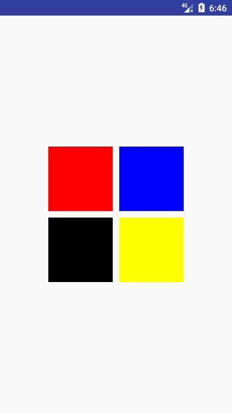

## Activity 过渡动画

### 基本介绍

在Android 5.0 （21）时，对于`window`添加了四个方法，分别如下

- `setEnterTransition`
- `setReenterTransition`
- `setExitTransition`
- `setReturnTransition`

该方法对应`window`的进入离开状态的过渡效果的设置。

对于 A - > B，他们对应的状态：

- 当A打开B时，A：exit , B : enter
- 当B退出，返回到A时， A : reenter , B:return 

从方法的命名上可以看出，该过渡效果的实现借助于`Transition`的相关方法。

### 简单的过渡效果

#### 使用代码方式实现

**设置Activity可以使用过渡动画**
```
getWindow().requestFeature(Window.FEATURE_CONTENT_TRANSITIONS);
```

**加载过渡动画**
```java
  Transition explode = TransitionInflater.from(this).inflateTransition(R.transition.explode);
```

**根据需求，调用上面列举的四个方法**

**替换`startActivity()`方法**

跳转页面时，需要传入当前页面场景状态，所以需要调用如下方法

```java
 startActivity(mIntent, ActivityOptions.makeSceneTransitionAnimation(this).toBundle());
```

#### `XML`实现方式

**设置Activity可以使用过渡动画**
```xml
 <item name="android:windowContentTransitions">true</item>
```
**设置切换的过渡动画**

```xml 
 <item name="android:windowReturnTransition">@transition/explode</item>
 <item name="android:windowExitTransition">@transition/explode</item>
 <item name="android:windowEnterAnimation">@transition/explode</item>
 <item name="android:windowReenterTransition">@transition/explode</item>
```

**替换`startActivity()`方法,同代码设置相同**

### 共享元素过渡动画

根据`Transition`的相关使用，重要的便是开始与结束场景。

在`Activity`中，创建初始场景是通过`ActivityOptions.makeSceneTransitionAnimation()`。

该方法有重载方法如下

```java
makeSceneTransitionAnimation(Activity activity,
            Pair<View, String>... sharedElements)
```
可以通过第二个可变参数传入需要两个`activity`共享的元素。

具体使用方法如下：

```java 
  ActivityOptions transitionActivityOptions = ActivityOptions.makeSceneTransitionAnimation(this
                        , Pair.create(findViewById(R.id.img_share), "share")
                        , Pair.create(findViewById(R.id.tv_share), "share_text"));
```

创建`Pair`对象时，两个参数分别为需要`share`的控件对象和`transitionName`,其中`transitionName`的如下：

```xml 
  <ImageView
                android:id="@+id/img_explode_share"
                android:layout_width="wrap_content"
                android:layout_height="wrap_content"
                android:layout_gravity="center_vertical"
                android:background="@drawable/circle_red"
                android:transitionName="share" />
```

### 列表形式添加共享元素过渡

实现效果如下：



实现流程分析：

- 列表页面，设置`transitionName`,并通过`startActivity(intent,options)`的方式启动`Activity`.
- 详情页面，构造`ViewPager`和`Adapter`。
- `Adapter`中，对应的每一个`View`设置对应的`transitionName`
- `重点：`：当滑动`ViewPager`时，修改共享元素信息。

只看具体的`java`代码，首先列表页面，使用简单的布局代替了

```java 
public class ShareElementViewPagerActivity extends AppCompatActivity implements View.OnClickListener {

    private GridLayout mRootView;

    private String[] mColors = {"#ff0000", "#0000ff", "#000000", "#ffff00"};

    @Override
    protected void onCreate(@Nullable Bundle savedInstanceState) {
        super.onCreate(savedInstanceState);
        setContentView(R.layout.activity_transition_example);
        mRootView = (GridLayout) findViewById(R.id.root_view);

        for (int i = 0; i < mRootView.getChildCount(); i++) {
            View view = mRootView.getChildAt(i);
            view.setBackgroundColor(Color.parseColor(mColors[i]));
            // 设置transitionName属性
            ViewCompat.setTransitionName(view, "color_" + i);
            view.setTag(i);
            view.setOnClickListener(this);
        }
    }

    @Override
    public void onClick(View v) {
        Intent intent = new Intent(this, ShareElementViewPager2Activity.class);
        // 指定启动`viewPager`的索引
        intent.putExtra("index", (Integer) v.getTag());
        // 启动activity
        startActivity(intent,
                ActivityOptions.makeSceneTransitionAnimation(this, v, v.getTransitionName()).toBundle()
        );
    
```

在这里的关键`  ViewCompat.setTransitionName(view, "color_" + i);`设置`transitionName`。

`  view.setTag(i);`指定点击`View`的索引，便于跳转传参。

最后通过

```java 
startActivity(intent,
                ActivityOptions.makeSceneTransitionAnimation(this, v, v.getTransitionName()).toBundle()
        );
```
跳转页面。


**列表详情页面**

初始化操作相关代码

```java 

    @Override
    protected void onCreate(@Nullable Bundle savedInstanceState) {
        super.onCreate(savedInstanceState);
        setContentView(R.layout.activity_share_elements_viewpager);
        // 查找控件
        mViewPager = (ViewPager) findViewById(R.id.viewpager);
        // 初始化显示的View集合
        initViews();
        // 初始化ViewPager
        MyAdapter adapter = new MyAdapter();
        mViewPager.setAdapter(adapter);
        int index = getIntent().getIntExtra("index", 0);
        mViewPager.setCurrentItem(index, false);
        // ...
        }
        
         //初始化Views ，并设置transitionName
    public void initViews() {
        for (int i = 0; i < mColors.length; i++) {
            View view = new ImageView(this);
            ViewGroup.LayoutParams params = new ViewGroup.LayoutParams(ViewGroup.LayoutParams.MATCH_PARENT, ViewGroup.LayoutParams.MATCH_PARENT);
            view.setLayoutParams(params);
            view.setBackgroundColor(Color.parseColor(mColors[i]));
            ViewCompat.setTransitionName(view, "color_" + i);
            mImageViews.add(view);
        }
    }

```

基本上大致如此，但是会有一个问题，就是在打开详情页面时，有时会没有过渡动画。因为此时详情页面并没有加载完成就启动动画，导致启动动画时的结束场景记录不正确，导致无动画效果。所以要延时进入动画过渡效果的启动。

在`onCreate()`中添加两个方法

```java
// 延时启动共享动画
        postponeEnterTransition();
        // 当View加载完毕时，启动动画
        scheduleStartPostponedTransition(mImageViews.get(index));
```

`scheduleStartPostponedTransition`的对应实现如下

```java

   private void scheduleStartPostponedTransition(final View sharedElement) {
        sharedElement.getViewTreeObserver().addOnPreDrawListener(
                new ViewTreeObserver.OnPreDrawListener() {
                    @Override
                    public boolean onPreDraw() {
                        //移除监听
                        sharedElement.getViewTreeObserver().removeOnPreDrawListener(this);
                        // 启动进入动画
                        startPostponedEnterTransition();
                        return true;
                    }
                });
    }
```

这样解决了进入时没有过渡动画的效果。

但是，仍然有一个问题：当在`ViewPager`左右滑动再返回时，返回的的共享元素并没有及时更新，导致过渡动画不匹配。所以，当滑动`ViewPager`时，需要更新列表页面退出动画的共享元素和详情页面进入动画的共享元素信息。

首先列表页面修改如下

```java 
public class ShareElementViewPagerActivity extends AppCompatActivity implements View.OnClickListener {

    // .....

    private static int enter = 0; // 第二个页面进入时的共享元素

    public static int exit = 0; // 第二个页面退出的共享元素索引

    @Override
    protected void onCreate(@Nullable Bundle savedInstanceState) {
      	 // .....
        // 监听回调
        setExitSharedElementCallback(new SharedElementCallback() {
            @Override
            public void onMapSharedElements(List<String> names, Map<String, View> sharedElements) {
                // 该回调在列表页进入和退出时都会回调，所以需要加上判断条件
                if (exit != enter) {
                    // 更新共享元素
                    names.clear();
                    sharedElements.clear();
                    View view = mRootView.getChildAt(exit);
                    names.add(view.getTransitionName());
                    sharedElements.put(view.getTransitionName(), view);
                }
            }
        });
    }

    @Override
    public void onClick(View v) {
     	//....
        // 更新对应索引表
        exit = enter = (int) v.getTag();
     	//....
    }
}

```

在详情页面，当页面结束时，更新过渡元素的集合

```java
   @Override
    public void finishAfterTransition() {
        // 更新共享元素数据。设置对应回调  Api 21
        setSharedElementCallback(mImageViews.get(mViewPager.getCurrentItem()));
        super.finishAfterTransition();
    }

    private void setSharedElementCallback(final View view) {
        setEnterSharedElementCallback(new SharedElementCallback() {
            //  @Override
            public void onMapSharedElements(List names, Map sharedElements) {
                names.clear();
                sharedElements.clear();
                names.add(view.getTransitionName());
                sharedElements.put(view.getTransitionName(), view);
            }
        });
    }
```


### `Fragment`添加过渡动画

`Fragment`过渡动画和`Activity`过渡动画使用上基本相同，唯一的区别便是共享元素。

`Fragment`共享元素切换时，需要手动制定过渡效果的`Transition`。

```java 
    public void onClick(View view) {
                Slide slideTransition = new Slide(Gravity.LEFT);
                slideTransition.setDuration(1000L);
                sharedElementFragment2.setEnterTransition(slideTransition);
                // 声明共享元素过渡效果
                ChangeBounds changeBoundsTransition = new ChangeBounds();
                changeBoundsTransition.setDuration(1000L);
                // 设置过渡效果
                sharedElementFragment2.setSharedElementEnterTransition(changeBoundsTransition);
                // 切换fragment
                getFragmentManager().beginTransaction()
                        .replace(R.id.framelayout_container, sharedElementFragment2)
                        .addToBackStack(null)
                        // 添加共享元素
                        .addSharedElement(sharedView, "share")
                        .commit();
            }
```


