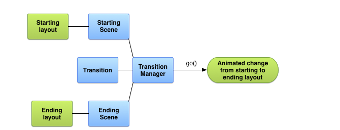
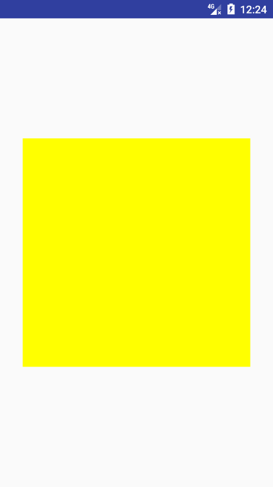

## `Transition` 

`Transition`:意“过渡”，从字面意思上理解，就是从一种状态到另一种状态的切换过程，同样，对于`Android`中，其实现了`UI`状态的切换，其中包含了同一个`Activity`不同`UI`视图的变换，同时也能够实现不同`Activity`的切换动画，最出名的可能就是共享元素动画了。

官网提供的原理如下

 

从流程图上可以看出，有关键类如下：

- `Scene`: 视图状态，定义开始和结束的状态。
- `Transtion`: 动画，对于初始状态和结束状态的过渡效果的定义。会遍历对应`Scene`下的每一个`View`
- `TransitionManager`：相应管理器，启动过渡效果。

### 简单的`Transition`动画

首先看一下实现的效果：


根据上面的原理图，我们可以按照如下思路实现效果。

-  构建初始场景（`Scene`）和结束场景（`Scene`）。
-  定义初始与结束场景的过渡动画效果（`Transition`）。
-  使用`TransitionMananger`启动相应动画效果。


实现代码如下：

#### 创建开始与结束场景
首先创建基本的布局文件`activity_scene.xml`文件

```xml 
<?xml version="1.0" encoding="utf-8"?>
<LinearLayout xmlns:android="http://schemas.android.com/apk/res/android"
    android:layout_width="match_parent"
    android:layout_height="match_parent"
    android:orientation="vertical"
    android:padding="16dp">
    <Button
        android:onClick="begin"
        android:layout_width="match_parent"
        android:layout_height="45dp"
        android:text="开始动画" />
    <!--这个View用来做动画的父布局-->
    <FrameLayout
        android:id="@+id/rootView"
        android:layout_width="match_parent"
        android:layout_height="wrap_content">
        <!--初始状态 -->
        <include layout="@layout/scene1"/>
    </FrameLayout>
</LinearLayout>

```

为了便于区分开始与结束状态的场景：将初始状态的场景抽出来为一单一的布局文件。
初始状态与结束状态的布局分别如下：
`scene1.xml`
```
<RelativeLayout xmlns:android="http://schemas.android.com/apk/res/android"
    android:layout_width="match_parent"
    android:layout_height="400dp">
    <ImageView
        android:id="@+id/image1"
        android:layout_width="150dp"
        android:layout_height="150dp"
        android:layout_centerInParent="true"
        android:src="@drawable/image1" />
    <ImageView
        android:id="@+id/image3"
        android:layout_width="150dp"
        android:layout_height="150dp"
        android:layout_alignParentLeft="true"
        android:layout_below="@id/image1"
        android:src="@drawable/image3" />
    <ImageView
        android:id="@+id/image2"
        android:layout_width="150dp"
        android:layout_height="150dp"
        android:layout_alignParentRight="true"
        android:layout_below="@id/image1"
        android:src="@drawable/image2" />
</RelativeLayout>
```
结束状态场景`scene2.xml`

```xml 
<RelativeLayout xmlns:android="http://schemas.android.com/apk/res/android"
    android:layout_width="match_parent"
    android:layout_height="400dp">
    <ImageView
        android:id="@+id/image3"
        android:layout_width="150dp"
        android:layout_height="150dp"
        android:layout_centerInParent="true"
        android:src="@drawable/image3" />
    <ImageView
        android:id="@+id/image2"
        android:layout_width="150dp"
        android:layout_height="150dp"
        android:layout_alignParentLeft="true"
        android:layout_below="@id/image3"
        android:src="@drawable/image2" />
    <ImageView
        android:id="@+id/image1"
        android:layout_width="150dp"
        android:layout_height="150dp"
        android:layout_alignParentRight="true"
        android:layout_below="@id/image3"
        android:alpha="20"
        android:src="@drawable/image1" />
</RelativeLayout>
```
通过代码可以看到，不同点在于两次场景的子控件的布局文件不同。把三个`ImageView`调换了一下位置。

相应的布局文件创建完了，那么如何通过布局文件创建具体的`Scene`类呢？

由于初始状态已经默认加载到布局中，所以我们只需要关心结束状态的场景即可，使用如下方法

`Scene.getSceneForLayout(ViewGroup sceneRoot, int layoutId, Context context) `即可通过布局加载场景。

- `sceneRoot`：对应的布局需要加入到那个父控件下
- `layoutId`：当前场景的布局id。
- `context`: 上下文。

场景创建如下

`Scene scene2 = Scene.getSceneForLayout(rootView, R.layout.scene2, this);`

#### 定义过渡动画

对于过渡动画效果，`Android`默认提供了一些基本的实现类

-  `ChangeBounds`: 布局位置改变的过渡效果
-  `Visibility` ： 布局显示隐藏的相关过渡效果。

在这里，初始与结束场景只是改变了控件的位置，我们使用`ChangeBounds`即可。

#### 启动动画

```
TransitionManager.go(scene2, new ChangeBounds());
```

#### 分析

对于上面的变化效果：可能会有如下疑问：

-  怎么确定那些控件需要变化。

-  动画效果是怎么实现的。

-  结束场景是什么时候加载到视图中的

对于`Transition`,他会比对开始场景与结束场景的不同，遍历场景下的每一个`View`，如何确定开始与结束场景是同一个`View`的判断条件如下：

```java
private static final int[] DEFAULT_MATCH_ORDER = {
          MATCH_NAME,  // xml中 transitionName 属性，暂时不管
        MATCH_INSTANCE, // 同一个xml实例
        MATCH_ID, // 布局id
        MATCH_ITEM_ID, // ListView ,recycleView 下的itemId 
    };
```
而对于上面的开始与结束场景，我们定义了对应`id`,所以`Transition`在比对两次场景下的`view`时，通过`id`确定前后场景下的同一个`View`。

找到了前后场景的相同控件，`Transition`会记录前后场景下同一`View`的相对应属性，例如`x,y`等，然后根据该属性进行相对应的动画。

在通过`TransitionManager`启动动画时，会将初始场景`remove`，加载结束场景，并启动动画，因为动画是从初始场景开始的，所以显示出过渡效果。

### 添加Target

上面的例子中，是对整个布局的变化进行全局的动画处理，当然可以对某一个单一的控件进行动画操作。

```java
changeBounds.addTarget(R.id.image2)
```

`addTraget`是一个重载的方法，其可以传入如下值：

- `int targetId`: 资源id
- `String targetName`: `transitionName`
- `Class targetType`:
- `View target`

### 编写xml动画

上面例子中的`ChangeBounds`是`new`出来的，同样可以编写`xml`实现动画。

```java
TransitionInflater.from(this).inflateTransition(R.transition.fade_transition);
```

```xml 
<?xml version="1.0" encoding="utf-8"?>
<explode xmlns:android="http://schemas.android.com/apk/res/android"
    android:duration="1000">
    <targets>
        <target android:targetId="@id/img_transition"/>
    </targets>
</explode>
```


###  延迟动画

上面的例子：对于每一次过渡效果，都需要构造对应的场景，稍微麻烦一点。

能不能们监听某一状态，当该状态下的`UI`产生变化时，自动执行变化效果，例如`View`的显示隐藏，将自动的执行过渡效果。

```java
TransitionManager.beginDelayedTransition(final ViewGroup sceneRoot, Transition transition)
```
该方法将监听`sceneRoot`下的控件，当有变化时，将会执行对象的效果。

实现下面这个例子来了解`beginDelayedTransition`的使用：


首先看一下布局文件`activity_transition_example.xml`

```xml 
<?xml version="1.0" encoding="utf-8"?>
<RelativeLayout xmlns:android="http://schemas.android.com/apk/res/android"
    android:layout_width="match_parent"
    android:layout_height="match_parent"
    android:orientation="vertical">
    <GridLayout
        android:id="@+id/root_view"
        android:layout_width="wrap_content"
        android:layout_height="wrap_content"
        android:layout_centerInParent="true"
        android:columnCount="2">
        <View
            android:id="@+id/red_box"
            android:layout_width="100dp"
            android:layout_height="100dp"
            android:background="#f00" />
        <View
            android:id="@+id/blue_box"
            android:layout_width="100dp"
            android:layout_height="100dp"
            android:layout_marginLeft="10dp"
            android:background="#00f" />
        <View
            android:id="@+id/black_box"
            android:layout_width="100dp"
            android:layout_height="100dp"
            android:layout_marginTop="10dp"
            android:background="#000" />
        <View
            android:id="@+id/yellow_box"
            android:layout_width="100dp"
            android:layout_height="100dp"
            android:layout_marginLeft="10dp"
            android:layout_marginTop="10dp"
            android:background="#ff0" />
    </GridLayout>
</RelativeLayout>
```
定义了一个四个不同的颜色的方块，将通过改变`visable`属性，构造不同的场景。

看一下具体的代码实现，关键便是在点击效果的监听实现方法

```java 
    @Override
    public void onClick(View v) {
        // 启动延时动画
        TransitionManager.beginDelayedTransition(mRootView, new Explode());
        // 切换控件的状态
        toggleVisibility(mRedBoxView, mBlueBoxView, mBlackBoxView, mYellowBoxView);
    }
```

注释很明白，唯一的疑惑可能就是	`Explode`，首先可以确定他是`Explode`的实现类。

在前面提到过`Transition`的其中一个子类`Visibility`，该类主要监听控件的显示和隐藏并做对应的动画，而`Explode`便是该类的其中一个子类，实现了类似爆炸效果的显示隐藏。还有两个子类分别是`Fade`和`Slide`。

### 自定义`Transition`

根据上面的例子，可以简单的理解，`Transition`就是监听控件的某一属性，并根据该属性的变化形成过渡动画。那么看下面的例子：



该过渡效果，主要监听颜色的变化根据颜色的变化生成过渡效果。

创建类`ColorChangeTransition`，继承`Transition`，并实现两个抽象方法：

```java 
 public static class ColorChangeTransition extends Transition {

        // key
        private static final String PROPNAME_BACKGROUND = "colorchangetransition:change_color:background";


        @Override
        public void captureStartValues(TransitionValues transitionValues) {
            // 开始场景的回调，计算初始状态
            if (transitionValues.view.getBackground() instanceof ColorDrawable) {
                // 计算颜色的值
                captureValues(transitionValues);
            }
        }

        // 获取色值，并保存
        private void captureValues(TransitionValues values) {
            View view = values.view;
            // 保存对应的状态
            values.values.put(PROPNAME_BACKGROUND, ((ColorDrawable) values.view.getBackground()).getColor());

        }

        @Override
        public void captureEndValues(TransitionValues transitionValues) {
            // 结束场景的回调，计算结束状态
            if (transitionValues.view.getBackground() instanceof ColorDrawable) {
                captureValues(transitionValues);
            }
        }
        
           @Override
        public String[] getTransitionProperties() {
            // 返回我们自定义的属性key
            return new String[]{
                    PROPNAME_BACKGROUND
            };
        }
}
```

因为我们实现的是背景颜色变换的过渡效果，所以我们只关注背景的变换。

继承`Transition`方法会实现两个抽象方法

-  `captureStartValues`: 开始场景状态的回调
-  `captureEndValues` : 结束场景状态的回调

根据之前的原理分析，我们只需要在两个回调中获取我们相应的值幷保存即可。因为开始与结束保存的值的方式都相同，所以统一方法处理。

同时，我们还需要重载一个方法，实现动画的创建。

```java 

 @Override
	public Animator createAnimator(ViewGroup sceneRoot, TransitionValues startValues, TransitionValues endValues) {
            // 在开始与结束场景都存在的时
            if (null == startValues || null == endValues) {
                return null;
            }
            // 动画的目标view
            final View view = endValues.view;
            // 初始状态和结束状态
            int startBackground = (Integer) startValues.values.get(PROPNAME_BACKGROUND);
            int endBackground = (Integer) endValues.values.get(PROPNAME_BACKGROUND);

            if (startBackground != endBackground) {
                // 创建动画
                ValueAnimator animator = ValueAnimator.ofObject(new ArgbEvaluator(),
                        startBackground, endBackground);
                animator.setDuration(500);
                animator.addUpdateListener(new ValueAnimator.AnimatorUpdateListener() {
                    @Override
                    public void onAnimationUpdate(ValueAnimator animation) {
                        Object value = animation.getAnimatedValue();
                        if (null != value) {
                            view.setBackgroundColor((Integer) value);
                        }
                    }
                });
                return animator;
            }
            return null;
        }

```

基于上，即可实现。

总结：

-  继承`Transition`,并实现抽象方法。
-  保存开始与结束场景的相应状态值
-  创建对应的动画。


