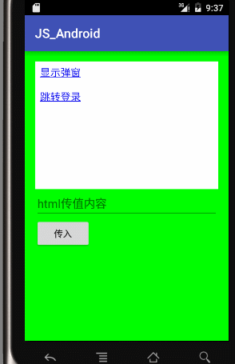

## JavaScript 与 Android 交互

前言：随着前端技术越来越火。许多app中不在是简单的android原生应用，加入了很多web页。通过Android的`webView`加载一个`html`。并且我们通常的一些落地页都是用`html`显示的。那么对于一些具有特殊功能的落地页。比如具有引导注册功能的，用户点击落地页之后跳转App的注册页面，或者登录页面。那么，这就需要`html`和`Android`原生进行交互，相互调用。


### 原理分析

 - `android` 调用`javascript`方法：
 
直接通过`webView.loadUrl("javascript:show('"+et.getText().toString()+"')");`,其实就是直接通过`loadUrl()`方法，传入`javascropt:`+方法名。

- `javascript`调用`Android`方法
	- 定义一个对象，包含`js`需要调用方法的定义和实现。
	-  `webView.addJavascriptInterface(new Object(), "obj");`传入。
	-  `js`调用。


### 来个栗子



白色区域是加载的html，带有显示弹窗和跳转登录，该连接调用android本地方法。

下方输入框和按钮为调用js方法，并传入参数

### 定义Android对象

首先需要定义一个类，该类主要用于定义一些方法（接口），以便`js`调用。

```java 
private  class Object {


        @JavascriptInterface
        public void intent2Activity(String activity){
            if(activity.equals("login")){
                Intent intent = new Intent(MainActivity.this,LoginActivity.class);
                startActivity(intent);
            }
        }

        @JavascriptInterface
        public void showDialog(String str){
            AlertDialog dialog = new AlertDialog.Builder(MainActivity.this)
                    .setTitle("消息")
                    .setMessage(str)
                    .setPositiveButton("确定",null)
                    .setNegativeButton("取消",null)
                    .create();

            dialog.show();
        }
    }
```
定义了两个方法，一个是跳转`activity`的方法，另一个是显示消息的方法。

注意：方法前一定要加上注解`@JavascriptInterface`，不然会没有效果。


在Activity中加入`webView`，并查找控件，进行一些初始化操作
```java 
 @SuppressLint("JavascriptInterface")
    public void onCreate(Bundle savedInstanceState) {
        super.onCreate(savedInstanceState);
        setContentView(R.layout.activity_main);

        et = ((EditText) findViewById(R.id.et));
        //加载页面
        webView = (WebView) findViewById(R.id.webView);
        //允许JavaScript执行
        webView.getSettings().setJavaScriptEnabled(true);
        webView.getSettings().setDefaultTextEncodingName("utf-8");

        // 添加一个对象, 让JS可以访问该对象的方法
        webView.addJavascriptInterface(new Object(), "obj");

        //找到Html文件，也可以用网络上的文件
        webView.loadUrl("file:///android_asset/index.html");
    }
```

`webView.addJavascriptInterface(new Object(), "obj");`相当于向`html`中传入了定义的接口对象，对象名为`obj`。

### 定义Html对象

因为我用的是`android studio`，所以在`main`目录下创建目录`assets`，并创建文件`index.html`

```html
<head>
    <meta http-equiv="Content-Type" content="text/html; charset=UTF-8">
    <title>Insert title here</title>

    <script type="text/javascript">

			<!-- android 调用js-->
            function show(msg){
                var str = document.getElementById("android").innerHTML;
                document.getElementById("android").innerHTML = str+"<br/>"+msg;
            }
        
    </script>
</head>
<body>

<a href="javascript:obj.showDialog('显示弹窗')">显示弹窗</a>

<br/>
<br/>

<a href="javascript:obj.intent2Activity('login')">跳转登录</a>

<br/>
<br/>

<div id="android"></div>
</body>
</html>

```

可以看到在html中我们分别调用了`android`中的两个方法，通过`javascript:obj.`+方法。

