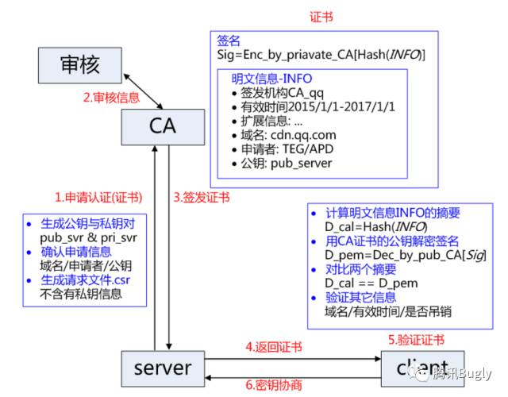
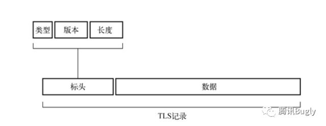
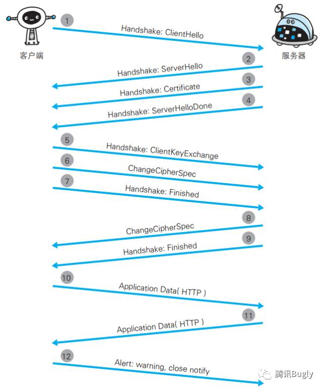
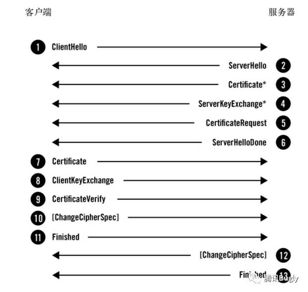

## HTTPS 原理相关浅析

### HTTP 协议不足
- 通信使用明文，可能被窃听。（抓包）
- 不验证通信方的身份，可能遭遇伪装。（伪装服务器和客户端进行交互）
- 无法证明报文的完整性，可能遭遇篡改。

### HTTPS

HTTPS = HTTP + TLS/SSL

TLS和SSL都是由Netscape公司开发，TLS是SSL的进阶版。

#### 基本的CA证书流程

#### 协议实现

TLS以记录协议(record protocol)实现。记录协议负责在传输连接上交换所有的底层消息，并可以配置加密。每一条TLS记录以一个短标头起始。标头包含记录内容的类型(或子协议)、协议版本和长度。消息数据紧跟在标头之后。

在数据交换过程中，根据标头的不同区分不同的数据信息，其中四个核心子协议

- 握手协议（handshake protocol）：握手协议中，完成基本的证书交换。
- 秘钥规格变更协议（change cipher spec protocol）：在完成进本的证书验证之后，通信时使用对称加密，通知通信的数据加密方式放生变更。
- 应用数据协议（application data protocol）：业务数据传输
- 警报协议（alert protocol）：关闭通信链接。

#### 单向验证握手流程
单向验证指的是只对服务器端的真实性做校验。及普通的HTTPS验证流程。

##### (1) ClientHello(握手协议)
握手流程中第一步，这条消息将客户端的功能和首选项传送给服务器。包含客户端支持的SSL的指定版本、加密组件(Cipher Suite)列表(所使用的加密算法及密钥长度等)。

> 告诉服务器，我支持那些功能。

##### (2) ServerHello(握手协议)
ServerHello消息将服务器选择的连接参数传送回客户端。服务器的加密组件内容以及压缩方法等都是从接收到的客户端加密组件内筛选出来的。
> 服务器从客户端提供的功能列表中选出使用哪些功能并告诉客户端。

##### (3) Certificate(握手协议)
服务器发送Certificate报文，报文中包含公开密钥证书，服务器必须保证它发送的证书与选择的算法套件一致。
> 发送证书给客户端

##### (4) ServerHelloDone(握手协议)
ServerHelloDone消息表明服务器已经将所有预计的握手消息发送完毕。在此之后，服务器会等待客户端发送消息。
> 告知客户端，消息发送完了，到你给我了。

##### (5) ClientKeyExchange(握手协议)
ClientKeyExchange消息携带客户端为密钥交换提供的所有信息。这个消息受协商的密码套件的影响，内容随着不同的协商密码套件而不同。
> 客户端验证完服务端回传的证书之后，利用证书中的公钥对客户端生成用以传输数据的对称加密的秘钥进行加密，并传给服务器。

##### (6&8) ChangeCipherSpec(秘钥规格变更协议)
 ChangeCipherSpec消息表明发送端已取得用以生成连接参数的足够信息，已生成加密密钥，并且将切换到加密模式。客户端和服务器在条件成熟时都会发送这个消息。
> 告诉服务器端，我将使用对称加密加密数据传输信息。

##### (7&9) Finished(握手协议)
 Finished消息意味着握手已经完成。消息内容将加密，以便双方可以安全地交换验证整个握手完整性所需的数据。客户端和服务器在条件成熟时都会发送这个消息。
>> go!!!

##### (10&11) Application Data(应用数据协议)
应用数据协议携带着应用消息，只以TLS的角度考虑的话，这些就是数据缓冲区。记录层使用当前连接安全参数对这些消息进行打包、碎片整理和加密
> 开始进行基本的业务数据交换

##### (12) close(警报协议)
警报的目的是以简单的通知机制告知对端通信出现异常状况。它通常会携带close_notify异常，在连接关闭时使用，报告错误。
> 数据交换完毕，关闭通道

#### 双向验证的握手流程

双向验证流程直不仅客户端校验服务器端的真实性，同时服务端校验客户端的真实有效性。

双向验证和单向验证的流程的区别在于，客户端获取到服务端的证书做校验之后，也会将自己的证书发给服务器端。

### Android 中常见错误

#### `SSLHandshakeException`

出现此错误的原因

- 颁发服务器证书的CA未知；（无法识别证书，例如不是由著名CA签署的，或者使用自签署证书，未加信任）
- 服务器配置缺少中间 CA；

