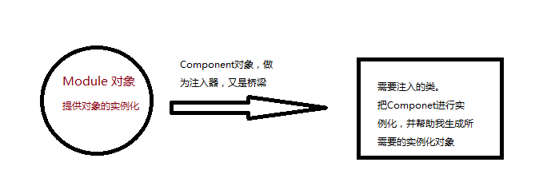

在上一篇博客中总结了依赖注入的原理与实现方式。[ 依赖注入的原理 ](http://blog.csdn.net/lisdye2/article/details/51887402)

依赖注入就是将调用者需要的另一个对象实例不在调用者内部实现，而是通过一定的方式从外部传入实例，解决了各个类之间的耦合。


那么这个外部，到底指的是哪里，如果指的是另一个类，那么，另一个类内部不就耦合了。能不能有一种方式，将这些构造的对象放到一个容器中，具体需要哪个实例时，就从这个容器中取就行了。那么，类的实例和使用就不在有联系了，而是通过一个容器将他们联系起来。实现了解耦。这个容器，便是`Dagger2`。


`Dagger2`是Google出的依赖注入框架。肯定有小伙伴疑问，为什么会有个 2 呢。该框架是基于`square`开发的`dagger`基础上开发的。


`Dagger2`的原理是在编译期生成相应的依赖注入代码。这也是和其他依赖注入框架不同的地方，其他框架是在运行时期反射获取注解内容，影响了运行效率。


### **导入Dagger2**

使用`Dagger2`之前需要一些配置，该配置是在`Android Studio`中进行操作。


在工程的`build.gradle`文件中添加`android-apt`插件（该插件后面介绍）

```java 
buildscript {
   
	....

    dependencies {
		
        classpath 'com.android.tools.build:gradle:2.1.0'
		// 添加android-apt 插件
        classpath 'com.neenbedankt.gradle.plugins:android-apt:1.8'
    }
}

```

在app的中的`build.gradle`文件中添加配置

```java 
apply plugin: 'com.android.application'
// 应用插件
apply plugin: 'com.neenbedankt.android-apt'

android {
    compileSdkVersion 23
    buildToolsVersion "23.0.2"

    defaultConfig {
        applicationId "com.mahao.alex.architecture"
        minSdkVersion 15
        targetSdkVersion 23
        versionCode 1
        versionName "1.0"
    }
    buildTypes {
        release {
            minifyEnabled false
            proguardFiles getDefaultProguardFile('proguard-android.txt'), 'proguard-rules.pro'
        }
    }
}


dependencies {
    compile fileTree(dir: 'libs', include: ['*.jar'])
    testCompile 'junit:junit:4.12'
    compile 'com.android.support:appcompat-v7:23.3.0'

	// dagger 2 的配置
    compile 'com.google.dagger:dagger:2.4'
    apt 'com.google.dagger:dagger-compiler:2.4'
    compile 'org.glassfish:javax.annotation:10.0-b28'// 添加java 注解库
}

```


以上两个配置就可以了。


`android-apt`是`Gradle`编译器的插件，根据其官方文档，主要两个目的：

- 编译时使用该工具，最终打包时不会将该插件打入到apk中。

- 能够根据设置的源路径，在编译时期生成相应代码。


在导入类库时，

```java 
	compile 'com.google.dagger:dagger:2.4'
    apt 'com.google.dagger:dagger-compiler:2.4'

```

`dagger`是主要的工具类库。`dagger-compiler`为编译时期生成代码等相关的类库。


在`android-apt`的文档中，也推荐使用这种方式。因为，编译时期生成代码的类库在运行期并不需要，那么将其分为两个库，（运行类库`dagger`）和（编译器生成代码类库（`dagger-compiler`）），那么在打包时，就不需要将`dagger-compiler`打入其中（用不到），减小APK 的大小。


### **Dagger2的简单使用**

`Dagger2`的使用，需要大量的学习成本，不是很能够容易的上手并使用。该博客将从简单入手，尽可能的使用简单的例子演示`Dagger2`的功能。

一个东西需要先会用，然后才更好的学习原理。该篇博客的目的主要是讲解如何使用。后面会有专门的分析源码的博客。


在之前的分析中，通过`Dagger2`的目的是将程序分为三个部分。
- 实例化部分：对象的实例化。类似于容器，将类的实例放在容器里。
- 调用者：需要实例化对象的类。
- 沟通桥梁：利用`Dagger2`中的一些API 将两者联系。


先看实例化部分（容器），在此处是`Module`。

```java 

@Module   //提供依赖对象的实例
public class MainModule {

    @Provides // 关键字，标明该方法提供依赖对象
    Person providerPerson(){
        //提供Person对象
        return new Person();
    }


}

```

沟通部分`Component`

```java 
@Component(modules = MainModule.class)  // 作为桥梁，沟通调用者和依赖对象库
public interface MainComponent {

    //定义注入的方法
    void inject(MainActivity activity);

}

```

使用者`Actvity`中调用。

```java 
public class MainActivity extends AppCompatActivity{

    @Inject   //标明需要注入的对象
    Person person;

    @Override
    protected void onCreate(@Nullable Bundle savedInstanceState) {
        super.onCreate(savedInstanceState);

        // 构造桥梁对象
        MainComponent component = DaggerMainComponent.builder().mainModule(new MainModule()).build();

        //注入
        component.inject(this);

    }
}

```

看一下`Person`类

```java 
public class Person {

    public Person(){
        Log.i("dagger","person create!!!");
    }


}

```

最后结果不在演示。其过程如下：

- 创建`Component`(桥梁)，并调用注入方法。

```java 
		// 构造桥梁对象
        MainComponent component = DaggerMainComponent.builder().mainModule(new MainModule()).build();

        //注入
        component.inject(this);
```

- 查找当前类中带有`@Inject`的成员变量。

```java 
 	@Inject   //标明需要注入的对象
    Person person;

```
- 根据成员变量的类型从`Module`中查找哪个有`@Provides`注解的方法返回值为当前类型。

```java 
 	@Provides // 关键字，标明该方法提供依赖对象
    Person providerPerson(){
        //提供Person对象
        return new Person();
    }

```



在使用过程出现了很多注解：

- `@Module`:作为实例对象的容器。
- `@Provides`:标注能够提供实例化对象的方法。
- `@Component`:作为桥梁，注入对象的通道。
- `@Inject`：需要注入的方法


如上使用有一种变通，修改`MainModule`和`Person`类。

```java 
@Module   //提供依赖对象的实例
public class MainModule {

/*
    @Provides // 关键字，标明该方法提供依赖对象
    Person providerPerson(){
        //提供Person对象
        Log.i("dagger"," from Module");
        return new Person();
    }

*/

}

```
```java 
public class Person {

    @Inject  // 添加注解关键字
    public Person(){
        Log.i("dagger","person create!!!");
    }

}

```

将`Module`中的`providePerson()`方法注释，在`Person`中添加`@Inject`注解，依然能够实现。

逻辑如下：
- 先判断`Module`中是否有提供该对象实例化的方法。
- 如果有则返回。结束。
- 如果没有，则查找该类的构造方法，是否有带有`@Inject`的方法。如过存在，则返回。


### **@Singleton  单例注解**

假如，对于同一个对象，我们需要注入两次，如下方式

```java 
 public class MainActivity extends AppCompatActivity{

    @Inject
    Person person;

    @Inject
    Person person2;

    @Override
    protected void onCreate(@Nullable Bundle savedInstanceState) {
        super.onCreate(savedInstanceState);

        // 构造桥梁对象
        MainComponent component = DaggerMainComponent.builder().mainModule(new MainModule()).build();

        //注入
        component.inject(this);

        // 打印两个对象的地址
        Log.i("dagger","person = "+ person.toString()+"; person2 = "+ person2.toString());
    }
}

```

看一下结果：

```java 
person = com.mahao.alex.architecture.dagger2.Person@430d1620; person2 = com.mahao.alex.architecture.dagger2.Person@430d17c8

```

可见两个对象不一致。也就是说创建了两个对象。


可以在提供实例化对象的方法上添加`@Singleton`注解

```java 
 @Provides // 关键字，标明该方法提供依赖对象
    @Singleton
    Person providerPerson(){

        return new Person();
    }

```

同时，对于`MainComponent`也需要添加注解，不添加会无法编译

```java 
@Singleton
@Component(modules = MainModule.class)  // 作为桥梁，沟通调用者和依赖对象库
public interface MainComponent {
    //定义注入的方法
    void inject(MainActivity activity);

}
```

此时在Log,会发现两个对象的地址一样，可见是同一个对象。

```java 
person = com.mahao.alex.architecture.dagger2.Person@4310f898; person2 = com.mahao.alex.architecture.dagger2.Person@4310f898
```

那么不同的`Activity`之间，能否保持单例呢？

创建一个新的`Activity`，代码如下：

```java 
public class Main2Actvity extends AppCompatActivity {

    @Inject
    Person person;


    @Override
    protected void onCreate(@Nullable Bundle savedInstanceState) {
        super.onCreate(savedInstanceState);

        // 构造桥梁对象
        MainComponent component = DaggerMainComponent.builder().mainModule(new MainModule()).build();

        //注入
        component.inject(this);

        Log.i("dagger","person = "+ person.toString());
    }
}

```

结果如下：

```java 
 person create!!!
 person = com.mahao.alex.architecture.dagger2.Person@4310f898; person2 = com.mahao.alex.architecture.dagger2.Person@4310f898
 person create!!!
 person = com.mahao.alex.architecture.dagger2.Person@43130058
```

可见，`@Singleton`只对一个`Component`有效，即其单例所依赖`Component`对象。


###  **需要参数的实例化对象**

`Person`的构造方法发生了变化，需要传入一个`Context`，代码如下：

```java 
public class Person {

    private Context mContext;

    public Person(Context context){
        mContext = context;
        Log.i("dagger","create");
    }

}

```

这样的话，我们需要修改`MainModule`

```java 

@Module   //提供依赖对象的实例
public class MainModule {

    private Context mContext;

    public MainModule(Context context){
        mContext = context;
    }


    @Provides
    Context providesContext(){
        // 提供上下文对象
        return mContext;
    }

    @Provides // 关键字，标明该方法提供依赖对象
    @Singleton
    Person providerPerson(Context context){

        return new Person(context);
    }

}

```

- 修改`providerPerson`方法，传入`Context`对象。
- 添加`providesContext()`,用以提供`Context`对象。


看一下使用

```java 
 // 构造桥梁对象
        MainComponent component = DaggerMainComponent.builder().mainModule(new MainModule(this)).build();

        //注入
        component.inject(this);

```

逻辑：

- 根据`@Inject`注解，查找需要依赖注入的对象。
- 从`MainModule`中根据返回值，找到`providerPerson(Context context)`对象。
- 发现其需要传入参数`Context`，找到`moudule`中具有返回值为`Context`的方法`providesContext()`。
- 最后就成功的构建了实例化对象。


可能会有疑问，我既然`module`中已经保存了`Context`对象，那么为什么不直接使用`Context`对象呢，因为解耦，如果使用了保存的对象，会导致下次`Context`获取发生变化时，需要修改`providerPerson(Context context)`中的代码。


**在编写`Module`中，不能出现传入参数和返回参数一致的情况，会导致死循环。**

很容易理解，需要的和获取的是同一个方法，循环调用。


### **依赖一个组件**

在使用中，往往会有依赖另一个组件的情况。比如，在`AppMoudle`中能够提供`Context`对象，如下：

```java 
@Module
public class AppModule {
    
    private Context mContext;

    public AppModule(Context context){
        mContext = context;
    }

    @Provides
    Context providesContext(){
        // 提供Context对象　
        return mContext;
    }

}

```

而在另一个`Module`中需要依赖`Context`对象，那么怎么写呢？


首先编写当前`AppModule`的`Component`类


```java 
/**
 *
 * 全局的Component 组件
 * Created by MH on 2016/7/18.
 */

@Component(modules = AppModule.class)
public interface AppComponent {

    // 向其下层提供Context 对象
    Context proContext();
}

```

在此种，因为`Module`中需要向下层提供`Context`对象，而其与下层的联系时通过`Component`
，所以需要在这里声明一个其所提供对象的方法。以便下层`Module`获取。


```java 
/**
 *
 * 下层Module类
 * Created by MH on 2016/7/18.
 */
@Module
public class ActivityMoudule {

    @Provides
    Person providePerson(Context context){
        //　此方法需要Context 对象
        return new Person(context);
    }
}


```

```java 
/**
 *  子的Component
 * Created by MH on 2016/7/18.
 */
@Component(dependencies = AppComponent.class,modules = ActivityMoudule.class)
public interface ActivityComponent {

    // 注入
    void inject(MainActivity activity);
}

```

在子`Component`中，有一句关键的注解`dependencies = AppComponent.class`，添加了上层依赖。


看一下使用

```java 
   		// 依赖对象　Component
        AppComponent appCom = DaggerAppComponent.builder().appModule(new AppModule(this)).build();

        // 子类依赖对象 ，并注入
        DaggerActivityComponent.builder()
                .appComponent(appCom)
                .activityMoudule(new ActivityMoudule())
                .build()
                .inject(this);


```


在其中使用过程中，有很重的两点。

- 父依赖的`Component`中需要添加提供对象的接口。
- 子依赖的`Component`中的注解中添加`dependencies = AppComponent.class`。


### **@Qualifier 自定义标记**

在使用中，会出现两个方法返回对象相同时的情况，那么如何区分呢。

`Person`对象具有两个构造方法，根据不同的参数值构造不同的方法。

```java 
public class Person {

    private Context mContext;

    public Person(Context context){
        mContext = context;
        Log.i("dagger","create");
    }

    public Person(String name){
        Log.i("dagger",name);
    }
}

```

`ActivityModule`中添加`@Named`标记

```java 
@Module
public class ActivityMoudule {

    @Named("Context")  // 通过context创建Person 对象
    @Provides
    Person providePersonContext(Context context){
        //　此方法需要Context 对象
        return new Person(context);
    }


    @Named("name")  // 通过name创建Person 对象
    @Provides
    Person providePersonName(){
        //　此方法需要name
        return new Person("1234");
    }
}

```

使用时，也需要添加此标记

```java 
    public class MainActivity extends AppCompatActivity{

    @Named("context") // 标记
    @Inject
    Person person;

    @Named("name")  // 标记
    @Inject
    Person person2;


    @Override
    protected void onCreate(@Nullable Bundle savedInstanceState) {
        super.onCreate(savedInstanceState);

        setContentView(R.layout.activity_main);
        //注入
        component.inject(this);*/

        // 依赖对象　Component
        AppComponent appCom = DaggerAppComponent.builder().appModule(new AppModule(this)).build();

        // 子类依赖对象 ，并注入
        DaggerActivityComponent.builder()
                .appComponent(appCom)
                .activityMoudule(new ActivityMoudule())
                .build()
                .inject(this);
    }

    }


```

使用时，使用者的`@Inject`上，必须要加入注解`@Named("xxx")`,不然编译期会报错。

这样使用过程中，虽然解决了问题，但是通过字符串标记一个对象，容易导致前后不匹配，可以通过自定义注解的方式解决。

添加两个注解，分别对应`Context`和`name`。

```java 
@Qualifier  // 关键词
@Retention(RetentionPolicy.RUNTIME)  // 运行时仍可用
public @interface PersonForContext {
    // Context 对象的注解
}
```

```java
@Qualifier
@Retention(RetentionPolicy.RUNTIME)
public @interface PersonForName {
	// name 对象的注解
}
```

在使用`@Named("")`的地方替换为上面的注解

```java

   @PersonForContext  // 通过context创建Person 对象
    @Provides
    Person providePersonContext(Context context){
        //　此方法需要Context 对象
        return new Person(context);
    }


    @PersonForName  // 通过name创建Person 对象
    @Provides
    Person providePersonName(){
        //　此方法需要Context 对象
        return new Person("123");
    }
```

注入时：

```java

   	@PersonForContext // 标记
    @Inject
    Person person;


    @PersonForName // 标记
    @Inject
    Person person2;
```


### **Scope**

在前面中提到`@Singleton`注解，该注解能够使同一个`Component`中的对象保持唯一，即单例。

回忆一下，如下方式：

```java 
 	@Provides // 关键字，标明该方法提供依赖对象
    @Singleton
    Person providerPerson(Context context){

        return new Person(context);
    }
```

`Module`中，对应方法中添加`@Singleton`注解，同时其所在的`Component`中，类生命上也需要添加注解

```java

@Singleton
@Component(modules = MainModule.class)  // 作为桥梁，沟通调用者和依赖对象库
public interface MainComponent {
}
```

如果我们看这个意思，感觉其内部应该做了很多的实现，用以达到单例。其实，没我们想的那么复杂。

看一下`@Singleton`的实现

```java   
@Scope //注明是Scope 
@Documented  //标记在文档 
@Retention(RUNTIME)  // 运行时级别
public @interface Singleton {}

```

通过`@Scope`定义的一个新的注解。

在之前的，我们知道该单例是依托于他所在的`Component`组件。那么我们是否可以这样理解，因为方法上添加的`@Scope`标记的注解和`Component`上添加的`@Scope`标记的注解相同（确实相同，同为`@Singleton`），就表明了该方法提供的实例对象在`Component`保持唯一。保持唯一的条件是通过`@Scope`标记的注解相同。

通过在上面的依赖层级上，`Android`中通常定义两个生命周期。

**全局的生命周期PerApp**

```java 
/**
 * 全局的生命周期单例
 */
@Scope
@Documented
@Retention(RetentionPolicy.RUNTIME)
public @interface PerApp {

}

```


在使用中完全和`@Singleton`相同。

```java 
@Module
public class AppModule {

    private Context mContext;

    public AppModule(Context context){
        mContext = context;
    }

    @Provides
    @PerApp  // 添加该标记表明该方法只产生一个实例
    Context providesContext(){
        // 提供上下文对象
        return mContext;
    }

}

```

```java 
@PerApp // 因为Module 中使用了该标记,所以需要在此添加
@Component(modules = AppModule.class)
public interface AppComponent {

    // 向其下层提供Context 对象
    Context proContext();
}

```

因为单例的依托于他所在的`Component`中，所以需要在`Application`中进行实例化。


```java 
public class App extends Application {

    // 为什么可以使用静态
    public static AppComponent appComponent;


    @Override
    public void onCreate() {
        super.onCreate();

        // 实例化
        appComponent = DaggerAppComponent.builder().appModule(new AppModule(this)).build();

    }
}

```

为什么可以使用静态的，因为该`AppComponent`对象的生命周期是整个App。那么在使用中，其所在`Module`中的实例化对象，可以保持全局单例。


**一个Activity的生命周期PerActivity**

有全局的单例，而对于一个`Activity`，他也有些对象需要保持单例。我们需要定义该注解。


```java 
/**
 * Activity 单例生命周期
 */
@Scope
@Documented
@Retention(RetentionPolicy.RUNTIME)
public @interface PerActivity {
}

```

会发现，除了定义名不一样，其余都和`PerApp`一样。在前面，说过这样一句话：**保持唯一的条件是通过`@Scope`标记的注解相同。**


```java 
@Module
public class ActivityMoudule {

    @PersonForContext
    @Provides
    @PerActivity  // 添加标记，生命其所构造的对象单例
    Person providePersonContext(Context context){
        //　此方法需要Context 对象
        return new Person(context);
    }

	.....
}

```

```java 

@PerActivity  // ActivityMoudule 中使用了该标记
@Component(dependencies = AppComponent.class,modules = ActivityMoudule.class)
public interface ActivityComponent {

    // 注入
    void inject(MainActivity activity);
}

```

使用方式，因为其所保持的单例是在`Activity`中，具体使用如下。

```java 
public class MainActivity extends AppCompatActivity{

    @PersonForContext // 标记
    @Inject
    Person person;


    @PersonForName // 标记
    @Inject
    Person person2;


    /**
     * 不使用静态的，因为该Component只是针对于该Activity，而不是全局的
     */
    ActivityComponent  activityComponent;


    @Override
    protected void onCreate(@Nullable Bundle savedInstanceState) {
        super.onCreate(savedInstanceState);

        setContentView(R.layout.activity_main);


        activityComponent = DaggerActivityComponent.builder()
                .appComponent(App.appComponent)  // 添加了全局的AppComponent组件,可以使用全局的实例化对象
                .activityMoudule(new ActivityMoudule())
                .build();


        activityComponent.inject(this);


```

> **对于具有依赖关系的Component，不能使用相同的Scope，如果使用相同的会带来语意不明**


### **懒加载Lazy和强制重新加载Provider**


```java 
public class MainActivity extends AppCompatActivity{

    @PersonForContext // 标记
    @Inject
    Lazy<Person> lazyPerson; // 注入Lazy元素


    @PersonForName // 标记
    @Inject
    Provider<Person> providerPerson; // 注入Provider


    /**
     * 不使用静态的，因为该Component只是针对于该Activity，而不是全局的
     */
    ActivityComponent  activityComponent;


    @Override
    protected void onCreate(@Nullable Bundle savedInstanceState) {
        super.onCreate(savedInstanceState);

        setContentView(R.layout.activity_main);


        activityComponent = DaggerActivityComponent.builder()
                .appComponent(App.appComponent)  // 添加了全局的AppComponent组件
                .activityMoudule(new ActivityMoudule())
                .build();


        activityComponent.inject(this);


        Person person = lazyPerson.get();// 调用该方法时才会去创建Person,以后每次调用获取的是同一个对象


        // 调用该方法时才回去创建Person1，以后每次调用都会重新加载Module中的具体方法，根据Module中的实现，可能相同，可能不相同。
        Person person1 = providerPerson.get();
	}
}

```


该博客中使用的代码已经上传到github，有需要者请移步。[https://github.com/AlexSmille/alex_mahao_sample/tree/master/architecture](https://github.com/AlexSmille/alex_mahao_sample/tree/master/architecture)


