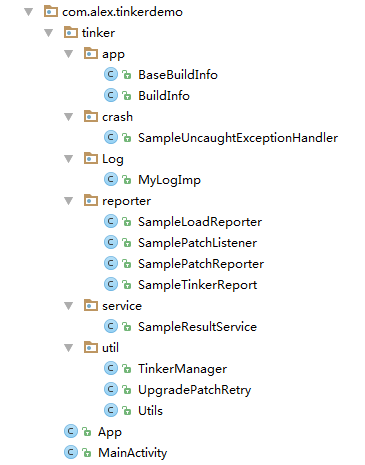
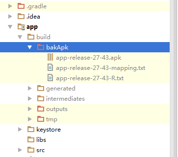
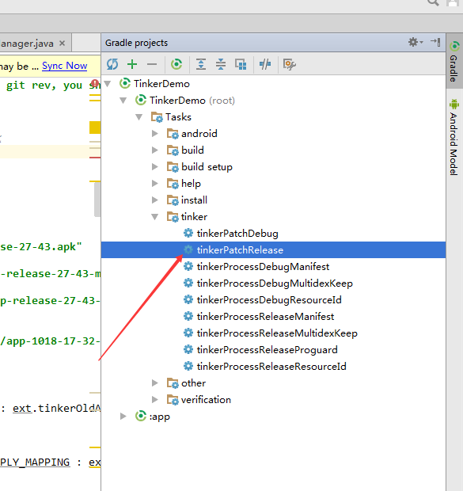
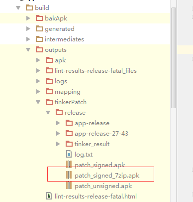

## 热修复框架Tinker的从0到集成之路


> 转载请标明出处：
[http://blog.csdn.net/lisdye2/article/details/52049857](http://blog.csdn.net/lisdye2/article/details/52049857)
本文出自:[【Alex_MaHao的博客】](http://blog.csdn.net/lisdye2?viewmode=contents)
项目中的源码已经共享到github，有需要者请移步[【Alex_MaHao的github】](https://github.com/AlexSmille/TinkerDemo)

2015年10月，QQ空间提出了热修复方案，一时间热修复风靡Android界，阿里的AndFix，360的插件形式，开源的NUWA等，都分别提出了自己的热修复实现方案，2016年微信推出了自己的热修复框架`Tinker`，从原理上来说，`Tinker`的实现方式和QQ空间的一脉相承，随着时间的推移，`Tinker`逐渐的成熟并推出了一键集成的SDK,感觉应该比较是靠谱了，所以就动手集成一下吧。集成比较方便，甚至推出了方便集成的SDK版本，不过需要money,所以我们还是从github上入手吧。

推荐大家看一下`Tinker`的[Wiki](https://github.com/Tencent/tinker/wiki),一些细节配置上比较清晰，本篇会忽略这些细节的配置


### 大致原理

为什么说大致原理呢，因为我也不知道他的原理，不过是在使用中猜的，如果错了，别怪我~~~。

- 利用`MulitDex`打出多个dex文件。
	- 主dex中没有逻辑，只是`Tinker`的所有逻辑，不能更新。
	- 其余dex文件保存我们编写的逻辑，主要用于更新方便。
- 保存上次打包的记录，便于打补丁包。
- 根据上一次的记录，一一对比，找出区别之后整合，加签，打包，生成补丁文件。
- 将补丁文件放到对应位置，验签，加载到内存。（QQ控件热修复原理加载到内存） 


> 具体原理可以看我之前的热修复文章或者百度一下，本篇只说集成。


### Gradle 配置

工程的根目录的`gradle.properties`文件中添加`Tinker`的版本号

```

org.gradle.jvmargs=-Xmx2048m -XX:MaxPermSize=512m -XX:+HeapDumpOnOutOfMemoryError -Dfile.encoding=UTF-8

TINKER_VERSION=1.7.6

```


工程根目录下的`build.gradle`中添加`Tinker`的编译插件

```
 dependencies {
        // Tinker 编译的插件
        classpath 'com.tencent.tinker:tinker-patch-gradle-plugin:1.7.6'


        classpath 'com.android.tools.build:gradle:2.1.0'
    }

```


app 目录下的`build.gradle`中添加程序运行时的jar包

```
apply plugin: 'com.android.application'

android {
    compileSdkVersion 23
    buildToolsVersion "23.0.2"

    defaultConfig {
        applicationId "com.alex.tinkerdemo"
        minSdkVersion 15
        targetSdkVersion 21
        versionCode 1
        versionName "1.0"


        // tinker 基本配置
        multiDexEnabled true
        buildConfigField "String", "MESSAGE", "\"I am the base apk\""
        buildConfigField "String", "TINKER_ID", "\"${getTinkerIdValue()}\""
        buildConfigField "String", "PLATFORM", "\"all\""
        
    }

    // Tinker 推荐设置
    dexOptions {
        jumboMode = true
    }

    // 签名信息的配置
    signingConfigs {
        release {
            try {
                storeFile file("./keystore/key.jks")
                storePassword "123456"
                keyAlias "1111"
                keyPassword "1234567"
            } catch (ex) {
                throw new InvalidUserDataException(ex.toString())
            }
        }
    }

    // 编译类型的配置
    buildTypes {
        release {
            minifyEnabled true
            signingConfig signingConfigs.release
            proguardFiles getDefaultProguardFile('proguard-android.txt'), 'proguard-rules.pro'
        }
        debug {
            debuggable true
            minifyEnabled false
            signingConfig signingConfigs.debug
        }
    }
}

dependencies {
    compile fileTree(dir: 'libs', include: ['*.jar'])
    testCompile 'junit:junit:4.12'
    compile 'com.android.support:appcompat-v7:24.2.1'

    // 多dex 打包的类库
    compile "com.android.support:multidex:1.0.1"
    // Tinker 基本类库
    compile("com.tencent.tinker:tinker-android-lib:${TINKER_VERSION}") { changing = true }
    // 编译时生成Application
    provided("com.tencent.tinker:tinker-android-anno:${TINKER_VERSION}") { changing = true }

}

```

在`build.gradle`中，关键是依赖的添加，分别三个依赖，第一个是`MultiDex`分包使用的依赖，第二个是基本功能的类库，第三个是重点。

`Tinker`不推荐我们自己实现`Application`,而是由`Tinker`自己生成，那么我们通常开发时都会自己定义一个`Application`类，进行一些App的初始化操作，怎么解决呢？`Tinker`推荐了另一种实现的方式，后面再说，而第三个依赖便是方便实现自定义`Application`所推荐的类库。

如上，就是基本的环境配置，当然还有`Tinker`的配置，这里我们直接采用`Tinker`提供的基本配置，具体配置的细节可以看wiki。

在app的`build.gradle`最后，添加如下配置

```
//=======================Tinker 配置=======================================

def gitSha() {
    try {
        // String gitRev = 'git rev-parse --short HEAD'.execute(null, project.rootDir).text.trim()
        String gitRev = "1008611"
        if (gitRev == null) {
            throw new GradleException("can't get git rev, you should add git to system path or just input test value, such as 'testTinkerId'")
        }
        return gitRev
    } catch (Exception e) {
        throw new GradleException("can't get git rev, you should add git to system path or just input test value, such as 'testTinkerId'")
    }
}

// 保存打包old apk 的地址，便于生成补丁包时的对比
def bakPath = file("${buildDir}/bakApk/")

ext {
    //是否打开tinker的功能。
    tinkerEnabled = true

    // old apk地址
    tinkerOldApkPath = "${bakPath}/app-release-16-13.apk"
    //old apk 混淆文件地址
    tinkerApplyMappingPath = "${bakPath}/app-release-16-13-mapping.txt"
    //old apk R 文件地址
    tinkerApplyResourcePath = "${bakPath}/app-release-16-13-R.txt"

    // 多渠道打包相关
    tinkerBuildFlavorDirectory = "${bakPath}/app-1018-17-32-47"
}


def getOldApkPath() {
    return hasProperty("OLD_APK") ? OLD_APK : ext.tinkerOldApkPath
}

def getApplyMappingPath() {
    return hasProperty("APPLY_MAPPING") ? APPLY_MAPPING : ext.tinkerApplyMappingPath
}

def getApplyResourceMappingPath() {
    return hasProperty("APPLY_RESOURCE") ? APPLY_RESOURCE : ext.tinkerApplyResourcePath
}

def getTinkerIdValue() {
    return hasProperty("TINKER_ID") ? TINKER_ID : gitSha()
}

def buildWithTinker() {
    return hasProperty("TINKER_ENABLE") ? TINKER_ENABLE : ext.tinkerEnabled
}

def getTinkerBuildFlavorDirectory() {
    return ext.tinkerBuildFlavorDirectory
}

if (buildWithTinker()) {
    apply plugin: 'com.tencent.tinker.patch'

    tinkerPatch {
        /**
         * necessary，default 'null'
         * the old apk path, use to diff with the new apk to build
         * add apk from the build/bakApk
         */
        oldApk = getOldApkPath()
        /**
         * optional，default 'false'
         * there are some cases we may get some warnings
         * if ignoreWarning is true, we would just assert the patch process
         * case 1: minSdkVersion is below 14, but you are using dexMode with raw.
         *         it must be crash when load.
         * case 2: newly added Android Component in AndroidManifest.xml,
         *         it must be crash when load.
         * case 3: loader classes in dex.loader{} are not keep in the main dex,
         *         it must be let tinker not work.
         * case 4: loader classes in dex.loader{} changes,
         *         loader classes is ues to load patch dex. it is useless to change them.
         *         it won't crash, but these changes can't effect. you may ignore it
         * case 5: resources.arsc has changed, but we don't use applyResourceMapping to build
         */
        ignoreWarning = false

        /**
         * 保证签名的唯一性
         */
        useSign = true

        /**
         * optional，default 'true'
         * whether use tinker to build
         */
        tinkerEnable = buildWithTinker()

        /**
         * 编译相关配置
         */
        buildConfig {

            /**
             * 新的apk使用旧的Map 文件，减少补丁包大小
             */
            applyMapping = getApplyMappingPath()
            /**
             * 同上所述，相同的R文件，减少补丁包大小
             */
            applyResourceMapping = getApplyResourceMappingPath()

            /**
             * 补丁的id标识，补丁包的tinkerId和apk的tinkerId相同才能加载补丁
             */
            tinkerId = getTinkerIdValue()

            /**
             * 打开keepDexApply模式，补丁包将根据基准包的类分布来编译。
             */
            keepDexApply = false
        }

        dex {
            /**
             * 'raw'模式，将会保持输入dex的格式。
             * 'jar'模式，我们将会把输入dex重新压缩封装到jar
             */
            dexMode = "jar"

            /**
             * 需要处理dex路径
             */
            pattern = ["classes*.dex",
                       "assets/secondary-dex-?.jar"]
            /**
             * 放在main.dex中的类，这些类不会被加载
             */
            loader = [
                    //use sample, let BaseBuildInfo unchangeable with tinker
                    "tinker.sample.android.app.BaseBuildInfo"
            ]
        }

        lib {
            /**
             *  需要处理的lib 路径
             */
            pattern = ["lib/armeabi/*.so"]
        }

        res {
            /**
             * 需要处理的资源路径
             */
            pattern = ["res/*", "assets/*", "resources.arsc", "AndroidManifest.xml"]

            /**
             * 忽视改变的文件，即这些文件的改变不会被打到补丁包中
             */
            ignoreChange = ["assets/sample_meta.txt"]

            /**
             *对于修改的资源，如果大于largeModSize，我们将使用bsdiff算法。这可以降低补丁包的大小，但是会增加合成时的复杂度。默认大小为100kb
             */
            largeModSize = 100
        }

        packageConfig {
            /**
             * 配置到清单文件的一些字段，没啥用
             */
            configField("patchMessage", "tinker is sample to use")
            /**
             * 配置到清单文件的一些字段，没啥用
             */
            configField("platform", "all")
            /**
             * 配置到清单文件的一些字段，没啥用
             */
            configField("patchVersion", "1.0")
        }
        //or you can add config filed outside, or get meta value from old apk
        //project.tinkerPatch.packageConfig.configField("test1", project.tinkerPatch.packageConfig.getMetaDataFromOldApk("Test"))
        //project.tinkerPatch.packageConfig.configField("test2", "sample")

        /**
         * if you don't use zipArtifact or path, we just use 7za to try
         */
        sevenZip {
            /**
             * zip路径配置项，执行前提是useSign为true，推荐配置
             */
            zipArtifact = "com.tencent.mm:SevenZip:1.1.10"

        }
    }

    List<String> flavors = new ArrayList<>();
    project.android.productFlavors.each {flavor ->
        flavors.add(flavor.name)
    }
    boolean hasFlavors = flavors.size() > 0
    /**
     * bak apk and mapping
     */
    android.applicationVariants.all { variant ->
        /**
         * task type, you want to bak
         */
        def taskName = variant.name
        //def date = new Date().format("MMdd-HH-mm-ss")
        def date = new Date().format("mm-ss")

        tasks.all {
            if ("assemble${taskName.capitalize()}".equalsIgnoreCase(it.name)) {

                it.doLast {
                    copy {
                        def fileNamePrefix = "${project.name}-${variant.baseName}"
                        def newFileNamePrefix = hasFlavors ? "${fileNamePrefix}" : "${fileNamePrefix}-${date}"

                        def destPath = hasFlavors ? file("${bakPath}/${project.name}-${date}/${variant.flavorName}") : bakPath
                        from variant.outputs.outputFile
                        into destPath
                        rename { String fileName ->
                            fileName.replace("${fileNamePrefix}.apk", "${newFileNamePrefix}.apk")
                        }

                        from "${buildDir}/outputs/mapping/${variant.dirName}/mapping.txt"
                        into destPath
                        rename { String fileName ->
                            fileName.replace("mapping.txt", "${newFileNamePrefix}-mapping.txt")
                        }

                        from "${buildDir}/intermediates/symbols/${variant.dirName}/R.txt"
                        into destPath
                        rename { String fileName ->
                            fileName.replace("R.txt", "${newFileNamePrefix}-R.txt")
                        }
                    }
                }
            }
        }
    }
    project.afterEvaluate {
        //sample use for build all flavor for one time
        if (hasFlavors) {
            task(tinkerPatchAllFlavorRelease) {
                group = 'tinker'
                def originOldPath = getTinkerBuildFlavorDirectory()
                for (String flavor : flavors) {
                    def tinkerTask = tasks.getByName("tinkerPatch${flavor.capitalize()}Release")
                    dependsOn tinkerTask
                    def preAssembleTask = tasks.getByName("process${flavor.capitalize()}ReleaseManifest")
                    preAssembleTask.doFirst {
                        String flavorName = preAssembleTask.name.substring(7, 8).toLowerCase() + preAssembleTask.name.substring(8, preAssembleTask.name.length() - 15)
                        project.tinkerPatch.oldApk = "${originOldPath}/${flavorName}/${project.name}-${flavorName}-release.apk"
                        project.tinkerPatch.buildConfig.applyMapping = "${originOldPath}/${flavorName}/${project.name}-${flavorName}-release-mapping.txt"
                        project.tinkerPatch.buildConfig.applyResourceMapping = "${originOldPath}/${flavorName}/${project.name}-${flavorName}-release-R.txt"

                    }

                }
            }

            task(tinkerPatchAllFlavorDebug) {
                group = 'tinker'
                def originOldPath = getTinkerBuildFlavorDirectory()
                for (String flavor : flavors) {
                    def tinkerTask = tasks.getByName("tinkerPatch${flavor.capitalize()}Debug")
                    dependsOn tinkerTask
                    def preAssembleTask = tasks.getByName("process${flavor.capitalize()}DebugManifest")
                    preAssembleTask.doFirst {
                        String flavorName = preAssembleTask.name.substring(7, 8).toLowerCase() + preAssembleTask.name.substring(8, preAssembleTask.name.length() - 13)
                        project.tinkerPatch.oldApk = "${originOldPath}/${flavorName}/${project.name}-${flavorName}-debug.apk"
                        project.tinkerPatch.buildConfig.applyMapping = "${originOldPath}/${flavorName}/${project.name}-${flavorName}-debug-mapping.txt"
                        project.tinkerPatch.buildConfig.applyResourceMapping = "${originOldPath}/${flavorName}/${project.name}-${flavorName}-debug-R.txt"
                    }

                }
            }
        }
    }
}


```

在一些基本的配置上都有注释，方便大家理解。

> `Tinker`的编译配置就到此为止，下面便是代码的配置。


### 代码编写

因为需要的代码不少，这里不在一一讲解，只标明主要的逻辑代码。具体代码可以去github上下载。

首先看一下整个类的结构



- `app`:这个我也不知道是干什么的，我感觉没什么用，自己可是删掉试试。

- `crash`:崩溃保护。

- `Log`:修复过程中的日志打印。

- `reporter`:补丁过程中的一些流程的回调。

- `service`：修复成功以及耗时等回调 

- `util` : 工具类，关键是`TinkerManager`。

#### Application编写

`Tinker`不推荐编写自定义`Application`,我们在自定义`Application`的逻辑，不在继承`Application`，而继承由`Tinker`提供的`DefaultApplicationLike`类，提供好编写的模板如下：

```java 
@SuppressWarnings("unused")
@DefaultLifeCycle(  application = "com.alex.tinkerdemo.TinkerApp",// 自定义生成
                    flags = ShareConstants.TINKER_ENABLE_ALL,
                    loadVerifyFlag = false)
public class App extends DefaultApplicationLike {


    public static App sApp;


    public App(Application application, int tinkerFlags, boolean tinkerLoadVerifyFlag,
               long applicationStartElapsedTime, long applicationStartMillisTime, Intent tinkerResultIntent,
               Resources[] resources, ClassLoader[] classLoader, AssetManager[] assetManager) {
        super(application, tinkerFlags, tinkerLoadVerifyFlag, applicationStartElapsedTime, applicationStartMillisTime, tinkerResultIntent, resources, classLoader, assetManager);
    }


    @Override
    public void onCreate() {
        super.onCreate();
        sApp = this;

        /*JPushInterface.setDebugMode(true);
        JPushInterface.init(getApplication());

        // 友盟统计日志加密
        AnalyticsConfig.enableEncrypt(true);*/


    }

    @TargetApi(Build.VERSION_CODES.ICE_CREAM_SANDWICH)
    @Override
    public void onBaseContextAttached(Context base) {
        super.onBaseContextAttached(base);

        // 其原理是分包架构，所以在加载初要加载其余的分包
        MultiDex.install(base);

        // Tinker管理类，保存当前对象
        TinkerManager.setTinkerApplicationLike(this);
        // 崩溃保护
        TinkerManager.initFastCrashProtect();
        // 是否重试
        TinkerManager.setUpgradeRetryEnable(true);

        //Log 实现，打印加载补丁的信息
        TinkerInstaller.setLogIml(new MyLogImp());

        // 运行Tinker ，通过Tinker添加一些基本配置
        TinkerManager.installTinker(this);


    }

    @TargetApi(Build.VERSION_CODES.ICE_CREAM_SANDWICH)
    public void registerActivityLifecycleCallbacks(Application.ActivityLifecycleCallbacks callback) {
        // 生命周期，默认配置
        getApplication().registerActivityLifecycleCallbacks(callback);
    }


    public static App getApp(){
        return sApp;
    }


}


```

在类上标有注解`@DefaultLifeCycle`,该注解是为了定义在编译是自动生成的`Application`类的信息，清单文件中的`Application`注册需要填此处定义的名字。

`onCreate()`方法和`Applciation`的`onCreate()`类似，在这里做一些初始化操作，例如友盟的初始化等等，不在过多的讲解。

其中一个区别便是上下文对象不能够在使用该对象，而是使用`app.getApplication()`方法获取上下文对象。

`onBaseContextAttached()`和`Applcation`的方法功能类似，在这里我们做一些基本操作。

- 加载分包：`MultiDex.install(base);`
- 初始化`Tinker`对象，设置一些信息。

关于`Tinker`初始化信息，主要用到`TinkerManager`对象，注释很详细，看注释即可。关键方法便是`TinkerManager.installTinker(this);`,他进行初始化的最终操作。看一下这个方法

```java 

 /**
     * you can specify all class you want.
     * sometimes, you can only install tinker in some process you want!
     *
     * @param appLike
     */
    public static void installTinker(ApplicationLike appLike) {
        if (isInstalled) {
            TinkerLog.w(TAG, "install tinker, but has installed, ignore");
            return;
        }
        //Tinker在加载补丁时的一些回调，我们实现对应方法获取回调
        LoadReporter loadReporter = new SampleLoadReporter(appLike.getApplication());
        //Tinker在修复或者升级补丁时的一些回调
        PatchReporter patchReporter = new SamplePatchReporter(appLike.getApplication());
        //用来过滤Tinker收到的补丁包的修复、升级请求
        PatchListener patchListener = new SamplePatchListener(appLike.getApplication());
        // 补丁包的核心处理类
        AbstractPatch upgradePatchProcessor = new UpgradePatch();

        TinkerInstaller.install(appLike,
            loadReporter, patchReporter, patchListener,
            SampleResultService.class, upgradePatchProcessor);

        isInstalled = true;
    }
```

注释很清晰，自己理解吧~~。


#### 加载补丁包

`MainActivity`中的代码

```java 
 	public class MainActivity extends AppCompatActivity {

    @Override
    protected void onCreate(Bundle savedInstanceState) {
        super.onCreate(savedInstanceState);
        setContentView(R.layout.activity_main);

        // 加载补丁包
        TinkerInstaller.onReceiveUpgradePatch(getApplicationContext(), "/sdcard/mdtinker.apk");
    }

    /**
     * =====================Tinker 默认配置========================
     */

    protected void onResume() {
        super.onResume();
        Utils.setBackground(false);

    }

    @Override
    protected void onPause() {
        super.onPause();
        Utils.setBackground(true);
    }
}
```

关键性便是加载补丁包，这里为了省事直接加载，如果内存理没有补丁，直接会返回了，程序不会崩溃。


### 开始操作

Debug的不在演示，直接按照Release的方式演示。

- **正常打出签名包**

先按照正常流程打包签名APK，此时将签名文件安装到手机中。



会在上图目录下多出一些文件，这些文件保存好，因为生成补丁的时候需要这个东西。

- **代码随便改出一些不同**


- **修改生成补丁的配置文件**

随便修改一些文件之后，打开`app`下的`build.gradle`文件，修改如下文件配置为我们的文件地址

```
ext {
    //是否打开tinker的功能。
    tinkerEnabled = true

    // old apk地址
    tinkerOldApkPath = "${bakPath}/app-release-27-43.apk"
    //old apk 混淆文件地址
    tinkerApplyMappingPath = "${bakPath}/app-release-27-43-mapping.txt"
    //old apk R 文件地址
    tinkerApplyResourcePath = "${bakPath}/app-release-27-43-R.txt"

    // 多渠道打包相关
    tinkerBuildFlavorDirectory = "${bakPath}/app-1018-17-32-47"
}


```

- **运行补丁命令**



- **获取补丁文件，导入到手机文件对应目录**




注意，其中红色框处圈出的就是最终的补丁包，将他改成`mdtinker.apk`导入到手机对应存储。


- **之后打开app会提示补丁加载成功，后台杀死进程再次打开，补丁就成功加载了。**

> 补丁第一次加载之后，会删除补丁包，之后每次加载，都是已经修改过后，打过补丁的apk。

### 附加

```
 		// 清除补丁包方法
        //Tinker.with(getApplicationContext()).cleanPatch();
```


