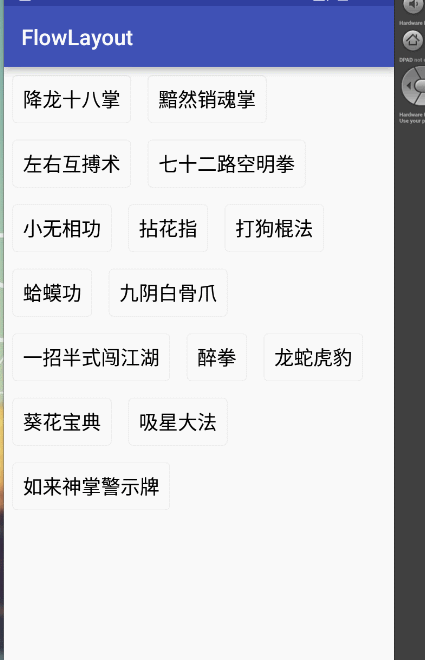

## 自定义View之流式布局FlowLayout

在我们往常的app设计中，对于一些搜索关键字的推荐，标签等，往往宽度都是不确定的，且当一行满之后会自动换行，类似下面这样，

那么今天我们就来实现这个效果。

首先是原理分析。对于该控件，无非就是我们需要获取到每一个子控件的宽，在显示的时候，当某一行的剩余宽度不足以显示下一个控件时，我们让其显示在下一行，继续提炼，主要就是一下两点。
- 在onMeasure()方法中，测量子控件，将其分类，一行显示多少控件，一行需要多大的高度。以及当前控件的大小。
- 在onLayout()中，对子控件进行布局。

那么，让我们开始吧。

首先看一下使用方式：
```java 

    @Override
    protected void onCreate(Bundle savedInstanceState) {
        super.onCreate(savedInstanceState);
        setContentView(R.layout.activity_main);
        
        setData();

        /**
         * 查找控件
         */
        mFlowLayout = ((FlowLayout) findViewById(R.id.fl));

        /**
         * 添加数据
         */
        mFlowLayout.addData(names);

        /**
         * 设置点击事件
         */
        mFlowLayout.setFlowLayoutListener(new FlowLayout.FlowLayoutListener() {
            @Override
            public void onItemClick(View view, int poition) {
                Toast.makeText(getApplicationContext(),names.get(poition),Toast.LENGTH_SHORT).show();
            }
        });

    }
```

根据我们的提炼的两点，分别实现，我们看一下字段，
```java 
 /**
     * 所有子View，按行记录
     */
    private List<List<View>> mAllViews = new ArrayList<List<View>>();

    /**
     * 记录每一行的最大高度
     */
    private  List<Integer> mLineHeight = new ArrayList<>();

    /**
     * 标签点击的回调
     */
    private FlowLayoutListener mFlowLayoutListener;


```
总共两个字段，一个按行进行存储的所有View的集合，一个用来存储每一行的高度。

先看onMeasure()
```java 
@Override
    protected void onMeasure(int widthMeasureSpec, int heightMeasureSpec) {
        super.onMeasure(widthMeasureSpec, heightMeasureSpec);


        mAllViews.clear();
        mLineHeight.clear();

        // 获取当前父容器给当前控件的大小和模式
        int sizeWidth = MeasureSpec.getSize(widthMeasureSpec);
        int sizeHeight = MeasureSpec.getSize(heightMeasureSpec);
        int modeWidth = MeasureSpec.getMode(widthMeasureSpec);
        int modeHeight = MeasureSpec.getMode(heightMeasureSpec);

        //每一行的List
        List<View> lineView = new ArrayList<>();

        //   Log.e(TAG, sizeWidth + "," + sizeHeight);

        // 如果是warp_content情况下，记录宽和高
        int width = 0;
        int height = 0;

        /**
         * 记录每一行的宽度，width不断取最大宽度
         */
        int lineWidth = 0;
        /**
         * 每一行的高度，累加至height
         */
        int lineHeight = 0;

        /**
         * 当前控件的宽度
         */
        int cCount = getChildCount();

        // 遍历每个子元素
        for (int i = 0; i < cCount; i++)
        {
            View child = getChildAt(i);
            // 测量每一个child的宽和高
            measureChild(child, widthMeasureSpec, heightMeasureSpec);
            // 得到child的lp
            MarginLayoutParams lp = (MarginLayoutParams) child
                    .getLayoutParams();

            // 当前子空间实际占据的宽度
            int childWidth = child.getMeasuredWidth() + lp.leftMargin
                    + lp.rightMargin;
            // 当前子空间实际占据的高度
            int childHeight = child.getMeasuredHeight() + lp.topMargin
                    + lp.bottomMargin;
            /**
             * 如果加入当前child，则超出最大宽度，则的到目前最大宽度给width，类加height 然后开启新行
             */
            if (lineWidth + childWidth > sizeWidth)
            {

                width = Math.max(lineWidth,width);// 取最大的


                lineWidth = childWidth; // 重新开启新行，开始记录

                //记录View
                mAllViews.add(lineView);
                lineView = new ArrayList<>();
                lineView.add(child);

                // 叠加当前高度，
                height += lineHeight;
                mLineHeight.add(lineHeight);

                // 开启记录下一行的高度
                lineHeight = childHeight;
            } else
            // 否则累加值lineWidth,lineHeight取最大高度
            {
                lineView.add(child);
                lineWidth += childWidth;
                lineHeight = Math.max(lineHeight, childHeight);
            }
            // 如果是最后一个，则将当前记录的最大宽度和当前lineWidth做比较
            if (i == cCount - 1)
            {
                width = Math.max(width, lineWidth);
                height += lineHeight;
                mAllViews.add(lineView);
                mLineHeight.add(lineHeight);
            }

        }
        //设置当前控件的宽高
        setMeasuredDimension((modeWidth == MeasureSpec.EXACTLY) ? sizeWidth
                : width, (modeHeight == MeasureSpec.EXACTLY) ? sizeHeight
                : height);
    }

```
onMeasure中，我们首先清空我们两个字段中的内容，因为，在我之前的[自定义View之垂直滑动的ViewPager](http://blog.csdn.net/lisdye2/article/details/50905362)中，发现onLayout和onMeasure()会多次被调用。所以，这一步必不可少。

其次，我们获取当前控件的大小模式，为什么呢，因为，当控件是固定值时，或者match_parent，我们无需管理其大小，但如果属性为wrap_content，我们需要根据，子控件所占位置的大小进行手动控制。（备注：如果为wrap_content，其获取的宽度仍然为屏幕的宽度，高度是当前可显示的最大大小）。

在for循环中，我们测量子类的大小，并获取到MarginLayoutParams用来获取该控件的上，下，左，右的间距。然后进行判断
 - 如果当前控件加上其之前的控件的宽度，大于了屏幕的宽度，则我们将当前宽度和之前记录的每一行的宽度比较，去最大值。同时开启新行，添加当前控件的宽度。将保存一行View的list添加到总集合中，开启新的list，添加当前childView到list中。记录高度，因为高度是叠加的，不需要取最大值。同时记录当前childView的高度。
 - 如果控件加上之前的控件的宽度仍然小于屏幕的宽度，则叠加这一行的宽度，添加到集合中，同时高度去最大值。

我们需要记录最后一行的高度，以及将控件添加到对应集合中。因为最后一行肯定不满足大于屏幕宽度的条件，但我们需要把他加入到我们数据集合中。

最后，设置当前的宽高，如果mode是EXACTLY,则表示宽高是确定的，我们无需设置。否则，设置为我们测量的值。

下面看一下onLayout()方法
```java 
  @Override
    protected void onLayout(boolean changed, int l, int t, int r, int b) {

        // 存储每一行所有的childView
        List<View> lineViews = new ArrayList<View>();
        int lineHeight = 0;
        int left = 0;
        int top = 0;
        // 得到总行数
        int lineNums = mAllViews.size();
        for (int i = 0; i < lineNums; i++)
        {
            // 每一行的所有的views
            lineViews = mAllViews.get(i);
            // 当前行的最大高度
            lineHeight = mLineHeight.get(i);

            // 遍历当前行所有的View
            for (int j = 0; j < lineViews.size(); j++)
            {
                View child = lineViews.get(j);
                if (child.getVisibility() == View.GONE)
                {
                    continue;
                }
                MarginLayoutParams lp = (MarginLayoutParams) child
                        .getLayoutParams();

                //计算childView的left,top,right,bottom
                int lc = left + lp.leftMargin;
                int tc = top + lp.topMargin;
                int rc =lc + child.getMeasuredWidth();
                int bc = tc + child.getMeasuredHeight();

                child.layout(lc, tc, rc, bc);

                left += child.getMeasuredWidth() + lp.rightMargin
                        + lp.leftMargin;
            }
            left = 0;
            top += lineHeight;
        }
    }

```

onLayout()方法就比较简单了，根据我们的mAllViews，共有多少行，for循环遍历每一行，利用layout方法遍历即可。

控件的显示已经搞定，下面就是点击事件的处理，如果我们把其交给调用者的话，无疑是一种很糟糕的行为，所以我们定义接口进行回调。
```java 
   /**
     * 标签点击的回调
     */
    public interface  FlowLayoutListener{
        void onItemClick(View view, int poition);
    }
```
```java 

    public void setFlowLayoutListener(FlowLayoutListener flowLayoutListener){
        mFlowLayoutListener = flowLayoutListener;
        for (int i = 0;i<getChildCount();i++){
            getChildAt(i).setOnClickListener(this);
        }
    }
```
我们在setFlowLayoutListener中，保存接口对象，同时遍历每一个View设置点击。
```java 
 @Override
    public void onClick(View v) {
        for (int i = 0;i<getChildCount();i++){
            if(getChildAt(i)==v){
                mFlowLayoutListener.onItemClick(v,i);
                break;
            }
        }
    }


```
在onClick方法中，我们利用遍历的方法，通过比对点击的View和childView是否是同一个对象，如果是，则返回第几个childView。

加入添加数据的方法

```java 


    /**
     * 添加数据
     */
    public void addData(List<String> datas){
        for(String data: datas){
            addTextView(data);
        }
        requestLayout();
    }

   /**
     * 动态添加布局
     * @param str
     */
    private void addTextView(String str) {
        TextView child = new TextView(getContext());
        ViewGroup.MarginLayoutParams params = new ViewGroup.MarginLayoutParams(ViewGroup.MarginLayoutParams.WRAP_CONTENT, ViewGroup.MarginLayoutParams.WRAP_CONTENT);
        params.setMargins(15, 15, 15, 15);
        child.setLayoutParams(params);
        child.setBackgroundResource(R.drawable.shape_text_border);
        child.setText(str);
        child.setTextSize(18);
        child.setTextColor(Color.BLACK);
        this.addView(child);

    }

```
我们传入一个字符串集合调用addData方法。如果对于标签的显示模式需要自定义，可以修改addTextView方法。

最后，我们需要加入一个方法
```java 
   @Override
    public ViewGroup.LayoutParams generateLayoutParams(AttributeSet attrs)
    {
        return new MarginLayoutParams(getContext(), attrs);
    }
```
因为，我们在onMeasure和onLayout中，利用MarginLayoutParams获取margin，但ViewGroup中，默认的是创建ViewGroup.LayoutParams,我们不实现此方法，则已xml文件的方式添加子控件时，会报出类型转换异常。该方法，在ViewGroup的构造方法中，会调用此方法。

使用方法，在最前面已经说明，当然，我们也可以直接在xml中进行添加子控件。

该项目已上传到github，有意者请移步[FlowLayout](https://github.com/AlexSmille/FlowLayout)
