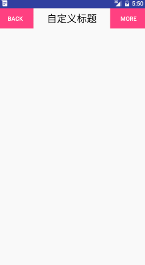

## 复合控件

复合控件主要是对android现有的控件进行一个组合封装，其好处时，对于一些具有共通性的UI控件，我们可以对其进行封装成一个新的控件，通过使用这个新的控件，大大的减少代码量，提高复用性。

因为Android自带的ActionBar局限性太大，对于我们平常项目中的TitleBar不是很适用，最多的TitleBar应该是左边一个按钮，中间标题，右边按钮，这种模式，或显示完全三个或显示左，中等各种组合，下面我们就开始自己封装一个这样的TitleB阿荣，用来学习和加深关于复合控件的理解。

首先，先上效果图


- 定义自定义属性，在values下创建attrs.xml文件，添加如下属性

```xml 
 <declare-styleable name="TopBar">
        <attr name="title1" format="string"/>
        <attr name="titleTextSize" format="dimension"/>
        <attr name="titleTextColor1" format="color"/>
        <attr name="leftTextColor" format="color"/>
        <attr name="leftBackground" format="reference|color"/>
        <attr name="leftText" format="string"/>
        <attr name="rightTextColor" format="color"/>
        <attr name="rightBackground" format="reference|color"/>
        <attr name="rightText" format="string"/>
    </declare-styleable>

```

- 创建TopBar并继承RelativeLayout,在构造方法中，查找参数。通过context.obtainStyledAttributes（）方法获取到TypedArray获取到自定义属性，在通过对应的get方法获取到对应值，最后调用TypedArray.recycle()方法回收资源

```java 

        if (attrs != null) {

            //通过这个方法，将你在attrs.xml中定义的declare-styleable的所有属性存储到TypedArray中。
            TypedArray ta = context.obtainStyledAttributes(attrs, R.styleable.TopBar);

            /**
             * 左侧按钮的属性
             */
            mLeftText =  ta.getString(R.styleable.TopBar_leftText);
            mLeftTextColor = ta.getColor(R.styleable.TopBar_leftTextColor, Color.BLACK);
            mLeftDrawable = ta.getDrawable(R.styleable.TopBar_leftBackground);


            /**
             * 右侧按钮的属性
             */
            mRightText = ta.getString(R.styleable.TopBar_rightText);
            mRightTextColor = ta.getColor(R.styleable.TopBar_rightTextColor, Color.BLACK);
            mRightDrawable = ta.getDrawable(R.styleable.TopBar_rightBackground);


            /**
             * 标题的属性
             */
            mTitle = ta.getString(R.styleable.TopBar_title1);
            mTitleColor = ta.getColor(R.styleable.TopBar_titleTextColor1,Color.BLACK);
            mTitleSize = ta.getDimension(R.styleable.TopBar_titleTextSize, TypedValue.applyDimension(TypedValue.COMPLEX_UNIT_SP, 14, getResources().getDisplayMetrics()));


            ta.recycle();
        }

```
- 添加子控件到该RelativeLayout中.
```java 
  mLeftButton = new Button(context);
        mRightButton = new Button(context);
        mTitleView = new TextView(context);

        mLeftButton.setTextColor(mLeftTextColor);
        mLeftButton.setText(mLeftText);
        mLeftButton.setBackground(mLeftDrawable);

        mRightButton.setText(mRightText);
        mRightButton.setTextColor(mRightTextColor);
        mRightButton.setBackground(mRightDrawable);

        mTitleView.setText(mTitle);
        mTitleView.setTextColor(mTitleColor);
        mTitleView.setTextSize(mTitleSize);
        mTitleView.setGravity(Gravity.CENTER);

        //为组件元素设置相应的布局元素

        mLeftParams = new LayoutParams(LayoutParams.WRAP_CONTENT, LayoutParams.MATCH_PARENT);
        mLeftParams.addRule(RelativeLayout.ALIGN_PARENT_LEFT, TRUE);
        addView(mLeftButton, mLeftParams);


        mRightParams = new LayoutParams(LayoutParams.WRAP_CONTENT, LayoutParams.MATCH_PARENT);
        mRightParams.addRule(RelativeLayout.ALIGN_PARENT_RIGHT, TRUE);
        addView(mRightButton, mRightParams);

        mTitleParams = new LayoutParams(LayoutParams.WRAP_CONTENT, LayoutParams.MATCH_PARENT);
        mTitleParams.addRule(RelativeLayout.CENTER_IN_PARENT, TRUE);
        addView(mTitleView, mTitleParams);
```
- 设置接口回调。因为左侧按钮和右侧按钮需要点击，在Activity中，我们需要获取其点击事件并作不同的处理，这时候我们可以通过设置接口监听的方式。
```java 

	//创建接口
    public interface TopBarClickListener {

        //左按钮点击回掉
        void leftClick();

        //右按钮点击回调
        void rightClick();
    }
```
- 在TopBar中添加字段：`  private TopBarClickListener mTopBarClickListener;`同时添加方法
```java 
   
    public void setTopBarClickListener(TopBarClickListener clickListener) {
        mTopBarClickListener = clickListener;

    }


```
- 设置按钮的监听事件，然后回调我们自己的接口
```java 
		mLeftButton.setOnClickListener(new OnClickListener() {
            @Override
            public void onClick(View v) {
                if (mTopBarClickListener != null) {
                    mTopBarClickListener.leftClick();
                }
            }
        });

        mRightButton.setOnClickListener(new OnClickListener() {
            @Override
            public void onClick(View v) {
                if (mTopBarClickListener != null) {
                    mTopBarClickListener.rightClick();
                }
            }
        });
```
- ok，在我们添加完监听之后，还有一种情况，是当我们左边或者右边按钮不显示的情况，我们可以在添加一个方法，用来控制左右按钮的显示
```java 
    private static final int BUTTON_LEFT = 0;
    public static final int BUTTON_RIGHT = 1;

     /**
     * 设置按钮是否显示
     * @param id
     * @param flag
     */
    private void setButtonVisable(int id,boolean flag){
        if(flag){
            if(id==BUTTON_LEFT){
                mLeftButton.setVisibility(View.VISIBLE);
            }else{
                mRightButton.setVisibility(View.VISIBLE);
            }
        }else{
            if(id==BUTTON_LEFT){
                mLeftButton.setVisibility(View.GONE);
            }else{
                mRightButton.setVisibility(View.GONE);
            }
        }
    }

```

- 定义方面差不多结束了，下面我们创建一个widget_topbar.xml文件，来添加我们的控件，同时如果想要使用自定义属性，必须添加如下生面`xmlns:app="http://schemas.android.com/apk/res-auto"`
```java 
<com.example.mdw.scrollertest.TopBar xmlns:android="http://schemas.android.com/apk/res/android"
    xmlns:app="http://schemas.android.com/apk/res-auto"
    android:id="@+id/top_bar"
    android:layout_width="match_parent"
    android:layout_height="48dp"
    android:orientation="vertical"
    app:leftTextColor="#Fff"
    app:leftText="BACK"
    app:leftBackground="@color/colorAccent"

    app:title1="自定义标题"
    app:titleTextColor1="#000"
    app:titleTextSize="12sp"

    app:rightText="MORE"
    app:rightBackground="@color/colorAccent"
    app:rightTextColor="#fff"


    />
```
同时通过include将该布局文件引入，   `<include layout="@layout/widget_topbar"/>`，在activity中查找并设置监听事件
```java 
public class MainActivity extends AppCompatActivity implements TopBar.TopBarClickListener {

    private TopBar mTopBar;

    @Override
    protected void onCreate(Bundle savedInstanceState) {
        super.onCreate(savedInstanceState);
        requestWindowFeature(Window.FEATURE_NO_TITLE);
        
        setContentView(R.layout.activity_custom_view);

        mTopBar = ((TopBar) findViewById(R.id.top_bar));
        mTopBar.setTopBarClickListener(this);
    }


    @Override
    public void leftClick() {
        Toast.makeText(getApplicationContext(),"left",Toast.LENGTH_SHORT).show();
    }

    @Override
    public void rightClick() {
        Toast.makeText(getApplicationContext(),"right",Toast.LENGTH_SHORT).show();
    }
}

```

- OK，大功告成。下面进行总结。

> **总结**
1. 通过`<declare-styleable>`和`<attr>`标签，添加自定义属性，并通过context.obtainStyledAttributes()方法获取到TypedArray对象获取到自定义值，在获取完属性值之后，一定要调用typedArray的recycle（）方法回收资源。
2. RelativeLayout.LayoutParams中包含addRule（int verb,int anchor） 方法来确定子控件加入到父控件的位置
3. 通过接口回调，将左右两边的按钮单击事件进行回传到actvitiy中。
4. xml中想要使用我们的自定义属性，必须添加如下命名空间的声明`xmlns:app="http://schemas.android.com/apk/res-auto"`。