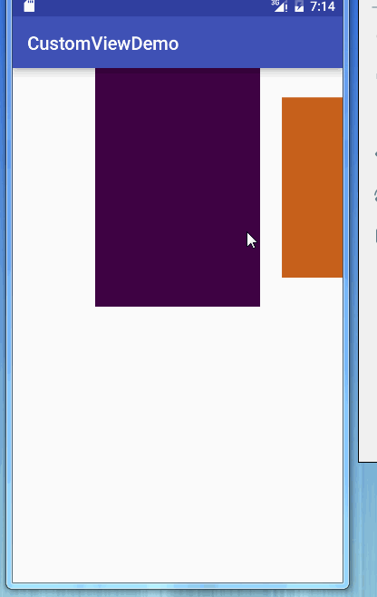

## 自定义View 之利用ViewPager 实现画廊效果（滑动放大缩小）


> 转载请标明出处：
[http://blog.csdn.net/lisdye2/article/details/52292896](http://blog.csdn.net/lisdye2/article/details/52292896)
本文出自:[【Alex_MaHao的博客】](http://blog.csdn.net/lisdye2?viewmode=contents)
项目中的源码已经共享到github，有需要者请移步[【Alex_MaHao的github】](https://github.com/AlexSmille/alex_mahao_sample/tree/master/customviewdemo/src/main/java/com/mahao/alex/customviewdemo/viewpager)


###  基本介绍

画廊在很多的App设计中都有，如下图所示：


该例子是我没事的时候写的一个小项目，具体源码地址请访问[https://github.com/AlexSmille/YingMi](https://github.com/AlexSmille/YingMi)。


该画廊类似封面的效果，滑到中间的图片会慢慢变大，离开的View会慢慢的缩小，同时可设置滑动监听和点击监听。

网上有很多例子都是通过`Gallery`实现的，而上例的实现是通过ViewPager实现，解决了性能优化的问题，今天特此把它抽出来，封装一下，以便以后的方便使用。最终实现的效果如下：




### 使用方式

**布局中添加该自定义控件**

```xml 
<RelativeLayout xmlns:android="http://schemas.android.com/apk/res/android"
    xmlns:tools="http://schemas.android.com/tools"
    android:layout_width="match_parent"
    android:layout_height="match_parent">

    <!-- 布局中添加自定义控件-->
    <com.mahao.alex.customviewdemo.viewpager.CoverFlowViewPager
        android:id="@+id/cover"
        android:layout_width="match_parent"
        android:layout_height="wrap_content" />

</RelativeLayout>


```


**代码中设置**

代码中设置分为以下几个步骤：

- 查找控件
- 初始化数据
- 将需要显示的数据设置到控件上
- 设置滑动监听


```java 
public class MainActivity extends AppCompatActivity {

    private CoverFlowViewPager mCover;

    @Override
    protected void onCreate(Bundle savedInstanceState) {
        super.onCreate(savedInstanceState);
        setContentView(R.layout.activity_main);

        mCover = (CoverFlowViewPager) findViewById(R.id.cover);

        // 初始化数据
        List<View> list = new ArrayList<>();
        for(int i = 0;i<10;i++){
            ImageView img = new ImageView(this);
            img.setBackgroundColor(Color.parseColor("#"+getRandColorCode()));
            list.add(img);
        }
        //设置显示的数据
        mCover.setViewList(list);
        // 设置滑动的监听，该监听为当前页面滑动到中央时的索引
        mCover.setOnPageSelectListener(new OnPageSelectListener() {
            @Override
            public void select(int position) {
                Toast.makeText(getApplicationContext(),position+"",Toast.LENGTH_SHORT).show();
            }
        });
    }


    /**
     * 获取随机颜色，便于区分
     * @return
     */
    public static String getRandColorCode(){
        String r,g,b;
        Random random = new Random();
        r = Integer.toHexString(random.nextInt(256)).toUpperCase();
        g = Integer.toHexString(random.nextInt(256)).toUpperCase();
        b = Integer.toHexString(random.nextInt(256)).toUpperCase();

        r = r.length()==1 ? "0" + r : r ;
        g = g.length()==1 ? "0" + g : g ;
        b = b.length()==1 ? "0" + b : b ;

        return r+g+b;
    }
}

```


### 实现原理


实现过程中有两个难点：

- 如何实现滑动过程中的放大与缩小
- 如何显示ViewPager中未被显示的页面


**如何实现滑动过程中的放大与缩小**

在设置每一个`ViewPager` 的页面时，对每一个页面都设置一个固定的`padding`值，这样每个页面都会显示缩小状态。同时`ViewPager`设置`addOnPageChangeListener()`，滑动监听，在该滑动监听中会回调`ViewPager`的滑动的状态，滑动的偏移量等，根据滑动的偏移量进行放大缩小。及根据`padding`值设置控件的显示大小

**如何显示ViewPager中未被显示的页面**

在`xml`中有一个不常用的属性`android:clipChildren`，是否限制子View的显示。设置为`false`，则子View的显示不受父控件的限制。


### 代码实现


**编写控件的布局文件**

```xml 
<RelativeLayout xmlns:android="http://schemas.android.com/apk/res/android"
    android:layout_width="match_parent"
    android:layout_height="wrap_content"
    android:clipChildren="false">

    <android.support.v4.view.ViewPager
        android:id="@+id/vp_conver_flow"
        android:layout_width="180dp"
        android:layout_height="260dp"
        android:layout_centerHorizontal="true"
        android:clipChildren="false" />
    
</RelativeLayout>

```

一个相对布局中嵌入一个`ViewPager`，相对布局用于确定显示的范围，`ViewPager`用以实现滑动，放大缩小等。

**创建CoverFlowViewPager，加载布局**

```java 
/**
 *
 *  实现封面浏览
 * Created by alex_mahao on 2016/8/25.
 */
public class CoverFlowViewPager extends RelativeLayout implements OnPageSelectListener {
    /**
     * 用于左右滚动
     */
    private ViewPager mViewPager;

    public CoverFlowViewPager(Context context, AttributeSet attrs) {
        super(context, attrs);
        inflate(context, R.layout.widget_cover_flow,this);
        mViewPager = (ViewPager) findViewById(R.id.vp_conver_flow);
        //init();
    }

```

查找控件，并加载布局。

**编写适配器，实现滑动的监听**

既然有了`ViewPager`，那么肯定要有适配器`Adapter`。因为我们要在滑动监听中，根据偏移量操作每一个子元素，放大或缩小，而对于子元素，当然适配器最容易获取，所以将`Adapter`实现了`ViewPager`的滑动监听接口。


```java 
/**
 * 滚动的适配器
 * Created by alex_mahao on 2016/8/25.
 */
public class CoverFlowAdapter extends PagerAdapter implements ViewPager.OnPageChangeListener {

    /**
     *  默认缩小的padding值
     */
    public static int sWidthPadding;

    public static int sHeightPadding;

    /**
     * 子元素的集合
     */
    private List<View> mViewList;

    /**
     * 滑动监听的回调接口
     */
    private OnPageSelectListener listener;

    /**
     * 上下文对象
     */
    private Context mContext;

    public CoverFlowAdapter(List<View> mImageViewList, Context context) {
        this.mViewList = mImageViewList;
        mContext = context;
        // 设置padding值
        sWidthPadding = dp2px(24);
        sHeightPadding = dp2px(32);
    }

    @Override
    public void destroyItem(ViewGroup container, int position, Object object) {
        container.removeView(mViewList.get(position));
    }

    @Override
    public Object instantiateItem(ViewGroup container, int position) {
        View view = mViewList.get(position);
        container.addView(view);

        return view;
    }

    @Override
    public int getCount() {
        return mViewList == null ? 0 : mViewList.size();
    }

    @Override
    public boolean isViewFromObject(View view, Object object) {
        return view == object;
    }

    @Override
    public void onPageScrolled(int position, float positionOffset, int positionOffsetPixels) {
        // 该方法回调ViewPager 的滑动偏移量
        if (mViewList.size() > 0 && position < mViewList.size()) {
            //当前手指触摸滑动的页面,从0页滑动到1页 offset越来越大，padding越来越大
            Log.i("info", "重新设置padding");
            int outHeightPadding = (int) (positionOffset * sHeightPadding);
            int outWidthPadding = (int) (positionOffset * sWidthPadding);
            // 从0滑动到一时，此时position = 0，其应该是缩小的，符合
            mViewList.get(position).setPadding(outWidthPadding, outHeightPadding, outWidthPadding, outHeightPadding);

            // position+1 为即将显示的页面，越来越大
            if (position < mViewList.size() - 1) {
                int inWidthPadding = (int) ((1 - positionOffset) * sWidthPadding);
                int inHeightPadding = (int) ((1 - positionOffset) * sHeightPadding);
                mViewList.get(position + 1).setPadding(inWidthPadding, inHeightPadding, inWidthPadding, inHeightPadding);
            }
        }

    }

    @Override
    public void onPageSelected(int position) {
        // 回调选择的接口
        if (listener != null) {
            listener.select(position);
        }
    }

    @Override
    public void onPageScrollStateChanged(int state) {

    }

    /**
     * 当将某一个作为最中央时的回调
     *
     * @param listener
     */
    public void setOnPageSelectListener(OnPageSelectListener listener) {
        this.listener = listener;
    }


    /**
     * dp 转 px
     *
     * @param dp
     * @return
     */
    public int dp2px(int dp) {
        int px = (int) TypedValue.applyDimension(TypedValue.COMPLEX_UNIT_DIP, dp, mContext.getResources().getDisplayMetrics());

        return px;
    }

}


```

改代码分为两部分，`PagerAdapter`实现，滑动监听的实现。`PagerAdapter`的实现不在多说，最基础的东西。重点在滑动监听的实现。

滑动监听有三个回调方法：其中`onPageScrolled(int position, float positionOffset, int positionOffsetPixels) `回调的便是`ViewPager`的滑动得偏移量，我们再次动态的设置相应元素的`padding`值，实现放大缩小。

`onPageSelected()`为选中的回调，通过自定义接口的方式回调给其调用者。后面会提。


**初始化ViewPager**

既然有了适配器，那么自然就开始编写适配器的部分：

```java 
  /**
     * 初始化方法
     */
    private void init() {
        // 构造适配器，传入数据源
        mAdapter = new CoverFlowAdapter(mViewList,getContext());
        // 设置选中的回调
        mAdapter.setOnPageSelectListener(this);
        // 设置适配器
        mViewPager.setAdapter(mAdapter);
        // 设置滑动的监听，因为adpter实现了滑动回调的接口，所以这里直接设置adpter
        mViewPager.addOnPageChangeListener(mAdapter);
        // 自己百度
        mViewPager.setOffscreenPageLimit(5);

        // 设置触摸事件的分发
        setOnTouchListener(new OnTouchListener() {
            @Override
            public boolean onTouch(View v, MotionEvent event) {
                // 传递给ViewPager 进行滑动处理
                return mViewPager.dispatchTouchEvent(event);
            }
        });
    }

```

注释很详细，唯一需要解释的便是事件的分发。

我们的`ViewPager`的大小是固定的，只有中间的显示区域，那么对于手指在两个侧边滑动时，`ViewPager`自然接受不到触摸事件，通过设置外层相对布局的触摸事件监听，将触摸的事件传递到`ViewPager`，实现滑动`ViewPager`之外区域时，`ViewPager`仍能够实现对应的滑动。


**数据源的包装**

适配器有了，`ViewPager`也有了，那么只剩下数据源了。

因为我们是根据设置`padding`值实现的，那么对于需要显示的控件，他的背景将无法实现放大缩小，所以对控件在包装一层外部控件，这样设置外部控件的`padding`值，自然需要显示的控件会放大缩小。

```java 
  /**
     * 设置显示的数据，进行一层封装
     * @param lists
     */
    public void setViewList(List<View> lists){
        if(lists==null){
            return;
        }
        mViewList.clear();
        for(View view:lists){

            FrameLayout layout = new FrameLayout(getContext());
            // 设置padding 值，默认缩小
            layout.setPadding(CoverFlowAdapter.sWidthPadding,CoverFlowAdapter.sHeightPadding,CoverFlowAdapter.sWidthPadding,CoverFlowAdapter.sHeightPadding);
            layout.addView(view);
            mViewList.add(layout);
        }
        // 刷新数据
        mAdapter.notifyDataSetChanged();
    }

```


**选中监听的回调**

当我们滑动时，可能会根据不同的滑动，显示不同的数据。

通过设置滑动监听之后，对`onPageSelected`实现层层的接口回调。

接口的定义`OnPageSelectListener`

```java 
public interface OnPageSelectListener {
    
    void select(int position);
}

```


`CoverFlowAdapter`中添加回调

```java 
    @Override
    public void onPageSelected(int position) {
        // 回调选择的接口
        if (listener != null) {
            listener.select(position);
        }
    }

```

`CoverFlowViewPager`中添加回调

```java 
 // 显示的回调
    @Override
    public void select(int position) {
        if(listener!=null){
            listener.select(position);
        }
    }


```

**点击事件的设置**

直接对数据源循环设置监听即可


