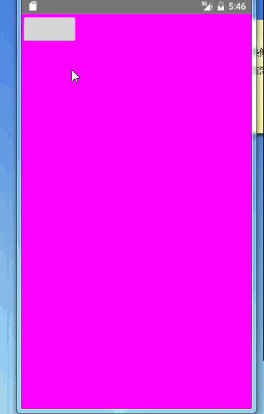

## 自定义View之仿淘宝详情页

> 转载请标明出处：
[http://blog.csdn.net/lisdye2/article/details/52292896](http://blog.csdn.net/lisdye2/article/details/52292896)
本文出自:[【Alex_MaHao的博客】](http://blog.csdn.net/lisdye2?viewmode=contents)
项目中的源码已经共享到github，有需要者请移步[【Alex_MaHao的github】](https://github.com/AlexSmille/alex_mahao_sample/tree/master/customviewdemo/src/main/java/com/mahao/alex/customviewdemo/taobao)

### 基本介绍

现在的一些购物类App例如淘宝，京东等，在物品详情页，都采用了类似分层的模式，即上拉加载详情的方式，节省了空间，使用户的体验更加的舒适。只要对于某个东西的介绍很多时，都可以采取这样的方式，第一个页面显示必要的，第二个页面显示详细信息。

在之前写项目的时候，曾经写过一个类似淘宝详情页的UI效果，如下：


仔细分析这种UI效果，其实很简单，就是两个页面，垂直摆放，同时两个页面之间过渡时，加上一层特殊处理，及当第二个页面显示多少时，松开手指时复原或者直接显示第二个页面。


根据这种特殊的UI效果进行实现封装，最终的效果如下：




能够实现页面的切换，当滑动到第二个页面不足显示区域的三分之一时，则松开手指时会还原，如果超过三分之一，则会跳到第二个页面。

同时实现了一些事件分发的处理，能够嵌入按钮，ViewPager等控件。

### 使用方式

编写`xml`文件，添加控件

```xml 
<?xml version="1.0" encoding="utf-8"?>
<RelativeLayout xmlns:android="http://schemas.android.com/apk/res/android"
    android:layout_width="match_parent"
    android:layout_height="match_parent"
    android:orientation="vertical">

    <com.mahao.alex.customviewdemo.taobao.DetailVerticalView
        android:id="@+id/detailVerticalView"
        android:layout_width="match_parent"
        android:layout_height="match_parent">

        <LinearLayout
            android:layout_width="match_parent"
            android:layout_height="1000dp"
            android:background="#f0f">

            <Button
                android:layout_width="wrap_content"
                android:layout_height="wrap_content"
                android:onClick="test" />
        </LinearLayout>

        <FrameLayout
            android:layout_width="match_parent"
            android:layout_height="1000dp"
            android:background="#ff0" />

    </com.mahao.alex.customviewdemo.taobao.DetailVerticalView>

</RelativeLayout>

```

在实现中，一定要将控件的高度设置为`match_parent`，因为在代码中需要获取显示区域的高度，用以判断是否复原和跳转页面。

在该控件中添加两个布局控件。


在`Activity`中查找控件并设置一些监听。


```java 
public class DetailVerticalActivity extends AppCompatActivity {

    private DetailVerticalView v;

    @Override
    protected void onCreate(@Nullable Bundle savedInstanceState) {
        super.onCreate(savedInstanceState);
        setContentView(R.layout.activity_taobao_detail);
        // 查找控件
        v = (DetailVerticalView) findViewById(R.id.detailVerticalView);
        // 设置滚动监听的回调
        v.setScrollChangeListener(new DetailVerticalView.ScrollChangeListener() {

            @Override
            public void scrollY(int y) {
                // y轴滑动偏移量的回调
            }

            @Override
            public void onScollStateChange(int type) {
                // 滑动到那个页面状体的变化
                if(DetailVerticalView.TOP == type){
                    Toast.makeText(DetailVerticalActivity.this, "1", Toast.LENGTH_SHORT).show();
                }else if(DetailVerticalView.BOTTOM==type){
                    Toast.makeText(DetailVerticalActivity.this, "2", Toast.LENGTH_SHORT).show();
                }
            }
        });
    }

    public void test(View view){
        Toast.makeText(getApplicationContext(),"点击",Toast.LENGTH_SHORT).show();
    }
}

```


### 实现原理

在实现过程中，主要考虑以下几点问题：

- 如何布置两个页面的控件位置。

解决方式是使自定义`View`实现`ViewGroup`，重写`onMeasure`和`onLayout`方法，对子`View`进行布局。

- 如何判断两个页面何时跳转，

解决方式：获取`View`显示区域高度的三分之一，如果超过，则显示第二个页面，否则
则恢复原状，不显示第二个页面。

- 如何实现滑动的过渡。

解决方式：使用`Scroller`进行滑动的控制。

- 判断的一些边界的问题。

滑动到底部和滑动到顶部时，等不可再滑，需要对边界进行配置。

- 事件分发的处理。

对于点击等事件，利用`onInterceptTouchEvent()` 对相关事件进行拦截。


### 代码实现

**创建对象，初始化控件**

```java 
/**
 *
 * 仿淘宝详情页
 * Created by alex_mahao on 2016/8/29.
 */
public class DetailVerticalView extends ViewGroup {

    // 滑动到顶部的状态
    public static final int TOP = 1;

    // 滑动到底部的状态
    public static final int BOTTOM = 2;

    public static final String TAG = "DetailVerticalView";

    /**
     * 屏幕高度
     */
    private int mScreenHeight;

    /**
     * 手指上次触摸事件的y轴位置
     */
    private int mLastY;

    /**
     * 点击时y轴的偏移量
     */
    private int mScrollY;

    /**
     * 滚动控件
     */
    private Scroller mScroller;

    /**
     * 最小移动距离判定
     */
    private int mTouchSlop;

    /**
     * 滑动结束的偏移量
     */
    private int mEnd;

    /**
     * 初始按下y轴坐标
     */
    private int mDownStartY;

    /**
     * 记录当前y轴坐标
     */
    private int y;

    /**
     * 控件的高度
     */
    private int mHeight;

    /**
     * 监听的回调
     */
    private ScrollChangeListener scrollChangeListener;

    public DetailVerticalView(Context context) {
        super(context, null);
    }

    public DetailVerticalView(Context context, AttributeSet attrs) {
        super(context, attrs);
        init();
    }

    /**
     * 初始化方法
     */
    private void init() {

        // 创建滑对象，以便滑动时使用
        mScroller = new Scroller(getContext());

        // 获取系统的最小距离
        mTouchSlop = ViewConfigurationCompat.getScaledPagingTouchSlop(ViewConfiguration.get(getContext()));
    }
	
	//....
}

```

一些变量的定义后面会有，此处不提。

`mTouchSlop`，系统默认的最小距离。当手指滑动的大小大于该值时，则认为是滑动，不在是点击，后面会通过与该值比对进行事件拦截。


**测量自身的大小和两个页面控件的大小**

```java 
    @Override
    protected void onMeasure(int widthMeasureSpec, int heightMeasureSpec) {
        super.onMeasure(widthMeasureSpec, heightMeasureSpec);
        // 获取显示区域的高度
        mScreenHeight = MeasureSpec.getSize(heightMeasureSpec);
        
        // 遍历子View
        int count = getChildCount();
        // 控件的高度
        mHeight = 0;
        for (int i = 0; i < count; i++) {
            View childView = getChildAt(i);
            // 测量子View 高度
            int childHeight = MeasureSpec.makeMeasureSpec(Integer.MAX_VALUE >> 2, MeasureSpec.AT_MOST);
            measureChild(childView, widthMeasureSpec, childHeight);
            mHeight = getChildAt(i).getMeasuredHeight() + mHeight;
        }
        // 设置控件的高度
        setMeasuredDimension(widthMeasureSpec, MeasureSpec.makeMeasureSpec(mHeight, MeasureSpec.EXACTLY));

    }

```

设置自定义`View`的高度为`match_parent`，就是为了获取显示区域的高度，从此处可以看出。

测量子`View`的高度，便于后面的布局使用。在中间，会看到我对`childView`的高度设置了值`childHeight`，该值的目的是告诉子`View`,我给你一个很大的值，你看着自己需要多少自己设置就行，及`AT_MOST`模式

在最后的时候，设置当前控件的高度，为两个页面控件的高度之和。

**对两个页面控件进行布置onLayout()方法**

```java 

@Override
    protected void onLayout(boolean changed, int l, int t, int r, int b) {

        int childCount = getChildCount();
        int childHeight = 0;
        for (int i = 0; i < childCount; i++) {
            View child = getChildAt(i);
            if (child.getVisibility() != View.GONE) {
                // 确定位置
                child.layout(l, childHeight, r, childHeight + child.getMeasuredHeight());
                childHeight = +child.getMeasuredHeight();
            }
        }

    }

```

这一段没什么难度，看着理解即可。


**处理事件分发**

```java 
 @Override
    public boolean onInterceptTouchEvent(MotionEvent ev) {
        // 获取当前触摸位置Y轴坐标
        y = (int) ev.getY();
        switch (ev.getAction()) {
            case MotionEvent.ACTION_DOWN:
                // 第一次按下时的Y轴坐标
                mDownStartY = (int) ev.getY();
                break;
            case MotionEvent.ACTION_MOVE:
                // 如果大于mTouchSlop，认为是滑动，则不再让子View处理事件
                if (Math.abs(y - mDownStartY) > mTouchSlop) {
                    // 因为是在onTouchEvent中处理，如果子View处理过事件，
                    // 则该控件的onTouchEvent()不再有DOWN事件，在这里获取一些值
                    mLastY = y;
                    mScrollY = getScrollY();
                    return true;
                }
                break;
            case MotionEvent.ACTION_UP:
                break;
        }
        return false;
    }

```

对于事件的传递，流程为 父：`onInterceptTouchEventr` - > 子：`onTouchEvent()` -> 父：`onTouchEvent()`,当然这里只是写了必要的流程。如果子：`onTouchEvent()`返回`true`,则当前控件就无法捕获触摸事件，那么滑动就无从处理了。所以，在此处，我们判断垂直滑动大于最小滑动距离时，就把事件给截断，不在交给子控件处理。

同时，如果子控件处理了一些事件，那么父控件的`onTouchEvent()`中，将不在有`DOWN`事件，那么我们需要先获取一次值，在打断子`View`的时候。


**滑动相关的处理**

```java 
@Override
    public boolean onTouchEvent(MotionEvent event) {
        y = (int) event.getY();
        mScrollY = getScrollY();
        switch (event.getAction()) {
            case MotionEvent.ACTION_DOWN:
                // 如果通过事件拦截获取到的触摸，则直接就为Move方法
                mLastY = y;
                mScrollY = getScrollY();
                break;

            case MotionEvent.ACTION_MOVE:
                int dy = mLastY - y;

                Log.i(TAG,"dy:"+dy+"-"+"mLastY:"+mLastY+"-"+"mScrolly:"+mScrollY);

                if(mScrollY+dy<0){
                    // 滑动到顶部，不可再滑动
                    scrollTo(0,0);
                }else if(mScrollY+dy>getMeasuredHeight()-mScreenHeight){
					//底部时
                    scrollTo(0,getMeasuredHeight()-mScreenHeight);
                }else{
                    scrollBy(0, dy);
                    mLastY = y;
                }

                break;
            case MotionEvent.ACTION_UP:

                // 当前偏移量是
                int absScroll = mScrollY+mScreenHeight-getChildAt(0).getMeasuredHeight();

                if(absScroll<0||absScroll>mScreenHeight){
                    // 第一个页面未滑到底部，不做操作，如果absScroll>屏幕的高度，则完全滚动
                    // 不做任何滚动操作
                }else if(absScroll>mScreenHeight/3){
					// 监听的回调
                    if(scrollChangeListener!=null){
                        scrollChangeListener.onScollStateChange(BOTTOM);
                    }
                    // 松开时显示第二个页面
                    mScroller.startScroll(0, mScrollY, 0, mScreenHeight-absScroll);
                }else if(absScroll<mScreenHeight/3){
                    // 回到第一个页面
                    if(scrollChangeListener!=null){
                        scrollChangeListener.onScollStateChange(TOP);
                    }
                    mScroller.startScroll(0,mScrollY,0,-absScroll);
                }
                break;
        }
        postInvalidate();

        return true;
    }

```

该段是整个自定义`View`中最重要的方法，总结来说干了两件事情：

- `ACTION_MOVE`中，处理触摸滑动的事件，及手指在屏幕滑动时的相关处理。

边界处理，判断滑动时，如果到顶部和底部，则不再滑动，否则进行相关的滑动。

- `ACTION_UP`：手指离开屏幕时，对是否需要跳转进行判断，如果需要跳转，则跳转。

在手指离开时，判断当前页面的显示量，偏移量+显示区域的高度-第一个控件的高度=第二个控件显示的高度。

如果显示的高度小于0，则表示还在第一个页面，第二个页面显示都没显示，不做任何处理。

如果显示的高度大于显示区域的高度，则表示第二个页面完全显示了，不做任何处理。

否则，如果显示的高度大于显示区域的1/3，则跳转到第二个页面，小于，则恢复到第一个页面。

可以看到通过`mScroller.startScroll()`实现页面的滑动跳转，使用该方式，需要重写另一个方法


```java 

   @Override
    public void computeScroll() {
        super.computeScroll();
        //判断scroller滚动是否完成
        if (mScroller.computeScrollOffset()) {
            // 这里调用View的scrollTo()完成实际的滚动
            scrollTo(0, mScroller.getCurrY());
            //刷新试图
            postInvalidate();
        }
    }

```


**最后一步，设置一些必要的监听回调，和辅助方法**


```java 
  /**
     * 监听的接口定义
     */
    public interface  ScrollChangeListener{
        void scrollY(int y);
        void onScollStateChange(int type);
    }

    /**
     * 设置监听
     * @param scrollChangeListener
     */
    public void setScrollChangeListener(ScrollChangeListener scrollChangeListener) {
        this.scrollChangeListener = scrollChangeListener;
    }

```


```java 
	/**
     * 回到第一个页面的顶部
     */
    public void scrollToTop(){
        mScroller.startScroll(0, getScrollY(), 0, -getScrollY());
        scrollChangeListener.onScollStateChange(TOP);
        postInvalidate();

    }

```
