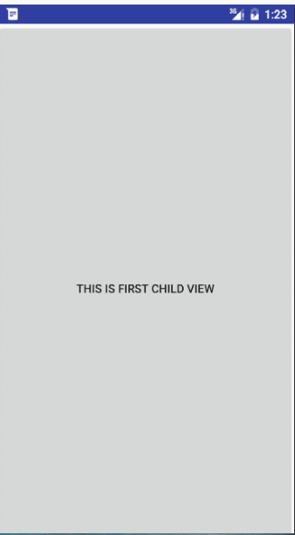
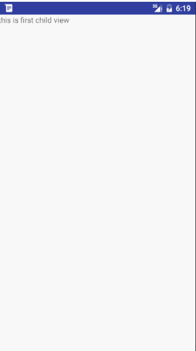
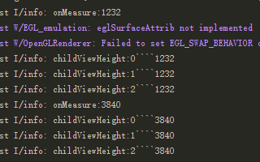
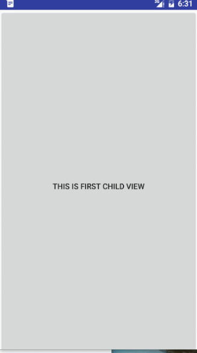

## 垂直滑动的ViewPager

研究了几天的自定义View，以及对应的事件分发，触摸拦截等，感觉是时候要来一点稍微有点难度的东西了。

实例图：


从图中可以看到，我们的View有三个页面，因为为了要显示事件拦截，所以第一个页面添加了一个button按钮。用来展示点击事件。

在实现的过程中踩了很多坑，虽然花费了不少时间，但对View的事件拦截还有测量等有了一个全新的认识。

- 按照惯例，先上字段图：
```java 
/**
     * 屏幕高度
     */
    private int mScreenHeight;

    /**
     * 手指上次触摸事件的y轴位置
     */
    private int mLastY;

    /**
     * 点击时y轴的偏移量
     */
    private int mStart;

    /**
     * 滚动控件
     */
    private Scroller mScroller;

    /**
     * 最小移动距离判定
     */
    private int mTouchSlop;

    /**
     * 滑动结束的偏移量
     */
    private int mEnd;

    /**
     * 初始按下y轴坐标
     */
    private int mDownStartX;

    /**
     * 记录当前y轴坐标
     */
    private int y;
```

- 按照定义View习惯，我们首先重写onMeasure()方法
```java 
 @Override
    protected void onMeasure(int widthMeasureSpec, int heightMeasureSpec) {
        super.onMeasure(widthMeasureSpec, heightMeasureSpec);

        int count = getChildCount();

        for (int i = 0; i < count; i++) {
            View childView = getChildAt(i);
           
            measureChild(childView, widthMeasureSpec, heightMeasureSpec);
        }


       Log.i("info", "onMeasure:"+getMeasuredHeight());
    }
```

在onMeasure()方法中，我们就干了一件事情，测量childView的宽高。看着没问题，于是我们开心的进入下一步。但此处有**大坑**。
- 重写onLayout()方法。
```java 
  @Override
    protected void onLayout(boolean changed, int l, int t, int r, int b) {

        int childCount = getChildCount();
		//重新设置控件的高度
        MarginLayoutParams mlp = (MarginLayoutParams) getLayoutParams();
        mlp.height = childCount*mScreenHeight;
        setLayoutParams(mlp);


        for (int i = 0; i < childCount; i++) {
            View child = getChildAt(i);
            if (child.getVisibility() != View.GONE) {
                child.layout(l, i * mScreenHeight, r, (i + 1) * mScreenHeight);
            }
        }
     

    }
```
因为我们想做一个垂直滑动并带有惯性的页面，那么当前View的高度应该是我们测量子View高度的总和，所以我们首先先设置一下当前控件的高度

其次，我们需要代码来确定不同控件的位置，通过调用child.layout()方法来确定子View在当前控件的位置。

- 重写onTouchEvent()方法进行事件处理
```java 
 @Override
    public boolean onTouchEvent(MotionEvent event) {
        y = (int) event.getY();
        switch (event.getAction()) {
            case MotionEvent.ACTION_DOWN:
                mLastY = y;
                mStart = getScrollY();
                break;

            case MotionEvent.ACTION_MOVE:
                if (!mScroller.isFinished()) {
                    mScroller.abortAnimation();
                }

                //手指移动的偏移量
                int dy = mLastY - y;

                if (getScrollY() < 0) {
                    dy = 0;
                }

                Log.i("info", "scroll:" + getScrollY() + "height:" + getHeight() + "mScreenHeight:" + mScreenHeight + "dy" + dy);
                if (getScrollY() > getHeight() - mScreenHeight) {
                    dy = 0;
                }

                scrollBy(0, dy);
                mLastY = y;
                break;
            case MotionEvent.ACTION_UP:
                mEnd = getScrollY();//偏移量，初始y-移动后的y
                int dScrollY = mEnd - mStart;
               // Log.i("info",dScrollY);
                if (dScrollY > 0) {
                    if (dScrollY < mScreenHeight / 3) {
                        mScroller.startScroll(0, getScrollY(), 0, -dScrollY);
                    } else {
                        mScroller.startScroll(0, getScrollY(), 0, mScreenHeight - dScrollY);
                    }
                } else {
                    if (-dScrollY < mScreenHeight / 3) {
                        mScroller.startScroll(0, getScrollY(), 0, -dScrollY);
                    } else {
                        mScroller.startScroll(0, getScrollY(), 0, -mScreenHeight - dScrollY);
                    }
                }
                break;
        }
        postInvalidate();
        return true;
    }
```
在ACTION_DOWN中，我们保存了手指按下事件的y坐标，以及getScrollY（）获取当前y轴相距控件原点的偏移量mStart。

在ACTION_MOVE中，我们先判断当前页面是否在滑动，如果仍在滑动中，则停止滑动。同时在18行的if判断是判断上边界，如果当前y轴偏移量小于0，则表示已滑倒顶部，此时dy=0，及不做任何滑动处理。23行判断下边界，即控件的总高度减去当前的偏移量如果小于一个childView的高度，则表示已滑倒底部，同样不做处理。最后调用scrollBy（0，dy）;进行相应位置的滚动。

> scrollBy()是相对于当前位置的偏移量。
> scrollTo()是移动到指定的x,y的具体坐标 


在ACTION_UP中，获取当前y轴偏移量mEnd,计算总差值，如果差值大于页面的三分之一，就默认到下一个页面，否则返回。利用Scroller的startScroll（）方法启动活动。

- 重写computeScroll()，配合startScroll()。
```java 
   @Override
    public void computeScroll() {
        super.computeScroll();
        //判断scroller滚动是否完成
        if (mScroller.computeScrollOffset()) {
            // 这里调用View的scrollTo()完成实际的滚动
            scrollTo(0, mScroller.getCurrY());
            //刷新试图
            postInvalidate();
        }
    }
```

- 在xml中添加三个TextView
```xml 
<com.example.mdw.scrollertest.VerticalScrollerLayout xmlns:android="http://schemas.android.com/apk/res/android"
    android:layout_width="match_parent"
    android:layout_height="match_parent"
    android:orientation="vertical">

    <TextView

        android:text="this is first child view"
        android:layout_width="match_parent"
        android:layout_height="match_parent" />
    <TextView
        android:textColor="#000"
        android:gravity="center"
        android:background="#ff0"
        android:text="this is second child view"
        android:layout_width="match_parent"
        android:layout_height="match_parent" />
    <TextView
        android:gravity="center"
        android:background="#0ff"
        android:text="this is third child view"
        android:textAllCaps="false"
        android:layout_width="match_parent"
        android:layout_height="match_parent" />

    </com.example.mdw.scrollertest.VerticalScrollerLayout >
```

OK,看一下效果图。

效果上看着不错，但在第二个页面，文字居中确无法显示，看不到文字，这时候还记得前面提到的那个坑。首先Log一下控件以及子控件的高度。

这。。onMeasure()和onLayout（）调用了两次，在第二次时，子控件的高度设置成了我们整个控件的高度。所以center无法看到控件。这时候我们在onMeasure()的measureChild()方法中做出如下修改
```java 
 measureChild(childView, widthMeasureSpec, mScreenHeight);
```
我们手动传入，让子控件的高度固定为屏幕的高度。但是，我们测试中，会出现，控件可以gravity属性的“center_horizontal”有用，“center_vertical”属性无用，这让我想到了之前关于测量MeasureSpec类，于是我们继续修改代码。
```java 
	int childHeight = MeasureSpec.makeMeasureSpec(mScreenHeight,MeasureSpec.EXACTLY);
    measureChild(childView, widthMeasureSpec, childHeight);
```
OK,这样就没问题了。下面我们把第一个TextView改成Button。
```xml 
	<Button
        android:onClick="show"
        android:text="this is first child view"
        android:layout_width="match_parent"
        android:layout_height="match_parent" />
```



会发现我们无法滑动，始终调用Button的onClick().这是因为Button将该事件消费了，当前控件onTouchEvent()方法无法调用。这时候，我们需要重写onInterceptTouchEvent()方法，拦截事件向子类分发。
```java 
 	@Override
    public boolean onInterceptTouchEvent(MotionEvent ev) {
       y = (int) ev.getY();
        switch (ev.getAction()) {
            case MotionEvent.ACTION_DOWN:
                mDownStartX = (int) ev.getY();
                mLastY = y;
                mStart = getScrollY();
                break;
            case MotionEvent.ACTION_MOVE:
                if(Math.abs(y-mDownStartX)>mTouchSlop){
                    return true;
                }
                break;
            case MotionEvent.ACTION_UP:
                break;
        }
        return super.onInterceptTouchEvent(ev);
    }
```
在onInterceptTouchEvent()中，我们在ACTION_DOWN中获取点击的y坐标，在ACTION_MOVE中，当触摸距离大于系统默认的最小移动距离，我们return true;阻拦事件往childView分发。

在ACTION_DOWN中我们多做了两步，分别获取mLastY和mStart字段，看似是无用的，因为我们在onTouchEvent中的ACTION_DOWN也做了类似操作，但如果熟知事件分发的应该清楚，在初次点击时，因为子类的Button将ACTION_DOWN方法进行消费了，当前的onTouchEvent()不会调用。所以。。

如果对事件分发有疑问的请看我之前写的blog[View事件分发](http://blog.csdn.net/lisdye2/article/details/50858970),   [ViewGroup事件分发](http://blog.csdn.net/lisdye2/article/details/50858981).

> 到此，自定义View的基础类已经大致研究结束了，下面就开始进行更加高深的，绚丽的自定义View技巧了。

关于自定义View的源码已上传到github。如需源码请移步https://github.com/AlexSmille/CustomView