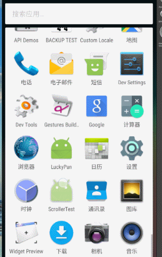

## 重写View来实现全新的控件

在Android中重写View是Android中的难点，但很多特效都是基于自定义View来实现的，下面我们来尝试通过两个例子来学习一下自定义View。

首先看一下实例图



#### 圆形进度图

通过看图，整个图可以分为三部分，内部圆环，外部弧形，以及文字。

- 首先看一下我们定义的一些字段
```java 
  /**
     * 圆心坐标
     */
    private int mCircleXY;

    /**
     * 内部圆半径
     */
    private int mRadius;

    /**
     * 控件的宽度
     */
    private int width;
    /**
     *  椭圆的文字
     */
    private String mText;

    /**
     * 弧形的画笔
     */
    private Paint mArcPaint;

    /**
     * 文字的画笔
     */
    private Paint mTextPaint;

    /**
     * 内部圆的画笔
     */
    private Paint mCirclePaint;


    /**
     * 弧形的内切矩形
     */
    private Rect mArcRect;


    /**
     * 圆心文字
     */
    private String mCenterText = "Alex_Mahao";

    /**
     * 文字所占大小
     */
    private Rect mTextBound = new Rect();

    /**
     * 外部弧形的度数
     */
    private int mSweepAngle;

    /**
     * 外部弧形的最终度数
     */
    private int mEndAngle;

```

- 重写onMeasure（）方法。
```java 
 @Override
    protected void onMeasure(int widthMeasureSpec, int heightMeasureSpec) {

        super.onMeasure(widthMeasureSpec, heightMeasureSpec);

        width = Math.min(getMeasuredWidth(),getMeasuredHeight());

        setMeasuredDimension(width,width);

        mCircleXY = width/2;

        mRadius = width/2/2;

        initPaint();

        //弧形矩形的范围
        mArcRect = new Rect(width/2/2/2/2,width/2/2/2/2,width-width/2/2/2/2,width-width/2/2/2/2);
        //测量文字的大小
        mTextPaint.getTextBounds(mCenterText, 0, mCenterText.length(), mTextBound);

		//设置弧形的进度
        setProgress(270);
    }
```
在onMeasure()方法中，首先对比宽和高取最小值，因为我们的该View为正方形，在第6行，我们获取测量后的宽高，取最小值，并重新设置控件的宽高。 

然后我们获取该控件的中心坐标。并获取内部圆的半径为控件宽度的四分之一。

- 初始化画笔
```java 
  private void initPaint() {
        mArcPaint = new Paint();
        mArcPaint.setColor(Color.BLUE);
        mArcPaint.setAntiAlias(true);
        mArcPaint.setStyle(Paint.Style.STROKE);
        mArcPaint.setStrokeWidth(width/2/2/2);


        mCirclePaint = new Paint();
        mCirclePaint.setColor(Color.RED);
        mCirclePaint.setStyle(Paint.Style.FILL);
        mCirclePaint.setAntiAlias(true);

        mTextPaint = new Paint();
        mTextPaint.setColor(Color.WHITE);
        mTextPaint.setTextSize(TypedValue.applyDimension(TypedValue.COMPLEX_UNIT_SP,16,getResources().getDisplayMetrics()));
        mTextPaint.setAntiAlias(true);

    }
```
在该方法中，我们初始化mArcPaint,mCirclePaint,mTextPaint,在设置mArcPaint中设置了Paint的画笔宽度，用来画出圆形弧，在设置了画笔的宽度之后，我们的onMeasure（）方法中，初始化弧形矩形的范围，那圆形弧的宽度的一半内切矩形，所以，我们必须减去弧形矩形的一半。及弧形的宽度为width/2/2/2,则对应的内切矩形为(width/2/2/2/2,width/2/2/2/2,width-width/2/2/2/2,width-width/2/2/2/2)；

- 重写onDraw()方法，画出对应图形。
```java 
 @Override
    protected void onDraw(Canvas canvas) {

 		canvas.drawCircle(mCircleXY,mCircleXY,mRadius,mCirclePaint);

 	    canvas.drawText(mCenterText,width/2-mTextBound.width()/2,getHeight()/2+mTextBound.height()/2,mTextPaint);

        //在画笔有宽度的情况下，画笔的宽度的一半正好内切范围矩形
        canvas.drawArc(new RectF(mArcRect),-90,mSweepAngle,false,mArcPaint);

        if(mEndAngle>mSweepAngle){
            mSweepAngle++;
 			postInvalidateDelayed(5);
        }

       
    }
```
通过canvas.drawCircle（）方法画出内部圆，参数分别为圆心x坐标，圆心y坐标，半径，画笔。

通过canvas.drawText（）画出文字，因为我们要将文字画出到中心，在onMeasure（）方法通过Paint的getTextBounds()测量出包含文字所占空间大小的Rect对象，继而通过控件宽高的一半-Rect对象的一半，设置到对应中心。

通过canvas.drawArc（）方法画出弧形，参数分别为，内切矩形，起始度数（0都为右侧，-90度为上方），弧度的偏移度数，是否画出圆心，画笔。

如果我们不想外部弧度慢慢增加，直接将mSweepAngle设置为固定值即可。如果我们想要其慢慢滚动，有一个缓冲效果，我们需要添加如下方法
```java 
 public void setProgress(int endAngle){
        mEndAngle = endAngle;
        mSweepAngle = 0;
        postInvalidate();
    }
```
该方法，可以在activity中调用，我为了简单，在onMeasure()方法中调用了，该方法做了三件事，将我们最终的弧度赋值，将当前弧度置为0，刷新控件（就是调用onDraw()）方法。那么，在onDraw()方法中，会进入到if(mEndAngle>mSweepAngle)中，自增当前度数，同时发送一个5ms之后刷新试图的延时任务。

- OK,搞定，我们可以根据自己的需求，定制内部的文字，颜色等等。


#### 条形图（音乐播放的）

按照惯例,先上字段：
```java 
       /**
     * 控件的宽度
     */
    private int mWidth;

    /**
     * 条形的高度
     */
    private int mRectHeight;

    /**
     * 条形的宽度
     */
    private int mRectWidth;

    /**
     * 条形的数量
     */
    private int mRectCount = 5;
    /**
     * 颜色的渲染器
     */
    private LinearGradient mLinearGradient;

    /**
     * 画笔
     */
    private Paint mPaint;
    /**
     * 随机条形的高度
     */
    private double mRandom;
```

- 在构造方法中初始化画笔
```java 
        /**
         * 初始化画笔
         */
        mPaint = new Paint();
        mPaint.setStyle(Paint.Style.FILL);
        mPaint.setAntiAlias(true);
```
- 在onSizeChange()方法中，获取一些必要属性
```java 
		//控件的宽度
        mWidth = getWidth();

        //条形的最大高度，最低端的坐标
        mRectHeight = getHeight();

        //条形图占总宽度的位置
        mRectWidth = (int) (mWidth*0.6/mRectCount);

        //渲染器，
        mLinearGradient = new LinearGradient(0,0,mRectWidth,mRectHeight, Color.YELLOW,Color.BLUE, Shader.TileMode.CLAMP);

        //设置渲染器
        mPaint.setShader(mLinearGradient);
```
- onDraw()中画出条形图。
```java 
   for(int i=0;i<mRectCount;i++){
            //获取随机数，获得条形的高度
            mRandom = Math.random();
            float currentHeight = (float) (mRectHeight*mRandom);
            
            //画出条形图
            canvas.drawRect((float)(mWidth*0.4/2+mRectWidth*i),
                        currentHeight,
                    (float)( mWidth*0.4/2+mRectWidth*(i+1)),
                        mRectHeight,
                    	mPaint
                    );
        }
        //300ms刷新视图，改变条形图
        postInvalidateDelayed(300);
```

注释已经很清楚了，不再多解释。

下面对这两个控件的知识点进行总结

> 总结
> 1. 在通过canvas.drawArc()画圆弧，设置了画笔的宽度，则限制圆弧的外切矩形，外切的不是圆弧最外端的像素，而是画笔宽度的一半，所以此时在计算外切矩形时，需要考虑到画笔的宽度。
> 2. 让文字居中，一直是自定义View中头疼的一件事，我们通过Paint的getTextBounds(String text, int start,int end,Rect bounds)方法，获取文字所占空间大小，该控件值之间存储到了传入的bounds参数中，这时，我们通过canvas.drawText(String text,float x,float y,Paint paint);这里又有一个坑，x表示的是左上x的坐标，y是右下y的坐标。
> 3. `TypedValue.applyDimension(TypedValue.COMPLEX_UNIT_SP,16,getResources().getDisplayMetrics())`，sp->dp的转化