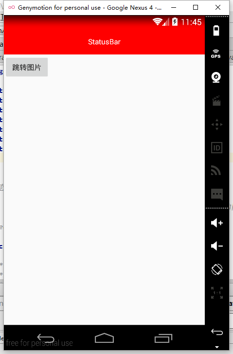
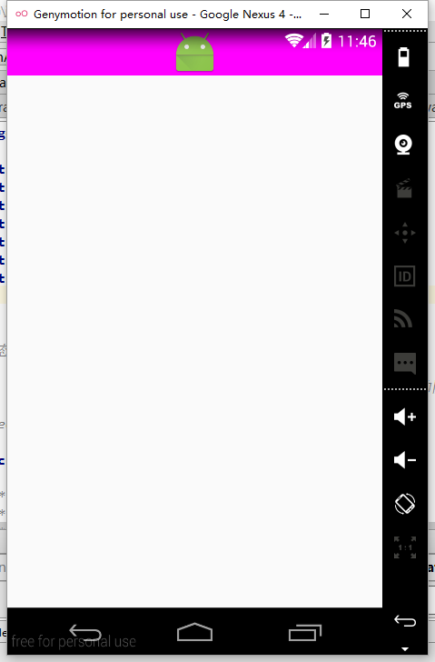
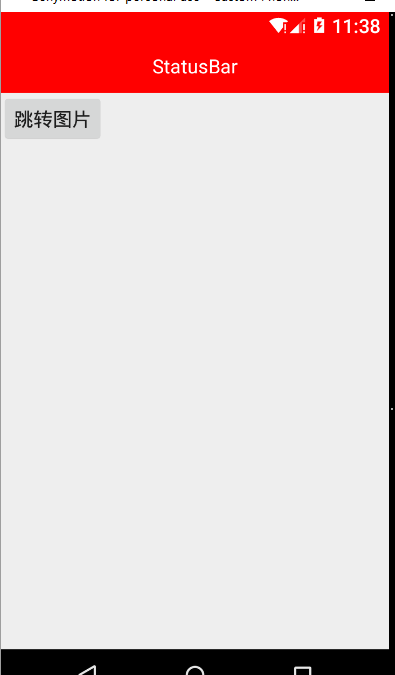
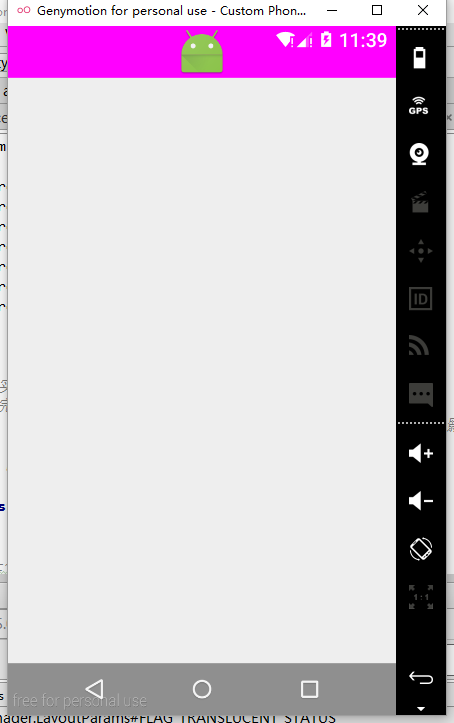

## 透明状态栏(StatusBar)的全适配

状态栏指定android手机上顶部显示手机状态信息的位置。

透明状态栏是android 自4.4开始新加入的功能，他可以是状态栏根据我们自己想要的颜色进行定义，使titleBar能够和状态栏融为一体，增加沉浸感。

### **实现中遇到的阻碍**

因为状态栏是在4.4加入的，所以在4.4以前的系统上无法实现。现在世面上的手机android4.4一下的占比不是很大，所以不是太影响。

网上有很多关于透明状态栏实现的技术博客，以及我之前的博客[透明状态栏（沉浸式状态栏）](http://blog.csdn.net/lisdye2/article/details/50583790)中，实现方式为通过设置`android：windowTanslucentStatus`和`fitSystemWindows`实现。

但通过属性设置的方式在使用中会出现沉浸状态不一样的现象，在5.0及以上的系统中使用透明状态栏不是完全透明的，会在透明的基础上添加一层半透明的阴影，非常的不友好。于是解决在不同系统版本之间的适配是主要问题。

## **解决方式**

对于透明状态栏，有以下两种情况

- 设置状态栏为一个单纯的颜色。
- 顶部是图片时，使图片沉浸到状态栏上。

对于适配，有以下两种情况需要适配

- 4.4系统

- 5.0及以上系统

那么思路如下：

- 当状态栏需要设置一个单纯的颜色时：
	- 4.4：设置`android：windowTranslucateStatus`属性，并且手动添加一个和状态栏高度等高的View。
	- 5.0及以上：不设置`android:windowTranslucateStatus`属性，直接设置`statusBarColor`的色值。

- 当状态栏需要设置一个图片
	- 4.4：直接设置`android：windowTranslucateStatus`属性。
	- 5.0：不设置，同时设置状态栏颜色透明，并使用另一个属性。


### 代码实现

```java 
/**
 *
 * 状态栏的实现封装类
 *      - 完成以下两种功能：
 *          1，设置一个纯色，适配4.4并以上，需要处理5.0并以上的阴影效果
 *          2，当顶部是一个图片，上移到状态栏
 * Created by mdw on 2016/5/6.
 */
public class StatusBarUtils  {

    /**
     * 将acitivity中的activity中的状态栏设置为一个纯色
     * @param activity 需要设置的activity
     * @param color 设置的颜色（一般是titlebar的颜色）
     */
    public static void setColor(Activity activity,int color){
        if (Build.VERSION.SDK_INT >= Build.VERSION_CODES.LOLLIPOP) {
            //5.0及以上，不设置透明状态栏，设置会有半透明阴影
            activity.getWindow().clearFlags(WindowManager.LayoutParams.FLAG_TRANSLUCENT_STATUS);
            //设置statusBar的背景色
            activity.getWindow().setStatusBarColor(color);
        } else if (Build.VERSION.SDK_INT >= Build.VERSION_CODES.KITKAT) {
            activity.getWindow().addFlags(WindowManager.LayoutParams.FLAG_TRANSLUCENT_STATUS);
            // 生成一个状态栏大小的矩形
            View statusView = createStatusBarView(activity, color);
            // 添加 statusView 到布局中
            ViewGroup decorView = (ViewGroup) activity.getWindow().getDecorView();
            decorView.addView(statusView);
            //让我们的activity_main。xml中的布局适应屏幕
            setRootView(activity);
        }
    }


    /**
     * 当顶部是图片时，是图片显示到状态栏上
     * @param activity
     */
    public static void setImage(Activity activity){
        if (Build.VERSION.SDK_INT >= Build.VERSION_CODES.LOLLIPOP) {
            //5.0及以上，不设置透明状态栏，设置会有半透明阴影
            activity.getWindow().clearFlags(WindowManager.LayoutParams.FLAG_TRANSLUCENT_STATUS);
            //是activity_main。xml中的图片可以沉浸到状态栏上
            activity.getWindow().addFlags(WindowManager.LayoutParams.FLAG_TRANSLUCENT_NAVIGATION);
            //设置状态栏颜色透明。
            activity.getWindow().setStatusBarColor(Color.TRANSPARENT);
        } else {
            //。。。。
            activity.getWindow().addFlags(WindowManager.LayoutParams.FLAG_TRANSLUCENT_STATUS);
        }
    }


    /**
     * 设置根布局参数，让跟布局参数适应透明状态栏
     *
     */
    private static void setRootView(Activity activity) {
        //获取到activity_main.xml文件
        ViewGroup rootView = (ViewGroup) ((ViewGroup) activity.findViewById(android.R.id.content)).getChildAt(0);

        //如果不是设置参数，会使内容显示到状态栏上
        rootView.setFitsSystemWindows(true);
    }

    /**
     * 获取状态栏的高度
     * @param acitivity
     * @return
     */
    private static int getStatusBarHeight(Activity acitivity){

        int resourceId = acitivity.getResources().getIdentifier("status_bar_height", "dimen", "android");

        return acitivity.getResources().getDimensionPixelOffset(resourceId);
    }


    /**
     * 生成一个和状态栏大小相同的矩形条
     *
     * @param activity 需要设置的activity
     * @param color    状态栏颜色值
     * @return 状态栏矩形条
     */
    private static View createStatusBarView(Activity activity, int color) {
        // 绘制一个和状态栏一样高的矩形
        View statusBarView = new View(activity);
        LinearLayout.LayoutParams params = new LinearLayout.LayoutParams(ViewGroup.LayoutParams.MATCH_PARENT,
                getStatusBarHeight(activity));
        statusBarView.setLayoutParams(params);
        statusBarView.setBackgroundColor(color);
        return statusBarView;
    }
}


```

注释已经很详细了，不做过多的解释。


### **使用**

注意：StatusBarUtils中已经完全处理，使用时xml文件中不需要添加特殊处理。

- MainActivity(设置状态栏为一个纯色)

xml文件
```xml

<?xml version="1.0" encoding="utf-8"?>
<LinearLayout xmlns:android="http://schemas.android.com/apk/res/android"
    xmlns:tools="http://schemas.android.com/tools"
    android:layout_width="match_parent"
    android:layout_height="match_parent"
    android:orientation="vertical"
  >

    <LinearLayout
        android:background="#FFFF0000"
        android:gravity="center"
        android:layout_width="match_parent"
        android:layout_height="50dp">
        <TextView
            android:textColor="#fff"
            android:text="StatusBar"
            android:layout_width="wrap_content"
            android:layout_height="wrap_content" />

    </LinearLayout>


    <Button
        android:onClick="toImage"
        android:text="跳转图片"
        android:layout_width="wrap_content"
        android:layout_height="wrap_content" />

</LinearLayout>

```

java文件
```java 

    @Override
    protected void onCreate(Bundle savedInstanceState) {
        super.onCreate(savedInstanceState);
        setContentView(R.layout.activity_main);

		//设置状态栏为红色
        StatusBarUtils.setColor(this, Color.RED);
    }

    public void toImage(View view){
        Intent intent = new Intent(this,ImageViewTranslucentActivity.class);
        startActivity(intent);
    }
```

- ImageViewTranslucentActivity（顶部为图片）

`activity_image.xml`文件
```xml 
<LinearLayout xmlns:android="http://schemas.android.com/apk/res/android"
    android:orientation="vertical" android:layout_width="match_parent"
    android:layout_height="match_parent">

    <ImageView
        android:background="#f0f"
        android:src="@mipmap/ic_launcher"
        android:layout_width="match_parent"
        android:layout_height="wrap_content" />

</LinearLayout>
```
`ImageViewTranslucentActivity` java文件

```java 
   @Override
    protected void onCreate(@Nullable Bundle savedInstanceState) {
        super.onCreate(savedInstanceState);

        setContentView(R.layout.activity_image);

        //设置图片沉浸
        StatusBarUtils.setImage(this);

    }


```

### **效果**

- 4.4效果





- 5.0及以上的效果



