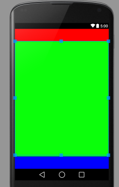

## 多媒体


### Activity 充满屏幕


```java 

getWindow().setFlags(WindowManager.LayoutParams.FLAG_FULLSCREEN,WindowManager.LayoutParams.FLAG_FULLSCREEN);
```

### 缓冲条布局（layout weight 控制先后顺序）

`layout_weight`属性控制布局的测量顺序，数值小的先于数值大的测量

```xml
<LinearLayout xmlns:android="http://schemas.android.com/apk/res/android"
    xmlns:tools="http://schemas.android.com/tools"
    android:layout_width="match_parent"
    android:layout_height="match_parent"
    android:orientation="vertical">
    
    <View
        android:background="#f00"
        android:layout_width="match_parent"
        android:layout_height="50dp"/>

    <View
        android:background="#0f0"
        android:layout_weight="1"
        android:layout_width="match_parent"
        android:layout_height="match_parent"/>
    <View
        android:background="#00f"
        android:layout_width="match_parent"
        android:layout_height="50dp"/>
    
</LinearLayout>
```

实现效果




虽然绿色位于第二个， 但其设置了`weight`属性等于1，而其余两个没有设置，默认是0.所以第一个和第三个先测量。


### selector-drawable实现选中效果
1. 在xml中配置多一个item,设置它的`android:state_selected="true"`

		<?xml version="1.0" encoding="UTF-8"?>
		<selector xmlns:android="http://schemas.android.com/apk/res/android">
		    <item android:drawable="@drawable/img_buttom_bg_press" android:state_pressed="true"/><!--按下效果  -->
		    <item android:drawable="@drawable/img_buttom_bg_press" android:state_selected="true"/><!--选中效果  -->
		    <item android:drawable="@drawable/img_none"/><!--默认效果  -->
		</selector>

2. 在代码中进行设置:主要是调用`setSelected(boolean flag)`方法

	
### SeekBar样式的修改

设置缓冲条的背景与样式。

-  构造seek_background。xml文件

```xml 
<layer-list
  xmlns:android="http://schemas.android.com/apk/res/android">
    <item android:id="@android:id/background" android:drawable="@drawable/img_progress_bg" />
    <item android:id="@android:id/progress" android:drawable="@drawable/img_progress" />
</layer-list>
```
`background`:背景。  `progress`:缓冲条颜色。

-  SeekBar添加属性`  android:progressDrawable="@drawable/seek_background"`；

-  默认的SeekBar会有一个默认的滑动按钮，使用以下属性隐藏`android:thumb="@null"`


