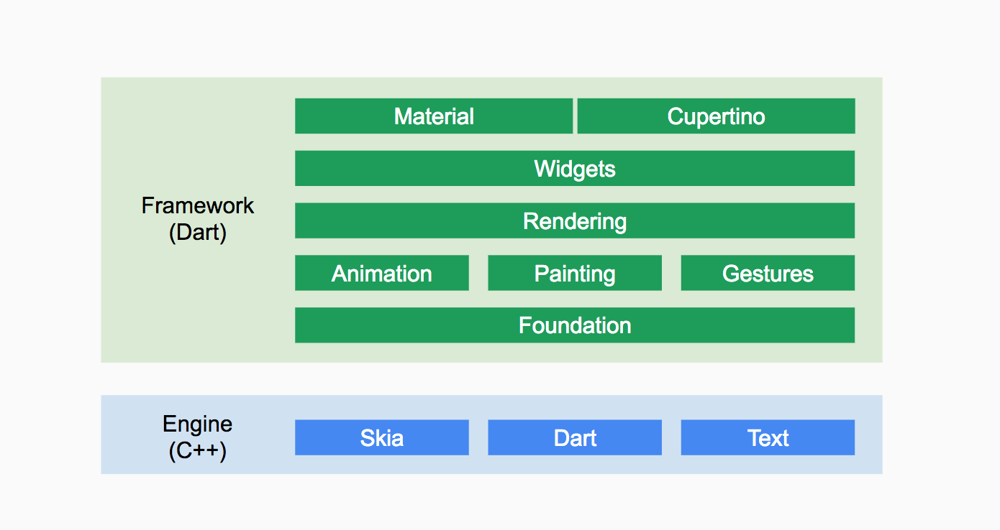
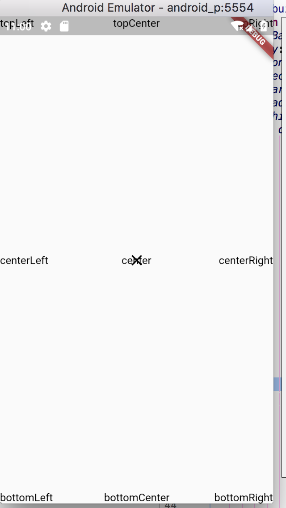
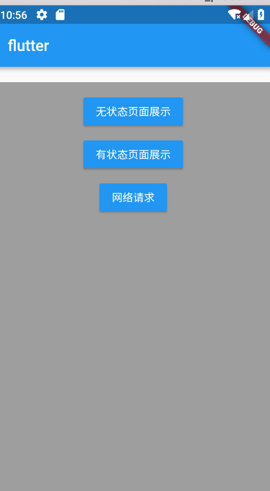
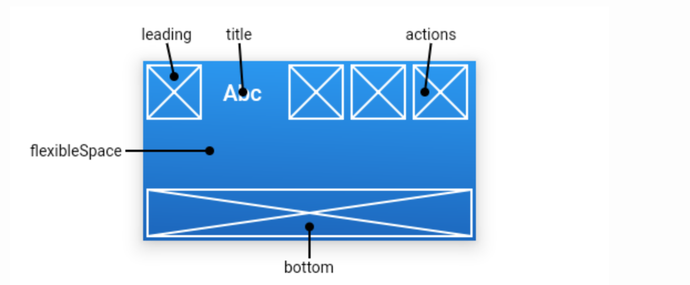
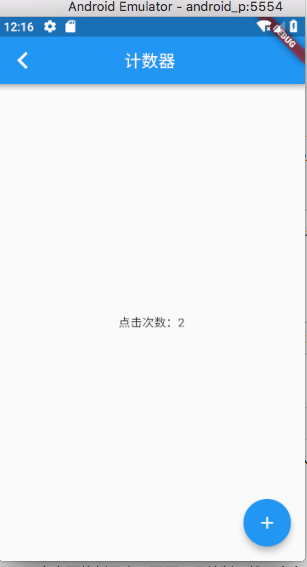

## Flutter概览 


### 什么是flutter 

Flutter 是一套跨平台的开发框架，适用于Android,ios,fuchsia（google计划的操作系统），能够实现一套代码编译成不同平台的app。

Flutter相较于RN的区别在于Flutter是基于skia的直接渲染，和平台无关。而RN是对不同平台的控件的向上抽象封装，不可避免的会有适配性等各种问题。


Flutter Widget采用现代响应式框架构建,中心思想是用widget构建你的UI。 Widget描述了他们的视图在给定其当前配置和状态时应该看起来像什么。当widget的状态发生变化时，widget会重新构建UI，Flutter会对比前后变化的不同， 以确定底层渲染树从一个状态转换到下一个状态所需的最小更改。

widget的构建函数一般没有副作用。每当它被要求构建时，widget应该返回一个新的widget树，无论widget以前返回的是什么。 Framework会将之前的构建与当前构建进行比较并确定需要对用户界面进行哪些修改。

这种自动比较非常有效，可以实现高性能的交互式应用程序。而构建函数的设计则着重于声明widget是由什么构成的，而不是将用户界面从一个状态更新到另一个状态的(这很复杂性)，从而简化了代码。


Flutter 提供的 widget 都是基于 skia 来实现和精心定制的.


### 整体框架



### 安装flutter 

[起步:安装Flutter](https://flutterchina.club/get-started/install/)


### flutter的布局方式

flutter中，所有的一切都是控件（`widget`），`Button`,`Icon`，`Text`等都是控件，甚至布局中所需的一些属性，`Center`，`Aligin`等，都是控件，也就是说对于一个基本的文本居中显示的布局，实质是`Center`和`Text`组合达到最终的目的。组合大于继承。

一些常用的控件可以有如下分类

- 用于显示内容的控件：`Image` `Text` `Icon` `Button`等。
- 用于布局的控件:`Row` `Column` `Stack` `Align` `Center`等。
- 用于处理手势输入的控件：`GestureDetector`  `LongPressDraggable` 等。
- 一些特殊封装的控件（类似组合控件） `Appbar` `Scaffold` `Container` 等。

根据以上所列出的一些常用的控件，那么就可以做一些常用的布局。

#### 基本布局展示



对于这个布局，其实很类似与android中的相对布局，代码如下：

```dart
import 'package:flutter/material.dart'; // 导包


void main() {
  runApp(new MaterialApp( // 可以运用MaterialApp的样式 构造了基础的路由方式
    home: new StatelessPage() // 创建布局
  ));
}

class StatelessPage extends StatelessWidget {
  // 基于flutter 一切都是控件的原理，我们自定义一个Widget来完成页面实现

  @override
  Widget build(BuildContext context) {
    return new Scaffold( // 基本布局框架，大部分使用该控件进行基本布局
        body: new Stack( // stack 可以允许其子widget简单的堆叠在一起
            children: <Widget>[
              new Align( // 可以将其子widget对齐，并可以根据子widget的大小自动调整大小。
                alignment: Alignment.center, // 属性
                child: getText("center"),
              ),
              new Align(
                alignment: Alignment.center,
                child: new GestureDetector( // 定义手势控件，提供一些默认回调方法。
                  onTap: () {
                    Navigator.of(context).pop();
                  },
                  child: new Icon(Icons.close),
                ),
              ),
              new Align(
                alignment: Alignment.topLeft,
                child: getText("topLeft"),
              ),
              new Align(
                alignment: Alignment.topCenter,
                child: getText("topCenter"),
              ),
              new Align(
                alignment: Alignment.topRight,
                child: getText("topRight"),
              ), new Align(
                alignment: Alignment.centerLeft,
                child: getText("centerLeft"),
              ),
              new Align(
                alignment: Alignment.centerRight,
                child: getText("centerRight"),
              ),
              new Align(
                alignment: Alignment.bottomCenter,
                child: getText("bottomCenter"),
              ),
              new Align(
                alignment: Alignment.bottomLeft,
                child: getText("bottomLeft"),
              ),
              new Align(
                alignment: Alignment.bottomRight,
                child: getText("bottomRight"),
              ),
            ]
        )
    );
  }

  Text getText(String title) {
    return new Text(title, style: new TextStyle(color: Colors.black));
  }
}
```

首先定义`main()`作为程序的入口，并且利用系统已经实现的`MaterialApp`控件，该控件包含了一个页面的基本路由管理器。

其次，`home:`添加我们定义的页面。我们编写的页面一定也是一个`Widget`，在这里继承了`StatelessWidget`，该类需要我们实现一个`build()`方法，该返回的返回值即使我们构造的布局。

在布局中出现了一些关键的控件，逐一解释：

**`Scaffold`**

flutter提供的页面布局基本控件，一个页面基本的元素都已经被封装进去。例如侧滑菜单，底部导航，appBar等等。

**`Stack`**

能够让子控件的展示可以重叠。因为其下面可以包含多个子控件，所以其添加子控件的属性为`children`，并且返回的是一个控件数组。

**`Align`**

该控件将尽可能的大，可以将其子widget对齐。`alignment`属性声明子控件在其中的相对位置。

**`Text`**

文本显示控件

**`TextStyle`**

文本样式

**`GestureDetector`**

手势处理控件，对于`Button`等，可能已经包含了按下处理，而对于一些控件如果没有默认的手势处理，可以通过包装该类实现手势触摸。

#### 稍复杂布局展示

上面的例子演示了一个基本的布局，下面我们实现如下布局：



根据整体布局分析，最上是一个`Appbar`，内容区域包含一个`margin`的间隔，其内部子控件是居中垂直显示。

根据上面的例子，`Scaffold`是一个页面基本的框架，其中已经提供了`Appbar`的位置等。

所以先贴上代码：

```dart 
import 'package:flutter/material.dart';
import 'package:flutter_app/main.dart';
import 'package:flutter_app/pages/ui_page.dart';

class HomePage extends StatelessWidget {
  @override
  Widget build(BuildContext context) {
    return Scaffold( // 依然使用scaffold布局
      // scaffold 已经实现了appBar的位置，所以直接通过属性声明
      appBar: new AppBar(title: new Text("flutter")), // 构造Appbar对象
      body: new Container( // 一个常用的布局控件，其下包含一个子控件，能够声明padding,margin,decoration等等
        constraints: BoxConstraints.expand(), // 控件大小，尽可能的大
        decoration: new BoxDecoration(color: Colors.grey), // 背景
        margin: EdgeInsets.only(top: 20.0),
        padding: EdgeInsets.only(top: 20.0),
        child: new Column( // 列控件
          children: <Widget>[
            new RaisedButton( // 默认包含点击特效
              onPressed: () {
                // 页面跳转，
                Navigator.of(context).pushNamed(PageList.STATELESS_PAGE);
              },
              color: Colors.blue,
              child: new Text("无状态页面展示",
                style: new TextStyle(color: Colors.white),),
            ),
            new Container(
              margin: EdgeInsets.only(top: 20.0),
              child: new RaisedButton(
                onPressed: () {
                  // 页面跳转
                  Navigator.of(context).push(
                      new MaterialPageRoute(builder: (context) {
                        return new UIPage();
                      }));
                },
                color: Colors.blue,
                child: new Text("有状态页面展示",
                  style: new TextStyle(
                      color: Colors.white),),
              ),
            ),
            new Container(
              margin: EdgeInsets.only(top: 20.0),
              child: new RaisedButton(
                onPressed: () {
                  Navigator.of(context).pushNamed(PageList.NET_PAGE);
                },
                color: Colors.blue,
                child: new Text("网络请求",
                  style: new TextStyle(
                      color: Colors.white),),
              ),
            )
          ],
        ),
      ),
    );
  }
}

```

在该例子中，依然使用了`Scaffold`作为页面框架，该控件提供了`appBar`。

对一些新控件进行解释：

**`Appbar`**

该控件主要用于标题栏的实现，其提供了多种样式。



**`Container`**

一个拥有绘制、定位、调整大小的 widget。该控件应该是最常用的控件。他提供了`margin`，`padding`等等对于一个显示的文本可能用到的属性。

**`Column`**

列控件，垂直的线性布局，可以定义子控件在当前布局中的排列。

**`RaisedButton`**

按钮，提供波纹和向上抬起的点击效果


### flutter 页面跳转

在Android中，页面对应的是Activity，在iOS中是ViewController。而在Flutter中，页面只是一个widget！

在Flutter中，我们那么我们可以使用Navigator在页面之间跳转。

- 调用Navigator.push导航到第二个页面。
- 调用Navigator.pop返回第一个页面。

```dart
onPressed: () {
  Navigator.push(
    context,
    // router 添加到布局管理器中
    new MaterialPageRoute(builder: (context) => new SecondScreen()),
  );
}
```

```dart
Navigator.pop(context);

```

对于`MaterialApp`控件，默认实现了路由的管理。可以根据路径的声明进行页面跳转。总共可分为三步：

- 页面路径声明

```dart 
void main() {
  runApp(new MaterialApp(
    home: new HomePage(),
    routes: <String, WidgetBuilder>{
      PageList.UI_PAGE: // 页面路径
          (BuildContext context) => new UIPage(), // 打开的widget
      PageList.STATELESS_PAGE:
          (BuildContext context) => new StatelessPage(),
      PageList.NET_PAGE:
          (BuildContext context) => new NetPage(),
    },
  ));
}

class PageList {
  static const String UI_PAGE = "ui_page";
  static const String STATELESS_PAGE = "stateless_page";
  static const String NET_PAGE = "net_page";
}

```

在`MaterialApp`中有属性`routers`，该属性主要是页面管理，其是。一个键值对的集合，分别是路径以及对应的页面。

- 页面跳转

```dart 
 Navigator.of(context).pushNamed(PageList.STATELESS_PAGE);
```

- 页面返回

``` dart 
Navigator.of(context).pop();

```

通过`push`和`pop`方法，也可以实现两个页面的数据的交换，`push`的返回值及是`pop`中的参数。

### 可变页面

在上面的例子中，页面一旦绘制，就不会有变化。而通常的一些实现中，可能涉及到页面的变化。

例如一个简单的计数器页面，点击加号按钮，数据会递增。：



该类实现牵扯到一个数据的变化，之前写一个控件都是继承`StatelessWidget`，而此例中引入一个新的概念`StatefulWidget`。对于一个控件，可能存在展示上的变化，那么就需要继承`StatefulWidget`进行处理。

实现一个`StatefulWidget`可以分为如下几步：

- 创建类继承`StatefulWidget`
- 创建状态保存对象，继承`State`
- 状态变化

#### 创建类继承`StatefulWidget`

```dart
class UIPage extends StatefulWidget {

  @override
  State<StatefulWidget> createState() {
    return new _UIPageState();
  }
}
```

#### 创建`_UIPageState `继承`State`

```

class _UIPageState extends State<UIPage> {
  int count = 0;

  void add() {
    setState(() {
      count++;
    });
  }

  @override
  Widget build(BuildContext context) {
    num++;
    print("build:${num}");
    return new Scaffold(
      appBar: new AppBar(
        centerTitle: true,
        title: new Text("计数器"),
      ),
      body: new Center(
          child: new Text("点击次数：${count}"),
      ),
      floatingActionButton: new FloatingActionButton(
          onPressed: () { // 点击事件
            add();
          },
          child: new Icon(Icons.add)
      ),
    );
  }
}
```
#### 状态变化

最后调用`setState()`通知状态发生变化。


> 有了独立的状态和widget对象，其他widget可以以同样的方式处理无状态和有状态的widget，而不必担心丢失状态。 父widget可以自由地创造子widget的新实例且不会失去子widget的状态，而不是通过持有子widget来维持其状态。


