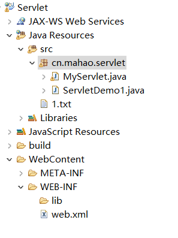

## Java Web 之 Servlet 学习总结

### Servlet 简介

`Servlet` 是运行在服务端的java 小程序，他能够响应客户端的请求，并向客户端发送相应的响应结果。

整个请求的流程：

- 用户通过浏览器向服务端发送请求。
- 服务端的web容器接受到请求并根据请求的路径等找到相应的`servlet`处理。
- `servlet`接受到请求并做出处理，并将响应结果交给web容器。
- web容器将最终的响应结果发送到浏览器。

实现`Servlet`需要实现以下两个步骤:

- 实现`Servlet`接口，并重写他的五个方法。
	- `init()`初始化方法
	- `getServletConfig()`:获取`servlet`的配置信息。将获取的配置信息传给`init`
	- `service()`: 请求的接受方法，并处理请求，做出响应。
	- `getServletInfo()`:返回有关 servlet 的信息，比如作者、版本和版权。 
	- `destroy()`:由 `servlet` 容器调用，指示将从服务中取出该 `servlet`。此方法仅在 `servlet` 的 `service` 方法已退出或者在过了超时期之后调用一次。在调用此方法之后，`servlet` 容器不会再对此 `servlet` 调用 `service` 方法。

需要注意的是，该接口的5个方法需要我们去实现，而该方法所要求的便是如上所示。
 
- 在`web.xml`中注册该`servlet`。

```xml
	<!-- 先配置Servlet信息 -->
	<servlet>
		<!-- 1,配置Servlet名称，名称必须唯一 -->
		<servlet-name>servlet1</servlet-name>
		<!-- 2,配置Servlet的完全路径（包名+类名） -->
		<servlet-class>cn.mahao.servlet.ServletDemo1</servlet-class>
	</servlet>

	<!-- 配置Servlet映射（访问路径） -->
	<servlet-mapping>
		<!-- 3,配置Servlet名称，和上面的名称必须相同 -->
		<servlet-name>servlet1</servlet-name>
		<!-- 4,配置虚拟路径（访问路径） -->
		<url-pattern>/demo1</url-pattern>
	</servlet-mapping>

 ```

需要注意的有如下几点：

- `<servlet-name>`: 该标签的内容必须唯一，且两个对应映射的`<servlet-name>`必须唯一。
- `<url-pattern>`: 该内容为服务端访问该`servlet`的地址。例如`http://localhost:8080/sevletDemo/demo1`。
- `<servlet-class>`：类的全路径名，代表唯一标识。

在`web.xml`中配置之后，如果有`/demo1`的请求，将按照  4 - 3 - 1- 2 的方式找到相应处理类，并通过反射加载类。


### Servlet 生命周期

`servlet`生命周期是指实例被创建，对外提供服务，销毁的过程。

- 当第一次请求到达时，`Servlet`实例被创建，同时调用`init()`方法。
- 每一次请求都会调用`service()`方法进行响应处理。
- 当服务器停止或者应用从服务器中移除时，调用`destory()`方法。

### HttpServlet

`HttpServlet`是`Servlet`的实现类。

因为对于任意一个`Servlet`，都需要编写5个方法很麻烦，所以根据Http协议封装了`HttpServlet`;

如果编写`servlet`，只需要继承`HttpServlet`即可，并重写`doGet`和`doPost`方法。

编写步骤：

- 编写一个类，继承`HttpServlet`
- 重写`doGet`和`doPost`方法。
	- 在`doPost`方法中，默认调用`doGet`方法。
	- 表单是`GET`时，调用`doGet()`方法。
	- 表单是`POST`时，调用`doPost()`方法。
- 在web.xml配置`servlet`


类似模板如下：

```java 
public class MyServlet extends HttpServlet {

	protected void doGet(HttpServletRequest request, HttpServletResponse response) throws ServletException, IOException {
	
		// 当表单是Get请求时，同时Post也会默认走此方法，一起处理
	}

	protected void doPost(HttpServletRequest request, HttpServletResponse response) throws ServletException, IOException {
		
		// 当表单是Post请求时，会调用此方法
		
		// 调用GET方法一起处理
		doGet(request, response);
	}

}


```


### Servlet自动加载

`Servlet`默认是第一次访问时候创建实例。但是我们可以通过配置让其在服务器启动时加载，创建`Servlet`实例。

好处：`init()`方法在创建`Servlet`时调用，某些`servlet`的初始化操作比较多，比较消耗时间。

在`<servlet>`标签下：配置`<load-on-startup>`标签。

```xml 
	<servlet>
		<servlet-name>MyServlet</servlet-name>
		<servlet-class>cn.mahao.servlet.MyServlet</servlet-class>
		<load-on-startup>3</load-on-startup>
	</servlet>
```

标签的顺序有要求。`<load-on-startup>`要放在后面。

> 数值越小，优先级越高。


### ServletConfig 

在Servlet的配置文件中，可以使用一个或多个<init-param>标签为servlet配置一些初始化参数。（配置在某个servlet标签或整个web.xml下）

当`Servlet`配置了初始化参数之后，web容器在创建`Servlet`实例对象时，会自动将这些初始化参数封装到`ServletConfig`对象中，并在调用`servlet`的`init`方法时，将`ServletConfig`作为参数传入。

- 配置全局的`ServletConfig`

```xml 
<web-app xmlns:xsi="http://www.w3.org/2001/XMLSchema-instance"
	xmlns="http://java.sun.com/xml/ns/javaee"
	xsi:schemaLocation="http://java.sun.com/xml/ns/javaee http://java.sun.com/xml/ns/javaee/web-app_2_5.xsd"
	id="WebApp_ID" version="2.5">

	<context-param>
		<param-name>name</param-name>
		<param-value>alex</param-value>
	</context-param>

</web-app>

```
- 配置某一个`Servlet`的参数

```xml 
	<servlet>
		<servlet-name>MyServlet</servlet-name>
		<servlet-class>cn.mahao.servlet.MyServlet</servlet-class>
		
		
		<init-param>
			<param-name>user</param-name>
			<param-value>mahao</param-value>
		</init-param>
		
		<load-on-startup>3</load-on-startup>
	</servlet>
```

- `Servlet`获取`ServletConfig`对象的对应参数

```java 
	protected void doGet(HttpServletRequest request, HttpServletResponse response) throws ServletException, IOException {
	
		// 当表单是Get请求时，同时Post也会默认走此方法，一起处理
		
		ServletConfig config = getServletConfig();
		
		// 获取全局的ServletConfig 参数
		String name = config.getServletContext().getInitParameter("name");
		
		// 获取Servlet 的下的ServletConfig 的参数
		String user = config.getInitParameter("user");
		
		response.getWriter().write(name+"-"+user);
	}


```

#### ServletConfig 的应用

- 获得字符集编码： 

```java  
String charset = this.config.getInitParameter("charset");
```
- 获得数据库连接信息：

```java 
  String url = this.config.getInitParameter("url");
  String username = this.config.getInitParameter("username");
  String password = this.config.getInitParameter("password");
```

- 获得配置文件

```java  
 String configFile = this.config.getInitParameter("config");
```

### ServletContext对象(域对象)

web容器在启动时，它会为每个WEB应用都创建一个对应的`ServletContext`对象，他代表当前web应用。

- 一个web应用对应一个`ServletContext`对象
- 一个web应用下有多个`Servlet`时，多个应用共享一个`ServletContext`对象

#### 实现数据共享
	
- 在一个`Servlet`中使用以下方法设置属性：

```java 
	ServletContext context = this.getServletContext();  //servletContext域对象
	context.setAttribute("data", "共享数据"); //向域中存了一个data属性

```

- 在另一个`Servlet`中获取属性

```java 
 ServletContext context = this.getServletContext();
  String value = (String) context.getAttribute("data");  //获取域中的data属性
```

#### 读取资源文件

因为`Servlet`会被加入到Tomcat 中去加载运行。其中src文件会加载到`E:\apache-tomcat-6.0.14\wtpwebapps\Servlet\WEB-INF\classes`中去。

但是因为其实在tomcat中执行的，所以我们的资源文件的获取不是普通的获取。


如下所示，有1.txt文件，



如果按照往常，有如下方式获取：

```java 
	
		BufferedReader br = new BufferedReader(new InputStreamReader(new FileInputStream("src/1.txt")));
		
```

但是，会报找不到文件的异常。因为其默认的根目录是`Tomcat`的`bin`目录。

所以，我们必须通过如下方式获取

```java 
		
		//编译到tomcat 中的文件地址，相对于工程
		InputStream is = getServletContext().getResourceAsStream("/WEB-INF/classes/1.txt");
		
		//获取其真实路径
		String path = getServletContext().getRealPath("/WEB-INF/classes/1.txt");
		
		BufferedReader br = new BufferedReader(new InputStreamReader(is));
		
		// 暂时只读取一行
		String line = br.readLine();
		
		response.getWriter().write("line:"+line+"\n"+path);
```

打印结果
```
	line:aaa
	E:\apache-tomcat-6.0.14\wtpwebapps\Servlet\WEB-INF\classes\1.txt

```


以下是来自黑马的web中的例子，在此粘贴，以作记录和查询

```java 
/**
 * 读取资源文件
 * @author Administrator
 *
 */
public class ReadServlet extends HttpServlet {
	
	public void doGet(HttpServletRequest request, HttpServletResponse response)
			throws ServletException, IOException {
		read5();
	}
	
	public void doPost(HttpServletRequest request, HttpServletResponse response)
			throws ServletException, IOException {
		doGet(request, response);
	}
	
	/**
	 * 通过ServletContext对象获取文件的绝对磁盘路径
	 * 获取src目录下文件
	 * @throws IOException 
	 */
	public void read5() throws IOException{
		// 获取对象
		String path = getServletContext().getRealPath("/WEB-INF/classes/db.properties");
		// System.out.println(path);
		// C:\apache-tomcat-6.0.14\webapps\day09\WEB-INF\classes\db.properties
		
		// 获取输入流
		InputStream in = new FileInputStream(path);
		print(in);
	}
	
	/**
	 * 获取WebRoot目录目录下db.properties文件
	 * @throws IOException
	 */
	public void read4() throws IOException{
		// ServletContext读取文件
		InputStream in = getServletContext().getResourceAsStream("/db.properties");
		// 打印方式
		print(in);
	}
	
	/**
	 * 获取包目录下db.properties文件
	 * @throws IOException
	 */
	public void read3() throws IOException{
		// ServletContext读取文件
		InputStream in = getServletContext().getResourceAsStream("/WEB-INF/classes/cn/itcast/context/db.properties");
		// 打印方式
		print(in);
	}
	
	/**
	 * 获取src目录下db.properties文件
	 * @throws IOException
	 */
	public void read2() throws IOException{
		// ServletContext读取文件
		InputStream in = getServletContext().getResourceAsStream("/WEB-INF/classes/db.properties");
		// 打印方式
		print(in);
	}
	
	/**
	 * 传统方式读取资源文件
	 * 	交给服务器处理，相对的位置tomcat/bin
	 * @throws IOException 
	 */
	public void read1() throws IOException{
		// 获取输入流
		InputStream in = new FileInputStream("src/db.properties");
		print(in);
	}
	
	/**
	 * 在控制台打印内容
	 * @param in
	 * @throws IOException
	 */
	public void print(InputStream in) throws IOException{
		Properties pro = new Properties();
		// 加载
		pro.load(in);
		// 获取文件中的内容
		String username = pro.getProperty("username");
		String password = pro.getProperty("password");
		String desc = pro.getProperty("desc");
		
		System.out.println("用户名："+username);
		System.out.println("密码："+password);
		System.out.println("描述："+desc);
	}
	
}

```