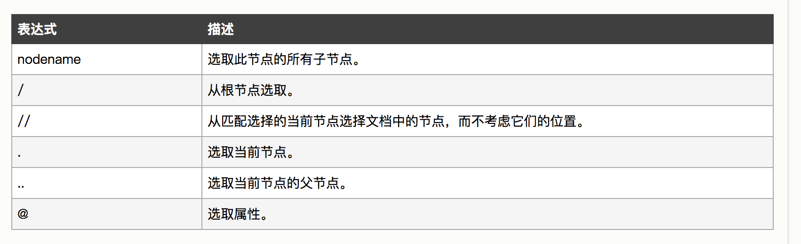
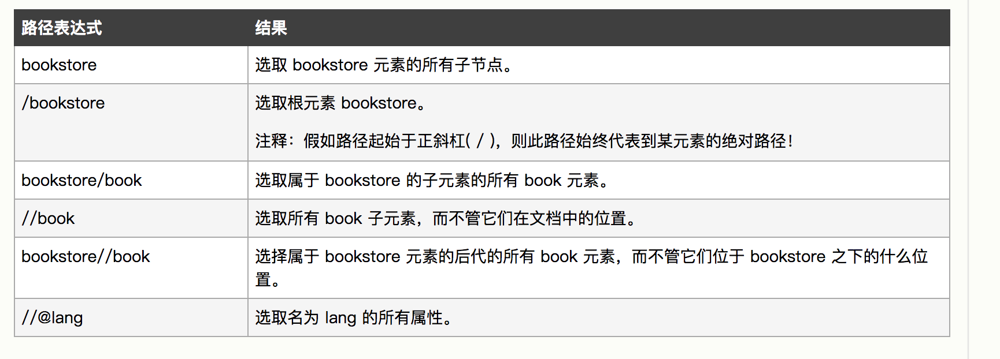
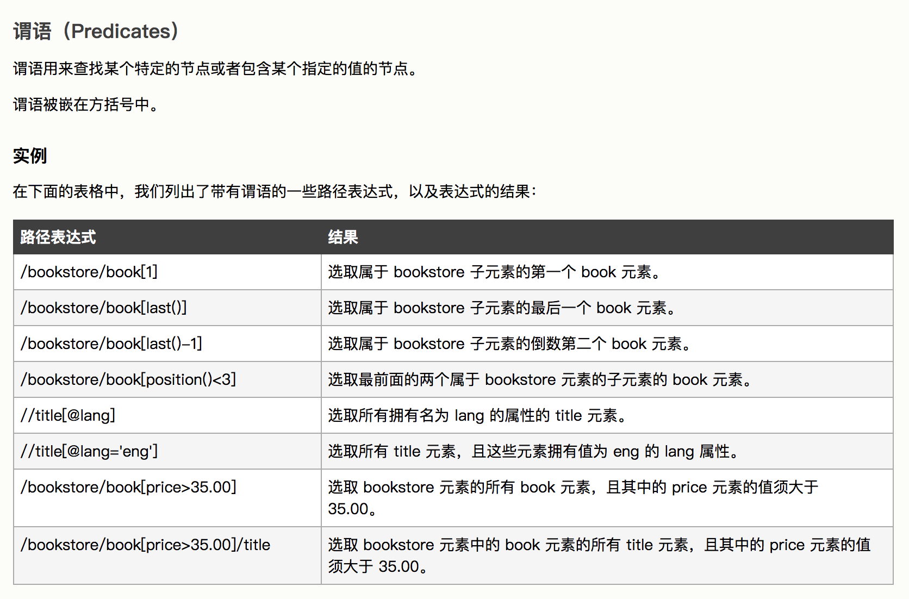
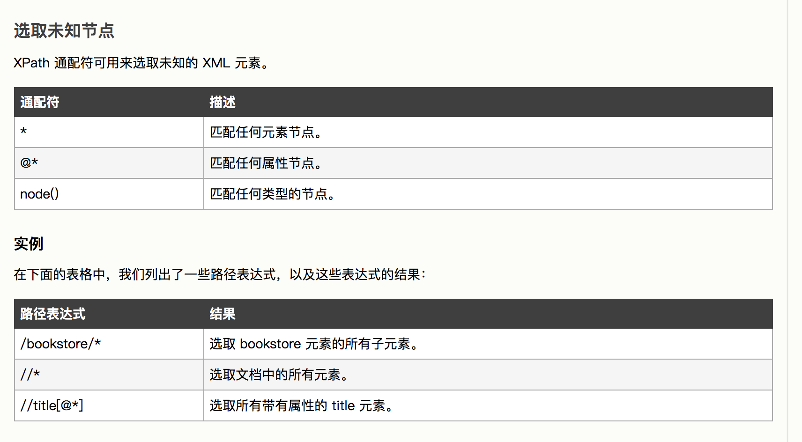
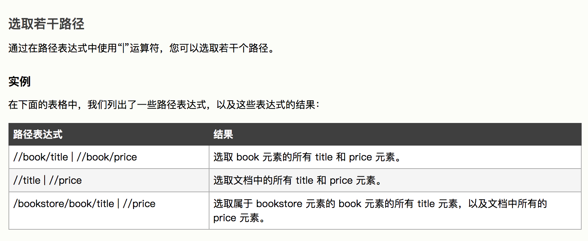
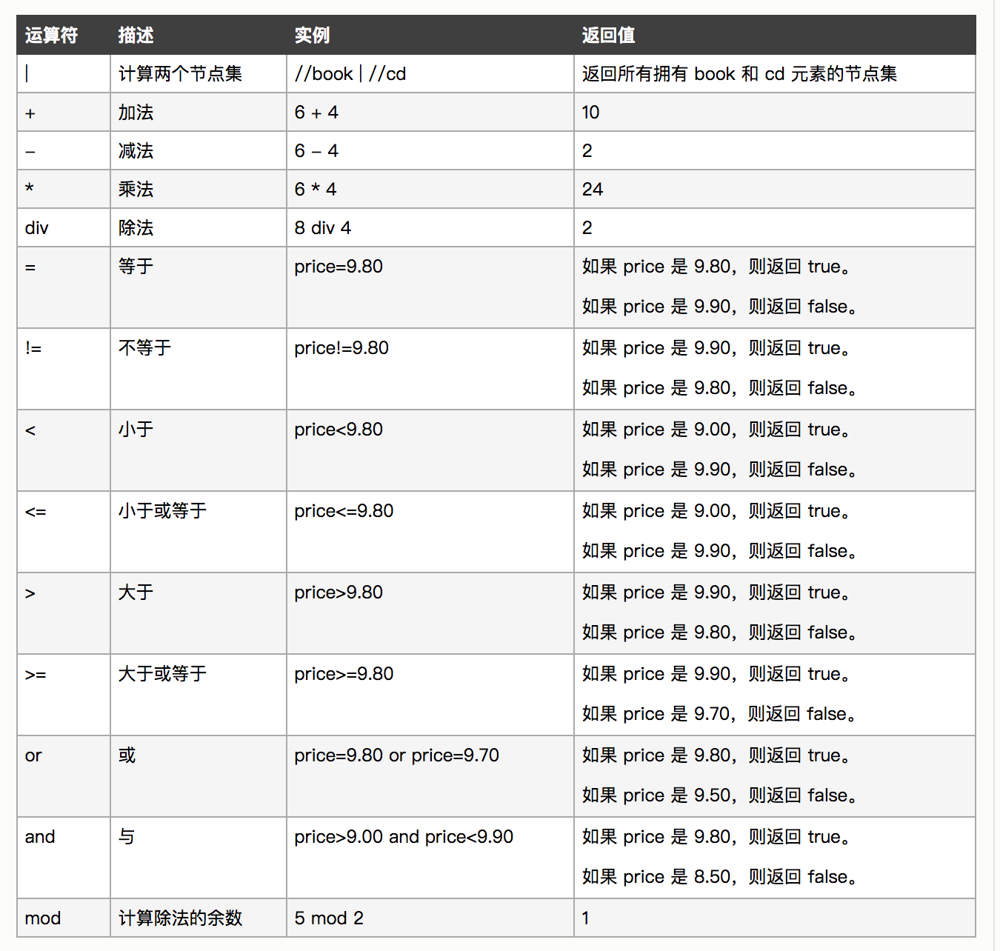

## XPath 

> XPath 是一门在 XML 文档中查找信息的语言。XPath 用于在 XML 文档中通过元素和属性进行导航。


### XPath简介

- XPath 是一个 W3C 标准 , XPath 于 1999 年 11 月 16 日 成为 W3C 标准。
- XPath 使用路径表达式来选取 XML 文档中的节点或者节点集。这些路径表达式和我们在常规的电脑文件系统中看到的表达式非常相似。


### XPath节点

> 在 XPath 中，有七种类型的节点：元素、属性、文本、命名空间、处理指令、注释以及文档节点（或称为根节点）。

```xml
<?xml version="1.0" encoding="ISO-8859-1"?>

<bookstore> <!-- 文档节点 -->

<book>
  <title lang="en">Harry Potter</title> <!-- （元素节点） -->
  <!-- lang="en" （属性节点） -->
  <author>J K. Rowling</author> 
  <year>2005</year>
  <price>29.99</price>
</book>

</bookstore>

```

**基本值**

```
J K. Rowling
"en"

```

### XPath 语法

#### 路径表达式




#### 筛选条件



#### 未知节点


#### 多个路径


### XPath 运算符




### XPath实例

> 本实例基于java进行编写

**xml文件如下**

```xml
<?xml version="1.0" encoding="utf-8"?>
<bookstore>

    <book category="COOKING">
        <title lang="en">Everyday Italian</title>
        <author>Giada De Laurentiis</author>
        <year>2005</year>
        <price>30.00</price>
    </book>

    <book category="CHILDREN">
        <title lang="en">Harry Potter</title>
        <author>J K. Rowling</author>
        <year>2005</year>
        <price>29.99</price>
    </book>

    <book category="WEB">
        <title lang="en">XQuery Kick Start</title>
        <author>James McGovern</author>
        <author>Per Bothner</author>
        <author>Kurt Cagle</author>
        <author>James Linn</author>
        <author>Vaidyanathan Nagarajan</author>
        <year>2003</year>
        <price>49.99</price>
    </book>

    <book category="WEB">
        <title lang="en">Learning XML</title>
        <author>Erik T. Ray</author>
        <year>2003</year>
        <price>39.95</price>
    </book>

</bookstore>

```

解析xml分为如下几步：

- 加载文档，构造`Document`对象
- 构造`xpath`表达式
- 通过`xpath`表达式查询文档
- 展示查询结果

```java
   // 加载文档
        DocumentBuilderFactory factory = DocumentBuilderFactory.newInstance();
        factory.setNamespaceAware(true); // never forget this!
        DocumentBuilder builder = factory.newDocumentBuilder();
        Document doc = builder.parse("books.xml");
        
        // 构造xpath
        XPathFactory xpathfactory = XPathFactory.newInstance();
        XPath xpath = xpathfactory.newXPath();
        // 节点表达式 选取所有 title
        XPathExpression expr = xpath.compile("/bookstore/book/title");
        // 获取结果
        Object result = expr.evaluate(doc, XPathConstants.NODESET);

        // 显示节点和节点内容
        NodeList nodes = (NodeList) result;
        for (int i = 0; i < nodes.getLength(); i++) {
            System.out.println(nodes.item(i).getLocalName() + "：" + nodes.item(i).getTextContent());
        }

```

运行结果:

```
title：Everyday Italian
title：Harry Potter
title：XQuery Kick Start
title：Learning XML

```

#### 选取第一个 book 的 title

表达式

```java
XPathExpression expr = xpath.compile("/bookstore/book[1]/title");
```

运行结果：

```
title：Everyday Italian
```

#### 下面的例子选取 price 节点中的所有文本

表达式

```java
XPathExpression expr = xpath.compile("//price/text()");
```

运行结果:

```
null：30.00
null：29.99
null：49.99
null：39.95
```

#### 选取价格高于 35 的 price 节点

表达式

```java
XPathExpression expr = xpath.compile("//price[text()>35]");

```

运行结果:

```
price：49.99
price：39.95
```

#### 选取价格高于 35 的 title 节点


表达式

```java
XPathExpression expr = xpath.compile("//book[price>35]/title");

```

运行结果:

```
title：XQuery Kick Start
title：Learning XML
```


