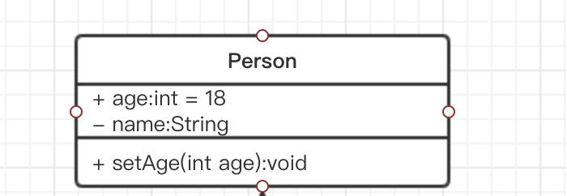
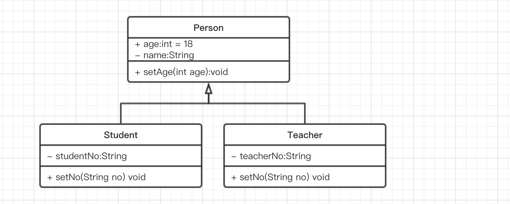
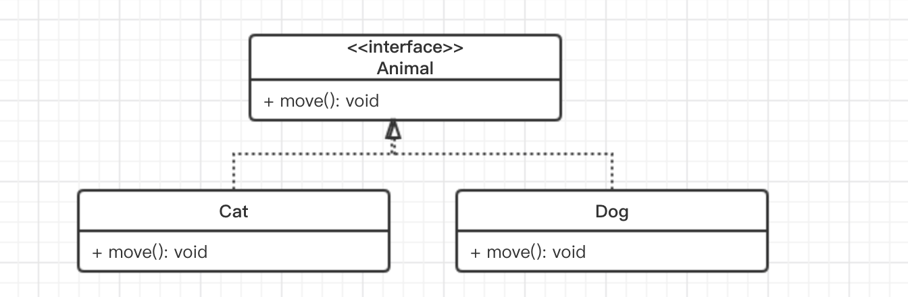
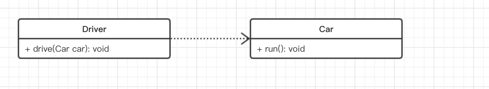
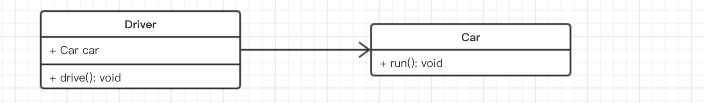
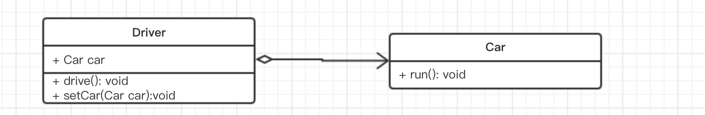
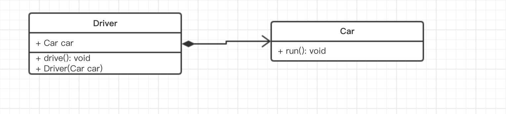
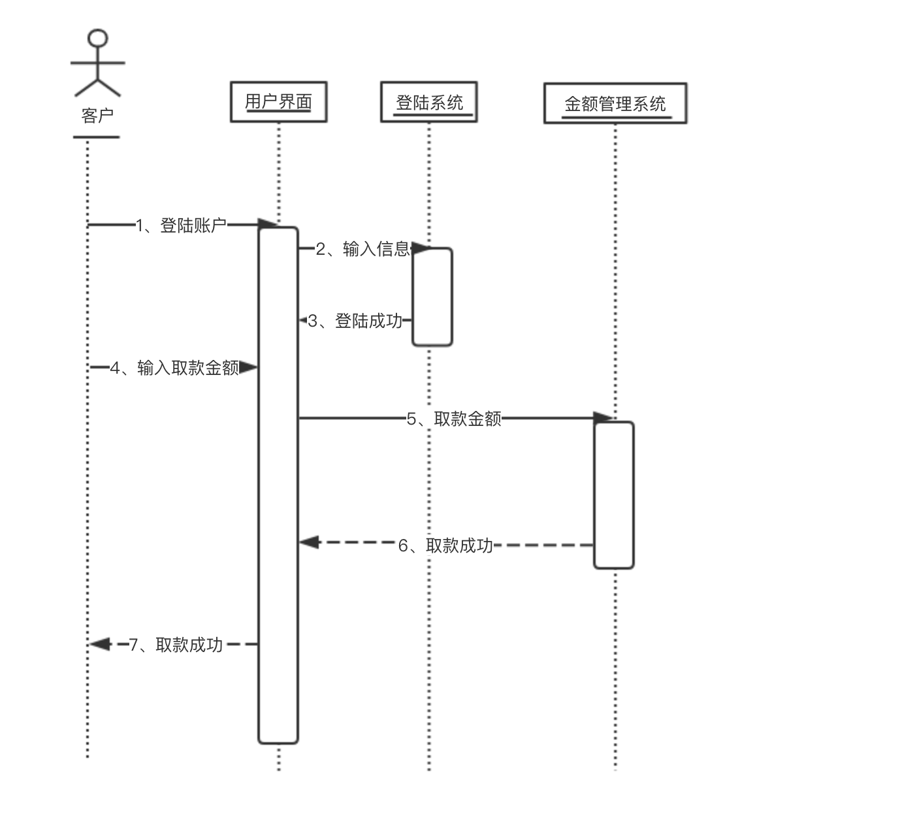
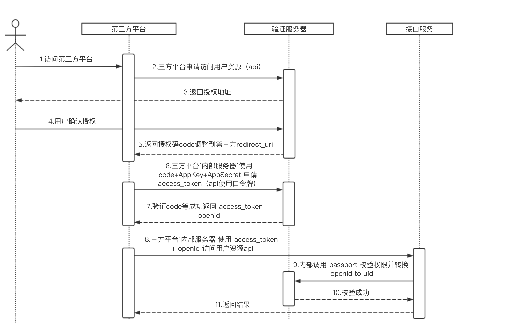

## UML

UML是一种开放的方法，用于说明、可视化、构建和编写一个正在开发的、面向对象的、软件密集系统的制品的开放方法。UML展现了一系列最佳工程实践，这些最佳实践在对大规模，复杂系统进行建模方面，特别是在软件架构层次已经被验证有效。


### UML类图

类图是软件工程的统一建模语言一种静态结构图，该图描述了系统的类集合，类的属性和类之间的关系。帮助人们简化对系统的理解，它是系统分析和设计阶段的重要产物，也是系统编码和测试的重要模型依据。

#### 一个基本的类图

在UML类图中，一个基本的类分为三个部分，分别是类名，字段，方法然后以不同的矩形隔开。



对于字段和方法其前面都有加号或者减号来声明，其含义如下：

- + ：表示public
- - ：表示private
- #：表示protected

对于一个字段，它的声明格式如下：

```
可见性  名称 ：类型 [ = 缺省值]
```

对于一个方法，它的声明格式如下：

```
可见性  名称(参数列表) [ ： 返回类型]
```

> 怎么表示抽象方法: 通过斜体来标识


#### 继承关系

继承关系也就是Java中的继承，类和类，接口和接口都可以是继承关系，父类又称作基类或超类，子类又称作派生类，类继承父类后可以实现父类的所以功能，并能拥有父类没有的功能。在UML中，泛化关系可以用带空心三角形的直线来表示。




#### 实现关系

实现关系在java中就是一个类和接口之间的关系，接口中一般是没有成员变量，所有操作都是抽象的（abstract修饰），只有声明没有具体的实现，具体实现需在实现该接口的类中。




#### 依赖关系

对应java中某一个类的调用需要另一个类的实例，即使依赖关系。



#### 关联关系

关系是类与类之间的联接，它使一个类知道另一个类的属性和方法。关联可以是双向的，也可以是单向的。在Java语言中，关联关系一般使用成员变量来实现。 




#### 聚合关系

关系是关联关系的一种，是强的关联关系。聚合是整体和个体之间的关系。例如，汽车类与引擎类、轮胎类，以及其它的零件类之间的关系便整体和个体的关系。与关联关系一样，聚合关系也是通过实例变量实现的。但是关联关系所涉及的两个类是处在同一层次上的，而在聚合关系中，两个类是处在不平等层次上的，一个代表整体，另一个代表部分。 



#### 组合关系

组合(Composition) 关系是关联关系的一种，是比聚合关系强的关系。它要求普通的聚合关系中代表整体的对象负责代表部分对象的生命周期，组合关系是不能共享的。代表整体的对象需要负责保持部分对象和存活，在一些情况下将负责代表部分的对象湮灭掉。代表整体的对象可以将代表部分的对象传递给另一个对象，由后者负责此对象的生命周期。换言之，代表部分的对象在每一个时刻只能与一个对象发生组合关系，由后者排他地负责生命周期。部分和整体的生命周期一样。 



#### 依赖关系、关联关系、聚合关系、组合关系的区分

以上关系的耦合度依次增强（关于耦合度的概念将在以后具体讨论，这里可以暂时理解为当一个类发生变更时，对其他类造成的影响程度，影响越小则耦合度越弱，影响越大耦合度越强）。由定义我们已经知道，依赖关系实际上是一种比较弱的关联，聚合是一种比较强的关联，而组合则是一种更强的关联，所以笼统的来区分的话，实际上这四种关系、都是关联关系。 


具体是哪一个，需要根据语义区分。

现有`Driver`和`Car`，`Driver`依赖于`Car`类，通过这两个类表达他们的关系。

**依赖关系**

它是耦合度最弱的一种，在java中表现为局域变量、方法的形参，或者对静态方法的调用，强调一种偶然性，例如共享车，骑的某一个车具有偶然性和不确定性。

**关联关系**

关联关系在java中一般使用成员变量来实现。使用者可以知道`Car`的一些属性等。一般指两个类地位上是平等，例如车是租过来的。

**聚合关系**

假如给上面代码赋予如下语义：车是一辆私家车，是司机财产的一部分。则相同的代码即表示聚合关系了。聚合关系一般使用setter方法给成员变量赋值。 

**组合关系**

车是司机的必须有的财产，要想成为一个司机必须要先有辆车，车要是没了，司机也不想活了。而且司机要是不干司机了，这个车就砸了，别人谁也别想用。那就表示组合关系了。一般来说，为了表示组合关系，常常会使用构造方法来达到初始化的目的，


#### 实例

**简单工厂模式**


**工厂方法模式**


**工厂方法模式实例**


### UML 时序图


>时序图是一种强调时间顺序的对象交互图(1.是描述对象间交互的图 2.这种图是强调时间顺序的)，换句话说就是描述谁和谁先做什么，然后再做什么的图
在时序图中，首先把参与交互的对象放在图的上方，沿X轴方向排列，通常把发起交互的对象放在左边，较下级的对象依次放在右边，然后把这些对象发送和接受的消息沿Y轴方向按时间顺序从上到下放置。这样就提供了控制流随着时间推移的清晰的可视化轨迹。

#### 时序图元素

##### 对象

表示的是时序图中的参与者

##### 生命线

每个对象的底部中心的位置都带有生命线。生命线是一个时间线，从时序图的顶部一直延伸到底部，长度当然由你的业务来决定啦，生命线表示了对象存在的时间

##### 激活状态

用来表示时序图中对象执行某个操作的一段时间，在很多文章里面将其形象的理解为程序函数 { } 中的内容。

##### 消息

消息（Messages）是对象间的一种通信机制。由发送对象向另一个或其他几个接收对象发送信号，或由一个对象（发送者或调用者）调用另一个对象（接收者）的操作。

**同步消息**

消息的发送者把控制传递给消息的接收者，然后停止活动，等待消息的接收者放弃或者返回控制。用来表示同步的意义。


**异步消息**
消息发送者通过消息把信号传递给消息的接收者，然后继续自己的活动，不等待接受者返回消息或者控制。异步消息的接收者和发送者是并发工作的。

**返回消息**
返回消息表示从过程调用返回


#### 时序图举例




#### oauth2.0

