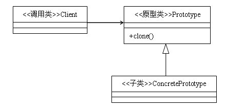

## 设计模式之（2）——原型模式


### 基本介绍

**定义**

原型模式（Prototype Pattern）：用原型实例指定创建对象的种类，并通过拷贝这些原型创建新的对象。

**UML类图**



**使用场景**

一个对象需要提供给其他对象访问，而各个调用者都需要修改其值，可以利用原型模式赋值多个拷贝对象公其他调用者使用。

**使用优点**

减少了类对象创建时的资源消耗。通过原型模式，直接操作内存中的数据，对于一些复杂对象的创建，大大减少了资源的消耗。

### 实现方式

首先看一下代码

```java 
/**
 *
 * 原型模式
 *
 * Created by alex_mahao on 2016/8/30.
 */
public class Prototype implements Cloneable {


    private String id;

    private ArrayList<String> names ;


    public Prototype(String id, ArrayList<String> names) {
        this.id = id;
        this.names = names;
    }

    // 拷贝方法
    @Override
    public Object clone() {
        Prototype prototype = null;

        try {
            // 调用Object的clone() 拷贝对象
            prototype = (Prototype) super.clone();
        } catch (CloneNotSupportedException e) {
            e.printStackTrace();
        }
        // 返回拷贝的实例对象
        return prototype ;
    }


    public String getId() {
        return id;
    }

    public void setId(String id) {
        this.id = id;
    }

    public ArrayList<String> getNames() {
        return names;
    }

    public void setNames(ArrayList<String> names) {
        this.names = names;
    }


    @Override
    public String toString() {
        return "Prototype{" +
                "id='" + id + '\'' +
                ", names=" + names +
                '}';
    }
}

```

从代码上看，实现方式分为两个步骤：

- 实现`Cloneable`接口，该接口是一个空接口，没有任何需要实现的方法。

- 重写`clone()`方法，该方法重写了`Object`的`clone()`方法。

在重写`clone()`方法内，直接调用了`super.clone()`获取了对象的实例。

**注意**

通过`clone()`获取的对象，不会调用该对象的构造方法。


**使用方式**

```java 
 @Test
    public void test_prototype(){
        ArrayList<String> names = new ArrayList<>();
        Prototype prototype = new Prototype("1",names);
        // 拷贝对象
        Prototype clone = (Prototype) prototype.clone();
        System.out.println("********拷贝对象************");
        System.out.println(clone);

        // 对拷贝对象设置值
        clone.getNames().add("Alex");
        clone.setId("2");
        // 看一下修改结果
        System.out.println("********原对象************");
        System.out.println(prototype);
        System.out.println("********拷贝对象************");
        System.out.println(clone);
        
    }

```

使用方式很简单，直接调用`prototype.clone()`方法就获取到了拷贝对象。根据分析，拷贝对象修改数值不会影响到原对象，那么结果是这样的吗？

```java 
********拷贝对象************
Prototype{id='1', names=[]}
********原对象************
Prototype{id='1', names=[Alex]}
********拷贝对象************
Prototype{id='2', names=[Alex]}

```
通过对结果分析，发现`id`没有收到影响，但`names`确收到了影响。为什么呢？

如果对于方法传参，形参和实参能够理解的话，这个地方类似。拷贝拷贝的是他们的值，而`names`的值时一个地址，拷贝对象也是该地址，那么修改该地址的值，两者都会改变。那么这种拷贝称之为浅拷贝。

既然有浅拷贝，那么肯定有深拷贝：

只需要我们实现`clone()`方法的地方修改代码

```java 
   // 拷贝方法
    @Override
    public Object clone() {
        Prototype prototype = null;

        try {
            // 调用Object的clone() 拷贝对象
            prototype = (Prototype) super.clone();
            // 一些集合类都默认实现了clone()方法
            prototype.names = (ArrayList<String>) this.names.clone();
        } catch (CloneNotSupportedException e) {
            e.printStackTrace();
        }
        // 返回拷贝的实例对象
        return prototype ;
    }
```

添加了代码` prototype.names = (ArrayList<String>) this.names.clone();`，幸运的是java提供的大部分的容器类都实现了Cloneable接口。

看一下结果

```java 
********拷贝对象************
Prototype{id='1', names=[]}
********原对象************
Prototype{id='1', names=[]}
********拷贝对象************
Prototype{id='2', names=[Alex]}

```


### 在Android中的应用

在Android 开发中，通常会在`Application`中保存全局的`User`对象，该对象在某些时候便于操作，如下所示

```java 
/**
 *  自定义Application
 * Created by alex_mahao on 2016/8/30.
 */
public class App extends Application {

    // 保存user对象
    private User user;

    @Override
    public void onCreate() {
        super.onCreate();
    }

    // 设置user对象
    public void setUser(User user){
        user = this.user;
    }

 	public User getUser(){
        return user;
    }
}

```

而在业务中，可能会有一些修改`User`对象的操作，例如修改用户名，密码等，我们可以自己`new`一个对象，对对象进行必要的赋值之后，通过网络请求传输过去，那么现在我们可以通过clone的方式进行修改。


首先看一下`User`对象的定义

```java 
/**
 *  自定义Application
 * Created by alex_mahao on 2016/8/30.
 */
public class App extends Application {

    // 保存user对象
    private User user;

    @Override
    public void onCreate() {
        super.onCreate();
    }

    // 设置user对象
    public void setUser(User user){
        user = this.user;
    }
}


```


那么在进行网络请求修改密码时：


```java 
		User user = app.getUser().clone();

        //　post 请求
        post(url,toJson(user),new Callback{

           public void onSuccess(){
                // 成功的回调
                app.setUser(user);
            }

            public void onFail(){
                // 失败的回调，不做任何操作
            }
        });

```
